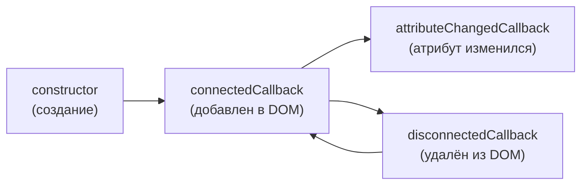
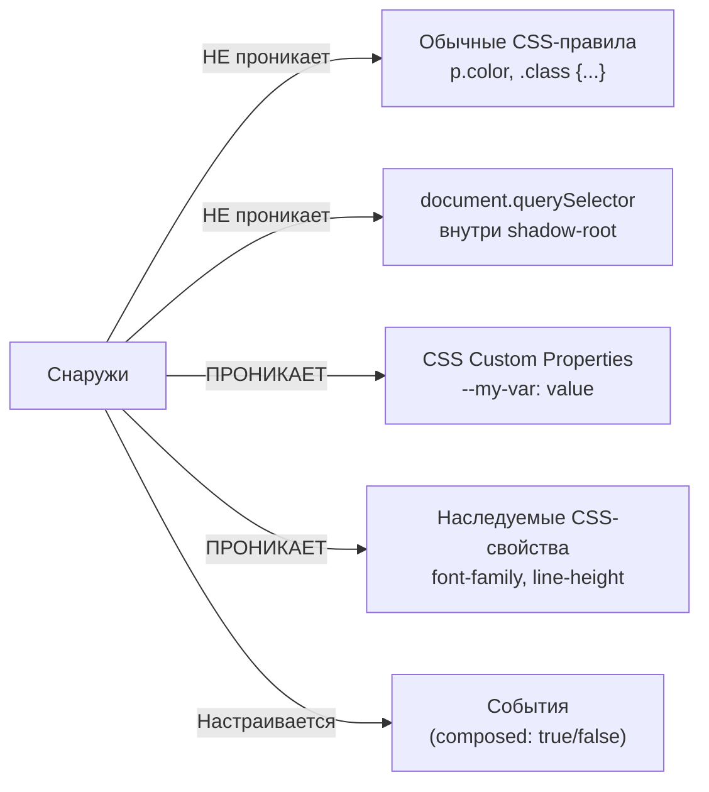
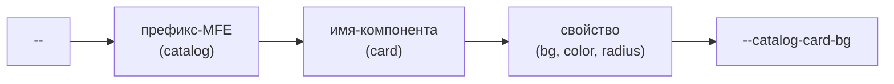
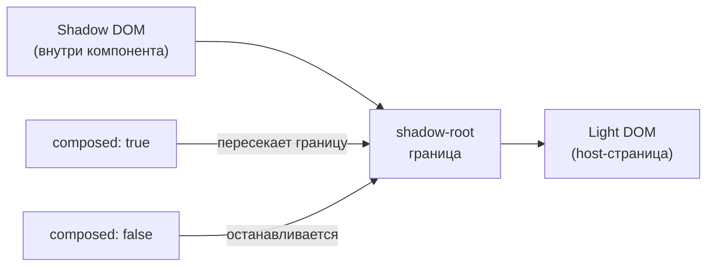

# Web Components как контракт в микрофронтендах — подробная теория

## Контекст: зачем это нужно архитектору

Представьте реальную ситуацию: e-commerce платформа, три команды. Команда A пишет Shell на React 18. Команда B пишет Catalog на Vue 3. Команда C пишет Cart на Angular 17. Все деплоятся независимо.

Каждая команда создала замечательный компонент `ProductCard`. Как команда Shell рендерит `ProductCard` из Vue-команды? Напрямую импортировать Vue-компонент в React — означает тащить Vue в бандл. Это нарушает независимость MFE.

Web Components дают решение: каждый MFE экспортирует компоненты как нативные HTML-элементы. `<catalog-card item-id="123">` — это просто HTML. Любой фреймворк умеет рендерить HTML.

## Custom Elements — регистрация нативного тега

### Как это работает

Браузер хранит реестр Custom Elements. Когда парсер встречает неизвестный тег, он смотрит в реестр. Если тег зарегистрирован — создаётся экземпляр вашего класса.

```js
class CatalogCard extends HTMLElement {
  connectedCallback() {
    console.log('Элемент добавлен в DOM')
    this.render()
  }

  disconnectedCallback() {
    console.log('Элемент удалён из DOM')
    // Здесь отписываемся от событий, очищаем таймеры
  }

  adoptedCallback() {
    console.log('Элемент перемещён в другой document')
  }

  render() {
    this.innerHTML = `<div class="card">Товар</div>`
  }
}

customElements.define('catalog-card', CatalogCard)
```

После регистрации можно использовать в HTML:
```html
<catalog-card item-id="123"></catalog-card>
```

Или создавать программно:
```js
const card = document.createElement('catalog-card')
document.body.appendChild(card)
```

### Правило имён

Имя Custom Element **обязано** содержать дефис. Это намеренное ограничение спецификации для избежания конфликтов с будущими нативными элементами браузера. Примеры корректных имён: `my-button`, `catalog-product-card`, `mfe-shell-nav`.

### Жизненный цикл Custom Element



⚠️ **Распространённая ошибка**: обращаться к атрибутам или дочерним элементам в `constructor`. В конструкторе DOM ещё не готов. Всё взаимодействие с DOM делайте в `connectedCallback`.

```js
// ❌ Неправильно
class MyElement extends HTMLElement {
  constructor() {
    super()
    this.innerHTML = 'Привет'  // Может упасть
    this.getAttribute('title') // Атрибут может быть не установлен
  }
}

// ✅ Правильно
class MyElement extends HTMLElement {
  constructor() {
    super()
    this.attachShadow({ mode: 'open' })  // Только shadow root
  }

  connectedCallback() {
    this.render()  // Работа с DOM здесь
  }
}
```

## Shadow DOM — настоящая инкапсуляция

### Что такое Shadow DOM

Shadow DOM — это отдельное, изолированное поддерево DOM, прикреплённое к обычному элементу (называется "host"). Браузер рендерит оба дерева вместе, но CSS и JavaScript видят их раздельно.

Аналогия: представьте `<video>` элемент. Кнопки воспроизведения, ползунок — это Shadow DOM браузера. Ваши стили на них не влияют. Web Components дают вам тот же механизм.

```js
const host = document.querySelector('#my-element')
const shadow = host.attachShadow({ mode: 'open' })
// mode: 'open'   — shadowRoot доступен снаружи через element.shadowRoot
// mode: 'closed' — shadowRoot недоступен снаружи (редко нужно)

shadow.innerHTML = `
  <style>
    /* Этот стиль влияет ТОЛЬКО на элементы внутри Shadow DOM */
    p { color: red; font-size: 14px; }
  </style>
  <p>Этот текст красный</p>
`
```

На странице может быть глобальный стиль `p { color: blue }` — он не повлияет на `<p>` внутри Shadow DOM.

### Что проникает в Shadow DOM, что нет



💡 Наследуемые CSS-свойства (font-family, color для текста, line-height) **наследуются** в Shadow DOM. Это позволяет задавать типографику на уровне host-приложения. Но блочные стили (background, border, padding) — нет.

### :host и :host-context

Из Shadow DOM можно стилизовать сам host-элемент:

```css
/* Базовые стили элемента */
:host {
  display: block;  /* По умолчанию Custom Elements — inline */
  padding: 16px;
}

/* Когда элемент disabled */
:host([disabled]) {
  opacity: 0.5;
  pointer-events: none;
}

/* Когда элемент находится внутри .dark-theme */
:host-context(.dark-theme) {
  background: #1e1e2e;
  color: #cdd6f4;
}
```

### ::part — продвинутая кастомизация

Если CSS Custom Properties недостаточно, можно открыть конкретные части компонента для стилизации снаружи через атрибут `part`:

```html
<!-- Внутри Shadow DOM -->
<div part="container">
  <button part="button primary">Купить</button>
</div>
```

```css
/* Снаружи — host-приложение */
catalog-card::part(button) {
  border-radius: 20px;
  text-transform: uppercase;
}

catalog-card::part(button primary) {
  background: linear-gradient(to right, #1a73e8, #0d47a1);
}
```

📌 `::part` — это "хирургический" доступ к внутренностям компонента. Используйте осторожно: это раскрывает детали реализации.

## Атрибуты vs свойства: главная концепция

Это самая частая зона ошибок при создании Web Components. Понять разницу критически важно.

### Атрибуты

Атрибуты — строки в HTML-разметке. Когда вы пишете `<my-element count="5">`, браузер устанавливает атрибут `count` со строковым значением `"5"`.

```js
class MyElement extends HTMLElement {
  static get observedAttributes() {
    return ['count', 'disabled', 'title']
    // Только перечисленные атрибуты вызовут attributeChangedCallback
  }

  attributeChangedCallback(name, oldValue, newValue) {
    if (name === 'count') {
      const count = parseInt(newValue || '0', 10)  // Строку нужно парсить!
      this.render()
    }
    if (name === 'disabled') {
      // Булевый атрибут: наличие = true, отсутствие = false
      const isDisabled = newValue !== null
    }
  }
}
```

```html
<!-- Установить атрибут в HTML -->
<my-element count="10" disabled></my-element>
```

```js
// Установить атрибут программно
element.setAttribute('count', '10')
const count = element.getAttribute('count')  // Всегда строка!
```

### Свойства

Свойства — это JavaScript-значения любого типа. Они не отражаются в HTML-атрибутах автоматически.

```js
class MyElement extends HTMLElement {
  private _items = []
  private _config = {}

  get items() { return this._items }
  set items(value) {
    this._items = value
    this.render()
  }

  get config() { return this._config }
  set config(value) {
    this._config = value
    this.render()
  }
}
```

```js
// Установить свойство (только программно, не через HTML)
element.items = [{ id: 1, name: 'Товар' }]
element.config = { theme: 'dark', locale: 'ru' }
```

### Правило выбора

| Тип данных | Атрибут | Свойство |
|---|---|---|
| Строка (`"hello"`) | ✅ | ✅ |
| Число (`42`) | ✅ (но нужен парсинг) | ✅ |
| Булево (`true/false`) | ✅ (атрибут present/absent) | ✅ |
| Объект (`{ a: 1 }`) | ❌ (только JSON — плохая идея) | ✅ |
| Массив (`[1, 2, 3]`) | ❌ | ✅ |
| Функция | ❌ | ✅ |

⚠️ **Ошибка**: передавать объекты через атрибуты как JSON-строки.

```js
// ❌ Плохо — сериализация/десериализация, проблемы с кодировкой
element.setAttribute('config', JSON.stringify({ theme: 'dark' }))
// attributeChangedCallback придётся делать JSON.parse — это хрупко

// ✅ Хорошо — свойство
element.config = { theme: 'dark' }
```

## CSS Custom Properties — контракт стилизации

Custom Properties (CSS-переменные) намеренно пересекают границу Shadow DOM. Это не баг, это фича — механизм для создания публичного API стилизации.

### Определение контракта

```css
/* Внутри Shadow DOM — компонент объявляет свой API стилизации */
:host {
  /* Основные цвета */
  --mf-primary: var(--catalog-card-primary, #1a73e8);
  --mf-text: var(--catalog-card-text, #212121);
  --mf-bg: var(--catalog-card-bg, #ffffff);

  /* Размеры */
  --mf-radius: var(--catalog-card-radius, 8px);
  --mf-padding: var(--catalog-card-padding, 16px);

  display: block;
  background: var(--mf-bg);
  color: var(--mf-text);
  border-radius: var(--mf-radius);
  padding: var(--mf-padding);
}

.price {
  color: var(--catalog-card-price-color, #d93025);
  font-weight: 600;
}
```

```css
/* Снаружи — host-приложение применяет тему */
catalog-card {
  --catalog-card-primary: #7b1fa2;
  --catalog-card-bg: #f3e5f5;
  --catalog-card-radius: 16px;
}

/* Или глобальная тема */
:root {
  --catalog-card-primary: #1a73e8;
  --catalog-card-text: #212121;
}
```

### Именование CSS Custom Properties

Рекомендуемые конвенции для MFE-архитектуры:



```css
/* ✅ Хорошо: namespace + компонент + свойство */
--catalog-card-bg: #fff;
--catalog-card-text: #333;
--catalog-card-border-radius: 8px;
--catalog-card-price-color: #d93025;

/* ❌ Плохо: слишком общие имена — конфликты с другими MFE */
--bg: #fff;
--color: #333;
--radius: 8px;
```

## Слоты — проекция контента

Слоты — это способ вставить пользовательский контент в Shadow DOM без нарушения инкапсуляции. Контент физически остаётся в Light DOM (доступен для скриптов и стилей страницы), но визуально отображается в том месте, где в Shadow DOM находится `<slot>`.

### Default slot и named slots

```html
<!-- Shadow DOM шаблон -->
<div class="card">
  <div class="card-header">
    <slot name="header">
      <!-- Fallback контент, если slot не заполнен -->
      <span class="default-title">Без заголовка</span>
    </slot>
  </div>

  <div class="card-body">
    <slot></slot>  <!-- Default slot — для всего что без slot="" -->
  </div>

  <div class="card-footer">
    <slot name="footer"></slot>
  </div>
</div>
```

```html
<!-- Использование в Light DOM -->
<catalog-card>
  <h2 slot="header">Ноутбук Dell XPS 15</h2>

  <!-- Этот контент идёт в default slot -->
  <p>Процессор Intel Core i7, 16GB RAM, SSD 512GB</p>
  

  <div slot="footer">
    <span class="price">89 999 ₽</span>
    <button>В корзину</button>
  </div>
</catalog-card>
```

### Стилизация slotted контента

```css
/* Изнутри Shadow DOM — стилизуем контент в слотах */
::slotted(*) {
  /* Все элементы в любом slot */
}

::slotted(p) {
  /* Только <p> в слотах */
  margin: 0 0 8px;
}

::slotted([slot="header"]) {
  /* Только контент в именованном slot */
  font-size: 1.2em;
  font-weight: 600;
}
```

⚠️ `::slotted()` применяется к **прямым** дочерним элементам слота. Вложенные потомки недоступны.

### slotchange событие

```js
connectedCallback() {
  const slot = this.shadowRoot.querySelector('slot')
  slot.addEventListener('slotchange', (e) => {
    const nodes = slot.assignedNodes({ flatten: true })
    console.log('Контент в slot изменился:', nodes)
  })
}
```

## CustomEvent — коммуникация через границы

### Базовый паттерн

```js
// Внутри Custom Element
class CatalogCard extends HTMLElement {
  handleAddToCart() {
    this.dispatchEvent(new CustomEvent('catalog:add-to-cart', {
      bubbles: true,      // Всплывает по DOM-дереву
      composed: true,     // Пересекает shadow-root ← КРИТИЧНО!
      detail: {
        itemId: this.getAttribute('item-id'),
        quantity: 1,
        price: this._price,
      }
    }))
  }
}
```

```js
// В host-приложении
document.addEventListener('catalog:add-to-cart', (event) => {
  cartStore.addItem(event.detail)
})

// Или точечная подписка
const card = document.querySelector('catalog-card')
card.addEventListener('catalog:add-to-cart', handler)
```

### composed: true vs false



Когда использовать `composed: false`: для событий, предназначенных только для внутренней коммуникации внутри Shadow DOM. Например, клик на внутреннюю кнопку, которая должна обработаться только внутри компонента.

### Типизация событий в TypeScript

```typescript
// Объявление типов событий компонента
interface CatalogCardEventMap {
  'catalog:add-to-cart': CustomEvent<{ itemId: string; quantity: number; price: number }>
  'catalog:wishlist-add': CustomEvent<{ itemId: string }>
  'catalog:view-details': CustomEvent<{ itemId: string; source: 'click' | 'keyboard' }>
}

// Расширяем HTMLElementEventMap
declare global {
  interface HTMLElementEventMap extends CatalogCardEventMap {}
}

// Теперь TypeScript подсказывает типы
const card = document.querySelector('catalog-card')!
card.addEventListener('catalog:add-to-cart', (e) => {
  const { itemId, quantity, price } = e.detail  // Типизировано!
})
```

## Обёртка React/Vue компонента в Custom Element

Классический паттерн для постепенной миграции и экспорта MFE-компонентов:

```typescript
import { createRoot, Root } from 'react-dom/client'
import React from 'react'
import { CatalogCard } from './CatalogCard'  // React компонент

class CatalogCardElement extends HTMLElement {
  private root: Root | null = null

  static get observedAttributes() {
    return ['item-id', 'currency']
  }

  connectedCallback() {
    this.root = createRoot(this)
    this.renderReact()
  }

  disconnectedCallback() {
    // Важно: unmount React перед удалением элемента
    this.root?.unmount()
    this.root = null
  }

  attributeChangedCallback() {
    this.renderReact()
  }

  // Свойство для передачи объектов
  private _config: Record<string, unknown> = {}
  get config() { return this._config }
  set config(value: Record<string, unknown>) {
    this._config = value
    this.renderReact()
  }

  private renderReact() {
    const itemId = this.getAttribute('item-id') || ''
    const currency = this.getAttribute('currency') || 'RUB'

    this.root?.render(
      <CatalogCard
        itemId={itemId}
        currency={currency}
        config={this._config}
        onAddToCart={(detail) => {
          this.dispatchEvent(new CustomEvent('catalog:add-to-cart', {
            bubbles: true,
            composed: true,
            detail,
          }))
        }}
      />
    )
  }
}

customElements.define('catalog-card', CatalogCardElement)
```

## Полный контракт Custom Element — документация

Хорошая документация Web Component для MFE-команд должна включать все аспекты публичного API:

```markdown
## catalog-card

Карточка товара. Используется в Shell, Cart и Wishlist MFE.

### Атрибуты
| Атрибут | Тип | Default | Описание |
|---------|-----|---------|----------|
| item-id | string | — | ID товара (обязательный) |
| currency | string | 'RUB' | Валюта для отображения цены |
| disabled | boolean | false | Отключить интерактивность |

### Свойства (JS)
| Свойство | Тип | Описание |
|----------|-----|----------|
| config | CatalogCardConfig | Конфигурация компонента |
| priceFormatter | (price: number) => string | Кастомный форматтер цены |

### События
| Событие | Payload | Описание |
|---------|---------|----------|
| catalog:add-to-cart | { itemId, quantity, price } | Добавление в корзину |
| catalog:view-details | { itemId } | Клик на детали товара |

### CSS Custom Properties
| Переменная | Default | Описание |
|-----------|---------|----------|
| --catalog-card-bg | #ffffff | Фон карточки |
| --catalog-card-radius | 8px | Скругление углов |
| --catalog-card-price-color | #d93025 | Цвет цены |

### Слоты
| Слот | Описание |
|------|----------|
| (default) | Дополнительное описание товара |
| badge | Бейдж (напр. "Хит продаж") |
| actions | Дополнительные кнопки действий |
```

## Когда НЕ использовать Web Components

Web Components — мощный инструмент, но не серебряная пуля:

| Ситуация | Рекомендация |
|----------|-------------|
| Все MFE на одном фреймворке (React) | Module Federation без WC проще |
| Высокочастотные обновления состояния | Прямая интеграция через фреймворк быстрее |
| SSR (server-side rendering) | WC плохо поддерживается в SSR без polyfills |
| Простые leaf-компоненты | Избыточно — достаточно Module Federation |
| Общая дизайн-система | WC хорошо подходят для framework-agnostic UI |

## ⚠️ Типичные ошибки

### 1. Работа с DOM в constructor

```js
// ❌ Ошибка
class MyElement extends HTMLElement {
  constructor() {
    super()
    this.innerHTML = 'Hello'  // DOMException!
    this.render()             // Тоже упадёт
  }
}

// ✅ Правильно
class MyElement extends HTMLElement {
  constructor() {
    super()
    this.attachShadow({ mode: 'open' })  // Только это
  }

  connectedCallback() {
    this.render()  // DOM работа здесь
  }
}
```

### 2. Забыть composed: true для событий

```js
// ❌ Событие не выходит за пределы Shadow DOM
this.dispatchEvent(new CustomEvent('my-event', {
  bubbles: true,
  // composed не указан → default false
}))

// ✅ Событие пересекает shadow boundary
this.dispatchEvent(new CustomEvent('my-event', {
  bubbles: true,
  composed: true,
}))
```

### 3. Передавать объекты через атрибуты

```js
// ❌ Плохая идея
element.setAttribute('config', JSON.stringify({ theme: 'dark', items: [...] }))

// ✅ Свойство для объектов
element.config = { theme: 'dark', items: [...] }
```

### 4. Не чистить ресурсы в disconnectedCallback

```js
// ❌ Утечка памяти
class MyElement extends HTMLElement {
  connectedCallback() {
    this.handler = () => this.update()
    window.addEventListener('resize', this.handler)
    this.interval = setInterval(() => this.tick(), 1000)
  }
  // Нет disconnectedCallback → обработчики и интервалы живут вечно
}

// ✅ Правильная очистка
class MyElement extends HTMLElement {
  connectedCallback() {
    this.handler = () => this.update()
    window.addEventListener('resize', this.handler)
    this.interval = setInterval(() => this.tick(), 1000)
  }

  disconnectedCallback() {
    window.removeEventListener('resize', this.handler)
    clearInterval(this.interval)
    this.root?.unmount()  // Если оборачиваем React
  }
}
```

### 5. Глобальные имена событий без namespace

```js
// ❌ Конфликт с другими MFE и нативными событиями браузера
this.dispatchEvent(new CustomEvent('click', { ... }))
this.dispatchEvent(new CustomEvent('change', { ... }))
this.dispatchEvent(new CustomEvent('update', { ... }))

// ✅ Namespace — имя MFE или домен
this.dispatchEvent(new CustomEvent('catalog:item-selected', { ... }))
this.dispatchEvent(new CustomEvent('cart:quantity-changed', { ... }))
this.dispatchEvent(new CustomEvent('mf:navigation-requested', { ... }))
```
