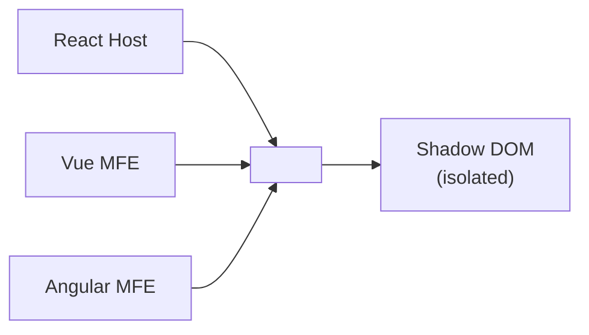
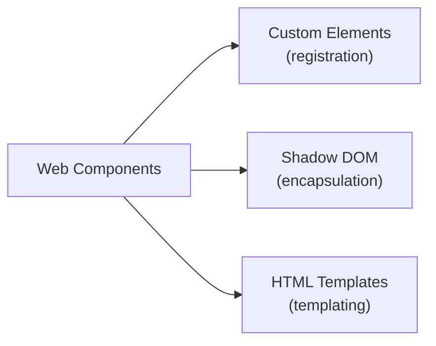
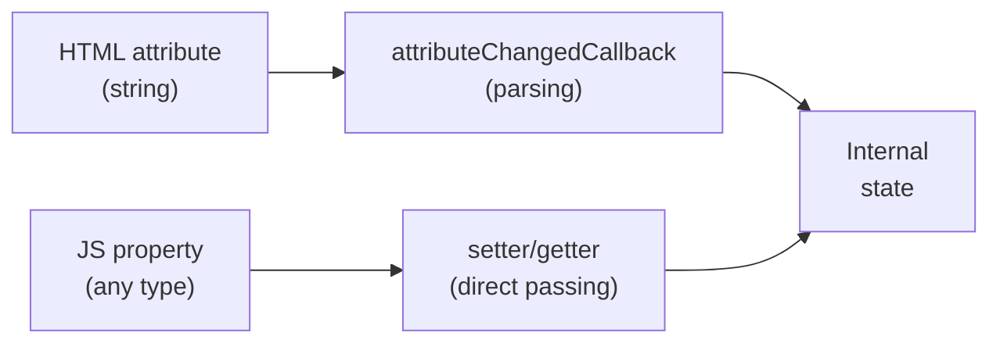
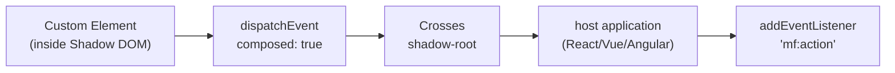
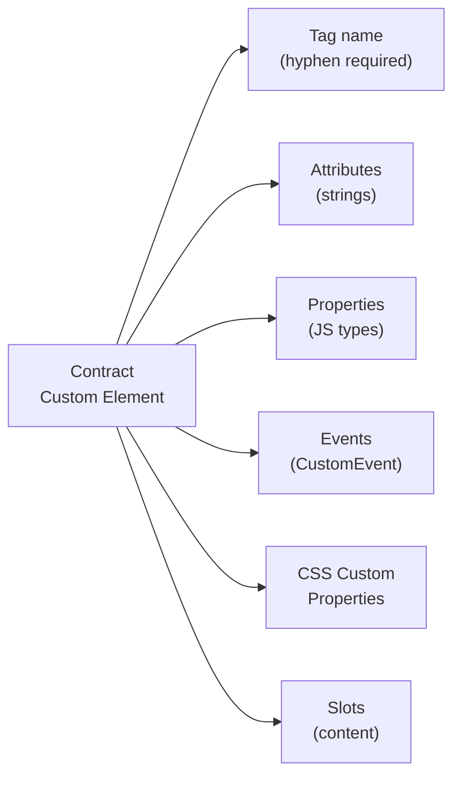

# Web Components as Contracts in Microfrontends

## Why Web Components in MFEs?

Imagine each microfrontend is written in its own framework: Shell on React, Catalog on Vue, Cart on Angular. How does one MFE pass a component to another? Using `<ReactComponent>` from Vue won't work.

Web Components solve this elegantly: they become native HTML elements. `<catalog-card>` looks the same to any framework as `<div>` or `<button>`. This is a **framework-agnostic contract**.



## Three Pillars of Web Components



**Custom Elements** — register your own HTML tag:
```js
customElements.define('my-widget', MyWidget)
// Now <my-widget> is a fully functional element
```

**Shadow DOM** — an isolated DOM subtree. External styles don't penetrate inside (and vice versa):
```js
this.attachShadow({ mode: 'open' })
this.shadowRoot.innerHTML = `<style>p { color: red; }</style><p>Hello</p>`
// p { color: red } affects ONLY this component
```

**HTML Templates** — a lazy template, doesn't render immediately:
```html
<template id="card-tmpl">
  <div class="card"><slot></slot></div>
</template>
```

## Contract: Attributes vs Properties

This is the main trap for beginners. Attributes — strings in HTML. Properties — JavaScript objects.



```js
// Attribute — string only
element.setAttribute('count', '5')  // string "5"

// Property — any type
element.items = [{ id: 1, name: 'Product' }]  // array of objects
element.config = { theme: 'dark', locale: 'ru' }  // object
```

💡 **Rule**: primitives (number, boolean, string) — attributes. Objects and arrays — properties only.

## CSS Custom Properties as Public Styling API

Shadow DOM isolates regular CSS rules. But CSS Custom Properties (CSS variables) **intentionally** cross this boundary. This is the customization mechanism:

```css
/* Outside — host application sets the theme */
catalog-card {
  --card-bg: #1e1e2e;
  --card-text: #cdd6f4;
  --card-border-radius: 12px;
}

/* Inside Shadow DOM — component uses variables */
:host {
  background: var(--card-bg, #ffffff);
  color: var(--card-text, #212121);
  border-radius: var(--card-border-radius, 8px);
}
```

📌 Document CSS Custom Properties as part of the contract — this is the public styling API.

## Slots: Content Projection

Slots allow inserting content into Shadow DOM without breaking encapsulation:

```html
<!-- Inside Shadow DOM (component template) -->
<div class="card">
  <header><slot name="header">Default Title</slot></header>
  <main><slot></slot></main>
  <footer><slot name="footer"></slot></footer>
</div>

<!-- Usage — Light DOM -->
<my-card>
  <h2 slot="header">Product #1</h2>
  <p>Product description</p>
  <button slot="footer">Add to Cart</button>
</my-card>
```

## CustomEvent: Communication Between MFEs



```js
// Inside Custom Element — dispatch
this.dispatchEvent(new CustomEvent('catalog:item-selected', {
  bubbles: true,
  composed: true,  // IMPORTANT: crosses shadow boundary
  detail: { itemId: '123', price: 999 }
}))

// In host application — subscribe
document.querySelector('catalog-card')
  .addEventListener('catalog:item-selected', (e) => {
    addToCart(e.detail)
  })
```

⚠️ Without `composed: true` the event "gets stuck" inside Shadow DOM and doesn't bubble to the global document.

## Wrapping a React/Vue Component in a Custom Element

Classic pattern for MFEs: you have a React component, but need to export it as a Web Component:

```js
import { createRoot } from 'react-dom/client'
import { CatalogCard } from './CatalogCard'

class CatalogCardElement extends HTMLElement {
  private root: ReturnType<typeof createRoot> | null = null

  connectedCallback() {
    this.root = createRoot(this)
    this.render()
  }

  disconnectedCallback() {
    this.root?.unmount()
  }

  render() {
    const itemId = this.getAttribute('item-id') || ''
    this.root?.render(<CatalogCard itemId={itemId} items={this.items} />)
  }
}

customElements.define('catalog-card', CatalogCardElement)
```

## Full Custom Element Contract



Document the contract — this is the interface between teams in an MFE architecture. It is stable and framework-independent.
