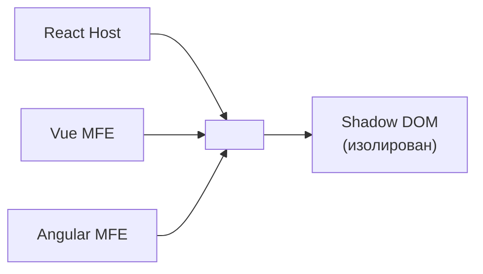
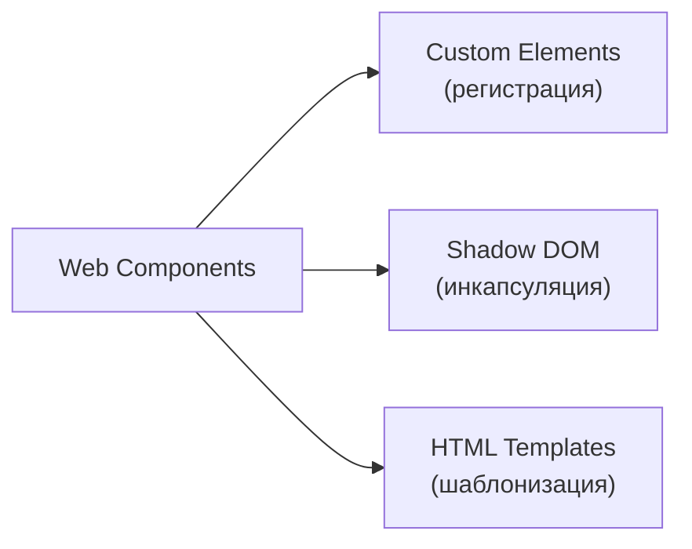
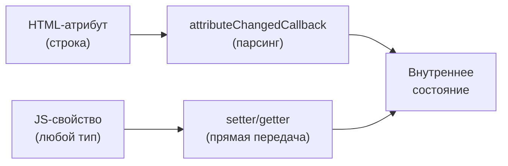
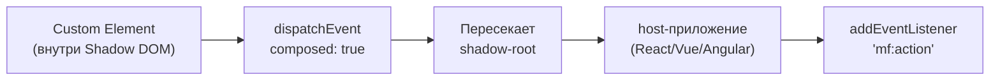
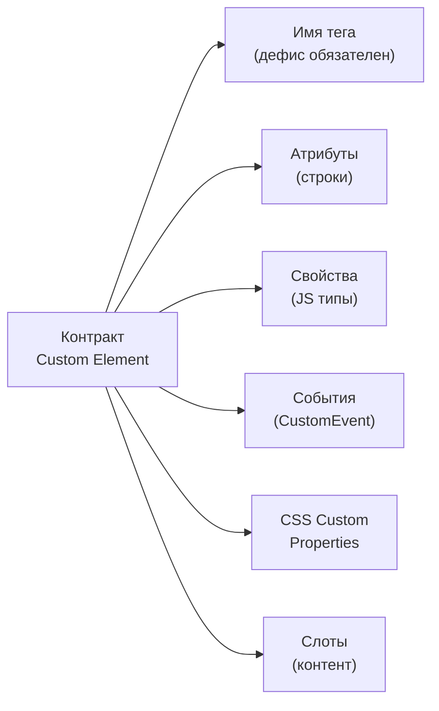

# Web Components как контракт в микрофронтендах

## Зачем Web Components в MFE?

Представьте, что каждый микрофронтенд написан на своём фреймворке: Shell на React, Catalog на Vue, Cart на Angular. Как один MFE передаёт компонент другому? Использовать `<ReactComponent>` из Vue не получится.

Web Components решают это красиво: они превращаются в нативные HTML-элементы. `<catalog-card>` выглядит для любого фреймворка так же, как `<div>` или `<button>`. Это **framework-agnostic контракт**.



## Три кита Web Components



**Custom Elements** — регистрируете свой HTML-тег:
```js
customElements.define('my-widget', MyWidget)
// Теперь <my-widget> — полноценный элемент
```

**Shadow DOM** — изолированное поддерево DOM. Стили снаружи не проникают внутрь (и наоборот):
```js
this.attachShadow({ mode: 'open' })
this.shadowRoot.innerHTML = `<style>p { color: red; }</style><p>Привет</p>`
// Стиль p { color: red } влияет ТОЛЬКО на этот компонент
```

**HTML Templates** — ленивый шаблон, не рендерится сразу:
```html
<template id="card-tmpl">
  <div class="card"><slot></slot></div>
</template>
```

## Контракт: атрибуты vs свойства

Это главная ловушка для новичков. Атрибуты — строки в HTML. Свойства — JavaScript-объекты.



```js
// Атрибут — только строка
element.setAttribute('count', '5')  // строка "5"

// Свойство — любой тип
element.items = [{ id: 1, name: 'Товар' }]  // массив объектов
element.config = { theme: 'dark', locale: 'ru' }  // объект
```

💡 **Правило**: примитивы (число, булево, строка) — атрибуты. Объекты и массивы — только свойства.

## CSS Custom Properties как публичный API стилизации

Shadow DOM изолирует обычные CSS-правила. Но CSS Custom Properties (CSS-переменные) **намеренно** пересекают эту границу. Это и есть механизм кастомизации:

```css
/* Снаружи — host-приложение задаёт тему */
catalog-card {
  --card-bg: #1e1e2e;
  --card-text: #cdd6f4;
  --card-border-radius: 12px;
}

/* Внутри Shadow DOM — компонент использует переменные */
:host {
  background: var(--card-bg, #ffffff);
  color: var(--card-text, #212121);
  border-radius: var(--card-border-radius, 8px);
}
```

📌 Документируйте CSS Custom Properties как часть контракта — это публичный API стилизации.

## Слоты: проекция контента

Слоты позволяют вставлять контент в Shadow DOM, не нарушая инкапсуляцию:

```html
<!-- Внутри Shadow DOM (шаблон компонента) -->
<div class="card">
  <header><slot name="header">Заголовок</slot></header>
  <main><slot></slot></main>
  <footer><slot name="footer"></slot></footer>
</div>

<!-- Использование — Light DOM -->
<my-card>
  <h2 slot="header">Товар №1</h2>
  <p>Описание товара</p>
  <button slot="footer">В корзину</button>
</my-card>
```

## CustomEvent: коммуникация между MFE



```js
// Внутри Custom Element — диспатч
this.dispatchEvent(new CustomEvent('catalog:item-selected', {
  bubbles: true,
  composed: true,  // ВАЖНО: пересекает shadow boundary
  detail: { itemId: '123', price: 999 }
}))

// В host-приложении — подписка
document.querySelector('catalog-card')
  .addEventListener('catalog:item-selected', (e) => {
    addToCart(e.detail)
  })
```

⚠️ Без `composed: true` событие "застревает" внутри Shadow DOM и не всплывает в глобальный документ.

## Обёртка React/Vue компонента в Custom Element

Классический паттерн для MFE: у вас есть React-компонент, но нужно экспортировать его как Web Component:

```js
import { createRoot } from 'react-dom/client'
import { CatalogCard } from './CatalogCard'

class CatalogCardElement extends HTMLElement {
  private root: ReturnType<typeof createRoot> | null = null

  connectedCallback() {
    this.root = createRoot(this)
    this.render()
  }

  disconnectedCallback() {
    this.root?.unmount()
  }

  render() {
    const itemId = this.getAttribute('item-id') || ''
    this.root?.render(<CatalogCard itemId={itemId} items={this.items} />)
  }
}

customElements.define('catalog-card', CatalogCardElement)
```

## Полный контракт Custom Element



Документируйте контракт — это интерфейс между командами в MFE-архитектуре. Он стабилен и независим от фреймворка.
