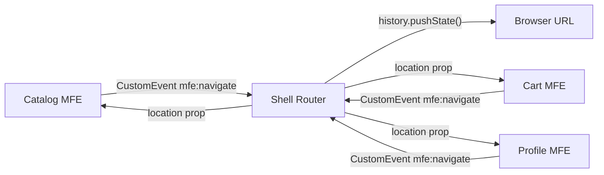
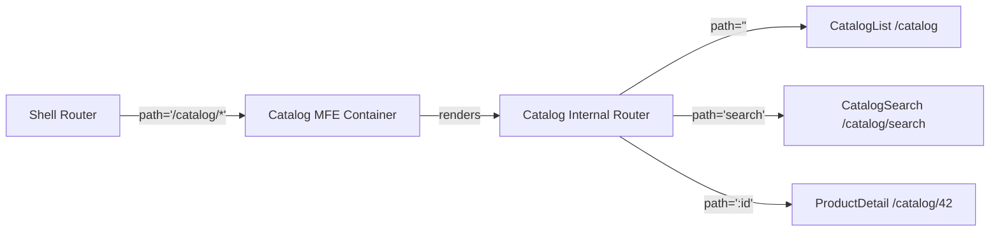

# Level 7: Routing Between Applications (Extended Version)

## Why Routing in MFE is a Separate Architectural Problem

In a monolithic SPA, there's one React Router. It knows everything: current route, history, pending transitions. The whole app lives in one router context.

In microfrontends, you have four independent apps, each with its own `createBrowserRouter`. They don't know about each other. But the browser is one — and so is the URL.

It's like a situation where four drivers are holding the steering wheel of the same car at the same time. Each has their own map, their own route — and all are convinced they're the main driver.

## Anatomy of Browser Routing API

Before talking about solutions, let's understand the mechanism:

```
window.history
  ├── pushState(state, title, url)   — add entry to stack
  ├── replaceState(state, title, url) — replace current entry
  ├── back()                         — go back
  ├── forward()                      — go forward
  └── go(n)                          — go n steps

window.addEventListener('popstate', handler)  — fires on back/forward
window.addEventListener('hashchange', handler) — for hash-based routing
```

Key property of `pushState`: **it doesn't generate events**. Calling `history.pushState('/catalog')` silently changes the URL, but no one in the app knows about it — unless you notify them yourself.

This is the source of conflicts: two MFEs call `pushState` at the same time, the second call overwrites the first, and the app ends up in an inconsistent state.

## Pattern: Shell as the Sole History Owner



Shell — the only system element that has the right to touch `history`. MFEs request navigation via events, Shell accepts or rejects the request and performs the transition.

Why this matters:
- Prevents URL race conditions
- Gives Shell the ability to add auth guard, analytics, page leave confirmation
- Enables centralized navigation logging

## Shell Routes: Configuration Structure

```ts
// Full typing of Shell route configuration
type ShellRouteConfig = {
  pathPattern: string      // '/catalog/*' — prefix + wildcard
  mfe: string              // 'catalog' — MFE name
  strategy: 'lazy' | 'eager'
  exact: boolean           // exact match or prefix match
}

// Full configuration example
const shellConfig: ShellRouteConfig[] = [
  { pathPattern: '/',           mfe: '',        strategy: 'eager', exact: true  },
  { pathPattern: '/catalog/*',  mfe: 'catalog', strategy: 'lazy',  exact: false },
  { pathPattern: '/cart/*',     mfe: 'cart',    strategy: 'lazy',  exact: false },
  { pathPattern: '/profile/*',  mfe: 'profile', strategy: 'lazy',  exact: false },
  { pathPattern: '*',           mfe: '',        strategy: 'eager', exact: false }, // 404 — always last!
]
```

💡 Wildcard `/catalog/*` means: "everything starting with /catalog/, give to Catalog MFE." Shell doesn't know about `/catalog/search` or `/catalog/42` — that's the MFE's internal kitchen.

## Nested Routing in Detail



Key point: **the MFE's internal router uses relative paths**. Not `/catalog/search`, but just `search`. React Router v6 does this automatically if the MFE renders inside a route with `/*`.

```js
// Shell: CatalogMFE gets everything starting with /catalog/
{ path: '/catalog/*', element: <Suspense fallback={<Spinner />}><CatalogMFE /></Suspense> }

// Catalog MFE: internal router uses basename
function CatalogApp() {
  return (
    <Routes>
      <Route index element={<CatalogList />} />       {/* /catalog */}
      <Route path="search" element={<CatalogSearch />} />  {/* /catalog/search */}
      <Route path=":id" element={<ProductDetail />} />     {/* /catalog/42 */}
    </Routes>
  )
}
```

If the MFE creates its own `createBrowserRouter` with `basename="/catalog"`, it also works, but requires passing basename as a prop from Shell.

## Navigation Communication: Custom Events vs Navigation Bus

### Custom Events

The simplest and most native approach. Works "out of the box" without additional libraries.

```js
// Navigation event contract (contracts/navigation.ts)
type NavigateEvent = {
  path: string
  source: string       // MFE sender name for debugging
  replace?: boolean    // pushState vs replaceState
  state?: unknown      // additional data in history state
}

// MFE: request navigation
export function requestNavigation(path: string) {
  window.dispatchEvent(
    new CustomEvent('mfe:navigate', {
      detail: { path, source: 'catalog-mfe' } satisfies NavigateEvent,
    })
  )
}

// Shell: handle
window.addEventListener('mfe:navigate', (event: CustomEvent<NavigateEvent>) => {
  const { path, replace, state } = event.detail
  if (replace) {
    router.navigate(path, { replace: true, state })
  } else {
    router.navigate(path, { state })
  }
})
```

Pros: no dependencies, browser standard, easy to debug via DevTools.
Cons: no typing at subscription level, hard to organize middleware.

### Navigation Bus (Shared Singleton)

For complex scenarios: leave confirmation, analytics, breadcrumbs.

```ts
// packages/navigation-bus/src/index.ts (shared package)
type NavigationHandler = (path: string, meta: NavigationMeta) => void
type NavigationGuard = (from: string, to: string) => boolean | Promise<boolean>

class NavigationBus {
  private handlers: NavigationHandler[] = []
  private guards: NavigationGuard[] = []

  async navigate(path: string, source: string) {
    const current = window.location.pathname

    // Run through guards (auth, unsaved changes, etc.)
    for (const guard of this.guards) {
      const allowed = await guard(current, path)
      if (!allowed) {
        console.log(`[NavigationBus] ${source}: navigation to ${path} rejected by guard`)
        return
      }
    }

    this.handlers.forEach(h => h(path, { source }))
  }

  addGuard(guard: NavigationGuard) { /* ... */ }
  onNavigate(handler: NavigationHandler) { /* ... */ }
}

export const navigationBus = new NavigationBus()
```

Pros: guards, middleware, history, typing.
Cons: shared singleton = MFE coupling through shared package.

## Deep Linking: Routing on Direct URL Entry

This is the scenario often overlooked during development: what happens when a user opens `/catalog/42` directly (from bookmarks, email links, search)?

```
Without proper setup:
  GET /catalog/42 → 404 (server doesn't know about SPA routes)

With proper nginx setup:
  GET /catalog/42 → index.html (serve SPA, it figures out itself)
    → Shell loads
    → URL = /catalog/42
    → Shell: starts with /catalog → mount Catalog MFE with initialPath='/catalog/42'
    → Catalog MFE: internal router opens ProductDetail
```

```nginx
# nginx.conf — return index.html for all SPA routes
location / {
  try_files $uri $uri/ /index.html;
}
```

Important: deep links must work on **direct access**, not just client-side navigation.

## SEO in Microfrontends

For public pages (e-commerce, blog, landing pages), SSR or SSG is needed:

```
GET /catalog/42
  Server:
    1. Determines: route belongs to Catalog MFE
    2. Renders Catalog MFE with path=/catalog/42 on server
    3. Fills in: <title>, <meta name="description">, og:* tags
    4. Returns ready HTML with data
```

For B2B and internal tools, SEO is usually not needed — client-side with correct nginx is enough.

## Route Order: Why It's Critical

```js
// ❌ Wrong order — wildcard blocks specific routes
const routes = [
  { path: '*',          element: <NotFound /> },    // intercepts EVERYTHING!
  { path: '/catalog/*', element: <CatalogMFE /> },  // never fires
]

// ✅ Correct order — from specific to general
const routes = [
  { path: '/',          element: <HomePage />,   exact: true },
  { path: '/catalog/*', element: <CatalogMFE /> },
  { path: '/cart/*',    element: <CartMFE /> },
  { path: '*',          element: <NotFound /> },  // wildcard LAST
]
```

React Router v6 uses a smart ranking algorithm and doesn't depend on order for most cases. But for wildcard routes (`*`) — order still matters.

## ⚠️ Common Beginner Mistakes

### 1. MFE Directly Calls history.pushState

```js
// ❌ Direct call from MFE — recipe for disaster
function CartMFE() {
  const checkout = () => {
    window.history.pushState({}, '', '/cart/checkout') // DON'T!
  }
}
```

**Problem:** Shell doesn't know about the transition, its router didn't update, another MFE might do the same in a millisecond — we get a conflict.

```js
// ✅ Request via events
function CartMFE() {
  const checkout = () => {
    window.dispatchEvent(
      new CustomEvent('mfe:navigate', { detail: { path: '/cart/checkout' } })
    )
  }
}
```

### 2. Duplicating Shell Prefix in Internal Routes

```js
// ❌ Catalog MFE duplicates /catalog in internal routes
<Routes>
  <Route path="/catalog" element={<CatalogList />} />          // bad
  <Route path="/catalog/search" element={<CatalogSearch />} /> // bad
  <Route path="/catalog/:id" element={<ProductDetail />} />    // bad
</Routes>

// ✅ Relative paths (Shell already handles /catalog/*)
<Routes>
  <Route index element={<CatalogList />} />         // /catalog
  <Route path="search" element={<CatalogSearch />} /> // /catalog/search
  <Route path=":id" element={<ProductDetail />} />    // /catalog/42
</Routes>
```

### 3. Forgotten Async Boundary on Lazy MFE

```js
// ❌ Without Suspense — lazy MFE throws an error
{ path: '/catalog/*', element: <CatalogMFE /> }  // lazy loaded component

// ✅ With Suspense fallback
{ path: '/catalog/*', element: <Suspense fallback={<PageSkeleton />}><CatalogMFE /></Suspense> }
```

### 4. MFE Doesn't Support Deep Links

```js
// ❌ MFE always starts from '/' ignoring passed path
function CatalogApp({ initialPath }) {
  // initialPath is ignored, router always opens CatalogList
  return <CatalogList />
}

// ✅ MFE accepts and uses initialPath
function CatalogApp({ initialPath }: { initialPath: string }) {
  return (
    <MemoryRouter initialEntries={[initialPath]}>
      <Routes>
        <Route index element={<CatalogList />} />
        <Route path="search" element={<CatalogSearch />} />
        <Route path=":id" element={<ProductDetail />} />
      </Routes>
    </MemoryRouter>
  )
}
```

## Best Practices

```
1. Navigation contract — document events and their payload in shared types.
   Without an explicit contract, each MFE will invent its own.

2. Deep link testing — automated tests should check direct
   navigation to each important URL, not just client-side navigation.

3. Navigation guards in Shell — single place for auth check, analytics, confirmations.
   Don't duplicate guard logic in each MFE.

4. basename for isolated development — each MFE should run
   standalone with correct basename, without Shell.

5. Navigation logging — record source (which MFE requested navigation)
   and timestamp. This is critical for debugging race conditions.
```
