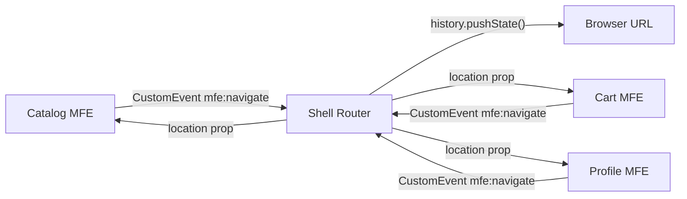
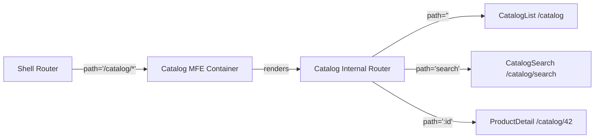

# Уровень 7: Роутинг между приложениями (расширенная версия)

## Почему роутинг в MFE — это отдельная архитектурная проблема

В монолитном SPA есть один React Router. Он знает всё: текущий маршрут, историю, pending transitions. Всё приложение живёт в одном контексте роутера.

В микрофронтендах у вас четыре независимых приложения, каждое со своим `createBrowserRouter`. Они не знают друг о друге. Но браузер один — и URL в нём тоже один.

Это похоже на ситуацию, где четыре водителя одновременно держатся за руль одной машины. У каждого своя карта, свой маршрут — и все уверены, что они главный водитель.

## Анатомия браузерного routing API

Прежде чем говорить о решениях, разберёмся с механизмом:

```
window.history
  ├── pushState(state, title, url)   — добавить запись в стек
  ├── replaceState(state, title, url) — заменить текущую запись
  ├── back()                         — назад
  ├── forward()                      — вперёд
  └── go(n)                          — перейти на n шагов

window.addEventListener('popstate', handler)  — срабатывает при back/forward
window.addEventListener('hashchange', handler) — для hash-based routing
```

Ключевое свойство `pushState`: **он не генерирует события**. Вызов `history.pushState('/catalog')` тихо меняет URL, но никто в приложении об этом не узнает — если только вы сами не оповестите.

Это и есть источник конфликтов: два MFE вызывают `pushState` в один момент времени, второй вызов перезаписывает первый, и приложение оказывается в рассогласованном состоянии.

## Паттерн: Shell как единственный владелец истории



Shell — единственный элемент системы, который имеет право трогать `history`. MFE запрашивают навигацию через события, Shell принимает или отклоняет запрос и выполняет переход.

Зачем это важно:
- Предотвращает race conditions с URL
- Даёт Shell возможность добавить auth guard, analytics, подтверждение ухода со страницы
- Позволяет вести централизованный лог навигации

## Shell Routes: структура конфигурации

```ts
// Полная типизация конфигурации Shell routes
type ShellRouteConfig = {
  pathPattern: string      // '/catalog/*' — prefix + wildcard
  mfe: string              // 'catalog' — имя MFE
  strategy: 'lazy' | 'eager'
  exact: boolean           // точное совпадение или prefix match
}

// Пример полной конфигурации
const shellConfig: ShellRouteConfig[] = [
  { pathPattern: '/',           mfe: '',        strategy: 'eager', exact: true  },
  { pathPattern: '/catalog/*',  mfe: 'catalog', strategy: 'lazy',  exact: false },
  { pathPattern: '/cart/*',     mfe: 'cart',    strategy: 'lazy',  exact: false },
  { pathPattern: '/profile/*',  mfe: 'profile', strategy: 'lazy',  exact: false },
  { pathPattern: '*',           mfe: '',        strategy: 'eager', exact: false }, // 404 — всегда последний!
]
```

💡 Wildcard `/catalog/*` означает: «всё, что начинается с /catalog/, отдать Catalog MFE». Shell не знает про `/catalog/search` или `/catalog/42` — это внутренняя кухня MFE.

## Nested Routing в деталях



Ключевой момент: **внутренний роутер MFE использует относительные пути**. Не `/catalog/search`, а просто `search`. React Router v6 делает это автоматически, если MFE рендерится внутри route с `/*`.

```js
// Shell: CatalogMFE получает всё, что начинается с /catalog/
{ path: '/catalog/*', element: <Suspense fallback={<Spinner />}><CatalogMFE /></Suspense> }

// Catalog MFE: внутренний роутер использует basename
function CatalogApp() {
  return (
    <Routes>
      <Route index element={<CatalogList />} />       {/* /catalog */}
      <Route path="search" element={<CatalogSearch />} />  {/* /catalog/search */}
      <Route path=":id" element={<ProductDetail />} />     {/* /catalog/42 */}
    </Routes>
  )
}
```

Если MFE создаёт свой `createBrowserRouter` с `basename="/catalog"`, это тоже работает, но требует передачи basename как prop от Shell.

## Коммуникация при навигации: Custom Events vs Navigation Bus

### Custom Events

Самый простой и нативный подход. Работает «из коробки» без дополнительных библиотек.

```js
// Контракт событий навигации (contracts/navigation.ts)
type NavigateEvent = {
  path: string
  source: string       // имя MFE-отправителя для отладки
  replace?: boolean    // pushState vs replaceState
  state?: unknown      // дополнительные данные в history state
}

// MFE: запрос навигации
export function requestNavigation(path: string) {
  window.dispatchEvent(
    new CustomEvent('mfe:navigate', {
      detail: { path, source: 'catalog-mfe' } satisfies NavigateEvent,
    })
  )
}

// Shell: обработка
window.addEventListener('mfe:navigate', (event: CustomEvent<NavigateEvent>) => {
  const { path, replace, state } = event.detail
  if (replace) {
    router.navigate(path, { replace: true, state })
  } else {
    router.navigate(path, { state })
  }
})
```

Плюсы: нет зависимостей, браузерный стандарт, легко дебажить через DevTools.
Минусы: нет типизации на уровне подписки, сложно организовать middleware.

### Navigation Bus (Shared Singleton)

Для сложных сценариев: подтверждение ухода, analytics, breadcrumbs.

```ts
// packages/navigation-bus/src/index.ts (shared пакет)
type NavigationHandler = (path: string, meta: NavigationMeta) => void
type NavigationGuard = (from: string, to: string) => boolean | Promise<boolean>

class NavigationBus {
  private handlers: NavigationHandler[] = []
  private guards: NavigationGuard[] = []

  async navigate(path: string, source: string) {
    const current = window.location.pathname
    
    // Прогоняем через guards (auth, unsaved changes и т.д.)
    for (const guard of this.guards) {
      const allowed = await guard(current, path)
      if (!allowed) {
        console.log(`[NavigationBus] ${source}: переход на ${path} отклонён guard`)
        return
      }
    }

    this.handlers.forEach(h => h(path, { source }))
  }

  addGuard(guard: NavigationGuard) { /* ... */ }
  onNavigate(handler: NavigationHandler) { /* ... */ }
}

export const navigationBus = new NavigationBus()
```

Плюсы: guards, middleware, история, типизация.
Минусы: shared singleton = связанность MFE через общий пакет.

## Deep Linking: маршрутизация при прямом вводе URL

Это сценарий, который часто упускают при разработке: что происходит, если пользователь открывает `/catalog/42` напрямую (из закладок, email-ссылки, поиска)?

```
Без правильной настройки:
  GET /catalog/42 → 404 (сервер не знает про SPA-маршруты)

С правильной настройкой nginx:
  GET /catalog/42 → index.html (отдаём SPA, она сама разберётся)
    → Shell загружается
    → URL = /catalog/42
    → Shell: starts with /catalog → монтируем Catalog MFE с initialPath='/catalog/42'
    → Catalog MFE: внутренний роутер открывает ProductDetail
```

```nginx
# nginx.conf — возвращаем index.html для всех SPA-маршрутов
location / {
  try_files $uri $uri/ /index.html;
}
```

Важно: глубокие ссылки должны работать при **прямом переходе**, не только при client-side навигации.

## SEO в микрофронтендах

Для публичных страниц (e-commerce, блог, лендинги) нужен SSR или SSG:

```
GET /catalog/42
  Server:
    1. Определяет: маршрут принадлежит Catalog MFE
    2. Рендерит Catalog MFE с path=/catalog/42 на сервере
    3. Заполняет: <title>, <meta name="description">, og:* теги
    4. Возвращает готовый HTML с данными
```

Для B2B и внутренних инструментов SEO обычно не нужен — достаточно client-side с корректным nginx.

## Порядок маршрутов: почему он критичен

```js
// ❌ Неправильный порядок — wildcard блокирует конкретные маршруты
const routes = [
  { path: '*',          element: <NotFound /> },    // перехватит ВСЁ!
  { path: '/catalog/*', element: <CatalogMFE /> },  // никогда не сработает
]

// ✅ Правильный порядок — от конкретного к общему
const routes = [
  { path: '/',          element: <HomePage />,   exact: true },
  { path: '/catalog/*', element: <CatalogMFE /> },
  { path: '/cart/*',    element: <CartMFE /> },
  { path: '*',          element: <NotFound /> },  // wildcard ПОСЛЕДНИМ
]
```

React Router v6 использует умный алгоритм ранжирования и не зависит от порядка для большинства случаев. Но для wildcard-маршрутов (`*`) — порядок всё ещё имеет значение.

## ⚠️ Типичные ошибки начинающих

### 1. MFE напрямую вызывает history.pushState

```js
// ❌ Прямой вызов из MFE — recipe for disaster
function CartMFE() {
  const checkout = () => {
    window.history.pushState({}, '', '/cart/checkout') // НЕЛЬЗЯ!
  }
}
```

**Проблема:** Shell не знает о переходе, его роутер не обновился, другой MFE может сделать то же самое через миллисекунду — получаем конфликт.

```js
// ✅ Запрос через события
function CartMFE() {
  const checkout = () => {
    window.dispatchEvent(
      new CustomEvent('mfe:navigate', { detail: { path: '/cart/checkout' } })
    )
  }
}
```

### 2. Дублирование shell prefix в internal routes

```js
// ❌ Catalog MFE дублирует /catalog в внутренних маршрутах
<Routes>
  <Route path="/catalog" element={<CatalogList />} />          // плохо
  <Route path="/catalog/search" element={<CatalogSearch />} /> // плохо
  <Route path="/catalog/:id" element={<ProductDetail />} />    // плохо
</Routes>

// ✅ Относительные пути (Shell уже взял на себя /catalog/*)
<Routes>
  <Route index element={<CatalogList />} />         // /catalog
  <Route path="search" element={<CatalogSearch />} /> // /catalog/search
  <Route path=":id" element={<ProductDetail />} />    // /catalog/42
</Routes>
```

### 3. Забытый async boundary при lazy MFE

```js
// ❌ Без Suspense — lazy MFE выбросит ошибку
{ path: '/catalog/*', element: <CatalogMFE /> }  // lazy загружаемый компонент

// ✅ С Suspense fallback
{ path: '/catalog/*', element: <Suspense fallback={<PageSkeleton />}><CatalogMFE /></Suspense> }
```

### 4. MFE не поддерживает deep links

```js
// ❌ MFE всегда стартует с '/' игнорируя переданный путь
function CatalogApp({ initialPath }) {
  // initialPath игнорируется, роутер всегда открывает CatalogList
  return <CatalogList />
}

// ✅ MFE принимает и использует initialPath
function CatalogApp({ initialPath }: { initialPath: string }) {
  return (
    <MemoryRouter initialEntries={[initialPath]}>
      <Routes>
        <Route index element={<CatalogList />} />
        <Route path="search" element={<CatalogSearch />} />
        <Route path=":id" element={<ProductDetail />} />
      </Routes>
    </MemoryRouter>
  )
}
```

## Лучшие практики

```
1. Контракт навигации — задокументируйте события и их payload в shared типах.
   Без явного контракта каждый MFE будет изобретать своё.

2. Тестирование deep links — автоматические тесты должны проверять прямой
   переход на каждый important URL, не только client-side навигацию.

3. Navigation guards в Shell — единое место для auth check, analytics, confirmations.
   Не дублируйте логику guard в каждом MFE.

4. basename для изолированной разработки — каждый MFE должен запускаться
   standalone с правильным basename, без Shell.

5. Логирование навигации — записывайте source (какой MFE запросил переход)
   и timestamp. Это критически важно для отладки race conditions.
```
