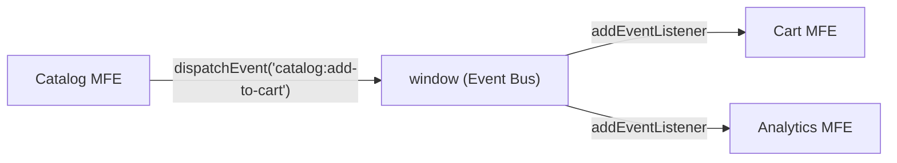
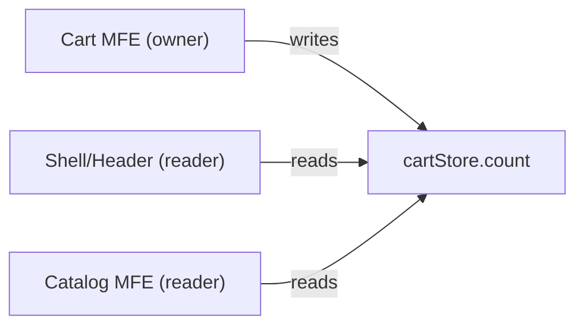

# Level 8: Communication Between Microfrontends

## Why Communication is a Separate Architectural Task

In a monolith, components communicate via props, Redux store, or direct imports — everything in one bundle, one execution context. In microfrontend architecture, each MFE lives in its own "bubble": separate bundle, possibly separate framework, its own state.

When the task comes "Catalog should add item to Cart," the temptation is to do it "as usual" — import cartStore from the cart package. This is a mistake that destroys the entire architecture.

The right question: **how can an MFE signal an intent without knowing who will react?**

## Principle 1: Minimal Coupling

```
Catalog only knows about event 'catalog:add-to-cart'
Cart only knows about event 'catalog:add-to-cart'
Catalog DOES NOT KNOW about Cart
Cart DOES NOT KNOW about Catalog
```

This allows:
- Replacing Cart with another implementation without changes in Catalog
- Adding an Analytics MFE that also listens to this event
- Testing Catalog without Cart

## Principle 2: Explicit Contracts

Every communication method must be documented with types:

```typescript
// This is not just code — it's architecture documentation
interface EventMap {
  'catalog:add-to-cart': { productId: string; qty: number }
  'cart:checkout-started': { total: number; items: number }
}
```

If a contract isn't documented — it becomes a source of bugs during changes.

## Pattern 1: Custom Events via window

### How It Works



Standard browser mechanism `CustomEvent` allows MFEs to communicate through a shared `window` object without imports.

```typescript
// Sender (Catalog MFE)
function addToCart(productId: string, qty: number) {
  window.dispatchEvent(new CustomEvent('catalog:add-to-cart', {
    bubbles: true,
    detail: { productId, qty }
  }))
}

// Receiver (Cart MFE)
function init() {
  const handler = (e: Event) => {
    const { productId, qty } = (e as CustomEvent<AddToCartPayload>).detail
    cartStore.addItem(productId, qty)
  }
  window.addEventListener('catalog:add-to-cart', handler)
  return () => window.removeEventListener('catalog:add-to-cart', handler)
}
```

### Event Namespacing

Always use `mfe-name:action` format:

```typescript
// Good — source immediately clear
'catalog:add-to-cart'
'cart:checkout-started'
'profile:logout'

// Bad — unclear who owns it
'add-to-cart'
'userLogout'
```

### Typed Event Bus

Raw CustomEvents are inconvenient: you have to remember payload types and event names. Typed Event Bus solves this:

```typescript
// packages/event-bus/index.ts — shared package
export interface EventMap {
  'catalog:add-to-cart': { productId: string; qty: number }
  'cart:checkout-started': { total: number; items: number }
  'profile:logout': void
  'profile:address-updated': { city: string; street: string }
}

export class EventBus {
  private handlers = new Map<keyof EventMap, Set<Function>>()

  emit<K extends keyof EventMap>(event: K, payload: EventMap[K]): void {
    // Use own Map instead of window for control
    this.handlers.get(event)?.forEach(fn => fn(payload))
  }

  on<K extends keyof EventMap>(
    event: K,
    handler: (payload: EventMap[K]) => void
  ): () => void {
    if (!this.handlers.has(event)) {
      this.handlers.set(event, new Set())
    }
    this.handlers.get(event)!.add(handler)
    // Return unsubscribe function
    return () => this.handlers.get(event)?.delete(handler)
  }
}

export const eventBus = new EventBus()
```

Usage:

```typescript
// Full typing: TypeScript checks event name and payload type
eventBus.emit('catalog:add-to-cart', { productId: 'p42', qty: 1 })

// Autocomplete works for all EventMap events
const unsubscribe = eventBus.on('catalog:add-to-cart', ({ productId, qty }) => {
  // productId: string, qty: number — TypeScript knows types
  cart.addItem(productId, qty)
})

// Must unsubscribe on unmount!
return () => unsubscribe()
```

### When to Use Custom Events

✅ Fire-and-forget notifications (Catalog adds item — Cart reacts)
✅ Analytics events (all MFEs emit, Analytics listens to everything)
✅ When sender doesn't expect a response
✅ When multiple receivers should react to one event

❌ UI state synchronization (cart counter must always be current)
❌ Multi-step processes with dependent steps
❌ Data needed "right now" without event delay

## Pattern 2: Shared State

### Ownership Concept

In shared state, the key rule: **only one MFE owns a slice and writes to it**.



```typescript
// packages/shared-store/cart.ts
interface CartStore {
  count: number
  items: CartItem[]
  // Actions — only Cart MFE calls
  addItem: (productId: string, qty: number) => void
  removeItem: (productId: string) => void
}

export const useCartStore = create<CartStore>((set) => ({
  count: 0,
  items: [],
  addItem: (productId, qty) => set((s) => ({
    count: s.count + qty,
    items: [...s.items, { productId, qty }]
  })),
  removeItem: (productId) => set((s) => ({
    count: s.count - 1,
    items: s.items.filter(i => i.productId !== productId)
  }))
}))
```

```typescript
// Shell/Header — only reads
function CartBadge() {
  const count = useCartStore((s) => s.count)
  return <span>{count}</span>
}

// Cart MFE — owner, reads and writes
function CartPage() {
  const { items, removeItem } = useCartStore()
  // ...
}
```

### Problem: Zustand Instance Duplication

Module Federation requires caution: if both Shell and Cart load Zustand independently, two different stores may arise. Solution:

```javascript
// webpack.config.js (Module Federation)
shared: {
  'zustand': { singleton: true, requiredVersion: '^4.0.0' }
}
```

### When to Use Shared State

✅ Data needed by multiple components simultaneously (badge, counter)
✅ UI must update synchronously
✅ Data must be available immediately on mount (no "missed" events)

❌ Data belongs to only one MFE (internal state)
❌ Rare events without need for constant synchronization

## Pattern 3: URL / localStorage

### localStorage + StorageEvent

```typescript
// Profile MFE — sets language
function changeLanguage(lang: string) {
  localStorage.setItem('app:lang', lang)
  // Notify other tabs and MFEs in same tab
  window.dispatchEvent(new StorageEvent('storage', {
    key: 'app:lang',
    newValue: lang,
    oldValue: localStorage.getItem('app:lang'),
  }))
}

// All MFEs initialize with current value
function init() {
  const currentLang = localStorage.getItem('app:lang') ?? 'en'
  applyLanguage(currentLang)

  window.addEventListener('storage', (e) => {
    if (e.key === 'app:lang' && e.newValue) {
      applyLanguage(e.newValue)
    }
  })
}
```

### URL for Shareable State

```typescript
// Catalog filters in URL — shareable link
const params = new URLSearchParams(window.location.search)
params.set('category', 'electronics')
params.set('price_max', '5000')
history.pushState({}, '', `?${params}`)
```

### When to Use

✅ User settings (language, theme) — persisted between sessions
✅ State that can be shared (URL)
✅ Global settings without server dependency

❌ Sensitive data (JWT tokens in localStorage → XSS risk!)
❌ Frequently changing state (performance: each localStorage write is synchronous)

## Pattern 4: Props via Shell

Shell is the only component that knows about all MFEs. It can pass data on mount:

```typescript
// Shell — owns the auth token
function Shell() {
  const [token, setToken] = useState<string | null>(null)

  const handleTokenRefresh = async () => {
    const newToken = await refreshToken()
    setToken(newToken)
    // Remount MFEs with new token
    remountMFEs({ authToken: newToken })
  }

  return (
    <>
      <CatalogMFE
        authToken={token}
        userId={session.userId}
      />
      <CartMFE
        authToken={token}
        onCheckout={(order) => shell.handleCheckout(order)}
      />
    </>
  )
}
```

```typescript
// MFE mount function
export function mount(container: HTMLElement, props: MFEProps): () => void {
  const root = createRoot(container)
  root.render(<App authToken={props.authToken} />)
  return () => root.unmount()
}
```

### When to Use

✅ Auth data and tokens (Shell manages refresh)
✅ Application configuration (locale, featureFlags)
✅ Callbacks for two-way MFE → Shell communication

❌ Data that changes frequently (remounting is expensive)
❌ Data needed deep in MFE hierarchy (prop drilling)

## Pattern 5: Orchestrator

Shell as a state machine for complex business flows:

```typescript
type CheckoutState =
  | { step: 'cart'; items: CartItem[] }
  | { step: 'address'; items: CartItem[]; address?: Address }
  | { step: 'payment'; items: CartItem[]; address: Address; paymentMethod?: string }
  | { step: 'confirm'; orderId: string }

function Shell() {
  const [checkout, setCheckout] = useState<CheckoutState>({ step: 'cart', items: [] })

  switch (checkout.step) {
    case 'cart':
      return (
        <CartMFE
          items={checkout.items}
          onProceed={(items) => setCheckout({ step: 'address', items })}
        />
      )
    case 'payment':
      return (
        <PaymentMFE
          total={calculateTotal(checkout.items)}
          onComplete={(method) => setCheckout({
            step: 'confirm',
            // ...
          })}
        />
      )
  }
}
```

### When to Use

✅ Multi-step processes (checkout, onboarding, wizard)
✅ Strict sequence — step 2 not available without step 1
✅ Process state should live in one place

❌ Simple events without dependencies
❌ Shell becomes too "smart" (god component)

## Anti-patterns: Error Analysis

### ❌ Direct Imports Between MFEs

```typescript
// cart/src/checkout.ts
import { catalogApi } from '../../../catalog/src/api' // DON'T!
import { useProductStore } from 'catalog/store' // also DON'T!
```

**Why bad:** Cart and Catalog are now one bundle. Changing Catalog requires rebuilding Cart. Deployment isolation broken.

**Correct:** Catalog emits an event with needed data in payload.

### ❌ Global Variables as Bus

```javascript
// Catalog writes
window.__appState.products = fetchedProducts

// Cart reads
const qty = window.__appState.cart.items.length

// Someone else in another MFE
window.__appState = {} // Accidentally wiped!
```

**Why bad:** no typing, no contract, any MFE can break another's state. Global namespace gets cluttered.

### ❌ Callback Hell via window

```javascript
window.catalogCallbacks = window.catalogCallbacks || {}
window.catalogCallbacks.onAddToCart = function(item) {
  window.cartCallbacks.updateCount(item.qty)
}
```

**Why bad:** MFE initialization order matters (race condition). On single MFE reload, callbacks are lost.

### ❌ Synchronous Call to Another MFE's Method

```javascript
// Cart MFE calls Catalog's public API
window.mfeApis.catalog.refreshProduct(productId) // tight coupling!
```

**Why bad:** Cart knows about Catalog's internal capabilities. If Catalog removes this method, Cart breaks.

## Comparison Table

| Pattern | Coupling | Synchronization | Persistence | Debugging |
|---------|----------|-----------------|-------------|-----------|
| Custom Events | Minimal | Asynchronous | No | Medium |
| Shared State | Medium | Synchronous | No | Simple |
| URL/localStorage | Minimal | Asynchronous | Yes | Simple |
| Props via Shell | Shell knows all | On mount | No | Simple |
| Orchestrator | Shell manages | Synchronous | No | Simple |

## Combining Patterns

In a real application, several patterns are used simultaneously:

```
Auth token        → Props via Shell (secure, explicit)
Cart counter      → Shared State (synchronous UI)
Add to cart       → Custom Events (fire-and-forget)
Interface language → localStorage (between sessions)
Checkout process  → Orchestrator (strict flow)
```

Main rule: **choose the pattern based on data and communication characteristics**, not "one pattern for everything."

## Testing Communication

```typescript
// Test event (without real event bus)
test('addToCart emits correct event', () => {
  const emitted: unknown[] = []
  const mockBus = {
    emit: (event: string, payload: unknown) => emitted.push({ event, payload }),
    on: vi.fn(),
  }

  const catalog = new CatalogService(mockBus)
  catalog.addToCart('p42', 2)

  expect(emitted).toEqual([{
    event: 'catalog:add-to-cart',
    payload: { productId: 'p42', qty: 2 }
  }])
})
```

MFE isolation makes them testable — you only need to mock the event bus, not the entire neighboring MFE.
