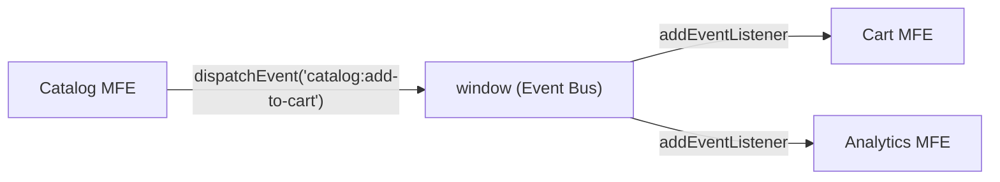
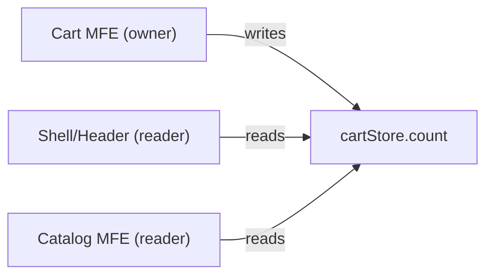

# Уровень 8: Коммуникация между микрофронтендами

## Почему коммуникация — это отдельная архитектурная задача

В монолите компоненты общаются через props, Redux store или прямые импорты — всё в одном bundle, один контекст выполнения. В микрофронтендной архитектуре каждый MFE живёт в своём «пузыре»: отдельный bundle, возможно отдельный фреймворк, своё состояние.

Когда приходит задача «Catalog должен добавить товар в Cart», возникает соблазн сделать «как обычно» — импортировать cartStore из cart-пакета. Это ошибка, разрушающая всю архитектуру.

Правильная постановка вопроса: **как MFE может сообщить о намерении, не зная, кто отреагирует?**

## Принцип 1: Минимальная связность

```
Catalog знает только о событии 'catalog:add-to-cart'
Cart знает только о событии 'catalog:add-to-cart'
Catalog НЕ ЗНАЕТ о Cart
Cart НЕ ЗНАЕТ о Catalog
```

Это позволяет:
- Заменить Cart другой реализацией без изменений в Catalog
- Добавить Analytics MFE, который тоже слушает это событие
- Тестировать Catalog без Cart

## Принцип 2: Явные контракты

Каждый способ коммуникации должен быть задокументирован типами:

```typescript
// Это не просто код — это документация архитектуры
interface EventMap {
  'catalog:add-to-cart': { productId: string; qty: number }
  'cart:checkout-started': { total: number; items: number }
}
```

Если контракт не задокументирован — он станет источником bugs при изменениях.

## Паттерн 1: Custom Events через window

### Как это работает



Стандартный браузерный механизм `CustomEvent` позволяет MFE общаться через общий `window` объект без импортов.

```typescript
// Отправитель (Catalog MFE)
function addToCart(productId: string, qty: number) {
  window.dispatchEvent(new CustomEvent('catalog:add-to-cart', {
    bubbles: true,
    detail: { productId, qty }
  }))
}

// Получатель (Cart MFE)
function init() {
  const handler = (e: Event) => {
    const { productId, qty } = (e as CustomEvent<AddToCartPayload>).detail
    cartStore.addItem(productId, qty)
  }
  window.addEventListener('catalog:add-to-cart', handler)
  return () => window.removeEventListener('catalog:add-to-cart', handler)
}
```

### Namespacing событий

Всегда используйте `mfe-name:action` формат:

```typescript
// Хорошо — сразу видно источник
'catalog:add-to-cart'
'cart:checkout-started'
'profile:logout'

// Плохо — неясно, кто владелец
'add-to-cart'
'userLogout'
```

### Typed Event Bus

Сырые CustomEvent неудобны: приходится помнить типы payload и имена событий. Typed Event Bus решает это:

```typescript
// packages/event-bus/index.ts — shared package
export interface EventMap {
  'catalog:add-to-cart': { productId: string; qty: number }
  'cart:checkout-started': { total: number; items: number }
  'profile:logout': void
  'profile:address-updated': { city: string; street: string }
}

export class EventBus {
  private handlers = new Map<keyof EventMap, Set<Function>>()

  emit<K extends keyof EventMap>(event: K, payload: EventMap[K]): void {
    // Используем собственный Map вместо window для контроля
    this.handlers.get(event)?.forEach(fn => fn(payload))
  }

  on<K extends keyof EventMap>(
    event: K,
    handler: (payload: EventMap[K]) => void
  ): () => void {
    if (!this.handlers.has(event)) {
      this.handlers.set(event, new Set())
    }
    this.handlers.get(event)!.add(handler)
    // Возвращаем функцию отписки
    return () => this.handlers.get(event)?.delete(handler)
  }
}

export const eventBus = new EventBus()
```

Использование:

```typescript
// Полная типизация: TypeScript проверит имя события и тип payload
eventBus.emit('catalog:add-to-cart', { productId: 'p42', qty: 1 })

// Автодополнение работает для всех событий EventMap
const unsubscribe = eventBus.on('catalog:add-to-cart', ({ productId, qty }) => {
  // productId: string, qty: number — TypeScript знает типы
  cart.addItem(productId, qty)
})

// Обязательно отписываться при unmount!
return () => unsubscribe()
```

### Когда использовать Custom Events

✅ Fire-and-forget уведомления (Catalog добавил товар — Cart реагирует)
✅ Аналитические события (все MFE эмитят, Analytics слушает всё)
✅ Когда отправитель не ожидает ответа
✅ Когда несколько получателей должны реагировать на одно событие

❌ Синхронизация UI-состояния (счётчик корзины должен всегда быть актуальным)
❌ Многошаговые процессы с зависимыми шагами
❌ Данные нужны «прямо сейчас» без задержки события

## Паттерн 2: Shared State

### Концепция ownership

В shared state важно правило: **только один MFE владеет слайсом и записывает в него**.



```typescript
// packages/shared-store/cart.ts
interface CartStore {
  count: number
  items: CartItem[]
  // Actions — только Cart MFE вызывает
  addItem: (productId: string, qty: number) => void
  removeItem: (productId: string) => void
}

export const useCartStore = create<CartStore>((set) => ({
  count: 0,
  items: [],
  addItem: (productId, qty) => set((s) => ({
    count: s.count + qty,
    items: [...s.items, { productId, qty }]
  })),
  removeItem: (productId) => set((s) => ({
    count: s.count - 1,
    items: s.items.filter(i => i.productId !== productId)
  }))
}))
```

```typescript
// Shell/Header — только читает
function CartBadge() {
  const count = useCartStore((s) => s.count)
  return <span>{count}</span>
}

// Cart MFE — владелец, читает и пишет
function CartPage() {
  const { items, removeItem } = useCartStore()
  // ...
}
```

### Проблема: дублирование Zustand instance

Module Federation требует осторожности: если и Shell, и Cart загружают Zustand независимо, могут возникнуть два разных store. Решение:

```javascript
// webpack.config.js (Module Federation)
shared: {
  'zustand': { singleton: true, requiredVersion: '^4.0.0' }
}
```

### Когда использовать Shared State

✅ Данные нужны нескольким компонентам одновременно (badge, счётчик)
✅ UI должен обновляться синхронно
✅ Данные должны быть доступны сразу при монтировании (нет «пропущенных» событий)

❌ Данные принадлежат только одному MFE (внутреннее состояние)
❌ Редкие события без необходимости постоянной синхронизации

## Паттерн 3: URL / localStorage

### localStorage + StorageEvent

```typescript
// Profile MFE — устанавливает язык
function changeLanguage(lang: string) {
  localStorage.setItem('app:lang', lang)
  // Уведомить другие вкладки и MFE в той же вкладке
  window.dispatchEvent(new StorageEvent('storage', {
    key: 'app:lang',
    newValue: lang,
    oldValue: localStorage.getItem('app:lang'),
  }))
}

// Все MFE инициализируются с текущим значением
function init() {
  const currentLang = localStorage.getItem('app:lang') ?? 'ru'
  applyLanguage(currentLang)

  window.addEventListener('storage', (e) => {
    if (e.key === 'app:lang' && e.newValue) {
      applyLanguage(e.newValue)
    }
  })
}
```

### URL для shareable state

```typescript
// Фильтры каталога в URL — можно поделиться ссылкой
const params = new URLSearchParams(window.location.search)
params.set('category', 'electronics')
params.set('price_max', '5000')
history.pushState({}, '', `?${params}`)
```

### Когда использовать

✅ Пользовательские настройки (язык, тема) — сохраняются между сессиями
✅ Состояние, которым можно поделиться (URL)
✅ Глобальные настройки без серверной зависимости

❌ Чувствительные данные (JWT токены в localStorage → XSS риск!)
❌ Часто меняющееся состояние (performance: каждая запись в localStorage синхронна)

## Паттерн 4: Props через Shell

Shell — это единственный компонент, который знает обо всех MFE. Он может передавать данные при монтировании:

```typescript
// Shell — хозяин токена авторизации
function Shell() {
  const [token, setToken] = useState<string | null>(null)

  const handleTokenRefresh = async () => {
    const newToken = await refreshToken()
    setToken(newToken)
    // Перемонтируем MFE с новым токеном
    remountMFEs({ authToken: newToken })
  }

  return (
    <>
      <CatalogMFE
        authToken={token}
        userId={session.userId}
      />
      <CartMFE
        authToken={token}
        onCheckout={(order) => shell.handleCheckout(order)}
      />
    </>
  )
}
```

```typescript
// Mount-функция MFE
export function mount(container: HTMLElement, props: MFEProps): () => void {
  const root = createRoot(container)
  root.render(<App authToken={props.authToken} />)
  return () => root.unmount()
}
```

### Когда использовать

✅ Auth-данные и токены (Shell управляет refresh)
✅ Конфигурация приложения (locale, featureFlags)
✅ Колбеки для двусторонней связи MFE → Shell

❌ Данные, которые часто меняются (перемонтирование дорого)
❌ Данные нужны глубоко в иерархии MFE (prop drilling)

## Паттерн 5: Orchestrator

Shell как state machine для сложных бизнес-флоу:

```typescript
type CheckoutState =
  | { step: 'cart'; items: CartItem[] }
  | { step: 'address'; items: CartItem[]; address?: Address }
  | { step: 'payment'; items: CartItem[]; address: Address; paymentMethod?: string }
  | { step: 'confirm'; orderId: string }

function Shell() {
  const [checkout, setCheckout] = useState<CheckoutState>({ step: 'cart', items: [] })

  switch (checkout.step) {
    case 'cart':
      return (
        <CartMFE
          items={checkout.items}
          onProceed={(items) => setCheckout({ step: 'address', items })}
        />
      )
    case 'payment':
      return (
        <PaymentMFE
          total={calculateTotal(checkout.items)}
          onComplete={(method) => setCheckout({
            step: 'confirm',
            // ...
          })}
        />
      )
  }
}
```

### Когда использовать

✅ Многошаговые процессы (checkout, onboarding, wizard)
✅ Строгая последовательность — шаг 2 недоступен без шага 1
✅ Состояние процесса должно жить в одном месте

❌ Простые события без зависимостей
❌ Shell становится слишком «умным» (god component)

## Анти-паттерны: разбор ошибок

### ❌ Прямые импорты между MFE

```typescript
// cart/src/checkout.ts
import { catalogApi } from '../../../catalog/src/api' // НЕЛЬЗЯ!
import { useProductStore } from 'catalog/store' // тоже НЕЛЬЗЯ!
```

**Почему плохо:** Cart и Catalog теперь один bundle. При изменении Catalog нужно пересобирать Cart. Нарушена изоляция деплоя.

**Правильно:** Catalog эмитит событие с нужными данными в payload.

### ❌ Глобальные переменные как шина

```javascript
// Catalog пишет
window.__appState.products = fetchedProducts

// Cart читает
const qty = window.__appState.cart.items.length

// Кто-то ещё в другом MFE
window.__appState = {} // Случайно затёр!
```

**Почему плохо:** нет типизации, нет контракта, любой MFE может сломать чужое состояние. Глобальный namespace захламляется.

### ❌ Callback hell через window

```javascript
window.catalogCallbacks = window.catalogCallbacks || {}
window.catalogCallbacks.onAddToCart = function(item) {
  window.cartCallbacks.updateCount(item.qty)
}
```

**Почему плохо:** порядок инициализации MFE имеет значение (race condition). При перезагрузке одного MFE коллбеки теряются.

### ❌ Синхронный вызов метода другого MFE

```javascript
// Cart MFE обращается к публичному API Catalog
window.mfeApis.catalog.refreshProduct(productId) // tight coupling!
```

**Почему плохо:** Cart знает о внутренних возможностях Catalog. Если Catalog убирает этот метод, Cart ломается.

## Сравнительная таблица

| Паттерн | Связность | Синхронизация | Сохранение | Отладка |
|---------|-----------|---------------|------------|---------|
| Custom Events | Минимальная | Асинхронная | Нет | Средне |
| Shared State | Средняя | Синхронная | Нет | Просто |
| URL/localStorage | Минимальная | Асинхронная | Да | Просто |
| Props через Shell | Shell знает обо всех | При монтировании | Нет | Просто |
| Orchestrator | Shell управляет | Синхронная | Нет | Просто |

## Комбинирование паттернов

В реальном приложении используются несколько паттернов одновременно:

```
Auth-токен        → Props через Shell (безопасно, явно)
Счётчик корзины   → Shared State (синхронный UI)
Добавить в корзину → Custom Events (fire-and-forget)
Язык интерфейса   → localStorage (между сессиями)
Checkout процесс  → Orchestrator (строгий флоу)
```

Главное правило: **выбирайте паттерн под характеристики данных и коммуникации**, а не «один паттерн на всё».

## Тестирование коммуникации

```typescript
// Тест события (без реального event bus)
test('addToCart эмитит правильное событие', () => {
  const emitted: unknown[] = []
  const mockBus = {
    emit: (event: string, payload: unknown) => emitted.push({ event, payload }),
    on: vi.fn(),
  }

  const catalog = new CatalogService(mockBus)
  catalog.addToCart('p42', 2)

  expect(emitted).toEqual([{
    event: 'catalog:add-to-cart',
    payload: { productId: 'p42', qty: 2 }
  }])
})
```

Изолированность MFE делает их тестируемыми — нужно только замокать event bus, а не весь соседний MFE.
