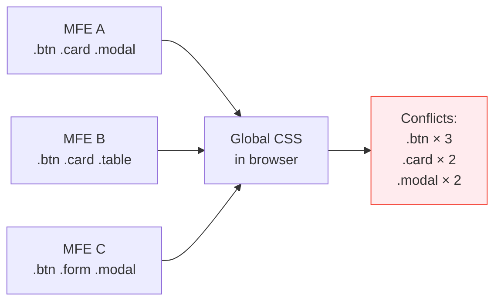
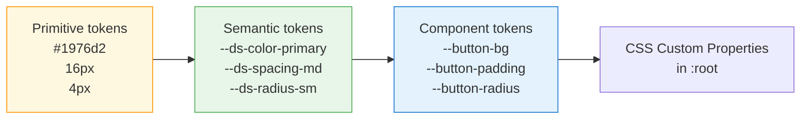

# Design System and Styling in Microfrontends — Detailed Theory

## The Problem: Style Consistency

Imagine an online store: team A develops the catalog, team B — the cart, team C — the profile. All three write their styles independently. In a monolith, this is solved by a design system and shared CSS. In MFE architecture, CSS reaches the browser from different sources, in unpredictable order.

### Anatomy of a CSS Conflict

```
Load order in browser:
1. MFE A loads → .btn { background: blue; border-radius: 4px; }
2. MFE B loads → .btn { background: red; border-radius: 24px; }

Result: ALL buttons with .btn class became red and rounded,
including buttons in MFE A — because CSS cascade works by order in DOM.
```

This is deterministic (whoever loads last wins), but not predictable at development time: load order depends on network, cache, Module Federation configuration.

### Scale of the Problem



## Strategy 1: No Isolation (Anti-pattern)

When each MFE just writes global CSS classes.

❌ What happens:
```css
/* MFE A */
.btn { color: white; background: #1976d2; }

/* MFE B (loaded later) */
.btn { color: white; background: #ff5722; font-size: 16px; }
```

All buttons in the application are now orange, including those in MFE A. Team A doesn't know their buttons are broken — they test MFE A in isolation, where their CSS loads last.

✅ When acceptable: never in production MFE architecture. Only for prototypes.

## Strategy 2: CSS Modules

Webpack/Vite transform class names during build, adding a unique hash.

```css
/* Source file: Button.module.css */
.btn { background: #1976d2; }
.btnLarge { font-size: 18px; }
```

```css
/* After bundling in browser */
.btn_a3x9k1 { background: #1976d2; }
.btnLarge_a3x9k1 { font-size: 18px; }
```

✅ Pros:
- No runtime cost (everything happens at build)
- Works in all browsers
- Good DX — local names in code, unique in browser

⚠️ Limitations:
- Isolation is name-only, not DOM-structural
- Global styles (`*`, `body`) can still conflict
- Component libraries with inline styles aren't protected

### MFE Application Pattern

```tsx
// MFE A: CatalogButton.module.css
// .btn { background: var(--ds-color-primary); }

import styles from './CatalogButton.module.css'

function CatalogButton() {
  // In DOM: class="btn_a3x9k1" — unique
  return <button className={styles.btn}>Add</button>
}
```

## Strategy 3: Shadow DOM

Browser platform encapsulation. Component creates an isolated DOM subtree where external CSS rules don't penetrate and internal ones don't leak.

```tsx
class CatalogMFE extends HTMLElement {
  connectedCallback() {
    const shadow = this.attachShadow({ mode: 'open' })

    // Styles live ONLY inside this shadow root
    shadow.innerHTML = `
      <style>
        /* This .btn doesn't conflict with anything outside */
        .btn {
          background: #1976d2;
          border-radius: 4px;
        }
      </style>
      <button class="btn">Add</button>
    `
  }
}
customElements.define('catalog-mfe', CatalogMFE)
```

✅ Complete CSS and DOM isolation. External styles don't affect.

⚠️ Problems:
- Global theme (dark mode) doesn't get inside automatically
- CSS Custom Properties — the only "bridge" through Shadow DOM
- Harder to debug (DevTools shows shadow tree separately)
- Harder to integrate with CSS-in-JS libraries

### CSS Custom Properties as a Bridge

```css
/* Globally in :root */
:root {
  --ds-color-primary: #1976d2;
}

/* Inside Shadow DOM — variables INHERIT */
.btn {
  /* This works even inside Shadow DOM! */
  background: var(--ds-color-primary);
}
```

This is exactly why Design Tokens on Custom Properties are the perfect pair with Shadow DOM.

## Strategy 4: CSS Layers (@layer)

New CSS standard (2022), allowing explicit cascade order management.

```css
/* Declare layer priority order */
@layer base, mfe-a, mfe-b, mfe-c;

/* MFE A registers its styles in its layer */
@layer mfe-a {
  .btn { background: #1976d2; border-radius: 4px; }
}

/* MFE B registers in its layer */
@layer mfe-b {
  .btn { background: #ff5722; border-radius: 24px; }
}

/* Styles from mfe-b have higher priority than mfe-a,
   BUT they only apply to elements inside their MFE */
```

Key difference from simple cascade: specificity within a layer doesn't matter when comparing between layers. `@layer mfe-a .btn.important` loses to `@layer mfe-b .btn` — layer priority is more important.

✅ Pros:
- No runtime cost
- Predictable cascade
- Works well with design tokens

⚠️ Support: Chrome 99+, Firefox 97+, Safari 15.4+. IE/old Edge not supported.

## Design Tokens: Contract Architecture

### What is a Design Token

It's a named design decision variable, not a value. The distinction is fundamental:

```
Value: #1976d2 (blue color)
Token:    --ds-color-primary (primary action color)
```

Token abstracts the decision from implementation. When a designer decides to make "primary action" purple, the token value changes, not all usage locations.

### Token Hierarchy



MFE teams use **semantic tokens** — they are stable. Primitive tokens — internals of the design system.

### Full Token Structure

```css
:root {
  /* === COLORS === */
  --ds-color-primary: #1976d2;
  --ds-color-primary-hover: #1565c0;
  --ds-color-secondary: #7b1fa2;
  --ds-color-success: #388e3c;
  --ds-color-error: #d32f2f;
  --ds-color-warning: #f57c00;
  --ds-color-background: #ffffff;
  --ds-color-surface: #f5f5f5;
  --ds-color-text: #212121;
  --ds-color-text-secondary: #757575;

  /* === SPACING === */
  --ds-spacing-xs: 4px;
  --ds-spacing-sm: 8px;
  --ds-spacing-md: 16px;
  --ds-spacing-lg: 24px;
  --ds-spacing-xl: 40px;
  --ds-spacing-2xl: 64px;

  /* === TYPOGRAPHY === */
  --ds-font-family: Inter, system-ui, sans-serif;
  --ds-font-size-h1: 32px;
  --ds-font-size-h2: 24px;
  --ds-font-size-h3: 20px;
  --ds-font-size-h4: 18px;
  --ds-font-size-body: 14px;
  --ds-font-size-small: 12px;
  --ds-font-weight-regular: 400;
  --ds-font-weight-medium: 500;
  --ds-font-weight-bold: 700;

  /* === BORDER RADIUS === */
  --ds-radius-sm: 4px;
  --ds-radius-md: 8px;
  --ds-radius-lg: 16px;
  --ds-radius-full: 9999px;

  /* === SHADOWS === */
  --ds-shadow-sm: 0 1px 3px rgba(0,0,0,0.12);
  --ds-shadow-md: 0 4px 12px rgba(0,0,0,0.15);
  --ds-shadow-lg: 0 8px 24px rgba(0,0,0,0.18);
}
```

## Token Distribution Strategies

### npm Package

```bash
npm install @company/design-tokens
```

```ts
// In MFE: import and inject into DOM
import '@company/design-tokens/tokens.css'
// or programmatic access
import { tokens } from '@company/design-tokens'
```

Update lifecycle:
```
Designer changes token
→ @company/design-tokens@2.1.0 published
→ Each team updates dependency
→ Each MFE rebuilds and deploys
→ Applied via CI/CD (days or weeks)
```

✅ Explicit versioning, TypeScript types, tree-shaking
⚠️ Slow change propagation

### Federated Module (Module Federation)

```ts
// design-system host: webpack.config.js
exposes: {
  './tokens': './src/tokens/index.ts',
}

// MFE consumer
import('@design-system/tokens').then(({ injectTokens }) => {
  injectTokens(document.documentElement)
})
```

Update lifecycle:
```
Designer changes token
→ design-system deploys (minutes)
→ All MFEs get new tokens on NEXT page load
→ Without MFE rebuild
```

✅ Instant distribution without rebuild
⚠️ Dependency on design-system availability at runtime

### CDN (static CSS/JSON)

```html
<!-- In shell application -->
<link rel="stylesheet" href="https://cdn.company.com/tokens/v2/tokens.css">
```

```ts
// Or dynamically with versioning
async function loadTokens(version: string) {
  const link = document.createElement('link')
  link.rel = 'stylesheet'
  link.href = `https://cdn.company.com/tokens/${version}/tokens.css`
  document.head.appendChild(link)
}
```

✅ Instant update, independent of MFE build
⚠️ No TypeScript, harder to manage versions across environments

## Design System Versioning

### Semantic Versioning for CSS

```
MAJOR.MINOR.PATCH
  │     │     └── Fix value (bug fix: wrong hex)
  │     └──────── New token added (backward compatible)
  └────────────── Token renamed / removed (breaking change)
```

### Deprecation Strategy

```css
/* v2.0.0 — token rename */
:root {
  --ds-color-primary: #1976d2;

  /* Deprecated alias: supported until v3.0.0 */
  /* @deprecated Use --ds-color-primary */
  --ds-color-blue: var(--ds-color-primary);
  --ds-color-brand: var(--ds-color-primary);
}
```

Rule: never remove a token without two-three major versions with a deprecated alias. Teams need time to migrate.

### Automated Audit

```ts
// Tool for finding deprecated token usage
function auditTokenUsage(cssText: string): string[] {
  const deprecated = ['--ds-color-blue', '--ds-color-brand']
  return deprecated.filter(token => cssText.includes(token))
}
```

## ⚠️ Common Beginner Mistakes

❌ Hardcoding values instead of tokens:
```css
/* Bad: on rebrand, need to find all locations */
.button { background: #1976d2; }

/* Good: one token changes */
.button { background: var(--ds-color-primary); }
```

❌ Using different token names across teams:
```css
/* MFE A */ --primary-color: ...;
/* MFE B */ --brand-color: ...;
/* MFE C */ --ds-color-primary: ...;
```
Tokens are a contract. Without a single namespace (`--ds-`) there's no consistency.

❌ Breaking Shadow DOM isolation via `:host`:
```css
/* Anti-pattern: injecting global styles */
:host { all: initial; } /* Resets entire theme */
```

✅ Correct: use CSS Custom Properties as the only bridge:
```css
:host {
  /* Inherit only what's needed */
  color: var(--ds-color-text, #212121);
  font-family: var(--ds-font-family, system-ui);
}
```

❌ Versioning tokens without deprecation period:
```
v1.0.0: --ds-color-blue
v2.0.0: removed --ds-color-blue  ← breaks all MFEs
```

✅ Correct: two majors with alias:
```
v2.0.0: --ds-color-primary + --ds-color-blue: var(--ds-color-primary) /* @deprecated */
v3.0.0: --ds-color-primary + --ds-color-blue: var(--ds-color-primary) /* @deprecated */
v4.0.0: only --ds-color-primary
```

## 💡 Best Practices

1. **Single source of truth** — all tokens defined in one place (design-system), MFEs only consume
2. **`--ds-` namespace** — explicit prefix for design system tokens distinguishes them from local variables
3. **CSS Modules + CSS Custom Properties** — best combo for most MFEs: isolated classes + shared theme via variables
4. **Shadow DOM only for real Web Components** — don't use Shadow DOM for CSS isolation unless creating a reusable custom element
5. **CI audit** — automatically check that MFEs don't use deprecated tokens during build
