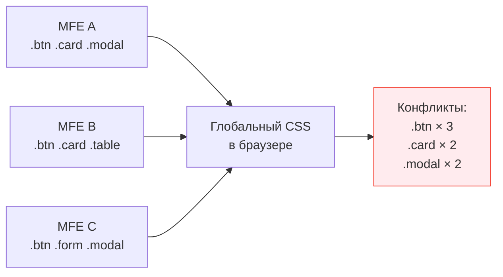
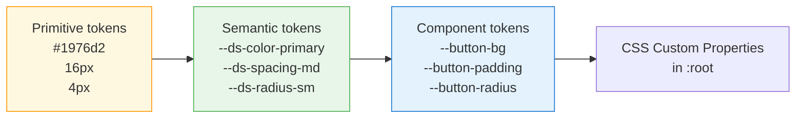

# Дизайн-система и стили в микрофронтендах — подробная теория

## Проблема: стилевая консистентность

Представьте интернет-магазин: команда A разрабатывает каталог, команда B — корзину, команда C — профиль. Все три пишут свои стили независимо. В монолите это решается дизайн-системой и общим CSS. В MFE-архитектуре CSS попадает в браузер из разных источников, в непредсказуемом порядке.

### Анатомия CSS-конфликта

```
Порядок загрузки в браузере:
1. MFE A грузится → .btn { background: blue; border-radius: 4px; }
2. MFE B грузится → .btn { background: red; border-radius: 24px; }

Результат: ВСЕ кнопки с классом .btn стали красными и круглыми,
включая кнопки в MFE A — потому что CSS cascade работает по порядку в DOM.
```

Это детерминировано (кто загружен последним — тот побеждает), но не предсказуемо на этапе разработки: порядок загрузки зависит от сети, кеша, конфигурации Module Federation.

### Масштаб проблемы



## Стратегия 1: Без изоляции (антипаттерн)

Когда каждый MFE просто пишет глобальные CSS-классы.

❌ Что происходит:
```css
/* MFE A */
.btn { color: white; background: #1976d2; }

/* MFE B (загружен позже) */
.btn { color: white; background: #ff5722; font-size: 16px; }
```

Все кнопки в приложении теперь оранжевые, включая те, что в MFE A. Команда A не знает, что их кнопки сломаны — они тестируют MFE A в изоляции, где их CSS загружается последним.

✅ Когда допустимо: никогда в production MFE-архитектуре. Только для прототипов.

## Стратегия 2: CSS Modules

Webpack/Vite трансформируют имена классов при сборке, добавляя уникальный хеш.

```css
/* Исходный файл: Button.module.css */
.btn { background: #1976d2; }
.btnLarge { font-size: 18px; }
```

```css
/* После сборки в браузере */
.btn_a3x9k1 { background: #1976d2; }
.btnLarge_a3x9k1 { font-size: 18px; }
```

✅ Плюсы:
- Нет runtime-cost (всё происходит при сборке)
- Работает во всех браузерах
- Хорошая DX — локальные имена в коде, уникальные в браузере

⚠️ Ограничения:
- Изоляция только именная, не DOM-структурная
- Global styles (`*`, `body`) всё равно могут конфликтовать
- Компоненты-библиотеки с инлайн-стилями не защищены

### Паттерн применения в MFE

```tsx
// MFE A: CatalogButton.module.css
// .btn { background: var(--ds-color-primary); }

import styles from './CatalogButton.module.css'

function CatalogButton() {
  // В DOM: class="btn_a3x9k1" — уникально
  return <button className={styles.btn}>Добавить</button>
}
```

## Стратегия 3: Shadow DOM

Браузерная платформенная инкапсуляция. Компонент создаёт изолированное поддерево DOM, куда не проникают внешние CSS-правила и из которого не утекают внутренние.

```tsx
class CatalogMFE extends HTMLElement {
  connectedCallback() {
    const shadow = this.attachShadow({ mode: 'open' })

    // Стили живут ТОЛЬКО внутри этого shadow root
    shadow.innerHTML = `
      <style>
        /* Этот .btn не конфликтует ни с чем снаружи */
        .btn {
          background: #1976d2;
          border-radius: 4px;
        }
      </style>
      <button class="btn">Добавить</button>
    `
  }
}
customElements.define('catalog-mfe', CatalogMFE)
```

✅ Полная изоляция CSS и DOM. Внешние стили не влияют.

⚠️ Проблемы:
- Глобальная тема (dark mode) не попадает внутрь автоматически
- CSS Custom Properties — единственный «мост» через Shadow DOM
- Сложнее отлаживать (DevTools показывает shadow tree отдельно)
- Сложнее интегрировать с CSS-in-JS библиотеками

### CSS Custom Properties как мост

```css
/* Глобально в :root */
:root {
  --ds-color-primary: #1976d2;
}

/* Внутри Shadow DOM — переменные НАСЛЕДУЮТСЯ */
.btn {
  /* Это работает даже внутри Shadow DOM! */
  background: var(--ds-color-primary);
}
```

Именно поэтому Design Tokens на Custom Properties — идеальная пара с Shadow DOM.

## Стратегия 4: CSS Layers (@layer)

Новый стандарт CSS (2022), позволяющий явно управлять порядком каскада.

```css
/* Объявление порядка приоритетов слоёв */
@layer base, mfe-a, mfe-b, mfe-c;

/* MFE A регистрирует свои стили в своём слое */
@layer mfe-a {
  .btn { background: #1976d2; border-radius: 4px; }
}

/* MFE B регистрирует в своём слое */
@layer mfe-b {
  .btn { background: #ff5722; border-radius: 24px; }
}

/* Стили из mfe-b имеют больший приоритет над mfe-a,
   НО они применяются только к элементам внутри своего MFE */
```

Ключевое отличие от простого каскада: специфичность внутри слоя не имеет значения при сравнении между слоями. `@layer mfe-a .btn.important` проиграет `@layer mfe-b .btn` — приоритет слоя важнее.

✅ Плюсы:
- Нет runtime-cost
- Предсказуемый каскад
- Хорошо работает с design tokens

⚠️ Поддержка: Chrome 99+, Firefox 97+, Safari 15.4+. IE/старые Edge не поддерживают.

## Design Tokens: архитектура контракта

### Что такое design token

Это именованная переменная дизайн-решения, а не значения. Различие принципиально:

```
Значение: #1976d2 (синий цвет)
Токен:    --ds-color-primary (цвет основного действия)
```

Токен абстрагирует решение от реализации. Когда дизайнер решает сделать «основное действие» фиолетовым, меняется значение токена, а не все места использования.

### Иерархия токенов



Команды MFE используют **semantic tokens** — они стабильны. Primitive tokens — это внутренность дизайн-системы.

### Полная структура токенов

```css
:root {
  /* === COLORS === */
  --ds-color-primary: #1976d2;
  --ds-color-primary-hover: #1565c0;
  --ds-color-secondary: #7b1fa2;
  --ds-color-success: #388e3c;
  --ds-color-error: #d32f2f;
  --ds-color-warning: #f57c00;
  --ds-color-background: #ffffff;
  --ds-color-surface: #f5f5f5;
  --ds-color-text: #212121;
  --ds-color-text-secondary: #757575;

  /* === SPACING === */
  --ds-spacing-xs: 4px;
  --ds-spacing-sm: 8px;
  --ds-spacing-md: 16px;
  --ds-spacing-lg: 24px;
  --ds-spacing-xl: 40px;
  --ds-spacing-2xl: 64px;

  /* === TYPOGRAPHY === */
  --ds-font-family: Inter, system-ui, sans-serif;
  --ds-font-size-h1: 32px;
  --ds-font-size-h2: 24px;
  --ds-font-size-h3: 20px;
  --ds-font-size-h4: 18px;
  --ds-font-size-body: 14px;
  --ds-font-size-small: 12px;
  --ds-font-weight-regular: 400;
  --ds-font-weight-medium: 500;
  --ds-font-weight-bold: 700;

  /* === BORDER RADIUS === */
  --ds-radius-sm: 4px;
  --ds-radius-md: 8px;
  --ds-radius-lg: 16px;
  --ds-radius-full: 9999px;

  /* === SHADOWS === */
  --ds-shadow-sm: 0 1px 3px rgba(0,0,0,0.12);
  --ds-shadow-md: 0 4px 12px rgba(0,0,0,0.15);
  --ds-shadow-lg: 0 8px 24px rgba(0,0,0,0.18);
}
```

## Стратегии распространения токенов

### npm-пакет

```bash
npm install @company/design-tokens
```

```ts
// В MFE: импорт и вставка в DOM
import '@company/design-tokens/tokens.css'
// или программный доступ
import { tokens } from '@company/design-tokens'
```

Жизненный цикл обновления:
```
Дизайнер меняет токен
→ Публикуется @company/design-tokens@2.1.0
→ Каждая команда обновляет зависимость
→ Каждый MFE пересобирается и деплоится
→ Применяется через CI/CD (дни или недели)
```

✅ Явное управление версиями, TypeScript-типы, tree-shaking  
⚠️ Медленное распространение изменений

### Federated Module (Module Federation)

```ts
// design-system host: webpack.config.js
exposes: {
  './tokens': './src/tokens/index.ts',
}

// MFE consumer
import('@design-system/tokens').then(({ injectTokens }) => {
  injectTokens(document.documentElement)
})
```

Жизненный цикл обновления:
```
Дизайнер меняет токен
→ design-system деплоится (минуты)
→ Все MFE получают новые токены при СЛЕДУЮЩЕЙ загрузке страницы
→ Без пересборки MFE
```

✅ Мгновенное распространение без пересборки  
⚠️ Зависимость от доступности design-system в runtime

### CDN (статический CSS/JSON)

```html
<!-- В shell-приложении -->
<link rel="stylesheet" href="https://cdn.company.com/tokens/v2/tokens.css">
```

```ts
// Или динамически с версионированием
async function loadTokens(version: string) {
  const link = document.createElement('link')
  link.rel = 'stylesheet'
  link.href = `https://cdn.company.com/tokens/${version}/tokens.css`
  document.head.appendChild(link)
}
```

✅ Мгновенное обновление, независимость от сборки MFE  
⚠️ Нет TypeScript, сложнее управлять версиями для разных окружений

## Версионирование дизайн-системы

### Семантическое версионирование для CSS

```
MAJOR.MINOR.PATCH
  │     │     └── Исправление значения (bug fix: неверный hex)
  │     └──────── Новый токен добавлен (обратно совместимо)
  └────────────── Токен переименован / удалён (breaking change)
```

### Стратегия deprecation

```css
/* v2.0.0 — переименование токена */
:root {
  --ds-color-primary: #1976d2;

  /* Deprecated alias: поддерживается до v3.0.0 */
  /* @deprecated Используйте --ds-color-primary */
  --ds-color-blue: var(--ds-color-primary);
  --ds-color-brand: var(--ds-color-primary);
}
```

Правило: никогда не удаляйте токен без двух-трёх мажорных версий с deprecated-алиасом. У команд должно быть время на миграцию.

### Автоматический аудит

```ts
// Инструмент для поиска использования deprecated токенов
function auditTokenUsage(cssText: string): string[] {
  const deprecated = ['--ds-color-blue', '--ds-color-brand']
  return deprecated.filter(token => cssText.includes(token))
}
```

## ⚠️ Типичные ошибки новичков

❌ Хардкодить значения вместо токенов:
```css
/* Плохо: при ребрендинге нужно искать все места */
.button { background: #1976d2; }

/* Хорошо: меняется один токен */
.button { background: var(--ds-color-primary); }
```

❌ Использовать разные имена токенов в разных командах:
```css
/* MFE A */ --primary-color: ...;
/* MFE B */ --brand-color: ...;
/* MFE C */ --ds-color-primary: ...;
```
Токены — это контракт. Без единого неймспейса (`--ds-`) нет консистентности.

❌ Нарушать Shadow DOM изоляцию через `:host`:
```css
/* Антипаттерн: прокидывание глобальных стилей */
:host { all: initial; } /* Сброс всей темы */
```

✅ Правильно: использовать CSS Custom Properties как единственный мост:
```css
:host {
  /* Наследуем только то, что нужно */
  color: var(--ds-color-text, #212121);
  font-family: var(--ds-font-family, system-ui);
}
```

❌ Версионировать токены без deprecation-периода:
```
v1.0.0: --ds-color-blue
v2.0.0: удалили --ds-color-blue  ← ломаем все MFE
```

✅ Правильно: два мажора с алиасом:
```
v2.0.0: --ds-color-primary + --ds-color-blue: var(--ds-color-primary) /* @deprecated */
v3.0.0: --ds-color-primary + --ds-color-blue: var(--ds-color-primary) /* @deprecated */
v4.0.0: только --ds-color-primary
```

## 💡 Лучшие практики

1. **Единственный источник правды** — все токены определяются в одном месте (design-system), MFE только потребляют
2. **Неймспейс `--ds-`** — явный префикс для токенов дизайн-системы отличает их от локальных переменных
3. **CSS Modules + CSS Custom Properties** — лучшая комбинация для большинства MFE: изолированные классы + общая тема через переменные
4. **Shadow DOM только для настоящих Web Components** — не используйте Shadow DOM ради изоляции CSS, если вы не создаёте переиспользуемый custom element
5. **Аудит в CI** — автоматически проверяйте, что MFE не используют deprecated токены при сборке
