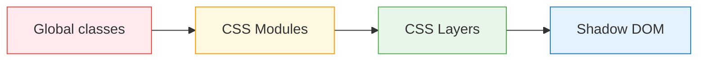

# Level 9: Design System and Styling in Microfrontends

## Why Styling is an Architectural Problem

In a monolith, there's one CSS bundle, one team, one set of classes. In microfrontends, each team writes styles independently. Without an explicit contract, this leads to collisions: `.btn` from MFE A overwrites `.btn` from MFE B, depending on load order.

This isn't just "ugly" — it's unpredictable behavior in production that depends on script loading sequence.

## CSS Isolation Strategies



**No isolation** — each MFE writes `.btn`, last loaded wins. Cheap during development, deadly at scale.

**CSS Modules** — bundler (webpack/vite) generates unique hashes: `.btn` → `.btn_3x9k1`. Works everywhere, no runtime cost. Limitation: isolation only at build level, not DOM.

**Shadow DOM** — browser encapsulation. Styles don't leak out (`::slotted` — the only exception). Full isolation — but also complete: global theme won't get inside without `CSS Custom Properties`.

**CSS Layers (@layer)** — managed cascade. You explicitly declare layer order: `@layer base, mfe-a, mfe-b`. A style in `mfe-a` never overrides `mfe-b` without explicit specificity increase. Modern approach, Chrome 99+.

## Design Tokens as a Single Contract

A design token is a named design decision. Not "blue color," but "primary action color." Implementation may change (dark theme, rebranding), the contract — doesn't.

```css
/* Contract — stable */
--ds-color-primary: #1976d2;
--ds-spacing-md: 16px;
--ds-radius-sm: 4px;

/* MFE A uses token, doesn't hardcode value */
.button {
  background: var(--ds-color-primary);
  padding: var(--ds-spacing-xs) var(--ds-spacing-md);
  border-radius: var(--ds-radius-sm);
}
```

CSS Custom Properties inherit through DOM, so they can be defined once in `:root` and be available in all MFEs — even inside Shadow DOM (this is the only thing that "penetrates" encapsulation).

## Token Distribution Strategies

| Strategy | When to change | Suitable for |
|---|---|---|
| npm package | Only after rebuilding all MFEs | Stable design systems |
| Federated Module | At runtime without rebuild | Frequent updates |
| CDN (CSS file) | Instantly, globally | Experiments, A/B |

## Versioning and Breaking Changes

Changing a token is a breaking change for all consumers. Rules:

1. Adding a new token — safe
2. Changing a value — only through a new major version
3. Removing a token — through a deprecation period (keep both names)

```css
/* Deprecated alias — keep for 2 major versions */
--ds-color-blue: var(--ds-color-primary); /* @deprecated, use --ds-color-primary */
```
