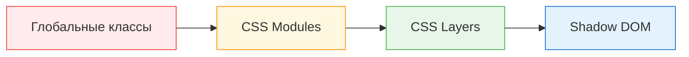

# Уровень 9: Дизайн-система и стили в микрофронтендах

## Почему стили — это архитектурная проблема

В монолите один CSS-бандл, одна команда, один набор классов. В микрофронтендах каждая команда пишет свои стили независимо. Без явного контракта это приводит к коллизиям: `.btn` из MFE A перезаписывает `.btn` из MFE B, в зависимости от порядка загрузки.

Это не просто «некрасиво» — это непредсказуемое поведение в production, которое зависит от последовательности загрузки скриптов.

## Стратегии CSS-изоляции



**Без изоляции** — каждый MFE пишет `.btn`, последний загруженный побеждает. Дёшево в разработке, смертельно в масштабе.

**CSS Modules** — сборщик (webpack/vite) генерирует уникальные хеши: `.btn` → `.btn_3x9k1`. Работает везде, нет runtime-cost. Ограничение: изоляция только на уровне сборки, не DOM.

**Shadow DOM** — браузерная инкапсуляция. Стили не вытекают наружу (`::slotted` — единственное исключение). Полная изоляция — но и полная: глобальная тема тоже не попадёт внутрь без `CSS Custom Properties`.

**CSS Layers (@layer)** — управляемый каскад. Вы явно объявляете порядок слоёв: `@layer base, mfe-a, mfe-b`. Стиль в `mfe-a` никогда не перебьёт `mfe-b` без явного повышения специфичности. Современный подход, Chrome 99+.

## Design Tokens как единый контракт

Design token — это именованная переменная дизайн-решения. Не «синий цвет», а «цвет основного действия». Реализация может меняться (тёмная тема, ребрендинг), контракт — нет.

```css
/* Контракт — стабилен */
--ds-color-primary: #1976d2;
--ds-spacing-md: 16px;
--ds-radius-sm: 4px;

/* MFE A использует токен, не хардкодит значение */
.button {
  background: var(--ds-color-primary);
  padding: var(--ds-spacing-xs) var(--ds-spacing-md);
  border-radius: var(--ds-radius-sm);
}
```

CSS Custom Properties наследуются по DOM, поэтому их можно определить один раз в `:root` и они будут доступны во всех MFE — даже внутри Shadow DOM (это единственное, что «проникает» сквозь инкапсуляцию).

## Стратегии распространения токенов

| Стратегия | Когда менять | Подходит |
|---|---|---|
| npm-пакет | Только после пересборки всех MFE | Стабильные дизайн-системы |
| Federated Module | В runtime без пересборки | Частые обновления |
| CDN (CSS-файл) | Мгновенно, глобально | Эксперименты, A/B |

## Версионирование и breaking changes

Изменение токена — это breaking change для всех потребителей. Правила:

1. Добавление нового токена — безопасно
2. Изменение значения — только через новую мажорную версию
3. Удаление токена — через deprecation период (поддерживать оба имени)

```css
/* Deprecated alias — оставить на 2 мажорных версии */
--ds-color-blue: var(--ds-color-primary); /* @deprecated, use --ds-color-primary */
```
