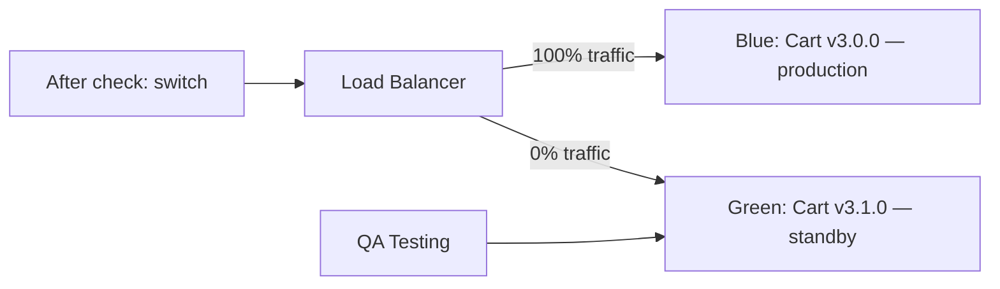

# MFE Deploy and Versioning: Complete Guide

## Why Independent Deploy is Hard

In a monolith, deploy is one operation: build everything, deploy everything. Yes, scary, but simple. In MFE you have 10 teams, each deploying their own piece. This means:

- Shell must be able to work with different versions of remote MFEs simultaneously
- Deploying one MFE shouldn't require rebuilding the rest
- If Cart deployed an incompatible interface — there must be a way to rollback only Cart

All this requires a thoughtful versioning strategy, registry, and CI/CD pipeline.

---

## MFE Registry: Control Center

Registry — the source of truth about where everything lives. Shell reads the registry at startup.

```json
{
  "remotes": {
    "catalog": {
      "url": "https://cdn.example.com/mfe/catalog/1.5.2/remoteEntry.js",
      "version": "1.5.2",
      "deployedAt": "2026-04-09T09:10:33Z"
    },
    "cart": {
      "url": "https://cdn.example.com/mfe/cart/a3b9f2c1/remoteEntry.js",
      "version": "3.1.0",
      "canary": {
        "enabled": true,
        "percent": 10,
        "url": "https://cdn.example.com/mfe/cart/7d4e8f2a/remoteEntry.js"
      }
    }
  }
}
```

Registry must have a very short cache TTL (10–60 seconds). This allows rollbacks to apply almost instantly — just update the record in the registry.

### Registry Storage Options

**JSON on S3/GCS** — the simplest. File loaded from CDN, has short TTL. Update — `aws s3 cp registry.json s3://bucket/`.

**KV storage (Redis, Cloudflare KV)** — fast reads, convenient API for atomic updates. Good for canary: one key per user-id.

**Config Service** — full-featured service with API, change history, read/write access. Suitable for large organizations.

---

## Module Federation: How Shell Loads Remote

```javascript
// webpack.config.js (shell)
new ModuleFederationPlugin({
  name: 'shell',
  remotes: {
    catalog: `promise new Promise(resolve => {
      fetch('/api/registry')
        .then(r => r.json())
        .then(registry => {
          const script = document.createElement('script')
          script.src = registry.remotes.catalog.url
          script.onload = () => resolve(window['catalog'])
          document.head.appendChild(script)
        })
    })`,
  },
})
```

Dynamic remote loading allows shell to not know the URL until runtime. URL comes from the registry at the first module access.

---

## Versioning and Contracts

### Semver in MFE Context

MFE component versions follow semver, but with one key rule:

- **Major bump** → potentially incompatible API/interface changes with other MFEs
- **Minor bump** → new features, backward compatible
- **Patch** → fixes, no API changes

Before a major bump, the team must notify consumers (shell, other MFEs) and give them time to adapt.

### Parallel Versions

When updating catalog to a major version, you can temporarily support two versions:

```
/mfe/catalog/1.x/remoteEntry.js  — legacy, deprecated
/mfe/catalog/2.x/remoteEntry.js  — new version
```

Shell gradually shifts traffic from v1 to v2. Teams depending on catalog migrate on their own schedule.

---

## Pipeline: Details of Each Stage

### Build

```yaml
build:
  script:
    - npm run build
    - ls -la dist/  # check that remoteEntry.js exists
  artifacts:
    paths:
      - dist/
```

During build it's important:
- Fix version in `remoteEntry.js` (via DefinePlugin or env variable)
- Generate `build-manifest.json` with list of all chunks and their hashes
- Don't include shared dependencies (react, react-dom) in the bundle — they're shared

### Testing

```
Unit tests      — components in isolation (Jest + RTL)
Contract tests  — verify exported API didn't change (Pact, MSW)
Visual tests    — screenshot tests (Playwright, Chromatic)
```

Important: contract tests verify that remote exports what shell expects. They run on CI for both sides.

### Publish

```bash
# Upload with versioned URL (remoteEntry.js — short TTL)
aws s3 cp dist/remoteEntry.js \
  s3://cdn/mfe/catalog/1.5.2/remoteEntry.js \
  --cache-control "max-age=3600, s-maxage=3600"

# Upload static chunks (immutable)
aws s3 sync dist/ \
  s3://cdn/mfe/catalog/1.5.2/ \
  --exclude "remoteEntry.js" \
  --cache-control "max-age=31536000, immutable" \
  --metadata-directive REPLACE
```

### CDN Invalidation

After updating `remoteEntry.js`, CDN cache must be invalidated:

```bash
aws cloudfront create-invalidation \
  --distribution-id $DISTRIBUTION_ID \
  --paths "/mfe/catalog/1.5.2/remoteEntry.js"
```

For content-hash files, invalidation isn't needed — new URL, new file.

---

## Canary: Implementation Details

### How to Route Canary at Registry Level

```javascript
// registry-service: returns different URLs based on userId
function getRemoteUrl(mfeId, userId) {
  const config = registry[mfeId]
  if (!config.canary?.enabled) return config.url

  // Deterministic userId hashing
  const userBucket = hashUserId(userId) % 100
  if (userBucket < config.canary.percent) {
    return config.canary.url  // new version
  }
  return config.url  // stable version
}
```

Determinism is important: a user should always hit the same version during the canary period. Random choice gives poor UX (version changes between sessions).

### Metrics for Promotion Decision

At each canary stage, the following are monitored:
- **Error rate** — JavaScript error percentage
- **Core Web Vitals** — LCP, CLS, FID for canary segment
- **Business metrics** — conversion, add to cart (for Cart MFE)
- **API error rate** — errors from MFE-initiated API requests

Automatic rollback triggers when threshold is exceeded (e.g., error rate > 1% for 5 minutes).

---

## Blue-Green for MFE

Unlike canary (gradual transition), blue-green keeps two full environments:



Blue-green for MFE means: both versions exist simultaneously in CDN. Shell is configured to green after successful smoke testing. Rollback — instant registry switch back to blue.

---

## Orchestrating Deploys of Multiple MFEs

Sometimes you need to deploy several MFEs in a coordinated way (e.g., Catalog and Cart both changed a shared contract). This is called **coordinated deploy**.

```yaml
# deploy-coordinator.yaml
steps:
  - name: "Deploy Catalog v2.0.0"
    action: deploy
    mfe: catalog
    version: "2.0.0"
    wait_healthy: true

  - name: "Deploy Cart v3.1.0"
    action: deploy
    mfe: cart
    version: "3.1.0"
    depends_on: ["catalog@2.0.0"]

  - name: "Update Shell config"
    action: update-registry
    entries:
      catalog: "2.0.0"
      cart: "3.1.0"
```

Coordinated deploy is the exception, not the rule. If it happens often, it's a signal that MFEs are too tightly coupled.

---

## Deploy Observability

Every deploy should leave a trace:

```javascript
// Deployment event in analytics
analytics.track('mfe_deployed', {
  mfe: 'catalog',
  version: '1.5.2',
  previous_version: '1.5.1',
  deploy_duration_ms: 45000,
  canary_percent: 5,
  environment: 'production',
  deployed_by: 'github-actions',
  commit_sha: process.env.COMMIT_SHA,
})
```

This allows:
- Correlating deploys with metric changes
- Quickly finding what changed during an incident
- Building reports on deploy frequency and success rate

---

## Pre-Deploy Checklist

```
[ ] Unit and integration tests passed
[ ] Contract tests with dependent MFEs passed
[ ] Rollback plan documented
[ ] Feature flags configured (if gradual activation needed)
[ ] Canary percentage defined
[ ] Monitoring configured for new MFE metrics
[ ] Registry TTL doesn't exceed 60 seconds
[ ] CDN invalidation included in pipeline
[ ] On-call engineer notified about deploy
```

---

## 📌 Final Principles

1. **Independence** — deploying one MFE shouldn't require coordination with others
2. **Backward compatibility** — contracts change with a deprecation period
3. **Observability** — every deploy is logged and correlated with metrics
4. **Graduality** — canary, not instant switch
5. **Fast rollback** — rollback via registry update, no rebuild
6. **Immutable artifacts** — content-hash files never change, only new ones are added
