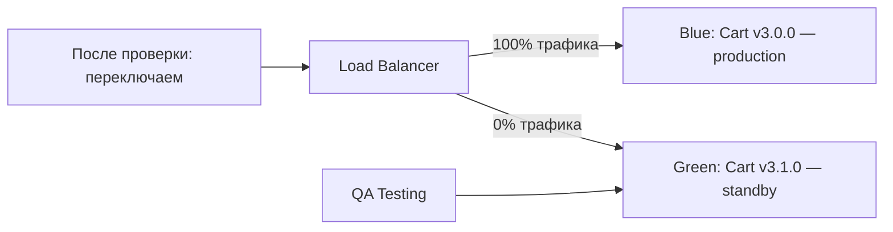

# Деплой и версионирование MFE: полное руководство

## Почему независимый деплой — это сложно

В монолите деплой — это одна операция: собрали всё, задеплоили всё. Да, страшно, зато просто. В MFE у вас 10 команд, каждая деплоит свой кусок. Это означает:

- Shell должен уметь работать с разными версиями удалённых MFE одновременно
- Деплой одного MFE не должен требовать пересборки остальных
- Если Cart задеплоил несовместимый интерфейс — должна быть возможность откатить только Cart

Всё это требует продуманной стратегии версионирования, реестра и CI/CD pipeline.

---

## Реестр MFE: центр управления

Реестр — это источник истины о том, что где лежит. Shell читает реестр при запуске.

```json
{
  "remotes": {
    "catalog": {
      "url": "https://cdn.example.com/mfe/catalog/1.5.2/remoteEntry.js",
      "version": "1.5.2",
      "deployedAt": "2026-04-09T09:10:33Z"
    },
    "cart": {
      "url": "https://cdn.example.com/mfe/cart/a3b9f2c1/remoteEntry.js",
      "version": "3.1.0",
      "canary": {
        "enabled": true,
        "percent": 10,
        "url": "https://cdn.example.com/mfe/cart/7d4e8f2a/remoteEntry.js"
      }
    }
  }
}
```

Реестр должен иметь очень короткий TTL кеша (10–60 секунд). Это позволяет rollback применяться почти мгновенно — достаточно обновить запись в реестре.

### Варианты хранения реестра

**JSON на S3/GCS** — самый простой. Файл загружается из CDN, имеет короткий TTL. Обновление — это `aws s3 cp registry.json s3://bucket/`.

**KV-хранилище (Redis, Cloudflare KV)** — быстрое чтение, удобный API для атомарных обновлений. Хорошо для canary: один ключ per user-id.

**Config Service** — полноценный сервис с API, историей изменений, доступом на чтение/запись. Подходит для крупных организаций.

---

## Module Federation: как shell загружает remote

```javascript
// webpack.config.js (shell)
new ModuleFederationPlugin({
  name: 'shell',
  remotes: {
    catalog: `promise new Promise(resolve => {
      fetch('/api/registry')
        .then(r => r.json())
        .then(registry => {
          const script = document.createElement('script')
          script.src = registry.remotes.catalog.url
          script.onload = () => resolve(window['catalog'])
          document.head.appendChild(script)
        })
    })`,
  },
})
```

Динамическая загрузка remote позволяет shell не знать URL до runtime. URL берётся из реестра в момент первого обращения к модулю.

---

## Версионирование и контракты

### Semver в контексте MFE

Версии компонентов MFE следуют semver, но с одним ключевым правилом:

- **Major bump** → потенциально несовместимые изменения API/интерфейса с другими MFE
- **Minor bump** → новые возможности, обратно совместимые
- **Patch** → исправления, никаких API-изменений

Перед major bump команда обязана уведомить потребителей (shell, другие MFE) и дать время на адаптацию.

### Параллельные версии

При major обновлении catalog можно временно поддерживать две версии:

```
/mfe/catalog/1.x/remoteEntry.js  — legacy, deprecated
/mfe/catalog/2.x/remoteEntry.js  — новая версия
```

Shell постепенно переводит трафик с v1 на v2. Команды, зависящие от catalog, мигрируют по своему расписанию.

---

## Pipeline: детали каждого этапа

### Build

```yaml
build:
  script:
    - npm run build
    - ls -la dist/  # проверяем, что remoteEntry.js создан
  artifacts:
    paths:
      - dist/
```

При сборке важно:
- Зафиксировать версию в `remoteEntry.js` (через DefinePlugin или переменную окружения)
- Сгенерировать `build-manifest.json` со списком всех чанков и их хешами
- Не включать в бандл общие зависимости (react, react-dom) — они shared

### Тестирование

```
Unit tests      — компоненты в изоляции (Jest + RTL)
Contract tests  — проверка, что экспортируемый API не изменился (Pact, MSW)
Visual tests    — скриншот-тесты (Playwright, Chromatic)
```

Важно: контрактные тесты проверяют, что remote экспортирует то, что shell ожидает. Они запускаются на CI у обеих сторон.

### Publish

```bash
# Загрузка с версионным URL (remoteEntry.js — короткий TTL)
aws s3 cp dist/remoteEntry.js \
  s3://cdn/mfe/catalog/1.5.2/remoteEntry.js \
  --cache-control "max-age=3600, s-maxage=3600"

# Загрузка статических чанков (immutable)
aws s3 sync dist/ \
  s3://cdn/mfe/catalog/1.5.2/ \
  --exclude "remoteEntry.js" \
  --cache-control "max-age=31536000, immutable" \
  --metadata-directive REPLACE
```

### Инвалидация CDN

После обновления `remoteEntry.js` нужно инвалидировать кеш CDN:

```bash
aws cloudfront create-invalidation \
  --distribution-id $DISTRIBUTION_ID \
  --paths "/mfe/catalog/1.5.2/remoteEntry.js"
```

Для content-hash файлов инвалидация не нужна — новый URL, новый файл.

---

## Canary: детали реализации

### Как роутить canary на уровне реестра

```javascript
// registry-service: возвращает разные URL на основе userId
function getRemoteUrl(mfeId, userId) {
  const config = registry[mfeId]
  if (!config.canary?.enabled) return config.url

  // Детерминированное хеширование userId
  const userBucket = hashUserId(userId) % 100
  if (userBucket < config.canary.percent) {
    return config.canary.url  // новая версия
  }
  return config.url  // стабильная версия
}
```

Детерминированность важна: пользователь должен всегда попадать в одну и ту же версию в течение canary-периода. Случайный выбор даёт плохой UX (версия меняется между сессиями).

### Метрики для promotion decision

На каждом шаге canary мониторятся:
- **Error rate** — процент JavaScript-ошибок
- **Core Web Vitals** — LCP, CLS, FID для canary-сегмента
- **Business metrics** — конверсия, добавление в корзину (для Cart MFE)
- **API error rate** — ошибки API-запросов, инициированных MFE

Автоматический rollback срабатывает при превышении порога (например, error rate > 1% в течение 5 минут).

---

## Blue-Green для MFE

В отличие от canary (градуальный переход), blue-green держит два полных окружения:



Blue-green для MFE означает: в CDN одновременно существуют обе версии. Shell конфигурируется на green после успешного smoke-тестирования. Rollback — мгновенное переключение реестра обратно на blue.

---

## Оркестрация деплоев нескольких MFE

Иногда нужно задеплоить несколько MFE согласованно (например, Catalog и Cart одновременно изменили shared contract). Это называется **coordinated deploy**.

```yaml
# deploy-coordinator.yaml
steps:
  - name: "Deploy Catalog v2.0.0"
    action: deploy
    mfe: catalog
    version: "2.0.0"
    wait_healthy: true
    
  - name: "Deploy Cart v3.1.0"
    action: deploy
    mfe: cart
    version: "3.1.0"
    depends_on: ["catalog@2.0.0"]
    
  - name: "Update Shell config"
    action: update-registry
    entries:
      catalog: "2.0.0"
      cart: "3.1.0"
```

Координированный деплой — это исключение, не правило. Если он происходит часто, это сигнал о слишком тесной связанности MFE.

---

## Observability деплоя

Каждый деплой должен оставлять след:

```javascript
// Deployment event в аналитике
analytics.track('mfe_deployed', {
  mfe: 'catalog',
  version: '1.5.2',
  previous_version: '1.5.1',
  deploy_duration_ms: 45000,
  canary_percent: 5,
  environment: 'production',
  deployed_by: 'github-actions',
  commit_sha: process.env.COMMIT_SHA,
})
```

Это позволяет:
- Коррелировать деплои с изменениями метрик
- Быстро находить, что изменилось при инциденте
- Строить отчёты о частоте и успешности деплоев

---

## Чеклист перед деплоем

```
[ ] Unit и integration тесты прошли
[ ] Contract tests с зависимыми MFE прошли
[ ] Rollback-план задокументирован
[ ] Feature flags настроены (если нужна постепенная активация)
[ ] Canary-процент определён
[ ] Мониторинг настроен на метрики нового MFE
[ ] Registry TTL не превышает 60 секунд
[ ] CDN invalidation включён в pipeline
[ ] On-call инженер уведомлён о деплое
```

---

## 📌 Итоговые принципы

1. **Независимость** — деплой одного MFE не должен требовать согласования с другими
2. **Обратная совместимость** — контракты меняются с deprecation-периодом
3. **Наблюдаемость** — каждый деплой логируется и коррелируется с метриками
4. **Постепенность** — canary, а не мгновенный переход
5. **Быстрый откат** — rollback через обновление реестра, без пересборки
6. **Immutable артефакты** — content-hash файлы никогда не изменяются, только добавляются новые
