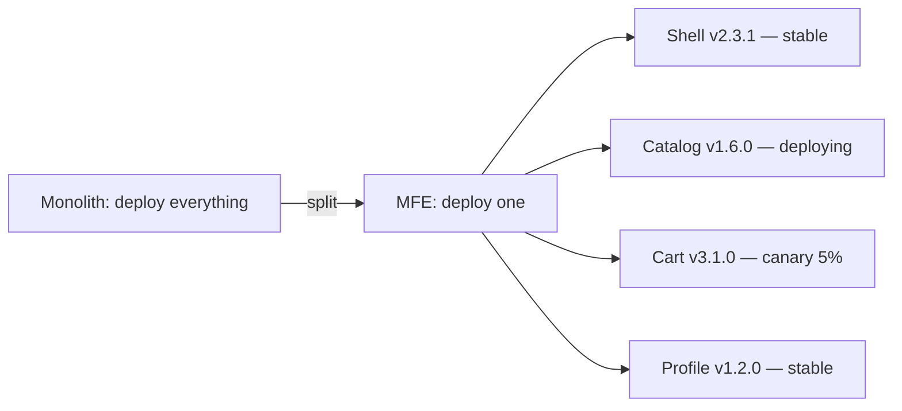
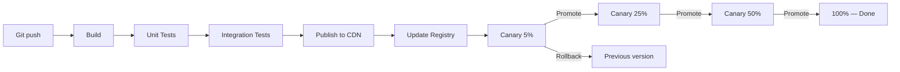
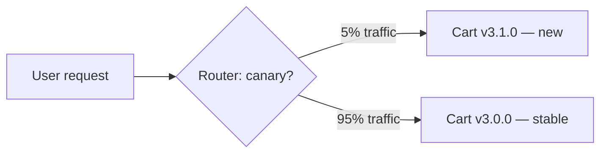
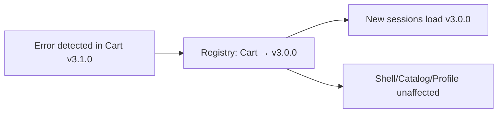

# Level 10: MFE Deploy and Versioning

## Independent Deploy — The Main Value of Microfrontends

One of the key promises of microfrontend architecture: **teams deploy independently**. Catalog team doesn't wait for Cart team. If Profile has a bug — only Profile deploys, leaving the rest untouched.

But this promise requires serious infrastructure. Without proper versioning and pipeline, one failed Cart deploy breaks the entire application.



---

## Versioning Strategies for Remote Modules

Each MFE publishes itself by URL. The question — which URL exactly?

### SemVer

```
/mfe/catalog/1.5.2/remoteEntry.js
/mfe/catalog/1.6.0/remoteEntry.js
```

URL contains an explicit version. Shell loads a specific version and knows what to expect. Rollback — just changing the version in config. This is the most predictable approach.

✅ Readability, simple rollback, explicit control
❌ Requires manifest update on every deploy

### Content Hash

```
/mfe/catalog/a3b9f2c1/remoteEntry.js
/mfe/catalog/7d4e8f2a/remoteEntry.js
```

Hash is generated from build content. Same code — same hash. This enables `Cache-Control: immutable` — browser never re-requests a file at the old URL.

✅ Ideal for CDN caching, automatically unique
❌ URL is unreadable, needs registry for hash → version mapping

### Latest

```
/mfe/catalog/latest/remoteEntry.js
```

Always points to the last deploy. Simplicity is tempting, but it's a mine.

⚠️ Requires `Cache-Control: no-cache` — every request hits CDN
⚠️ Shell doesn't know what it's loading — no compatibility guarantee
⚠️ Not recommended for production, especially for shell

---

## CI/CD Pipeline for a Single MFE



Each MFE goes through the pipeline independently. Shell and other MFEs continue running with previous versions.

### Build

Webpack/Vite builds the MFE as a Module Federation remote. Output — `remoteEntry.js` and all chunks. Important: no dependencies on other MFEs in the bundle.

### Test

Unit tests and integration tests run on the component in isolation. No need for the full shell — just the MFE itself.

### Publish

Artifacts are uploaded to CDN (S3 + CloudFront, GCS + Cloud CDN, etc.). Content-hash files are uploaded once forever. `remoteEntry.js` with version-based URL may update.

### Update Registry

Registry — a central store of "where everything lives." Shell reads the registry at startup and knows which URL to load for each MFE. Registry can be: JSON file on S3, KV storage (Redis), config service.

---

## Canary Deployment for MFE

Canary — when a new version receives only part of the traffic, while other users see the old one.



How it works technically for MFE:
- Shell requests the registry on load
- Registry responds with different URLs for different sessions (based on userId or cookie)
- Shell loads the specified URL

Canary percentage increases in stages: 5% → 25% → 50% → 100%. Errors are monitored at each stage. If SLO is breached — automatic rollback.

---

## Rollback: Rolling Back a Single MFE

This is the main difference between MFE and monolith. When Cart has an issue:

1. Registry updates: Cart → previous version
2. Users receive the old URL on next request
3. Shell, Catalog, Profile are not restarted



💡 With proper setup, rollback takes seconds and doesn't require a rebuild.

---

## CDN and Caching: Strategy by File Type

Not all files are cached the same way:

| File | Strategy | Cache-Control |
|------|----------|---------------|
| `remoteEntry.js` (semver URL) | Short TTL | `max-age=3600` |
| `chunk.abc123.js` (hash in name) | Immutable | `max-age=31536000, immutable` |
| `remoteEntry.js` (latest URL) | No cache | `no-cache, no-store` |
| Registry JSON | Very short | `max-age=60` |

### Immutable Cache — Why It's Powerful

A file with content-hash in its name will never change. Browser can cache it for a year. CDN also caches it on edge nodes worldwide. This gives lightning-fast loading for returning users.

On new deploy, a new hash is generated → new URL → browser requests new file. Old files gradually get evicted from cache.

---

## ⚠️ Common Beginner Mistakes

### Mistake 1: Shell with "latest" Strategy

```
❌ /mfe/shell/latest/remoteEntry.js
```

Shell is the application foundation. If it loads an incompatible version, the entire app breaks.

```
✅ /mfe/shell/2.3.1/remoteEntry.js  — explicit version
```

### Mistake 2: Immutable Cache + Latest Strategy

```
❌ Cache-Control: immutable
❌ URL: /mfe/catalog/latest/remoteEntry.js
```

Browser cached the file forever, but URL doesn't change. Users never get the update.

```
✅ latest → Cache-Control: no-cache
✅ immutable → only for files with hash in name
```

### Mistake 3: Canary Without Rollback Policy

```
❌ canaryPercent: 25, rollbackPolicy: "disabled"
```

If errors start on the canary audience, nobody will automatically rollback. You'll have to wake up at night and do it manually.

```
✅ canaryPercent: 25, rollbackPolicy: "auto-on-error"
```

### Mistake 4: Deploy Without Updating Registry

```
❌ Uploaded files to CDN
❌ Forgot to update registry.json
```

Users keep loading the old version. Deploy as if it never happened.

```
✅ Deploy = Upload CDN + Update Registry — this is an atomic operation in the pipeline
```

---

## 📌 Best Practices

- Shell always uses semver, never latest
- Content-hash + immutable for all static chunks
- Registry TTL ≤ 60 seconds — fast change application
- Canary starts at 5%, promote only with healthy metrics
- Rollback = change record in registry, no rebuild needed
- Document rollback plan before deploy, not after an incident
