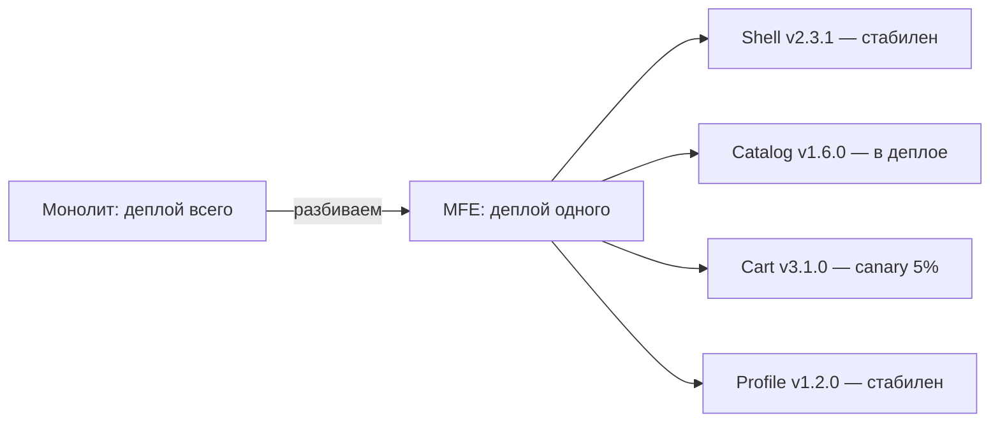
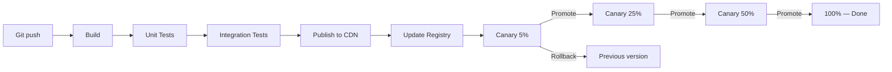
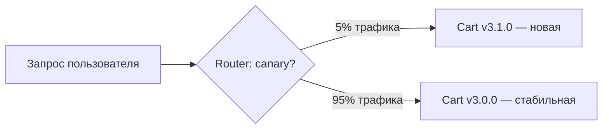
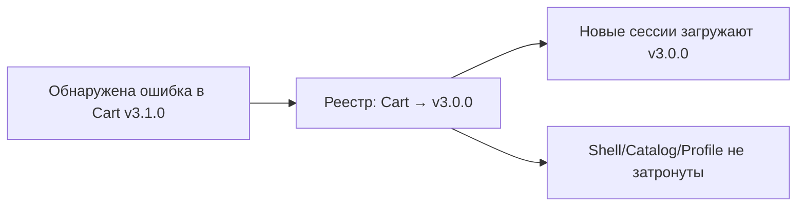

# Уровень 10: Деплой и версионирование MFE

## Независимый деплой — главная ценность микрофронтендов

Одно из ключевых обещаний архитектуры микрофронтендов звучит так: **команды деплоят независимо**. Команда Catalog не ждёт готовности команды Cart. Если в Profile нашли баг — деплоят только Profile, не трогая остальных.

Но это обещание требует серьёзной инфраструктуры. Без правильного версионирования и pipeline один неудачный деплой Cart сломает всё приложение.



---

## Стратегии версионирования remote-модулей

Каждый MFE публикует себя по URL. Вопрос — какой именно URL?

### SemVer

```
/mfe/catalog/1.5.2/remoteEntry.js
/mfe/catalog/1.6.0/remoteEntry.js
```

URL содержит явную версию. Shell загружает конкретную версию и знает, что ожидать. Rollback — просто смена версии в конфиге. Это самый предсказуемый подход.

✅ Читаемость, простой rollback, явное управление
❌ Требует обновления манифеста при каждом деплое

### Content Hash

```
/mfe/catalog/a3b9f2c1/remoteEntry.js
/mfe/catalog/7d4e8f2a/remoteEntry.js
```

Хеш генерируется из содержимого сборки. Одинаковый код — одинаковый хеш. Это позволяет использовать `Cache-Control: immutable` — браузер никогда не перезапросит файл по старому URL.

✅ Идеален для CDN кеширования, автоматически уникален
❌ URL нечитаем, нужен реестр для маппинга hash → версия

### Latest

```
/mfe/catalog/latest/remoteEntry.js
```

Всегда указывает на последний деплой. Простота подкупает, но это мина.

⚠️ Требует `Cache-Control: no-cache` — каждый запрос к CDN
⚠️ Shell не знает, что именно загрузит — нет гарантии совместимости
⚠️ Для production не рекомендуется, особенно для shell

---

## CI/CD Pipeline для одного MFE



Каждый MFE проходит pipeline независимо. Shell и другие MFE при этом продолжают работать с прежними версиями.

### Build

Webpack/Vite собирает MFE как Module Federation remote. На выходе — `remoteEntry.js` и все чанки. Важно: никаких зависимостей от других MFE в бандле.

### Test

Запускаются unit-тесты и интеграционные тесты компонента в изоляции. Не нужен весь shell — только сам MFE.

### Publish

Артефакты загружаются на CDN (S3 + CloudFront, GCS + Cloud CDN и т.д.). Файлы с content-hash загружаются один раз навсегда. `remoteEntry.js` с version-based URL может обновляться.

### Update Registry

Реестр — это центральное хранилище «что где лежит». Shell читает реестр при старте и знает, какой URL загружать для каждого MFE. Реестр может быть: JSON-файл на S3, KV-хранилище (Redis), конфиг-сервис.

---

## Canary Deployment для MFE

Canary — это когда новая версия получает только часть трафика, а остальные пользователи видят старую.



Как это работает технически для MFE:
- Shell при загрузке запрашивает реестр
- Реестр отвечает разными URL для разных сессий (на основе userId или cookie)
- Shell загружает указанный URL

Canary-процент повышается поэтапно: 5% → 25% → 50% → 100%. На каждом этапе мониторятся ошибки. Если SLO нарушается — автоматический rollback.

---

## Rollback: откат одного MFE

Это главное отличие MFE от монолита. При проблеме с Cart:

1. Реестр обновляется: Cart → предыдущая версия
2. Пользователи при следующем запросе получают старый URL
3. Shell, Catalog, Profile не перезапускаются



💡 При правильной настройке rollback занимает секунды и не требует пересборки.

---

## CDN и кеширование: стратегия по типу файла

Не все файлы кешируются одинаково:

| Файл | Стратегия | Cache-Control |
|------|-----------|---------------|
| `remoteEntry.js` (semver URL) | Короткое TTL | `max-age=3600` |
| `chunk.abc123.js` (hash в имени) | Immutable | `max-age=31536000, immutable` |
| `remoteEntry.js` (latest URL) | Нет кеша | `no-cache, no-store` |
| Registry JSON | Очень короткое | `max-age=60` |

### Immutable cache — почему это мощно

Файл с content-hash в имени никогда не изменится. Браузер может кешировать его год. CDN также кеширует его на edge-нодах по всему миру. Это даёт молниеносную загрузку для вернувшихся пользователей.

При новом деплое генерируется новый хеш → новый URL → браузер запрашивает новый файл. Старые файлы постепенно вытесняются из кеша.

---

## ⚠️ Типичные ошибки начинающих

### Ошибка 1: Shell с "latest" стратегией

```
❌ /mfe/shell/latest/remoteEntry.js
```

Shell — это основа приложения. Если он загрузит несовместимую версию, всё приложение сломается.

```
✅ /mfe/shell/2.3.1/remoteEntry.js  — явная версия
```

### Ошибка 2: Immutable cache + latest стратегия

```
❌ Cache-Control: immutable
❌ URL: /mfe/catalog/latest/remoteEntry.js
```

Браузер закешировал файл навсегда, но URL не меняется. Пользователи никогда не получат обновление.

```
✅ latest → Cache-Control: no-cache
✅ immutable → только для файлов с hash в имени
```

### Ошибка 3: Canary без rollback-политики

```
❌ canaryPercent: 25, rollbackPolicy: "disabled"
```

Если на canary-аудитории начнутся ошибки, никто не откатит версию автоматически. Нужно проснуться ночью и делать это вручную.

```
✅ canaryPercent: 25, rollbackPolicy: "auto-on-error"
```

### Ошибка 4: Деплой без обновления реестра

```
❌ Загрузили файлы на CDN
❌ Забыли обновить registry.json
```

Пользователи продолжают загружать старую версию. Деплой как будто не произошёл.

```
✅ Деплой = Upload CDN + Update Registry — это атомарная операция в pipeline
```

---

## 📌 Best Practices

- Shell всегда использует semver, никогда latest
- Content-hash + immutable для всех статических чанков
- Registry TTL ≤ 60 секунд — быстрое применение изменений
- Canary начинается с 5%, promote только при здоровых метриках
- Rollback = смена записи в реестре, без пересборки
- Документируйте rollback-план до начала деплоя, не после инцидента
