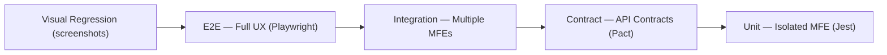
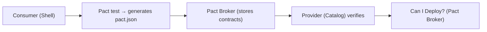

# Testing Microfrontends: Complete Guide

## Why MFE Testing is Harder Than a Monolith

In a monolithic frontend, all components live in one repository, share one dependency graph, and deploy together. Any broken import is visible during build. In microfrontend architecture, the picture is fundamentally different:

- Each MFE — a separate deployment with independent lifecycle
- Interface between MFEs (exposed modules, EventBus, shared state) — implicit contract
- A change in CatalogMFE can break ShellMFE without a single compilation error
- Teams deploy independently — integration issues discovered in prod

The standard Unit → Integration → E2E pyramid is insufficient. A specific level is needed — Contract Testing.

## Extended Pyramid for MFE



Each level answers its own question:

| Level | Question | Tools |
|-------|----------|-------|
| Unit | Does the component work in isolation? | Jest, Vitest, RTL |
| Contract | Is the cross-team contract broken? | Pact, MSW |
| Integration | Do MFEs work together? | Jest + Module Federation |
| E2E | Does the user scenario work? | Playwright, Cypress |
| Visual | Has the visual changed? | Playwright screenshots |

## Unit Tests: Full Isolation

### Principle

MFE is tested without shell and without other MFEs. All cross-boundary imports are stubbed via Jest moduleNameMapper.

### Isolation Setup

```ts
// jest.config.ts — catalog MFE
export default {
  moduleNameMapper: {
    // Stub all imports from other MFEs
    '^shell/(.*)$': '<rootDir>/__mocks__/shell/$1',
    '^shared-ui/(.*)$': '<rootDir>/__mocks__/shared-ui/$1',
  },
  setupFilesAfterFramework: ['./jest.setup.ts'],
}
```

```ts
// __mocks__/shell/EventBus.ts
export const emit = jest.fn()
export const on = jest.fn()
export const off = jest.fn()
```

### What to Test

✅ Components: render, props, user interactions
✅ Hooks: useCartItems, useProductSearch
✅ Utilities: price formatting, validation
✅ Store: Redux/Zustand slice logic
❌ Module Federation runtime — not unit-testable

### Good Unit Test Example

```tsx
// Cart MFE — useCartTotal hook test
import { renderHook, act } from '@testing-library/react'
import { useCartTotal } from './useCartTotal'

describe('useCartTotal', () => {
  it('calculates total with quantity', () => {
    const { result } = renderHook(() =>
      useCartTotal([
        { id: '1', price: 100, qty: 2 },
        { id: '2', price: 50, qty: 1 },
      ])
    )
    expect(result.current.total).toBe(250)
    expect(result.current.itemCount).toBe(3)
  })

  it('applies discount correctly', () => {
    const { result } = renderHook(() =>
      useCartTotal([{ id: '1', price: 1000, qty: 1 }], { discount: 0.1 })
    )
    expect(result.current.total).toBe(900)
  })
})
```

## Contract Tests: Pact

### Problem Without Contract Testing

```
CatalogMFE v1.5 exports: { products: Product[] }
CatalogMFE v1.6 exports: { items: Product[] }  ← breaking change!

Shell expects .products → undefined at runtime
No test caught this before deploy
```

### How Pact Works



### Consumer Side (Shell)

```ts
import { PactV3, MatchersV3 } from '@pact-foundation/pact'
const { eachLike, string, number } = MatchersV3

const provider = new PactV3({
  consumer: 'ShellMFE',
  provider: 'CatalogMFE',
  dir: path.resolve(process.cwd(), 'pacts'),
})

describe('ShellMFE — CatalogMFE contract', () => {
  it('loads product list', () => {
    return provider
      .given('products exist')
      .uponReceiving('GET /api/products')
      .withRequest({ method: 'GET', path: '/api/products' })
      .willRespondWith({
        status: 200,
        headers: { 'Content-Type': 'application/json' },
        body: {
          products: eachLike({
            id: string(),
            name: string(),
            price: number(),
          }),
        },
      })
      .executeTest(async (mockServer) => {
        const result = await fetchCatalogProducts(mockServer.url)
        expect(result.products).toBeDefined()
        expect(result.products.length).toBeGreaterThan(0)
      })
  })
})
```

### Provider Side (Catalog)

```ts
import { PactV3 } from '@pact-foundation/pact'

const verifier = new PactV3({
  provider: 'CatalogMFE',
  providerBaseUrl: 'http://localhost:3001',
  pactBrokerUrl: process.env.PACT_BROKER_URL,
  publishVerificationResult: true,
  providerVersion: process.env.CATALOG_VERSION,
  stateHandlers: {
    'products exist': async () => {
      await db.seed('products')
    },
  },
})

describe('CatalogMFE provider verification', () => {
  it('verifies pacts', () => verifier.verifyProvider())
})
```

### CI Workflow for Pact

```yaml
# Catalog deploy blocked if contract violated
- name: Verify pacts
  run: npx pact-broker can-i-deploy
    --pacticipant CatalogMFE
    --version ${{ github.sha }}
    --to-environment production
```

## Integration Tests: Multiple MFEs Together

### Approach: Test Application

A special test host is created that mounts multiple MFEs:

```ts
// test-utils/app-factory.ts
import { init } from '@module-federation/runtime'

export async function createTestApp(config: {
  mfes: string[]
  mockApi?: boolean
}) {
  const remotes = Object.fromEntries(
    config.mfes.map((name) => [
      name,
      `${name}@http://localhost:${MFE_PORTS[name]}/remoteEntry.js`,
    ])
  )

  const federation = init({ remotes })
  const shell = await federation.loadRemote('shell/App')
  const eventBus = await federation.loadRemote('shell/EventBus')

  return { federation, shell, eventBus }
}
```

### Example: EventBus Test

```ts
describe('EventBus integration', () => {
  it('Cart updates on addToCart from Catalog', async () => {
    const { eventBus } = await createTestApp({
      mfes: ['shell', 'catalog', 'cart'],
    })

    const cartUpdated = new Promise((resolve) => {
      eventBus.on('cart:updated', resolve)
    })

    eventBus.emit('catalog:addToCart', {
      productId: 'prod-42',
      quantity: 2,
    })

    const event = await cartUpdated
    expect(event).toMatchObject({
      itemCount: 2,
      total: expect.any(Number),
    })
  })
})
```

## E2E: Playwright

### Strategy: Only Critical Paths

E2E is slow and expensive. Test only:

1. Full checkout flow (catalog → cart → payment)
2. Registration and authentication
3. Critical business scenarios (order placement, payment)

```ts
// playwright.config.ts
export default defineConfig({
  testDir: './e2e',
  use: {
    baseURL: process.env.E2E_BASE_URL || 'http://localhost:3000',
    trace: 'on-first-retry',
  },
  projects: [
    { name: 'chromium', use: { ...devices['Desktop Chrome'] } },
    { name: 'mobile', use: { ...devices['iPhone 14'] } },
  ],
})
```

### MFE Isolation in E2E

```ts
// Using data-mfe attribute for selectors
test('catalog MFE loads', async ({ page }) => {
  await page.goto('/')
  // Wait for specific MFE
  const catalogMfe = page.locator('[data-mfe="catalog"]')
  await expect(catalogMfe).toBeVisible({ timeout: 10000 })
  // Work inside MFE
  await catalogMfe.locator('[data-testid="search-input"]').fill('iPhone')
})
```

## Visual Regression

### When It's Especially Important

- After design system updates (new tokens, components)
- When upgrading shared dependencies (Material UI / Tailwind version)
- During CSS/style refactoring

### Baseline Workflow

```bash
# First run — create baseline
npx playwright test --update-snapshots

# Subsequent runs — comparison
npx playwright test

# On intentional change — update baseline
npx playwright test --update-snapshots --grep "Catalog"
```

### Scaling

```ts
// Test all MFEs on different viewports
const MFE_ROUTES = [
  { name: 'shell-header', url: '/', selector: '[data-mfe="shell"] header' },
  { name: 'catalog-grid', url: '/catalog', selector: '[data-mfe="catalog"]' },
  { name: 'cart-empty', url: '/cart', selector: '[data-mfe="cart"]' },
]

for (const { name, url, selector } of MFE_ROUTES) {
  test(`visual: ${name}`, async ({ page }) => {
    await page.goto(url)
    await expect(page.locator(selector)).toHaveScreenshot(`${name}.png`)
  })
}
```

## Mock Remote: Substitution Strategies

### Three Strategies

```
Real remotes:   Shell + real Catalog/Cart/Profile
Mock remotes:   Shell + stubs for all remotes
Hybrid:         Shell + real Catalog + stubs Cart/Profile
```

### Mock Remote Implementation

```ts
// mock-entry.js — published next to tests
const MockCatalog = {
  ProductList: () => import('./mocks/catalog/ProductList'),
  ProductCard: () => import('./mocks/catalog/ProductCard'),
  EventBus: () => import('./mocks/catalog/EventBus'),
}

// webpack.config.test.ts
remotes: {
  catalog: process.env.USE_MOCK_CATALOG
    ? 'catalog@http://localhost:3099/mock-entry.js'
    : 'catalog@http://localhost:3001/remoteEntry.js',
}
```

### MSW as Alternative

Mock Service Worker intercepts HTTP requests — MFE thinks it's working with real API:

```ts
// handlers.ts
export const handlers = [
  http.get('/api/products', () => {
    return HttpResponse.json({
      products: mockProducts,
    })
  }),
]
```

## CI Pipeline: Optimal Configuration

### GitHub Actions Example

```yaml
name: MFE Test Pipeline

on:
  pull_request:
    branches: [main]
  push:
    branches: [main]

jobs:
  unit-contract:
    name: Unit + Contract
    runs-on: ubuntu-latest
    steps:
      - run: pnpm test:unit --workspace=packages/*
      - run: pnpm test:pact
      - run: npx pact-broker can-i-deploy --to-environment staging

  integration:
    name: Integration
    needs: unit-contract
    if: github.event_name == 'push'
    runs-on: ubuntu-latest
    steps:
      - run: pnpm test:integration

  e2e-visual:
    name: E2E + Visual
    needs: integration
    if: startsWith(github.ref, 'refs/tags/')  # only on tag
    runs-on: ubuntu-latest
    steps:
      - run: pnpm playwright test
      - run: pnpm playwright test --grep="visual"
```

### Time Optimization

| Problem | Solution |
|---------|----------|
| E2E takes 40+ min | Shard across 4 parallel agents |
| Contract tests block PR | Run async, only block deploy |
| Visual flakiness | Increase `maxDiffPixelRatio` or mask dynamic content |
| Integration flaky | Add retry + proper waitFor |

## ⚠️ Common Mistakes

### ❌ Testing Module Federation Runtime

```ts
// Bad — testing Module Federation bootstrap
test('remote loads', async () => {
  const remote = await import('catalog/ProductList') // breaks in Jest
})
```

**Problem:** Jest can't resolve Module Federation remotes.

```ts
// Good — stub via moduleNameMapper
// jest.config.ts
moduleNameMapper: { '^catalog/(.*)$': '<rootDir>/__mocks__/catalog/$1' }
```

### ❌ Duplicating E2E as Integration

```ts
// Bad — E2E scenario in integration test
test('full checkout', async () => {
  // 50 lines, slow, fragile
  await login(), addToCart(), fillPayment(), confirmOrder()
})
```

An integration test should test **one** inter-component scenario, quickly.

### ❌ Ignoring Contract Testing

Without Pact, breaking changes are only found in integration or prod. Contract tests take 5 minutes and catch 80% of cross-team conflicts.

### ❌ Running E2E on Every PR

Full E2E pyramid on every PR = 30–60 minutes wait for developer. Split by triggers.

## 💡 Best Practices

📌 **Pyramid rule**: 70% unit, 20% contract+integration, 10% E2E+visual

📌 **data-testid and data-mfe**: test attributes should be part of component API, not implementation detail

📌 **Pact Broker**: use Can-I-Deploy for safe deploys — it checks all contracts automatically

📌 **Visual baseline in git**: store screenshots in repo, update via separate PR

📌 **Test ID isolation**: each MFE should have a unique prefix in `data-testid` (`catalog-`, `cart-`)

📌 **Parallel E2E**: Playwright supports `--shard=1/4` — use it for speed

📌 **Smoke tests in prod**: minimal E2E set after deploy for early problem detection
