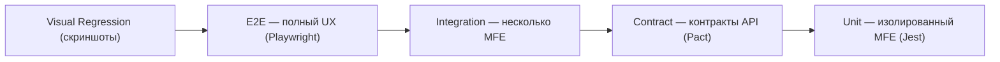
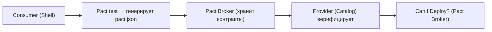

# Тестирование микрофронтендов: полное руководство

## Почему тестирование MFE сложнее монолита

В монолитном фронтенде все компоненты живут в одном репозитории, разделяют один граф зависимостей и деплоятся вместе. Любой сломанный импорт виден во время сборки. В архитектуре микрофронтендов картина принципиально иная:

- Каждый MFE — отдельный деплоймент с независимым lifecycle
- Интерфейс между MFE (exposed modules, EventBus, shared state) — неявный контракт
- Изменение в CatalogMFE может сломать ShellMFE без единой ошибки компиляции
- Команды деплоят независимо — интеграционные проблемы обнаруживаются в prod

Стандартная пирамида Unit → Integration → E2E недостаточна. Нужен специфический уровень — Contract Testing.

## Расширенная пирамида для MFE



Каждый уровень отвечает на свой вопрос:

| Уровень | Вопрос | Инструменты |
|---------|--------|-------------|
| Unit | Работает ли компонент изолированно? | Jest, Vitest, RTL |
| Contract | Не нарушен ли межкомандный контракт? | Pact, MSW |
| Integration | Работают ли MFE вместе? | Jest + Module Federation |
| E2E | Работает ли пользовательский сценарий? | Playwright, Cypress |
| Visual | Не изменился ли визуал? | Playwright screenshots |

## Unit-тесты: полная изоляция

### Принцип

MFE тестируется без shell и без других MFE. Все cross-boundary импорты заглушаются через Jest moduleNameMapper.

### Настройка изоляции

```ts
// jest.config.ts — catalog MFE
export default {
  moduleNameMapper: {
    // Заглушить все импорты из других MFE
    '^shell/(.*)$': '<rootDir>/__mocks__/shell/$1',
    '^shared-ui/(.*)$': '<rootDir>/__mocks__/shared-ui/$1',
  },
  setupFilesAfterFramework: ['./jest.setup.ts'],
}
```

```ts
// __mocks__/shell/EventBus.ts
export const emit = jest.fn()
export const on = jest.fn()
export const off = jest.fn()
```

### Что тестировать

✅ Компоненты: рендер, props, user interactions
✅ Хуки: useCartItems, useProductSearch
✅ Утилиты: форматирование цены, валидация
✅ Store: Redux/Zustand slice логика
❌ Module Federation runtime — не поддаётся unit-тестированию

### Пример хорошего unit-теста

```tsx
// Cart MFE — тест хука useCartTotal
import { renderHook, act } from '@testing-library/react'
import { useCartTotal } from './useCartTotal'

describe('useCartTotal', () => {
  it('считает сумму с учётом количества', () => {
    const { result } = renderHook(() =>
      useCartTotal([
        { id: '1', price: 100, qty: 2 },
        { id: '2', price: 50, qty: 1 },
      ])
    )
    expect(result.current.total).toBe(250)
    expect(result.current.itemCount).toBe(3)
  })

  it('применяет скидку корректно', () => {
    const { result } = renderHook(() =>
      useCartTotal([{ id: '1', price: 1000, qty: 1 }], { discount: 0.1 })
    )
    expect(result.current.total).toBe(900)
  })
})
```

## Contract-тесты: Pact

### Проблема без contract testing

```
CatalogMFE v1.5 экспортирует: { products: Product[] }
CatalogMFE v1.6 экспортирует: { items: Product[] }  ← breaking change!

Shell ожидает .products → undefined в runtime
Ни один тест не поймал это до деплоя
```

### Как работает Pact



### Consumer side (Shell)

```ts
import { PactV3, MatchersV3 } from '@pact-foundation/pact'
const { eachLike, string, number } = MatchersV3

const provider = new PactV3({
  consumer: 'ShellMFE',
  provider: 'CatalogMFE',
  dir: path.resolve(process.cwd(), 'pacts'),
})

describe('ShellMFE — CatalogMFE contract', () => {
  it('загружает список продуктов', () => {
    return provider
      .given('продукты существуют')
      .uponReceiving('GET /api/products')
      .withRequest({ method: 'GET', path: '/api/products' })
      .willRespondWith({
        status: 200,
        headers: { 'Content-Type': 'application/json' },
        body: {
          products: eachLike({
            id: string(),
            name: string(),
            price: number(),
          }),
        },
      })
      .executeTest(async (mockServer) => {
        const result = await fetchCatalogProducts(mockServer.url)
        expect(result.products).toBeDefined()
        expect(result.products.length).toBeGreaterThan(0)
      })
  })
})
```

### Provider side (Catalog)

```ts
import { PactV3 } from '@pact-foundation/pact'

const verifier = new PactV3({
  provider: 'CatalogMFE',
  providerBaseUrl: 'http://localhost:3001',
  pactBrokerUrl: process.env.PACT_BROKER_URL,
  publishVerificationResult: true,
  providerVersion: process.env.CATALOG_VERSION,
  stateHandlers: {
    'продукты существуют': async () => {
      await db.seed('products')
    },
  },
})

describe('CatalogMFE provider verification', () => {
  it('verifies pacts', () => verifier.verifyProvider())
})
```

### CI workflow для Pact

```yaml
# Catalog деплой блокируется если нарушен контракт
- name: Verify pacts
  run: npx pact-broker can-i-deploy
    --pacticipant CatalogMFE
    --version ${{ github.sha }}
    --to-environment production
```

## Integration-тесты: несколько MFE вместе

### Подход: тест-приложение

Создаётся специальный тест-хост, который монтирует несколько MFE:

```ts
// test-utils/app-factory.ts
import { init } from '@module-federation/runtime'

export async function createTestApp(config: {
  mfes: string[]
  mockApi?: boolean
}) {
  const remotes = Object.fromEntries(
    config.mfes.map((name) => [
      name,
      `${name}@http://localhost:${MFE_PORTS[name]}/remoteEntry.js`,
    ])
  )

  const federation = init({ remotes })
  const shell = await federation.loadRemote('shell/App')
  const eventBus = await federation.loadRemote('shell/EventBus')

  return { federation, shell, eventBus }
}
```

### Пример: тест EventBus

```ts
describe('EventBus integration', () => {
  it('Cart обновляется при addToCart от Catalog', async () => {
    const { eventBus } = await createTestApp({
      mfes: ['shell', 'catalog', 'cart'],
    })

    const cartUpdated = new Promise((resolve) => {
      eventBus.on('cart:updated', resolve)
    })

    eventBus.emit('catalog:addToCart', {
      productId: 'prod-42',
      quantity: 2,
    })

    const event = await cartUpdated
    expect(event).toMatchObject({
      itemCount: 2,
      total: expect.any(Number),
    })
  })
})
```

## E2E: Playwright

### Стратегия: только критические пути

E2E медленные и дорогие. Тестируем только:

1. Полный checkout flow (каталог → корзина → оплата)
2. Регистрация и авторизация
3. Критические бизнес-сценарии (оформление заказа, оплата)

```ts
// playwright.config.ts
export default defineConfig({
  testDir: './e2e',
  use: {
    baseURL: process.env.E2E_BASE_URL || 'http://localhost:3000',
    trace: 'on-first-retry',
  },
  projects: [
    { name: 'chromium', use: { ...devices['Desktop Chrome'] } },
    { name: 'mobile', use: { ...devices['iPhone 14'] } },
  ],
})
```

### Изоляция MFE в E2E

```ts
// Использование data-mfe атрибута для селекторов
test('catalog MFE загружается', async ({ page }) => {
  await page.goto('/')
  // Ждём конкретный MFE
  const catalogMfe = page.locator('[data-mfe="catalog"]')
  await expect(catalogMfe).toBeVisible({ timeout: 10000 })
  // Работаем внутри MFE
  await catalogMfe.locator('[data-testid="search-input"]').fill('iPhone')
})
```

## Visual Regression

### Когда особенно важно

- После обновления дизайн-системы (новые токены, компоненты)
- При обновлении shared зависимостей (версия Material UI / Tailwind)
- При рефакторинге CSS/стилей

### Baseline workflow

```bash
# Первый запуск — создать baseline
npx playwright test --update-snapshots

# Последующие запуски — сравнение
npx playwright test

# При намеренном изменении — обновить baseline
npx playwright test --update-snapshots --grep "Catalog"
```

### Масштабирование

```ts
// Тестировать все MFE на разных viewport
const MFE_ROUTES = [
  { name: 'shell-header', url: '/', selector: '[data-mfe="shell"] header' },
  { name: 'catalog-grid', url: '/catalog', selector: '[data-mfe="catalog"]' },
  { name: 'cart-empty', url: '/cart', selector: '[data-mfe="cart"]' },
]

for (const { name, url, selector } of MFE_ROUTES) {
  test(`visual: ${name}`, async ({ page }) => {
    await page.goto(url)
    await expect(page.locator(selector)).toHaveScreenshot(`${name}.png`)
  })
}
```

## Mock Remote: стратегии подмены

### Три стратегии

```
Real remotes:   Shell + реальные Catalog/Cart/Profile
Mock remotes:   Shell + заглушки для всех remotes
Hybrid:         Shell + реальный Catalog + заглушки Cart/Profile
```

### Реализация mock remote

```ts
// mock-entry.js — публикуется рядом с тестами
const MockCatalog = {
  ProductList: () => import('./mocks/catalog/ProductList'),
  ProductCard: () => import('./mocks/catalog/ProductCard'),
  EventBus: () => import('./mocks/catalog/EventBus'),
}

// webpack.config.test.ts
remotes: {
  catalog: process.env.USE_MOCK_CATALOG
    ? 'catalog@http://localhost:3099/mock-entry.js'
    : 'catalog@http://localhost:3001/remoteEntry.js',
}
```

### MSW как альтернатива

Mock Service Worker перехватывает HTTP-запросы — MFE думает, что работает с реальным API:

```ts
// handlers.ts
export const handlers = [
  http.get('/api/products', () => {
    return HttpResponse.json({
      products: mockProducts,
    })
  }),
]
```

## CI Pipeline: оптимальная конфигурация

### GitHub Actions пример

```yaml
name: MFE Test Pipeline

on:
  pull_request:
    branches: [main]
  push:
    branches: [main]

jobs:
  unit-contract:
    name: Unit + Contract
    runs-on: ubuntu-latest
    steps:
      - run: pnpm test:unit --workspace=packages/*
      - run: pnpm test:pact
      - run: npx pact-broker can-i-deploy --to-environment staging

  integration:
    name: Integration
    needs: unit-contract
    if: github.event_name == 'push'
    runs-on: ubuntu-latest
    steps:
      - run: pnpm test:integration

  e2e-visual:
    name: E2E + Visual
    needs: integration
    if: startsWith(github.ref, 'refs/tags/')  # только на тег
    runs-on: ubuntu-latest
    steps:
      - run: pnpm playwright test
      - run: pnpm playwright test --grep="visual"
```

### Оптимизация времени

| Проблема | Решение |
|----------|---------|
| E2E занимают 40+ мин | Shard на 4 параллельных агента |
| Contract тесты блокируют PR | Запускать async, только блокировать деплой |
| Visual flakiness | Увеличить `maxDiffPixelRatio` или маскировать динамику |
| Integration нестабильны | Добавить retry + правильные waitFor |

## ⚠️ Типичные ошибки

### ❌ Тестировать Module Federation runtime

```ts
// Плохо — тест Module Federation bootstrap
test('remote загружается', async () => {
  const remote = await import('catalog/ProductList') // ломается в Jest
})
```

**Проблема:** Jest не умеет разрешать Module Federation remotes.

```ts
// Хорошо — заглушить через moduleNameMapper
// jest.config.ts
moduleNameMapper: { '^catalog/(.*)$': '<rootDir>/__mocks__/catalog/$1' }
```

### ❌ Дублировать E2E как integration

```ts
// Плохо — E2E сценарий в integration тесте
test('полный checkout', async () => {
  // 50 строк, медленно, хрупко
  await login(), addToCart(), fillPayment(), confirmOrder()
})
```

Интеграционный тест должен тестировать **один** межкомпонентный сценарий, быстро.

### ❌ Игнорировать Contract testing

Без Pact ломающие изменения обнаруживаются только в интеграции или prod. Contract тест занимает 5 минут и ловит 80% межкомандных конфликтов.

### ❌ Запускать E2E на каждый PR

Полная E2E пирамида на каждый PR = 30–60 минут ожидания для разработчика. Разделяйте по триггерам.

## 💡 Best Practices

📌 **Правило пирамиды**: 70% unit, 20% contract+integration, 10% E2E+visual

📌 **data-testid и data-mfe**: атрибуты для тестов должны быть частью API компонента, не implementation detail

📌 **Pact Broker**: используйте Can-I-Deploy для безопасного деплоя — он проверяет все контракты автоматически

📌 **Visual baseline в git**: храните скриншоты в репозитории, обновляйте через отдельный PR

📌 **Test ID изоляция**: каждый MFE должен иметь уникальный префикс в `data-testid` (`catalog-`, `cart-`)

📌 **Параллельные E2E**: Playwright поддерживает `--shard=1/4` — используйте для ускорения

📌 **Smoke tests в prod**: минимальный набор E2E после деплоя для раннего обнаружения проблем
