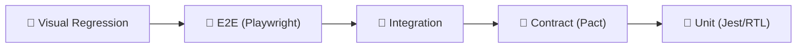

# Testing Microfrontends

Microfrontends create unique testing challenges: each MFE is developed independently, but together they must work as a single application. The standard testing pyramid isn't enough here — an additional layer is needed to verify contracts between teams.

## Testing Pyramid in MFE Context



Bottom to top: speed decreases, cost increases, but UX confidence grows.

## Unit Tests: Isolated MFE Testing

Each MFE is tested without other MFEs. Module Federation is stubbed via Jest mock:

```ts
// jest.config.ts
moduleNameMapper: {
  '^shell/(.*)$': '<rootDir>/__mocks__/shell/$1',
  '^catalog/(.*)$': '<rootDir>/__mocks__/catalog/$1',
}
```

Coverage: components, hooks, utilities, business logic. Speed: seconds.

## Contract Tests: Pact

Consumer-driven contract testing — the most important level for MFE architecture. Solves the problem: "Shell expects interface X from Catalog, but Catalog changed the API."

```
Consumer (Shell) → generates pact file → Provider (Catalog) → verifies
```

Pact Broker stores contracts. On every CatalogMFE deploy — automatic check of all contracts.

## Integration Tests

Multiple MFEs run together in JSDOM. We check EventBus, shared state, navigation:

```ts
const app = await createTestApp({ mfes: ['shell', 'catalog', 'cart'], mockApi: true })
catalog.eventBus.emit('catalog:addToCart', { productId: '42' })
await expect(cart.getCartCount()).resolves.toBe(1)
```

## E2E: Playwright

Fully assembled application in a real browser. Only critical user journeys: registration, checkout, critical paths. Run on pre-release, not on every PR.

## Visual Regression

Playwright takes screenshots of each MFE and compares with baseline. Critical when updating the design system — one updated token can break visuals in 5 MFEs simultaneously.

## Mock Remote: Substituting MFEs During Host Testing

```ts
// webpack.config.test.ts
plugins: [
  new ModuleFederationPlugin({
    remotes: {
      catalog: 'catalog@http://localhost:3001/mock-entry.js', // mock
      cart: 'cart@http://localhost:3002/remoteEntry.js',      // real
    }
  })
]
```

Hybrid strategy: tested MFE is real, others are stubs.

## CI Strategy

| Trigger | Levels |
|---------|--------|
| Every PR | Unit + Contract |
| Merge to main | + Integration |
| Pre-release | + E2E + Visual |
| Nightly | Full pyramid |
