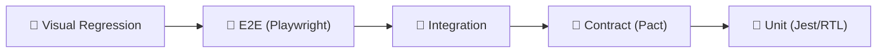

# Тестирование микрофронтендов

Микрофронтенды создают уникальные вызовы для тестирования: каждый MFE разрабатывается независимо, но вместе они должны работать как единое приложение. Обычная пирамида тестирования здесь недостаточна — нужен дополнительный уровень, проверяющий контракты между командами.

## Пирамида тестирования в контексте MFE



Снизу вверх: скорость падает, стоимость растёт, но уверенность в UX растёт.

## Unit-тесты: изолированное тестирование MFE

Каждый MFE тестируется без других MFE. Module Federation заглушается через Jest mock:

```ts
// jest.config.ts
moduleNameMapper: {
  '^shell/(.*)$': '<rootDir>/__mocks__/shell/$1',
  '^catalog/(.*)$': '<rootDir>/__mocks__/catalog/$1',
}
```

Покрываем: компоненты, хуки, утилиты, бизнес-логику. Скорость: секунды.

## Contract-тесты: Pact

Consumer-driven contract testing — самый важный уровень для MFE-архитектуры. Решает проблему: «Shell ожидает интерфейс X от Catalog, но Catalog изменил API».

```
Consumer (Shell) → генерирует pact-файл → Provider (Catalog) → верифицирует
```

Pact Broker хранит контракты. При каждом деплое CatalogMFE — автоматическая проверка всех контрактов.

## Integration-тесты

Несколько MFE запускаются вместе в JSDOM. Проверяем EventBus, shared state, навигацию:

```ts
const app = await createTestApp({ mfes: ['shell', 'catalog', 'cart'], mockApi: true })
catalog.eventBus.emit('catalog:addToCart', { productId: '42' })
await expect(cart.getCartCount()).resolves.toBe(1)
```

## E2E: Playwright

Полное собранное приложение в реальном браузере. Только критические user journeys: регистрация, checkout, критические пути. Запускать на pre-release, не на каждый PR.

## Visual Regression

Playwright делает снимки каждого MFE и сравнивает с baseline. Критично при обновлении дизайн-системы — один обновлённый токен может сломать визуал в 5 MFE одновременно.

## Mock Remote: подмена MFE при тестировании host

```ts
// webpack.config.test.ts
plugins: [
  new ModuleFederationPlugin({
    remotes: {
      catalog: 'catalog@http://localhost:3001/mock-entry.js', // mock
      cart: 'cart@http://localhost:3002/remoteEntry.js',      // real
    }
  })
]
```

Гибридная стратегия: тестируемый MFE реальный, остальные — заглушки.

## CI-стратегия

| Триггер | Уровни |
|---------|--------|
| Каждый PR | Unit + Contract |
| Merge to main | + Integration |
| Pre-release | + E2E + Visual |
| Nightly | Полная пирамида |
