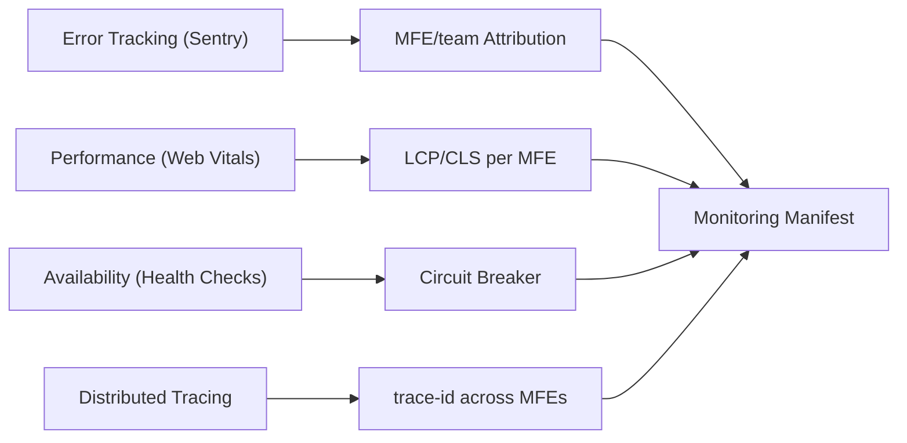

# Monitoring and Observability of Microfrontends: Full Course

## Why Observability is an Architectural Task

In a monolithic frontend, an error has a single context: bundle version, page URL, call stack. Debugging is unpleasant but predictable. In microfrontend architecture, each MFE is an independently deployed artifact with its own team, version, and lifecycle. Five MFEs in one browser window create five potential error sources with a single user interface.

The problem isn't technical — it's organizational. When an alert comes in "LCP degraded by 20%", who picks up the phone? Which team owns the error in the minified shared bundle? Without a clear answer to these questions, observability doesn't work.

Observability in MFE has three pillars:
1. **Attribution** — every signal (error, metric, log) contains information about its source: MFE, team, version
2. **Isolation** — an error in one MFE doesn't affect data collection from other MFEs
3. **Correlation** — events from different MFEs can be linked into a single user journey via trace-id

## Observability Layers



Each layer solves a separate task:

| Layer | Question | Tools |
|-------|----------|-------|
| Error Tracking | What broke and who owns it? | Sentry + ownership rules |
| Performance | What slows the user down? | Web Vitals API + analytics |
| Availability | Is MFE available for loading? | Health check endpoint + Circuit Breaker |
| Tracing | Where in the request chain is the problem? | trace-id + X-Trace-Id headers |

## Error Boundaries in Detail

Error Boundary works through two React lifecycle methods:

```tsx
class MfeErrorBoundary extends React.Component<Props, State> {
  // Called before rendering fallback — returns new state
  static getDerivedStateFromError(error: Error): Partial<State> {
    return { hasError: true, error }
  }

  // Called after rendering fallback — side effects, logging
  componentDidCatch(error: Error, info: React.ErrorInfo) {
    const componentStack = info.componentStack ?? ''

    Sentry.withScope(scope => {
      scope.setTag('mfe', this.props.mfe)
      scope.setTag('team', this.props.team)
      scope.setExtra('componentStack', componentStack)
      scope.setExtra('mfe_version', this.props.version ?? 'unknown')
      Sentry.captureException(error)
    })

    // Optional: report to own monitoring system
    this.props.onError?.(error, { mfe: this.props.mfe, componentStack })
  }
}
```

The difference between the two methods is critical: `getDerivedStateFromError` is a pure function (no side effects), `componentDidCatch` is the place for logging.

### What Error Boundary Does NOT Catch

```tsx
// NOT caught: async errors
async function loadProducts() {
  const data = await fetch('/api/products') // if this fails — Error Boundary won't help
  return data.json()
}

// NOT caught: event handlers
<button onClick={() => { throw new Error('handler error') }}>
  Click
</button>

// NOT caught: errors outside React tree
window.onerror = (msg, url, line) => { /* needs separate handler */ }
```

For full coverage, three levels are needed:
1. Error Boundary — synchronous rendering errors
2. `.catch()` / try-catch — async data errors
3. `window.onerror` + `window.onunhandledrejection` — everything else

## Sentry Ownership Rules: Automatic Routing

Sentry supports routing rules for errors to teams by several criteria:

```
# By MFE tag (most reliable)
tags:mfe:catalog          user:team-catalog@company.com

# By URL pattern (less reliable — URLs may overlap)
url:*/catalog/*           user:team-catalog@company.com

# By file path in stacktrace
path:src/catalog/**       user:team-catalog@company.com
```

With proper setup, every Issue in Sentry is automatically assigned to the right team — without manual sorting.

## Web Vitals Attribution API

Modern `web-vitals` package supports detailed attribution, allowing you to understand not only the metric value but also its source:

```ts
import { onLCP, onCLS, onINP } from 'web-vitals/attribution'

onLCP(metric => {
  const { lcpEntry, navigationEntry } = metric.attribution

  analytics.track('lcp', {
    value: metric.value,
    rating: metric.rating, // 'good' | 'needs-improvement' | 'poor'
    mfe: MFE_META.name,
    team: MFE_META.team,

    // Details: what exactly was the LCP element
    lcpElement: lcpEntry?.element?.tagName,
    lcpUrl: lcpEntry?.url, // image URL if LCP is img

    // Time until load: TTFB + resource load + render
    ttfb: navigationEntry?.responseStart,
    resourceLoadTime: lcpEntry?.loadTime,
  })
})

onCLS(metric => {
  analytics.track('cls', {
    value: metric.value,
    mfe: MFE_META.name,
    // Which element caused the largest layout shift
    largestShiftElement: metric.attribution?.largestShiftSource?.node?.nodeName,
    largestShiftValue: metric.attribution?.largestShiftSource?.currentRect?.width,
  })
})
```

📌 In MFE architecture, CLS is especially tricky: MFEs load asynchronously and can shift already-rendered content from other MFEs.

## Health Check Endpoint: MFE Standard

Each MFE as a CDN artifact should have a health check endpoint. This is a simple JSON response, available without authorization:

```json
// GET https://cdn.example.com/catalog/health
{
  "status": "ok",
  "version": "2.4.1",
  "buildTime": "2024-01-15T10:30:00Z",
  "dependencies": {
    "catalogApi": "ok",
    "designSystem": "ok"
  }
}
```

Shell can check the health check on load:

```ts
async function checkMfeHealth(url: string, mfe: string): Promise<boolean> {
  try {
    const controller = new AbortController()
    const timeout = setTimeout(() => controller.abort(), 5000)

    const response = await fetch(url, { signal: controller.signal })
    clearTimeout(timeout)

    if (!response.ok) {
      console.warn(`[${mfe}] health check failed: ${response.status}`)
      return false
    }

    const data = await response.json()
    return data.status === 'ok'
  } catch {
    return false
  }
}
```

## Circuit Breaker: Implementation Details

Full implementation considering edge cases:

```ts
type CircuitState = 'closed' | 'open' | 'half-open'

interface CircuitBreakerConfig {
  errorThreshold: number    // N errors before opening
  openTimeoutMs: number     // time in open before half-open
  halfOpenMaxAttempts: number // how many requests to allow in half-open
}

class MfeCircuitBreaker {
  private state: CircuitState = 'closed'
  private errorCount = 0
  private halfOpenAttempts = 0
  private openedAt = 0
  private readonly listeners = new Set<(state: CircuitState) => void>()

  constructor(
    private readonly mfe: string,
    private readonly config: CircuitBreakerConfig,
  ) {}

  onStateChange(listener: (state: CircuitState) => void) {
    this.listeners.add(listener)
    return () => this.listeners.delete(listener)
  }

  private transition(newState: CircuitState) {
    this.state = newState
    this.listeners.forEach(fn => fn(newState))

    // State transition metric
    analytics.track('circuit_breaker_transition', {
      mfe: this.mfe,
      state: newState,
    })
  }

  async call<T>(fn: () => Promise<T>, fallback: () => T): Promise<T> {
    // Fast fail in open state
    if (this.state === 'open') {
      const elapsed = Date.now() - this.openedAt
      if (elapsed < this.config.openTimeoutMs) {
        return fallback()
      }
      // Time to probe
      this.halfOpenAttempts = 0
      this.transition('half-open')
    }

    // In half-open, allow limited requests
    if (this.state === 'half-open') {
      if (this.halfOpenAttempts >= this.config.halfOpenMaxAttempts) {
        return fallback()
      }
      this.halfOpenAttempts++
    }

    try {
      const result = await fn()
      // Success — close circuit
      if (this.state !== 'closed') {
        this.errorCount = 0
        this.transition('closed')
      }
      return result
    } catch (error) {
      this.errorCount++
      if (
        this.state === 'half-open' ||
        this.errorCount >= this.config.errorThreshold
      ) {
        this.openedAt = Date.now()
        this.transition('open')
      }
      return fallback()
    }
  }
}
```

## Monitoring Manifest as Infrastructure as Code

Monitoring configuration in YAML/JSON allows verifying it in code review, applying changes via CI/CD, and having a single source of truth:

```yaml
# monitoring-manifest.yaml
version: "1.0"
mfes:
  - name: catalog
    team: team-catalog
    slo:
      availability: 99.9
      latency_p95_ms: 500
    alerting:
      channel: pagerduty
      oncall_schedule: catalog-oncall
      error_rate_threshold: "0.1%"
    health_check:
      url: "https://cdn.example.com/catalog/health"
      interval_sec: 30
      timeout_sec: 5
    circuit_breaker:
      error_threshold: 5
      open_timeout_sec: 30
      half_open_reset_timeout_sec: 60
    dependencies:
      - catalog-api
      - design-system
```

CI/CD applies this manifest to Sentry, Datadog, PagerDuty via API on every deploy:

```bash
# In deploy pipeline
./scripts/apply-monitoring-manifest.sh monitoring-manifest.yaml --env=production
```

## Observability Checklist for Review

Before deploying a new MFE:

- [ ] Error Boundary wraps MFE in Shell
- [ ] Sentry tags `mfe` and `team` set on initialization
- [ ] Web Vitals reported with MFE attribution
- [ ] Health check endpoint available and returns `{"status":"ok"}`
- [ ] Circuit Breaker configured for remote entry loading
- [ ] SLO defined and documented in monitoring-manifest.json
- [ ] Alert channel connected (Slack/PagerDuty/Email)
- [ ] trace-id from Shell passed to MFE API requests
- [ ] Error Budget documented and available to team
