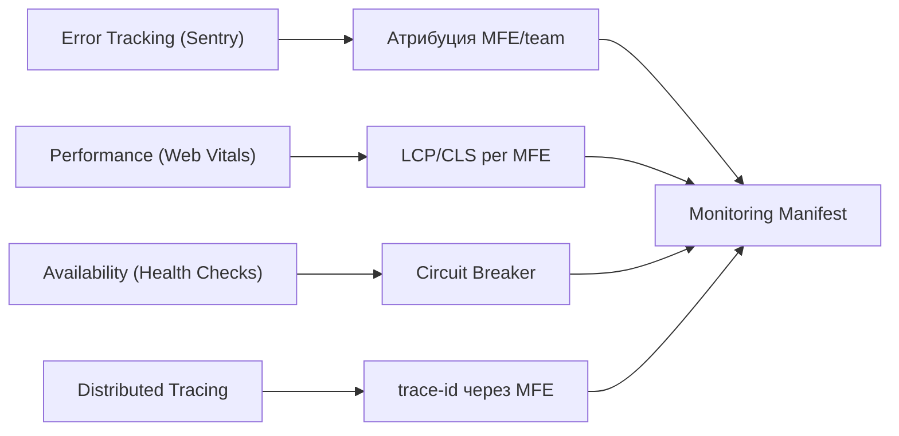

# Мониторинг и наблюдаемость микрофронтендов: полный курс

## Почему наблюдаемость — это архитектурная задача

В монолитном фронтенде ошибка имеет единственный контекст: версия бандла, URL страницы, стек вызовов. Отладка хоть и неприятна, но предсказуема. В микрофронтендной архитектуре каждый MFE — независимо задеплоенный артефакт с собственной командой, версией и жизненным циклом. Пять MFE в одном браузерном окне создают пять потенциальных источников ошибок с единым пользовательским интерфейсом.

Проблема не техническая — она организационная. Когда приходит алерт "LCP деградировал на 20%", кто берёт трубку? Какая команда отвечает за ошибку в минифицированном общем бандле? Без явного ответа на эти вопросы наблюдаемость не работает.

Наблюдаемость в MFE имеет три столпа:
1. **Атрибуция** — каждый сигнал (ошибка, метрика, лог) содержит информацию о своём источнике: MFE, команда, версия
2. **Изоляция** — ошибка в одном MFE не влияет на сбор данных от других MFE
3. **Корреляция** — события из разных MFE можно связать в единый пользовательский путь через trace-id

## Слои наблюдаемости



Каждый слой решает отдельную задачу:

| Слой | Вопрос | Инструменты |
|------|--------|-------------|
| Error Tracking | Что сломалось и у кого? | Sentry + ownership rules |
| Performance | Что замедляет пользователя? | Web Vitals API + analytics |
| Availability | MFE доступен для загрузки? | Health check endpoint + Circuit Breaker |
| Tracing | Где в цепочке запросов проблема? | trace-id + X-Trace-Id headers |

## Error Boundaries в деталях

Error Boundary работает через два метода жизненного цикла React:

```tsx
class MfeErrorBoundary extends React.Component<Props, State> {
  // Вызывается до рендеринга fallback — возвращает новый state
  static getDerivedStateFromError(error: Error): Partial<State> {
    return { hasError: true, error }
  }

  // Вызывается после рендеринга fallback — side effects, логирование
  componentDidCatch(error: Error, info: React.ErrorInfo) {
    const componentStack = info.componentStack ?? ''

    Sentry.withScope(scope => {
      scope.setTag('mfe', this.props.mfe)
      scope.setTag('team', this.props.team)
      scope.setExtra('componentStack', componentStack)
      scope.setExtra('mfe_version', this.props.version ?? 'unknown')
      Sentry.captureException(error)
    })

    // Опционально: репорт в собственную систему мониторинга
    this.props.onError?.(error, { mfe: this.props.mfe, componentStack })
  }
}
```

Разница между двумя методами критична: `getDerivedStateFromError` — это чистая функция (без side effects), `componentDidCatch` — место для логирования.

### Что Error Boundary НЕ перехватывает

```tsx
// НЕ перехватывается: async ошибки
async function loadProducts() {
  const data = await fetch('/api/products') // если упадёт — Error Boundary не поможет
  return data.json()
}

// НЕ перехватывается: event handlers
<button onClick={() => { throw new Error('handler error') }}>
  Click
</button>

// НЕ перехватывается: ошибки вне React-дерева
window.onerror = (msg, url, line) => { /* нужен отдельный обработчик */ }
```

Для полного покрытия нужны три уровня:
1. Error Boundary — синхронные ошибки рендеринга
2. `.catch()` / try-catch — async ошибки данных
3. `window.onerror` + `window.onunhandledrejection` — всё остальное

## Sentry Ownership Rules: автоматическая маршрутизация

Sentry поддерживает правила маршрутизации ошибок к командам по нескольким критериям:

```
# По тегу MFE (наиболее надёжно)
tags:mfe:catalog          user:team-catalog@company.com

# По URL паттерну (менее надёжно — URL могут совпадать)
url:*/catalog/*           user:team-catalog@company.com

# По пути к файлу в стектрейсе
path:src/catalog/**       user:team-catalog@company.com
```

При правильной настройке каждый Issue в Sentry автоматически назначается нужной команде — без ручной сортировки.

## Web Vitals Attribution API

Современный `web-vitals` пакет поддерживает детализированную атрибуцию, позволяющую понять не только значение метрики, но и её источник:

```ts
import { onLCP, onCLS, onINP } from 'web-vitals/attribution'

onLCP(metric => {
  const { lcpEntry, navigationEntry } = metric.attribution

  analytics.track('lcp', {
    value: metric.value,
    rating: metric.rating, // 'good' | 'needs-improvement' | 'poor'
    mfe: MFE_META.name,
    team: MFE_META.team,

    // Детали: что именно стало LCP-элементом
    lcpElement: lcpEntry?.element?.tagName,
    lcpUrl: lcpEntry?.url, // URL изображения, если LCP — img

    // Время до загрузки: TTFB + resource load + render
    ttfb: navigationEntry?.responseStart,
    resourceLoadTime: lcpEntry?.loadTime,
  })
})

onCLS(metric => {
  analytics.track('cls', {
    value: metric.value,
    mfe: MFE_META.name,
    // Какой элемент вызвал наибольший layout shift
    largestShiftElement: metric.attribution?.largestShiftSource?.node?.nodeName,
    largestShiftValue: metric.attribution?.largestShiftSource?.currentRect?.width,
  })
})
```

📌 В MFE-архитектуре CLS особенно коварен: MFE загружаются асинхронно и могут сдвигать уже отрисованный контент других MFE.

## Health Check Endpoint: стандарт для MFE

Каждый MFE как CDN-артефакт должен иметь health check endpoint. Это простой JSON-ответ, доступный без авторизации:

```json
// GET https://cdn.example.com/catalog/health
{
  "status": "ok",
  "version": "2.4.1",
  "buildTime": "2024-01-15T10:30:00Z",
  "dependencies": {
    "catalogApi": "ok",
    "designSystem": "ok"
  }
}
```

Shell может проверять health check при загрузке:

```ts
async function checkMfeHealth(url: string, mfe: string): Promise<boolean> {
  try {
    const controller = new AbortController()
    const timeout = setTimeout(() => controller.abort(), 5000)

    const response = await fetch(url, { signal: controller.signal })
    clearTimeout(timeout)

    if (!response.ok) {
      console.warn(`[${mfe}] health check failed: ${response.status}`)
      return false
    }

    const data = await response.json()
    return data.status === 'ok'
  } catch {
    return false
  }
}
```

## Circuit Breaker: детали реализации

Полная реализация с учётом граничных случаев:

```ts
type CircuitState = 'closed' | 'open' | 'half-open'

interface CircuitBreakerConfig {
  errorThreshold: number    // N ошибок до открытия
  openTimeoutMs: number     // время в open до half-open
  halfOpenMaxAttempts: number // сколько запросов пропускать в half-open
}

class MfeCircuitBreaker {
  private state: CircuitState = 'closed'
  private errorCount = 0
  private halfOpenAttempts = 0
  private openedAt = 0
  private readonly listeners = new Set<(state: CircuitState) => void>()

  constructor(
    private readonly mfe: string,
    private readonly config: CircuitBreakerConfig,
  ) {}

  onStateChange(listener: (state: CircuitState) => void) {
    this.listeners.add(listener)
    return () => this.listeners.delete(listener)
  }

  private transition(newState: CircuitState) {
    this.state = newState
    this.listeners.forEach(fn => fn(newState))

    // Метрика смены состояния
    analytics.track('circuit_breaker_transition', {
      mfe: this.mfe,
      state: newState,
    })
  }

  async call<T>(fn: () => Promise<T>, fallback: () => T): Promise<T> {
    // Fast fail в open состоянии
    if (this.state === 'open') {
      const elapsed = Date.now() - this.openedAt
      if (elapsed < this.config.openTimeoutMs) {
        return fallback()
      }
      // Пора пробовать
      this.halfOpenAttempts = 0
      this.transition('half-open')
    }

    // В half-open пропускаем ограниченное число запросов
    if (this.state === 'half-open') {
      if (this.halfOpenAttempts >= this.config.halfOpenMaxAttempts) {
        return fallback()
      }
      this.halfOpenAttempts++
    }

    try {
      const result = await fn()
      // Успех — закрываем circuit
      if (this.state !== 'closed') {
        this.errorCount = 0
        this.transition('closed')
      }
      return result
    } catch (error) {
      this.errorCount++
      if (
        this.state === 'half-open' ||
        this.errorCount >= this.config.errorThreshold
      ) {
        this.openedAt = Date.now()
        this.transition('open')
      }
      return fallback()
    }
  }
}
```

## Мониторинг-манифест как Infrastructure as Code

Конфигурация мониторинга в YAML/JSON позволяет проверять её в code review, применять изменения через CI/CD и иметь единый источник истины:

```yaml
# monitoring-manifest.yaml
version: "1.0"
mfes:
  - name: catalog
    team: team-catalog
    slo:
      availability: 99.9
      latency_p95_ms: 500
    alerting:
      channel: pagerduty
      oncall_schedule: catalog-oncall
      error_rate_threshold: "0.1%"
    health_check:
      url: "https://cdn.example.com/catalog/health"
      interval_sec: 30
      timeout_sec: 5
    circuit_breaker:
      error_threshold: 5
      open_timeout_sec: 30
      half_open_reset_timeout_sec: 60
    dependencies:
      - catalog-api
      - design-system
```

CI/CD применяет этот манифест к Sentry, Datadog, PagerDuty через API при каждом деплое:

```bash
# В деплой-пайплайне
./scripts/apply-monitoring-manifest.sh monitoring-manifest.yaml --env=production
```

## Чеклист наблюдаемости для ревью

Перед деплоем нового MFE:

- [ ] Error Boundary обёртывает MFE в Shell
- [ ] Sentry теги `mfe` и `team` установлены при инициализации
- [ ] Web Vitals репортятся с атрибуцией по MFE
- [ ] Health check endpoint доступен и возвращает `{"status":"ok"}`
- [ ] Circuit Breaker настроен для загрузки remote entry
- [ ] SLO определён и задокументирован в monitoring-manifest.json
- [ ] Алерт-канал подключён (Slack/PagerDuty/Email)
- [ ] trace-id из Shell передаётся в API-запросы MFE
- [ ] Error Budget задокументирован и доступен команде
