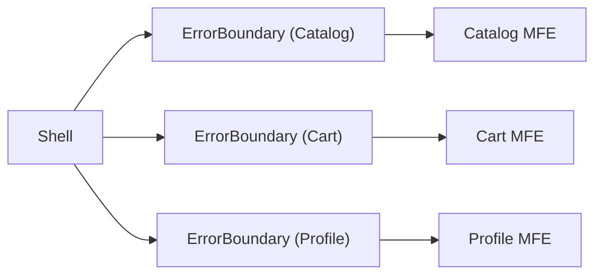
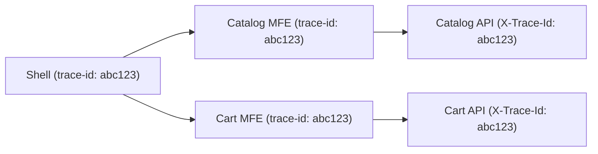
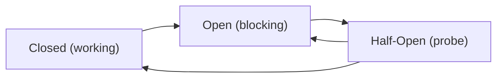

# Monitoring and Observability of Microfrontends

In a monolith, errors are easily localized — one application, one stack, one Sentry project. In microfrontend architecture, the picture changes: five MFEs work in one browser context, an error in Catalog may look like a Shell bug, and Cart degradation goes unnoticed until conversion drops. Observability in MFE is not a tool, it's an architectural decision.

## The Problem: Error Without Context

Imagine an error log in production:

```
TypeError: Cannot read properties of undefined (reading 'price')
  at ProductCard.render (main.js:1:45231)
```

Whose error is this? Shell? Catalog? Cart? Without explicit MFE attribution, the whole team spends time dissecting a minified bundle. Now multiply by 10 teams and 50 errors per day.

## Error Boundaries: Failure Isolation

Error Boundary is a React mechanism that catches rendering errors in a component subtree. Without it, an error in a child MFE unmounts the entire Shell React tree, including working MFEs.



Each MFE is wrapped in its own Error Boundary. A crash in one — others continue working.

```tsx
// Basic Error Boundary with MFE attribution
class MfeErrorBoundary extends React.Component<{
  mfe: string
  team: string
  children: React.ReactNode
  fallback?: React.ReactNode
}> {
  state = { hasError: false, error: null as Error | null }

  static getDerivedStateFromError(error: Error) {
    return { hasError: true, error }
  }

  componentDidCatch(error: Error, info: React.ErrorInfo) {
    // Send to Sentry with MFE and team tags
    Sentry.captureException(error, {
      tags: {
        mfe: this.props.mfe,
        team: this.props.team,
        component: info.componentStack?.split('\n')[1]?.trim() ?? 'unknown',
      },
    })
  }

  render() {
    if (this.state.hasError) {
      return this.props.fallback ?? (
        <div>Error in {this.props.mfe}</div>
      )
    }
    return this.props.children
  }
}
```

⚠️ **Common mistake:** Error Boundary doesn't catch errors in async code (fetch, setTimeout), only synchronous rendering errors. For async, use global `window.onerror` + manual `Sentry.captureException` call.

## Error Tracking: Sentry and Team Ownership

Sentry supports Ownership Rules — rules by which errors are automatically assigned to teams:

```yaml
# .sentryrc or Sentry UI settings
ownership_rules:
  - type: tag
    value: mfe:catalog
    owner: team-catalog@company.com
  - type: tag
    value: mfe:cart
    owner: team-cart@company.com
  - type: url
    value: "*/catalog/*"
    owner: team-catalog@company.com
```

On every error, pass attribution tags:

```ts
// In each MFE — identification constant
export const MFE_META = {
  name: 'catalog',
  team: 'team-catalog',
  version: process.env.REACT_APP_VERSION ?? 'unknown',
} as const

// On MFE initialization
Sentry.setTag('mfe', MFE_META.name)
Sentry.setTag('team', MFE_META.team)
Sentry.setTag('mfe_version', MFE_META.version)
```

💡 Each MFE should have its own Sentry DSN or at least a separate Environment. Otherwise tagging gives attribution, but alerts still go to a shared channel.

## Performance Monitoring: Web Vitals per MFE

LCP and CLS are global metrics, but in MFE architecture it's important to know which MFE causes them:

```ts
import { onLCP, onCLS, onFID } from 'web-vitals'

// In each MFE on mount
function reportWebVitals(mfeName: string) {
  onLCP(metric => {
    analytics.track('web_vital', {
      name: metric.name,
      value: metric.value,
      mfe: mfeName,
      team: MFE_META.team,
      // Attribution: which element was the LCP element
      element: metric.attribution?.lcpEntry?.element?.tagName,
    })
  })

  onCLS(metric => {
    analytics.track('web_vital', {
      name: metric.name,
      value: metric.value,
      mfe: mfeName,
      // Attribution: which element caused the shift
      sources: metric.attribution?.largestShiftSource?.node?.nodeName,
    })
  })
}
```

📌 **Important:** LCP attribution in MFE has a nuance — if Catalog MFE loads lazily, its image may become the LCP of the entire page. Without attribution, you see poor LCP for Shell, when Catalog is the culprit.

## Distributed Tracing: trace-id Across MFE Boundaries

User makes a request: Shell → Catalog API → Cart API. How to link logs of these three independent systems?



Shell generates a `trace-id` on session load and passes it via Event Bus or shared context:

```ts
// Shell — generate trace-id
const traceId = crypto.randomUUID()
window.__SHELL_TRACE_ID__ = traceId

// Each MFE — add trace-id to requests
const traceId = window.__SHELL_TRACE_ID__ ?? 'no-trace'

fetch('/api/products', {
  headers: {
    'X-Trace-Id': traceId,
    'X-MFE-Name': MFE_META.name,
  }
})
```

Now all requests from one user session can be found by `trace-id` in any logging system.

## Circuit Breaker: Protection from Cascading Failures

Imagine: CDN with remote MFE is unavailable. Without protection, every page load waits for timeout (30+ sec), accumulating errors. Circuit Breaker — a pattern that automatically switches traffic to fallback after N errors.



Three states:
- **Closed** — normal operation, errors are counted
- **Open** — after threshold exceeded, all requests immediately rejected (fast fail)
- **Half-Open** — after timeout, one probe request is allowed

```ts
class MfeCircuitBreaker {
  private errorCount = 0
  private state: 'closed' | 'open' | 'half-open' = 'closed'
  private lastOpenedAt = 0

  constructor(
    private readonly threshold = 5,
    private readonly timeoutMs = 30_000,
  ) {}

  async execute<T>(fn: () => Promise<T>, fallback: T): Promise<T> {
    if (this.state === 'open') {
      const elapsed = Date.now() - this.lastOpenedAt
      if (elapsed < this.timeoutMs) return fallback // fast fail
      this.state = 'half-open'
    }

    try {
      const result = await fn()
      if (this.state === 'half-open') this.reset()
      return result
    } catch (error) {
      this.recordError()
      return fallback
    }
  }

  private recordError() {
    this.errorCount++
    if (this.errorCount >= this.threshold || this.state === 'half-open') {
      this.state = 'open'
      this.lastOpenedAt = Date.now()
    }
  }

  private reset() {
    this.state = 'closed'
    this.errorCount = 0
  }
}
```

## SLO and Error Budget

SLO (Service Level Objective) — agreement on acceptable error level. In MFE architecture, SLO is set per-MFE:

| MFE | SLO | Error Budget/month | Team |
|-----|-----|-------------------|------|
| Catalog | 99.9% | 43.8 min | team-catalog |
| Cart | 99.95% | 21.9 min | team-cart |
| Profile | 99.5% | 219 min | team-profile |

When Error Budget is exhausted — the team enters reliability mode: no new features, only stabilization.

## ⚠️ Common Beginner Mistakes

### Mistake 1: One Sentry Project for All MFEs

❌ All MFEs write to one DSN without tags:
```ts
// Same in every MFE
Sentry.init({ dsn: 'https://global@sentry.io/1' })
```

Result: 500 errors per day, unclear ownership, alerts ignored.

✅ Each MFE has attribution tags:
```ts
Sentry.init({
  dsn: process.env.SENTRY_DSN, // Own DSN or shared with tags
  initialScope: {
    tags: { mfe: 'catalog', team: 'team-catalog' },
  },
})
```

### Mistake 2: Error Boundary Only at Shell Level

❌ One shared Error Boundary for entire app:
```tsx
<ErrorBoundary>
  <Shell>
    <CatalogMFE />
    <CartMFE />
  </Shell>
</ErrorBoundary>
```

On Catalog error, entire Shell including Cart crashes.

✅ Each MFE is isolated:
```tsx
<Shell>
  <MfeErrorBoundary mfe="catalog" team="team-catalog">
    <CatalogMFE />
  </MfeErrorBoundary>
  <MfeErrorBoundary mfe="cart" team="team-cart">
    <CartMFE />
  </MfeErrorBoundary>
</Shell>
```

### Mistake 3: Circuit Breaker Without Half-Open State

❌ Simple on/off without recovery:
```ts
if (errors > threshold) {
  disabled = true // never recovers automatically
}
```

On service recovery, MFE remains disabled until manual intervention.

✅ Full state cycle with timeout and probe request.

## Monitoring Manifest as Code

Monitoring configuration should live in the repository, not in the Sentry/Datadog UI:

```json
{
  "mfes": [
    {
      "name": "Catalog MFE",
      "ownership": { "team": "team-catalog" },
      "slo": { "availability": 99.9, "errorBudgetPercent": 0.1 },
      "alerting": { "channel": "PagerDuty", "threshold": "0.1% error rate" },
      "healthCheck": { "url": "https://cdn.example.com/catalog/health" },
      "circuitBreaker": { "errorThreshold": 5, "openTimeoutSec": 30 }
    }
  ]
}
```

This file is read by the CI/CD pipeline on deploy and applied to the monitoring platform via API.
