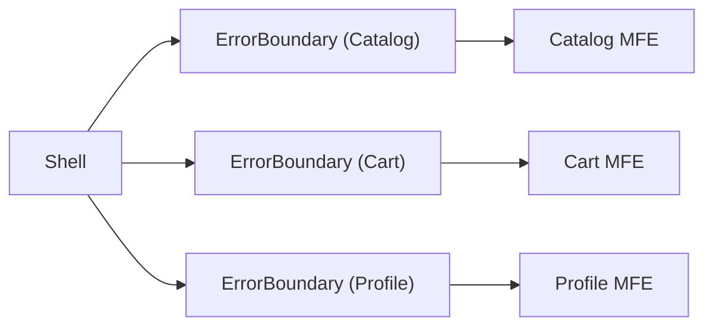
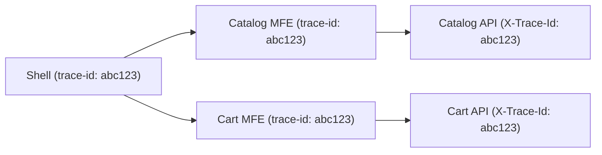
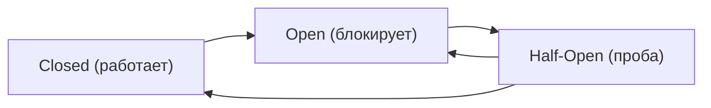

# Мониторинг и наблюдаемость микрофронтендов

В монолите ошибка легко локализуется — у вас одно приложение, один стек, один Sentry-проект. В архитектуре микрофронтендов картина меняется: пять MFE работают в одном браузерном контексте, ошибка в Catalog может выглядеть как баг Shell, а деградация Cart незаметна до тех пор, пока не упадёт конверсия. Наблюдаемость в MFE — это не инструмент, это архитектурное решение.

## Проблема: ошибка без контекста

Представьте лог ошибки в production:

```
TypeError: Cannot read properties of undefined (reading 'price')
  at ProductCard.render (main.js:1:45231)
```

Чья это ошибка? Shell? Catalog? Cart? Без явной атрибуции по MFE вся команда тратит время на разбор минифицированного бандла. Теперь умножьте на 10 команд и 50 ошибок в сутки.

## Error Boundaries: изоляция сбоев

Error Boundary — React-механизм, перехватывающий ошибки рендеринга в поддереве компонентов. Без него ошибка в дочернем MFE размонтирует всё React-дерево Shell, включая рабочие MFE.



Каждый MFE оборачивается в собственный Error Boundary. Crash в одном — остальные продолжают работу.

```tsx
// Базовый Error Boundary с атрибуцией по MFE
class MfeErrorBoundary extends React.Component<{
  mfe: string
  team: string
  children: React.ReactNode
  fallback?: React.ReactNode
}> {
  state = { hasError: false, error: null as Error | null }

  static getDerivedStateFromError(error: Error) {
    return { hasError: true, error }
  }

  componentDidCatch(error: Error, info: React.ErrorInfo) {
    // Отправляем в Sentry с тегами MFE и team
    Sentry.captureException(error, {
      tags: {
        mfe: this.props.mfe,
        team: this.props.team,
        component: info.componentStack?.split('\n')[1]?.trim() ?? 'unknown',
      },
    })
  }

  render() {
    if (this.state.hasError) {
      return this.props.fallback ?? (
        <div>Ошибка в {this.props.mfe}</div>
      )
    }
    return this.props.children
  }
}
```

⚠️ **Распространённая ошибка:** Error Boundary не перехватывает ошибки в async-коде (fetch, setTimeout), только синхронные ошибки рендеринга. Для async используйте глобальный `window.onerror` + ручной вызов `Sentry.captureException`.

## Error Tracking: Sentry и team ownership

Sentry поддерживает концепцию Ownership Rules — правила, по которым ошибки автоматически назначаются командам:

```yaml
# .sentryrc или настройки Sentry UI
ownership_rules:
  - type: tag
    value: mfe:catalog
    owner: team-catalog@company.com
  - type: tag
    value: mfe:cart
    owner: team-cart@company.com
  - type: url
    value: "*/catalog/*"
    owner: team-catalog@company.com
```

При каждой ошибке передавайте теги атрибуции:

```ts
// В каждом MFE — константа идентификации
export const MFE_META = {
  name: 'catalog',
  team: 'team-catalog',
  version: process.env.REACT_APP_VERSION ?? 'unknown',
} as const

// При инициализации MFE
Sentry.setTag('mfe', MFE_META.name)
Sentry.setTag('team', MFE_META.team)
Sentry.setTag('mfe_version', MFE_META.version)
```

💡 Каждый MFE должен иметь свой Sentry DSN или хотя бы отдельный Environment. Иначе тегирование даёт атрибуцию, но алерты всё равно приходят в общий канал.

## Performance Monitoring: Web Vitals per MFE

LCP и CLS — глобальные метрики, но в MFE-архитектуре важно знать, какой MFE их вызывает:

```ts
import { onLCP, onCLS, onFID } from 'web-vitals'

// В каждом MFE при монтировании
function reportWebVitals(mfeName: string) {
  onLCP(metric => {
    analytics.track('web_vital', {
      name: metric.name,
      value: metric.value,
      mfe: mfeName,
      team: MFE_META.team,
      // Attribution: какой элемент был LCP-элементом
      element: metric.attribution?.lcpEntry?.element?.tagName,
    })
  })

  onCLS(metric => {
    analytics.track('web_vital', {
      name: metric.name,
      value: metric.value,
      mfe: mfeName,
      // Attribution: какой элемент вызвал сдвиг
      sources: metric.attribution?.largestShiftSource?.node?.nodeName,
    })
  })
}
```

📌 **Важно:** LCP attribution в MFE имеет особенность — если Catalog MFE загружается лениво, его изображение может стать LCP всей страницы. Без атрибуции вы видите плохой LCP у Shell, хотя виновник — Catalog.

## Distributed Tracing: trace-id через MFE границы

Пользователь делает запрос: Shell → Catalog API → Cart API. Как связать логи этих трёх независимых систем?



Shell генерирует `trace-id` при загрузке сессии и передаёт через Event Bus или shared context:

```ts
// Shell — генерация trace-id
const traceId = crypto.randomUUID()
window.__SHELL_TRACE_ID__ = traceId

// Каждый MFE — добавление trace-id в запросы
const traceId = window.__SHELL_TRACE_ID__ ?? 'no-trace'

fetch('/api/products', {
  headers: {
    'X-Trace-Id': traceId,
    'X-MFE-Name': MFE_META.name,
  }
})
```

Теперь все запросы одной пользовательской сессии можно найти по `trace-id` в любой системе логирования.

## Circuit Breaker: защита от каскадных сбоев

Представьте: CDN с remote MFE недоступен. Без защиты каждая загрузка страницы будет ждать таймаута (30+ сек), накапливая ошибки. Circuit Breaker — паттерн, автоматически переключающий поток в fallback после N ошибок.



Три состояния:
- **Closed** — нормальная работа, ошибки считаются
- **Open** — после превышения порога, все запросы немедленно отклоняются (fast fail)
- **Half-Open** — после таймаута пропускается один пробный запрос

```ts
class MfeCircuitBreaker {
  private errorCount = 0
  private state: 'closed' | 'open' | 'half-open' = 'closed'
  private lastOpenedAt = 0

  constructor(
    private readonly threshold = 5,
    private readonly timeoutMs = 30_000,
  ) {}

  async execute<T>(fn: () => Promise<T>, fallback: T): Promise<T> {
    if (this.state === 'open') {
      const elapsed = Date.now() - this.lastOpenedAt
      if (elapsed < this.timeoutMs) return fallback // fast fail
      this.state = 'half-open'
    }

    try {
      const result = await fn()
      if (this.state === 'half-open') this.reset()
      return result
    } catch (error) {
      this.recordError()
      return fallback
    }
  }

  private recordError() {
    this.errorCount++
    if (this.errorCount >= this.threshold || this.state === 'half-open') {
      this.state = 'open'
      this.lastOpenedAt = Date.now()
    }
  }

  private reset() {
    this.state = 'closed'
    this.errorCount = 0
  }
}
```

## SLO и Error Budget

SLO (Service Level Objective) — договорённость о допустимом уровне ошибок. В MFE-архитектуре SLO устанавливается per-MFE:

| MFE | SLO | Error Budget/мес | Команда |
|-----|-----|-----------------|---------|
| Catalog | 99.9% | 43.8 мин | team-catalog |
| Cart | 99.95% | 21.9 мин | team-cart |
| Profile | 99.5% | 219 мин | team-profile |

Когда Error Budget исчерпан — команда переходит в режим reliability: никаких новых фич, только стабилизация.

## ⚠️ Типичные ошибки новичков

### Ошибка 1: один Sentry-проект на все MFE

❌ Все MFE пишут в один DSN без тегов:
```ts
// В каждом MFE одинаково
Sentry.init({ dsn: 'https://global@sentry.io/1' })
```

Результат: 500 ошибок в сутки, непонятно кто владелец, алерты игнорируются.

✅ Каждый MFE имеет теги атрибуции:
```ts
Sentry.init({
  dsn: process.env.SENTRY_DSN, // Свой DSN или общий с тегами
  initialScope: {
    tags: { mfe: 'catalog', team: 'team-catalog' },
  },
})
```

### Ошибка 2: Error Boundary только на уровне Shell

❌ Один общий Error Boundary на всё приложение:
```tsx
<ErrorBoundary>
  <Shell>
    <CatalogMFE />
    <CartMFE />
  </Shell>
</ErrorBoundary>
```

При ошибке в Catalog падает весь Shell включая Cart.

✅ Каждый MFE изолирован:
```tsx
<Shell>
  <MfeErrorBoundary mfe="catalog" team="team-catalog">
    <CatalogMFE />
  </MfeErrorBoundary>
  <MfeErrorBoundary mfe="cart" team="team-cart">
    <CartMFE />
  </MfeErrorBoundary>
</Shell>
```

### Ошибка 3: Circuit Breaker без half-open состояния

❌ Простой on/off без восстановления:
```ts
if (errors > threshold) {
  disabled = true // никогда не восстановится автоматически
}
```

При восстановлении сервиса MFE останется отключённым до ручного вмешательства.

✅ Полный цикл состояний с таймаутом и пробным запросом.

## Мониторинг-манифест как код

Конфигурация мониторинга должна жить в репозитории, а не в UI Sentry/Datadog:

```json
{
  "mfes": [
    {
      "name": "Catalog MFE",
      "ownership": { "team": "team-catalog" },
      "slo": { "availability": 99.9, "errorBudgetPercent": 0.1 },
      "alerting": { "channel": "PagerDuty", "threshold": "0.1% error rate" },
      "healthCheck": { "url": "https://cdn.example.com/catalog/health" },
      "circuitBreaker": { "errorThreshold": 5, "openTimeoutSec": 30 }
    }
  ]
}
```

Этот файл читается CI/CD pipeline при деплое и применяется к платформе мониторинга через API.
