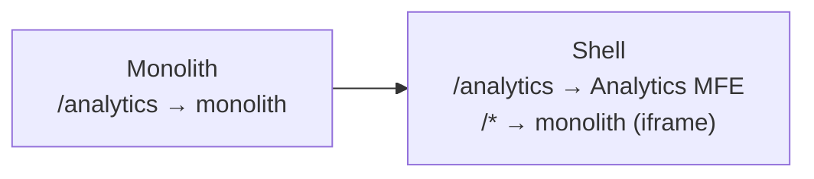
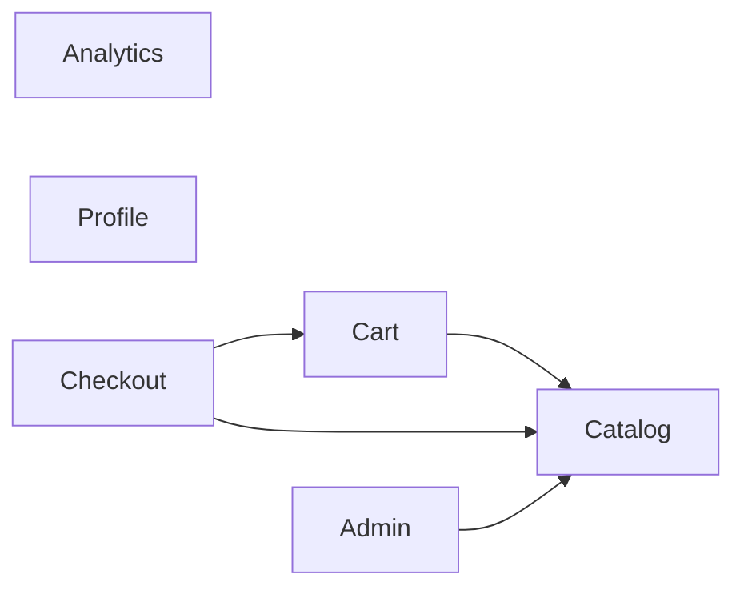

# Migration from Monolith to Microfrontends: Complete Guide

Migrating a monolith to MFE is not a technical project — it's an organizational project with a technical implementation. Most migrations fail not because the team doesn't know Module Federation, but because they misjudged dependencies, chose the wrong first domain, or tried to migrate everything at once.

## Why Strangler Fig, Not Big Bang?

Big Bang approach — rewrite everything from scratch — sounds attractive: "clean code, proper architecture." In practice:

- Team supports two applications in parallel for years
- Monolith continues to receive new features (business doesn't stop)
- By the time of "completion," the new app is already outdated
- Risk of losing accumulated edge cases and business logic

Strangler Fig works because:
- Each step delivers value to users
- Rollback to previous step is configuration, not code revert
- Teams gain MFE experience on non-critical domains

## Detailed Migration Plan

### Phase 0: Infrastructure Preparation (2–4 weeks)

Before extracting anything:

```
1. Create shell application
   - Module Federation host
   - Router with "who serves this URL" rules
   - Layout: header, sidebar, footer

2. Wrap monolith
   - nginx route: /* → shell → iframe/remoteEntry of monolith
   - User notices nothing

3. Set up CI/CD for MFE
   - Independent pipelines for each future MFE
   - Versioned remoteEntry.js in CDN

4. Agree on contracts
   - EventBus schema
   - Shared state API
   - Auth token sharing
```

### Phase 1: Pilot MFE (4–8 weeks)

Select the simplest domain. Goal — not speed, but creating a pattern:



What we learn from the pilot:
- How to share auth state between monolith and MFE
- How routing works in shell
- How to deploy independently
- What breaks (and that's normal!)

### Phase 2–N: Sequential Extraction

Extraction order rule: **dependencies first**.

```
Wrong:
  Extract Checkout → depends on Cart → Cart still in monolith → complex integration

Correct:
  1. Catalog (no dependencies)
  2. Cart (depends on Catalog → already MFE)
  3. Checkout (depends on Cart + Catalog → both already MFE)
```

## Dependency Graph — Mandatory Tool

Before starting migration, draw the graph of all dependencies between domains:



Domains without incoming arrows — first candidates (Analytics, Profile).

## Shared State: Three Strategies

### Strategy 1: Monolith as Source of Truth

```ts
// MFE reads data via monolith's API
const user = await fetch('/api/monolith/current-user').then(r => r.json())
```

Pros: simple, no duplication. Cons: MFE depends on monolith — can't deploy independently of its API.

### Strategy 2: Shared LocalStorage / SessionStorage

```ts
// monolith writes on login
localStorage.setItem('mfe:auth', JSON.stringify({ token, userId, roles }))

// MFE reads
const auth = JSON.parse(localStorage.getItem('mfe:auth') ?? '{}')
```

Pros: no network requests. Cons: no reactivity, needs versioned schema.

### Strategy 3: EventBus Synchronization

```ts
// Monolith on cart change
window.dispatchEvent(new CustomEvent('mfe:cart:updated', {
  detail: { items: cartItems, total }
}))

// Cart MFE listens
window.addEventListener('mfe:cart:updated', (e: CustomEvent) => {
  setCartState(e.detail)
})
```

Recommended for: cart counter in header, notifications, user status.

## Migration Anti-patterns

### ❌ Extracting Critical Domain First

```
// Wrong
Phase 1: Checkout (critical, many dependencies, complex state)

// Correct
Phase 1: Analytics (non-critical, no dependencies, simple)
```

A mistake leads to a prod incident at migration start — team loses trust in the process.

### ❌ Keeping Direct Imports Between Domains

```ts
// Was in monolith (normal)
import { formatPrice } from '../catalog/utils'

// After extraction (bad) — direct dependency via Module Federation
import { formatPrice } from 'catalog/utils'
```

Such import creates coupling: Catalog MFE can't deploy independently.

```ts
// Correct: move to shared utilities
import { formatPrice } from '@company/shared-utils'
```

### ❌ Ignoring Contract Versioning

```ts
// Monolith expects event from Cart MFE
window.addEventListener('cart:add', handler) // v1

// Cart MFE updated and renamed
window.dispatchEvent(new CustomEvent('cart:item:added', ...)) // v2 - breaking!
```

Always version EventBus events and store the schema in a shared package.

## Readiness Criteria for Completing Migration

Checklist before disabling monolith:

- [ ] 0% of URL routes go to monolith
- [ ] Monolith JS bundle doesn't load on any page
- [ ] All inter-domain calls via EventBus or REST API
- [ ] Shared state in independent service (not in monolith)
- [ ] Each MFE passed load testing independently
- [ ] E2E tests cover all critical user journeys
- [ ] Teams have independent CI/CD pipelines
- [ ] Rollback plan: can return monolith in 5 minutes (via nginx config)

## Time Estimation

Practical data from real migrations:

| Domain size | No dependencies | 2–3 dependencies | 5+ dependencies |
|-------------|----------------|-----------------|-----------------|
| S (5K LOC) | 1–2 weeks | 3–4 weeks | 6–8 weeks |
| M (15K LOC) | 3–4 weeks | 6–8 weeks | 10–14 weeks |
| L (40K LOC) | 6–8 weeks | 12–16 weeks | 20+ weeks |
| XL (100K LOC) | 12–16 weeks | Split into subdomains | Split into subdomains |

Add 30–50% buffer for unexpected dependencies discovered during the process.

## ⚠️ Common Beginner Mistakes

### Mistake 1: "Let's design the perfect MFE architecture first, then start migrating"

❌ Team spends 3 months designing the ideal shell, EventBus, contracts. Nothing deployed.

✅ Start with the simplest pilot. Real problems will only emerge when working with prod data and real users.

### Mistake 2: Migrate by Technology, Not by Domain

❌ "First we'll move everything to React 18, then split into MFEs"

✅ MFE allows each domain to have its own stack. Migrate by domain — each team chooses their MFE technologies.

### Mistake 3: Ignore DX During Migration

❌ Developer starts 5 dev servers to test a change in one MFE.

✅ From the first MFE, set up mock remote strategy — each MFE is developed in isolation with stubbed dependencies.

### Mistake 4: Forget About SEO and SSR During Migration

❌ Monolith rendered HTML on server (SSR). MFE — pure CSR. Search traffic drops 40%.

✅ Check SEO requirements for each domain before extraction. Critical pages require SSR-compatible MFE (Next.js remote).
