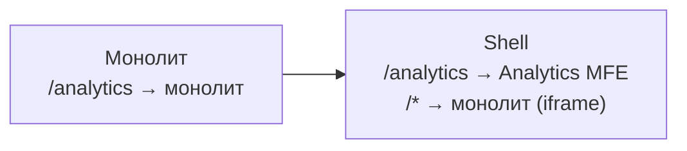
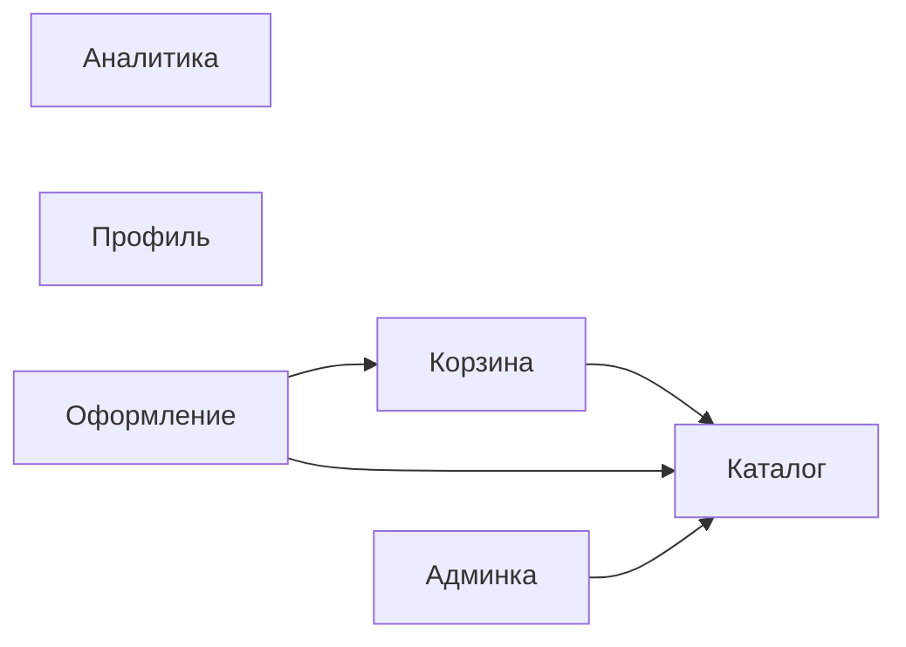

# Миграция из монолита в микрофронтенды: полное руководство

Мигрировать монолит в MFE — это не технический проект, это организационный проект с техническим воплощением. Большинство миграций проваливаются не потому что команда не знает Module Federation, а потому что неверно оценили зависимости, выбрали неправильный первый домен или попытались мигрировать всё сразу.

## Почему Strangler Fig, а не Big Bang?

Big Bang подход — переписать всё с нуля — звучит привлекательно: «чистый код, правильная архитектура». На практике:

- Команда годами поддерживает два приложения параллельно
- Монолит продолжает получать новые фичи (бизнес не останавливается)
- К моменту «завершения» новое приложение уже устарело
- Риск потери накопленных edge-cases и бизнес-логики

Strangler Fig работает потому что:
- Каждый шаг поставляет ценность пользователю
- Откат на предыдущий шаг — это конфигурация, не code revert
- Команды получают опыт с MFE на некритичных доменах

## Детальный план миграции

### Фаза 0: Подготовка инфраструктуры (2–4 недели)

Прежде чем что-то извлекать:

```
1. Создать shell-приложение
   - Module Federation host
   - Роутер с правилами "кто обслуживает этот URL"
   - Layout: header, sidebar, footer

2. Обернуть монолит
   - nginx route: /* → shell → iframe/remoteEntry монолита
   - Пользователь ничего не замечает

3. Настроить CI/CD для MFE
   - Независимые пайплайны для каждого будущего MFE
   - Versioned remoteEntry.js в CDN

4. Договориться о контрактах
   - EventBus schema
   - Shared state API
   - Auth token sharing
```

### Фаза 1: Пилотный MFE (4–8 недель)

Выбираем самый простой домен. Цель — не скорость, а создание паттерна:



Что изучаем на пилоте:
- Как шарить auth state между монолитом и MFE
- Как работает routing в shell
- Как деплоить независимо
- Что ломается (и это нормально!)

### Фаза 2–N: Последовательное извлечение

Правило порядка извлечения: **зависимости сначала**.

```
Неправильно:
  Извлечь Checkout → он зависит от Cart → Cart ещё в монолите → сложная интеграция

Правильно:
  1. Catalog (нет зависимостей)
  2. Cart (зависит от Catalog → уже MFE)
  3. Checkout (зависит от Cart + Catalog → оба уже MFE)
```

## Граф зависимостей — обязательный инструмент

Перед началом миграции нарисуйте граф всех зависимостей между доменами:



Домены без входящих стрелок — первые кандидаты (Аналитика, Профиль).

## Shared State: три стратегии

### Стратегия 1: Монолит как источник истины

```ts
// MFE читает данные через API монолита
const user = await fetch('/api/monolith/current-user').then(r => r.json())
```

Плюсы: просто, без дублирования. Минусы: MFE зависит от монолита — нельзя деплоить независимо от его API.

### Стратегия 2: Shared LocalStorage / SessionStorage

```ts
// monolith пишет при логине
localStorage.setItem('mfe:auth', JSON.stringify({ token, userId, roles }))

// MFE читает
const auth = JSON.parse(localStorage.getItem('mfe:auth') ?? '{}')
```

Плюсы: без сетевых запросов. Минусы: нет реактивности, нужна версионированная схема.

### Стратегия 3: EventBus синхронизация

```ts
// Монолит при изменении корзины
window.dispatchEvent(new CustomEvent('mfe:cart:updated', {
  detail: { items: cartItems, total }
}))

// Cart MFE слушает
window.addEventListener('mfe:cart:updated', (e: CustomEvent) => {
  setCartState(e.detail)
})
```

Рекомендуется для: счётчик корзины в header, уведомления, статус пользователя.

## Anti-patterns при миграции

### ❌ Извлечение критичного домена первым

```
// Неправильно
Фаза 1: Checkout (критический, много зависимостей, сложный state)

// Правильно
Фаза 1: Analytics (некритичный, нет зависимостей, простой)
```

Ошибка приведёт к инциденту в prod на старте миграции — команда теряет доверие к процессу.

### ❌ Сохранение прямых импортов между доменами

```ts
// Было в монолите (нормально)
import { formatPrice } from '../catalog/utils'

// После извлечения (плохо) — прямая зависимость через Module Federation
import { formatPrice } from 'catalog/utils'
```

Такой импорт создаёт coupling: Catalog MFE не может деплоиться независимо.

```ts
// Правильно: вынести в shared-утилиты
import { formatPrice } from '@company/shared-utils'
```

### ❌ Игнорирование версионирования контрактов

```ts
// Монолит ожидает от Cart MFE событие
window.addEventListener('cart:add', handler) // v1

// Cart MFE обновился и переименовал
window.dispatchEvent(new CustomEvent('cart:item:added', ...)) // v2 - breaking!
```

Всегда версионируйте EventBus события и храните схему в shared-пакете.

## Критерии готовности к завершению миграции

Чеклист перед отключением монолита:

- [ ] 0% URL-маршрутов ведут в монолит
- [ ] Монолитный JS bundle не загружается ни на одной странице
- [ ] Все inter-domain вызовы через EventBus или REST API
- [ ] Shared state в независимом сервисе (не в монолите)
- [ ] Каждый MFE прошёл нагрузочное тестирование независимо
- [ ] E2E-тесты покрывают все критические user journeys
- [ ] Команды имеют независимые CI/CD пайплайны
- [ ] Rollback план: можно вернуть монолит за 5 минут (через конфиг nginx)

## Оценка сроков

Практические данные из реальных миграций:

| Размер домена | Без зависимостей | 2–3 зависимости | 5+ зависимостей |
|---------------|-----------------|-----------------|-----------------|
| S (5K LOC) | 1–2 недели | 3–4 недели | 6–8 недель |
| M (15K LOC) | 3–4 недели | 6–8 недель | 10–14 недель |
| L (40K LOC) | 6–8 недель | 12–16 недель | 20+ недель |
| XL (100K LOC) | 12–16 недель | Разбить на поддомены | Разбить на поддомены |

Закладывайте 30–50% буфер на непредвиденные зависимости, которые обнаружатся в процессе.

## ⚠️ Типичные ошибки новичков

### Ошибка 1: «Сначала сделаем идеальную архитектуру MFE, потом начнём мигрировать»

❌ Команда тратит 3 месяца на проектирование идеального shell, EventBus, контрактов. Ничего не задеплоено.

✅ Начните с простейшего пилота. Реальные проблемы откроются только при работе с prod-данными и реальными пользователями.

### Ошибка 2: Мигрировать по технологиям, а не по доменам

❌ «Сначала перенесём всё на React 18, потом разобьём на MFE»

✅ MFE позволяет каждому домену иметь свой стек. Мигрируйте по доменам — каждая команда сама выбирает технологии своего MFE.

### Ошибка 3: Игнорировать DX в процессе миграции

❌ Разработчик запускает 5 dev-серверов чтобы протестировать изменение в одном MFE.

✅ С первого MFE настройте mock remote стратегию — каждый MFE разрабатывается изолированно с заглушками зависимостей.

### Ошибка 4: Забыть про SEO и SSR при миграции

❌ Монолит рендерил HTML на сервере (SSR). MFE — чистый CSR. Поисковый трафик падает на 40%.

✅ Проверьте требования к SEO для каждого домена до начала извлечения. Критичные страницы требуют SSR-совместимого MFE (Next.js remote).
