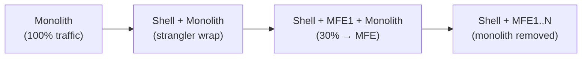

# Migration from Monolith to Microfrontends

Migrating an existing monolithic frontend to MFE architecture is one of the most complex and risky projects. The main goal: continue delivering business value during migration, not freezing development for 6 months.

## Strangler Fig Pattern



Strangler Fig Pattern: you wrap the monolith with a shell application that gradually "intercepts" URL routes, redirecting them to new MFEs. The monolith continues working and shrinks until it's completely replaced.

The name comes from the tropical fig tree that grows around its host and gradually replaces it.

## Three Migration Steps

### Step 1: Shell Wrapper

A shell application is created that connects the monolith as an iframe or as a remoteEntry. The user sees no changes. Shell becomes the single entry point.

```
Before:  nginx → monolith (serves all HTML)
After: nginx → shell → monolith (via iframe/proxy)
```

### Step 2: First MFE

The "cheapest" domain is selected — minimum dependencies, non-critical, high change frequency. Shell starts routing `/analytics/*` to the new MFE, while the rest goes to the monolith.

### Step 3: Continued Extraction

Each phase: one or two domains move to MFE. Connections between domains are converted from direct calls to EventBus. Shared state is extracted into a separate service.

## Criteria for Choosing the First Candidate

Ideal first MFE:

| Criteria | Good | Bad |
|----------|------|-----|
| Dependencies | 0–2 | 5+ |
| Criticality | Low | Critical |
| Change frequency | Daily | Rare |
| Size | S/M (~5–15K LOC) | XL (100K+ LOC) |
| Shared state | 0–1 entity | 5+ entities |

High change frequency + low criticality = fast feedback on issues and low business risk.

## Shared State During Transition

Monolith and MFE inevitably share data: user token, cart, settings. Solutions:

```
Option 1: Monolith — source of truth
  MFE reads via monolith's REST API

Option 2: External state store
  Redis / shared localStorage key with versioning

Option 3: EventBus synchronization
  Monolith emits events, MFEs subscribe
```

## Traffic Routing

Shell manages routing via Module Federation or iframe proxy:

```ts
// Shell Router
const routes = [
  { path: '/analytics', target: 'mfe:analytics' },   // MFE
  { path: '/profile',   target: 'mfe:profile' },      // MFE
  { path: '/*',         target: 'monolith:iframe' },  // monolith
]
```

## Migration Completion Criteria

Migration is complete when:
- 100% of URL routes are served by MFEs
- Monolithic bundle no longer loads in the browser
- All direct inter-domain calls replaced by EventBus
- Shared state moved to independent service
- Each MFE deploys independently of others
