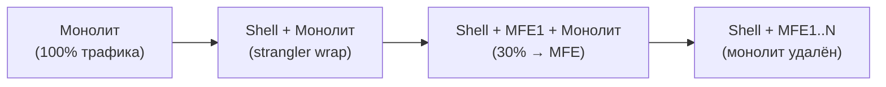

# Миграция из монолита в микрофронтенды

Перенос существующего монолитного фронтенда в MFE-архитектуру — один из самых сложных и рискованных проектов. Главная цель: продолжать поставлять бизнес-ценность в процессе миграции, а не замораживать разработку на 6 месяцев.

## Strangler Fig Pattern



Паттерн Strangler Fig (Удушающий фикус): вы оборачиваете монолит shell-приложением, которое постепенно «перехватывает» URL-маршруты, перенаправляя их на новые MFE. Монолит продолжает работать и уменьшается, пока не будет полностью вытеснен.

Название — от тропического дерева-фикуса, которое прорастает вокруг хозяина и постепенно его замещает.

## Три шага миграции

### Шаг 1: Shell-обёртка

Создаётся shell-приложение, которое подключает монолит как iframe или как remoteEntry. Пользователь не видит изменений. Shell становится единой точкой входа.

```
До:  nginx → monolith (выдаёт весь HTML)
После: nginx → shell → monolith (через iframe/proxy)
```

### Шаг 2: Первый MFE

Выбирается самый «дешёвый» домен — минимум зависимостей, некритичный, высокая частота изменений. Shell начинает маршрутизировать `/analytics/*` на новый MFE, а остальное — в монолит.

### Шаг 3: Продолжение извлечения

Каждая фаза: один-два домена переезжают в MFE. Связи между доменами конвертируются из прямых вызовов в EventBus. Shared state вычленяется в отдельный сервис.

## Критерии выбора первого кандидата

Идеальный первый MFE:

| Критерий | Хорошо | Плохо |
|----------|--------|-------|
| Зависимости | 0–2 | 5+ |
| Критичность | Низкая | Критическая |
| Частота изменений | Ежедневно | Редко |
| Размер | S/M (~5–15K LOC) | XL (100K+ LOC) |
| Shared state | 0–1 entity | 5+ entities |

Высокая частота изменений + низкая критичность = быстрая обратная связь при проблемах и низкий риск бизнес-потерь.

## Shared State в переходный период

Монолит и MFE неизбежно используют общие данные: токен пользователя, корзину, настройки. Решения:

```
Вариант 1: Монолит — источник истины
  MFE читает через REST API монолита

Вариант 2: Внешний state store
  Redis / shared localStorage key с версионированием

Вариант 3: EventBus синхронизация
  Монолит эмитит события, MFE подписываются
```

## Traffic Routing

Shell управляет маршрутизацией через Module Federation или iframe-прокси:

```ts
// Shell Router
const routes = [
  { path: '/analytics', target: 'mfe:analytics' },   // MFE
  { path: '/profile',   target: 'mfe:profile' },      // MFE
  { path: '/*',         target: 'monolith:iframe' },  // монолит
]
```

## Критерии завершения миграции

Миграция завершена когда:
- 100% URL маршрутов обслуживаются MFE
- Монолитный bundle не загружается в браузере
- Все прямые inter-domain вызовы заменены EventBus
- Shared state вынесен в независимый сервис
- Каждый MFE деплоится независимо от других
