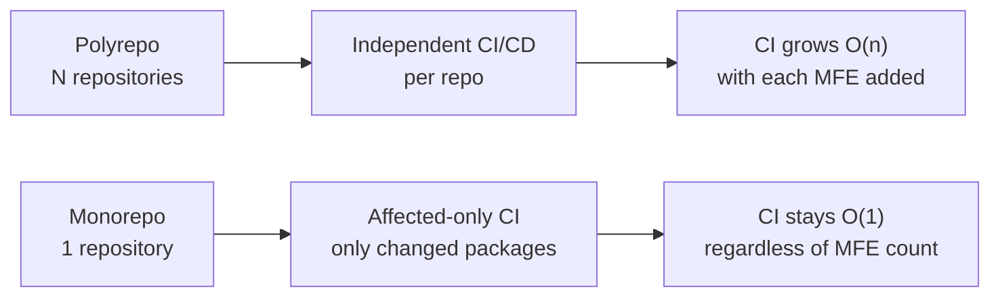

# DX and Tooling for Microfrontends

Moving to MFE architecture isn't just about technical decisions. It's also about the risk of losing team productivity: instead of one `npm run dev`, you now need to run five servers, synchronize package versions across ten repositories, and remember where ESLint configurations are stored. Developer Experience (DX) in MFE solves one task: a developer should feel they're working with a single project, even if technically split into parts.

## Monorepo vs Polyrepo



**Monorepo** — one repository contains all MFEs and shared packages. **Polyrepo** — each MFE in a separate repository.

| Criteria | Monorepo | Polyrepo |
|----------|----------|----------|
| Cross-MFE refactoring | One PR | N PRs in N repos |
| CI time | Affected-only (fast) | Full run per repo |
| Onboarding | Clone 1 repo | Clone N repos + setup |
| Dependency consistency | Guaranteed | Manual synchronization |
| Team independence | Requires discipline | Isolated by default |
| Code visibility | Full (coupling risk) | Explicit boundaries |

No universal answer — choice depends on team size, domain isolation level, and process maturity.

## Monorepo Tools

### Nx

```json
// nx.json
{
  "affected": { "defaultBase": "main" },
  "tasksRunnerOptions": {
    "default": {
      "runner": "nx/tasks-runners/default",
      "options": { "cacheableOperations": ["build", "test", "lint"] }
    }
  }
}
```

Nx builds a dependency graph between projects and runs only tasks affected by changed files — `nx affected --target=build`. Result caching: if code hasn't changed, result comes from cache.

### Turborepo

```json
// turbo.json
{
  "pipeline": {
    "build": { "dependsOn": ["^build"], "outputs": ["dist/**"] },
    "test": { "dependsOn": ["build"] },
    "lint": { "outputs": [] }
  }
}
```

Turborepo works via pipeline: `^build` means "build all dependencies first." Parallel task execution + Remote Cache for sharing results between developers.

### PNPM Workspaces

```yaml
# pnpm-workspace.yaml
packages:
  - 'apps/*'
  - 'packages/*'
```

PNPM solves node_modules duplication via hard links. Workspaces allow referencing local packages via `workspace:*`. The lightest option — no additional orchestration needed.

## Local Development: Mock Remote Strategy

The main MFE developer pain: needing to run host + all remotes to check their MFE. Solution — mock remote:

```ts
// webpack.config.dev.js in host
new ModuleFederationPlugin({
  remotes: {
    // In prod: 'catalogMfe@https://cdn.example.com/remoteEntry.js'
    // In dev:  local server or mock
    catalogMfe: process.env.LOCAL_CATALOG
      ? 'catalogMfe@http://localhost:3001/remoteEntry.js'
      : 'catalogMfe@https://cdn.example.com/remoteEntry.js',
    cartMfe: 'cartMfe@https://cdn.example.com/remoteEntry.js', // always prod
  }
})
```

Developer runs only their own MFE locally, others pull from staging/prod CDN.

## Dev Server: Proxy and HMR

```ts
// vite.config.ts for MFE with HMR via proxy
export default {
  server: {
    port: 3001,
    hmr: { port: 3001 },
    proxy: {
      '/api': 'http://localhost:4000',
    },
  },
}
```

HMR (Hot Module Replacement) works natively with MFE in Vite. Webpack requires additional `writeToDisk: true` setting so remoteEntry.js is available after HMR updates.

## Shared Configurations

In monorepo, shared configs are extracted into separate packages:

```
packages/
  eslint-config/        ← @company/eslint-config
    index.js
  tsconfig/             ← @company/tsconfig
    base.json
    react.json
  prettier-config/      ← @company/prettier-config
    index.js
```

```json
// In each MFE — package.json
{
  "devDependencies": {
    "@company/eslint-config": "workspace:*",
    "@company/tsconfig": "workspace:*"
  }
}
```

```js
// .eslintrc.js in MFE
module.exports = { extends: ['@company/eslint-config'] }
```

Change an ESLint rule in one place — applies to all MFEs.

## CLI for Scaffolding

Manual scaffolding of a new MFE — copying boilerplate with errors. CLI automates:

```bash
# Example CLI command
npx @company/mfe-cli create --name payments --type app --deps ui-kit,utils

# Generates:
apps/payments/
  src/
    bootstrap.tsx
    App.tsx
  webpack.config.js    ← with Module Federation preset
  package.json         ← with correct dependencies
  tsconfig.json        ← extends @company/tsconfig/react
  .eslintrc.js         ← extends @company/eslint-config
```

```ts
// Simplest scaffolding via Plop.js
module.exports = function(plop) {
  plop.setGenerator('mfe', {
    description: 'Create new MFE',
    prompts: [
      { type: 'input', name: 'name', message: 'MFE name?' },
      { type: 'list', name: 'type', choices: ['app', 'library', 'shared'] }
    ],
    actions: [
      { type: 'addMany', destination: 'apps/{{name}}', templateFiles: 'plop-templates/mfe/**' }
    ]
  })
}
```

## ⚠️ Common Beginner Mistakes

### Mistake 1: Running All MFEs Locally for One MFE Development

```bash
# ❌ Developer runs 5 servers to check a button in their MFE
npm run start:shell &
npm run start:catalog &
npm run start:cart &
npm run start:checkout &
npm run start:payments  # here's where I work
```

This slows down the machine, complicates onboarding, and makes development painful.

```bash
# ✅ Mock remote: only own MFE + prod CDN for others
MOCK_REMOTES=true npm run start:payments
# Other MFEs loaded from staging CDN automatically
```

### Mistake 2: Separate ESLint/TSConfig in Each MFE Without Inheritance

```json
// ❌ In each of 8 MFEs — own copy of rules
{
  "rules": { "no-console": "error", "prefer-const": "error" }
}
```

Rule changed → need to update 8 files. One team forgot → rule divergence.

```json
// ✅ One shared package, all MFEs inherit
{ "extends": ["@company/eslint-config"] }
```

### Mistake 3: Manual MFE Creation from Template

```
❌ Copy existing MFE folder, rename files manually,
   forget to update package.json, module federation config, webpack port.
   Result: port 3001 occupied by two MFEs, build fails.
```

```bash
# ✅ CLI with validation: checks port uniqueness, name, generates everything
npx @company/mfe-cli create --name new-feature
```

### Mistake 4: Ignoring Circular Dependencies in Monorepo

```
# ❌ payments depends on checkout, checkout depends on payments
payments → checkout → payments (cycle)
```

Circular dependencies break build and initialization order. In Nx, this is auto-detected via `@nrwl/enforce-module-boundaries`. In PNPM/Turborepo — need a dependency linter.

```ts
// ✅ Extract common logic to shared package with no upward dependencies
payments → @company/payment-utils (shared, no deps on apps)
checkout → @company/payment-utils
```
