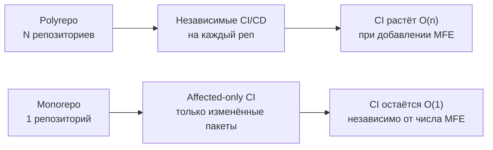

# DX и инструментарий для микрофронтендов

Переход на MFE-архитектуру — это не только технические решения. Это ещё и риск потерять продуктивность команды: вместо одного `npm run dev` теперь нужно запускать пять серверов, синхронизировать версии пакетов в десяти репозиториях и помнить, где лежат ESLint-конфигурации. Developer Experience (DX) в MFE решает одну задачу: разработчик должен ощущать, что работает с единым проектом, даже если он технически разбит на части.

## Monorepo vs Polyrepo



**Monorepo** — один репозиторий содержит все MFE и shared-пакеты. **Polyrepo** — каждый MFE в отдельном репозитории.

| Критерий | Monorepo | Polyrepo |
|----------|----------|----------|
| Cross-MFE рефакторинг | Один PR | N PR в N репо |
| CI время | Affected-only (быстро) | Полный прогон каждого репо |
| Onboarding | Клонировать 1 репо | Клонировать N репо + настройка |
| Консистентность зависимостей | Гарантирована | Ручная синхронизация |
| Независимость команд | Требует дисциплины | Изолирована по умолчанию |
| Видимость кода | Полная (риск coupling) | Явные границы |

Нет универсального ответа — выбор зависит от размера команды, степени изоляции доменов и зрелости процессов.

## Инструменты для Monorepo

### Nx

```json
// nx.json
{
  "affected": { "defaultBase": "main" },
  "tasksRunnerOptions": {
    "default": {
      "runner": "nx/tasks-runners/default",
      "options": { "cacheableOperations": ["build", "test", "lint"] }
    }
  }
}
```

Nx умеет строить граф зависимостей между проектами и запускать только те задачи, которые затронуты изменёнными файлами — `nx affected --target=build`. Кэширование результатов: если код не изменился, результат берётся из кэша.

### Turborepo

```json
// turbo.json
{
  "pipeline": {
    "build": { "dependsOn": ["^build"], "outputs": ["dist/**"] },
    "test": { "dependsOn": ["build"] },
    "lint": { "outputs": [] }
  }
}
```

Turborepo работает через pipeline: `^build` означает «сначала собери все зависимости». Параллельное выполнение задач + Remote Cache для разделения результатов между разработчиками.

### PNPM Workspaces

```yaml
# pnpm-workspace.yaml
packages:
  - 'apps/*'
  - 'packages/*'
```

PNPM решает проблему дублирования node_modules через hard links. Workspaces позволяют ссылаться на локальные пакеты через `workspace:*`. Самый лёгкий вариант — без дополнительной оркестрации.

## Локальная разработка: Mock Remote Strategy

Главная боль MFE-разработчика: нужно запустить host + все remote, чтобы проверить свой MFE. Решение — mock remote:

```ts
// webpack.config.dev.js в host
new ModuleFederationPlugin({
  remotes: {
    // В prod: 'catalogMfe@https://cdn.example.com/remoteEntry.js'
    // В dev:  локальный сервер или мок
    catalogMfe: process.env.LOCAL_CATALOG
      ? 'catalogMfe@http://localhost:3001/remoteEntry.js'
      : 'catalogMfe@https://cdn.example.com/remoteEntry.js',
    cartMfe: 'cartMfe@https://cdn.example.com/remoteEntry.js', // всегда prod
  }
})
```

Разработчик запускает только свой MFE локально, остальные подтягиваются из staging/prod CDN.

## Dev Server: Proxy и HMR

```ts
// vite.config.ts для MFE с HMR через proxy
export default {
  server: {
    port: 3001,
    hmr: { port: 3001 },
    proxy: {
      '/api': 'http://localhost:4000',
    },
  },
}
```

HMR (Hot Module Replacement) работает с MFE нативно при Vite. Webpack требует дополнительной настройки `writeToDisk: true` чтобы remoteEntry.js был доступен после HMR-обновлений.

## Shared Конфигурации

В monorepo shared-конфиги выносятся в отдельные пакеты:

```
packages/
  eslint-config/        ← @company/eslint-config
    index.js
  tsconfig/             ← @company/tsconfig
    base.json
    react.json
  prettier-config/      ← @company/prettier-config
    index.js
```

```json
// В каждом MFE — package.json
{
  "devDependencies": {
    "@company/eslint-config": "workspace:*",
    "@company/tsconfig": "workspace:*"
  }
}
```

```js
// .eslintrc.js в MFE
module.exports = { extends: ['@company/eslint-config'] }
```

Изменение правила ESLint в одном месте — применяется ко всем MFE.

## CLI для Scaffolding

Scaffolding нового MFE вручную — копирование boilerplate с ошибками. CLI автоматизирует:

```bash
# Пример CLI команды
npx @company/mfe-cli create --name payments --type app --deps ui-kit,utils

# Генерирует:
apps/payments/
  src/
    bootstrap.tsx
    App.tsx
  webpack.config.js    ← с Module Federation preset
  package.json         ← с правильными зависимостями
  tsconfig.json        ← extends @company/tsconfig/react
  .eslintrc.js         ← extends @company/eslint-config
```

```ts
// Простейший scaffolding через Plop.js
module.exports = function(plop) {
  plop.setGenerator('mfe', {
    description: 'Create new MFE',
    prompts: [
      { type: 'input', name: 'name', message: 'MFE name?' },
      { type: 'list', name: 'type', choices: ['app', 'library', 'shared'] }
    ],
    actions: [
      { type: 'addMany', destination: 'apps/{{name}}', templateFiles: 'plop-templates/mfe/**' }
    ]
  })
}
```

## ⚠️ Типичные ошибки новичков

### Ошибка 1: Запускать все MFE локально для разработки одного

```bash
# ❌ Разработчик запускает 5 серверов чтобы проверить кнопку в своём MFE
npm run start:shell &
npm run start:catalog &
npm run start:cart &
npm run start:checkout &
npm run start:payments  # вот где я работаю
```

Это замедляет машину, усложняет onboarding и делает разработку мучительной.

```bash
# ✅ Mock remote: только свой MFE + prod CDN для остальных
MOCK_REMOTES=true npm run start:payments
# Остальные MFE загружаются с staging CDN автоматически
```

### Ошибка 2: Отдельные ESLint/TSConfig в каждом MFE без наследования

```json
// ❌ В каждом из 8 MFE — своя копия правил
{
  "rules": { "no-console": "error", "prefer-const": "error" }
}
```

Правило изменилось → нужно обновить 8 файлов. Одна команда забыла → расхождение правил.

```json
// ✅ Один shared пакет, все MFE наследуют
{ "extends": ["@company/eslint-config"] }
```

### Ошибка 3: Ручное создание нового MFE по шаблону

```
❌ Копировать папку существующего MFE, переименовывать файлы вручную,
   забывать обновить package.json, module federation config, webpack port.
   Результат: порт 3001 занят двумя MFE, сборка падает.
```

```bash
# ✅ CLI с валидацией: проверяет уникальность порта, имени, генерирует всё
npx @company/mfe-cli create --name new-feature
```

### Ошибка 4: Игнорировать циклические зависимости в monorepo

```
# ❌ payments зависит от checkout, checkout зависит от payments
payments → checkout → payments (цикл)
```

Циклические зависимости ломают сборку и порядок инициализации. В Nx это детектируется автоматически через `@nrwl/enforce-module-boundaries`. В PNPM/Turborepo — нужен линтер зависимостей.

```ts
// ✅ Вынести общую логику в shared-пакет без зависимостей вверх
payments → @company/payment-utils (shared, no deps on apps)
checkout → @company/payment-utils
```
