# Capstone: проектирование MFE-платформы — расширенное руководство

## Полный взгляд на курс

За 15 уровней этого курса мы прошли путь от вопроса «зачем вообще нужны микрофронтенды» до проектирования полноценной production-платформы. Каждый уровень решал одну конкретную проблему:

```mermaid
graph LR
  L0["00 — Зачем MFE?\nМонолит vs MFE"] --> L1["01 — Паттерны\nRouting, Composition, Edge Side"]
  L1 --> L2["02 — Module Federation\nBasics: host, remote, shared"]
  L2 --> L3["03 — Module Federation\nAdvanced: версии, реестр"]
  L3 --> L4["04 — Single-SPA\nОркестрация lifecycle"]
  L4 --> L5["05 — Web Components\nShadow DOM, Custom Elements"]
  L5 --> L6["06 — Shared Dependencies\nsingleton, versioning"]
  L6 --> L7["07 — Routing\nShell routing, deep links"]
  L7 --> L8["08 — Communication\nEventBus, Shared State"]
  L8 --> L9["09 — Design System\nCSS isolation, tokens"]
  L9 --> L10["10 — Deploy\nversioning, canary"]
  L10 --> L11["11 — Testing\ncontract, integration"]
  L11 --> L12["12 — Monitoring\nerror boundary, SLO"]
  L12 --> L13["13 — Migration\nstrangler fig"]
  L13 --> L14["14 — DX\nmonorepo, tooling"]
  L14 --> L15["15 — Capstone\nполная платформа"]
```



Каждое решение принимается в контексте. Нет «правильного» ответа вне зависимости от размера команды, технического долга, бюджета и SLA.

## Проектирование e-commerce MFE-платформы: полный разбор

### Декомпозиция по доменам

Первый и самый важный шаг — разрезать систему по бизнес-доменам, а не по техническим слоям. Закон Конвея гласит: «Organizations which design systems are constrained to produce designs which are copies of the communication structures of these organizations.»

| MFE | Домен | Команда | Критичность |
|-----|-------|---------|-------------|
| Shell | Оркестрация, auth | Platform | Критический |
| Catalog | Просмотр товаров, поиск | Commerce | Высокая (SEO) |
| Cart | Корзина, промокоды | Commerce | Высокая |
| Checkout | Оплата, доставка | Payments | Критическая (PCI) |
| Profile | Аккаунт, история заказов | Identity | Средняя |
| Admin | Управление каталогом | Internal | Низкая (internal) |

Обратите внимание: Catalog и Cart в одной команде Commerce. Это не нарушение принципа «одна команда = один MFE» — это сознательное решение на раннем этапе. Когда Commerce вырастет, можно разделить.

### Communication Matrix

Событийная архитектура позволяет избежать прямых зависимостей между MFE:

| От \ До | Shell | Catalog | Cart | Checkout | Profile |
|---------|-------|---------|------|----------|---------|
| Shell | — | user:logout | user:logout | user:logout | user:logout |
| Catalog | mfe:ready | — | cart:add | — | — |
| Cart | — | — | — | checkout:start | — |
| Checkout | — | — | payment:failed | — | order:created |
| Profile | auth:changed | — | — | — | — |

Каждое событие имеет строго типизированный payload. Изменение payload — versioning события.

### Deploy Matrix

Разные MFE требуют разных стратегий деплоя:

| MFE | Стратегия | Причина |
|-----|-----------|---------|
| Shell | Blue/Green | Любой downtime Shell = downtime платформы |
| Catalog | Canary (15%) | Высокий трафик, SEO-риск при ошибках |
| Cart | Rolling | Умеренный трафик, stateless |
| Checkout | Blue/Green + ручное подтверждение | PCI DSS, деньги |
| Profile | Rolling | Низкая критичность |
| Admin | Direct | Только internal, низкий трафик |

### SLO Matrix

| MFE | SLO Availability | Error Budget | Мониторинг |
|-----|------------------|--------------|-----------|
| Shell | 99.9% | 8.7 часов/год | Datadog + PagerDuty |
| Catalog | 99.5% | 43.8 часов/год | Datadog + Slack |
| Cart | 99.5% | 43.8 часов/год | Datadog + Slack |
| Checkout | 99.95% | 4.4 часа/год | Datadog + PagerDuty (24/7) |
| Profile | 99.5% | 43.8 часов/год | Datadog |
| Admin | 99% | 87.6 часов/год | Только метрики |

## Patterns Recap: когда что использовать

### Интеграция MFE

**Module Federation** — выбирайте, если:
- Стек преимущественно React/Vue (один фреймворк)
- Нужен эффективный sharing зависимостей (react, react-dom как singletons)
- Webpack/Rspack уже в стеке
- Нет жёстких требований к security isolation

**Single-SPA** — выбирайте, если:
- Нужна оркестрация lifecycle MFE на уровне фреймворка
- Смешанные фреймворки с общим роутером
- Нужен parcel-режим (MFE без routing, встраиваемые виджеты)
- Multi-tenant runtime customization

**Web Components** — выбирайте, если:
- Максимальная изоляция через Shadow DOM (CSS не протекает)
- Разные фреймворки в одной платформе (Angular + React + Vue)
- Строгие security требования (PCI, healthcare)
- MFE как reusable виджеты

**Import Maps** — выбирайте, если:
- Хотите нативный ESM без бандлера
- Экспериментальный подход, browser support — не проблема
- Small/medium платформы без legacy

### Репозиторий

**Monorepo (Nx)** — для больших команд (5+) с тесными зависимостями. Nx дает module boundaries, dep graph, generators.

**Monorepo (Turborepo)** — более простой вариант без opinionated конфигурации. Подходит для 3-5 команд.

**Polyrepo** — для платформ со строгими security/compliance требованиями, где изоляция кода важнее DX.

### Deploy

**Independent deploy** — базовый принцип MFE. Версионированные URL (не `latest`).

**Canary** — для высокотрафичных MFE где риск велик. Поэтапный выкат от 1% до 100%.

**Blue/Green** — для критических MFE (Checkout, Shell). Мгновенный rollback.

**Feature Flags** — не стратегия деплоя, а дополнение. Позволяет деплоить код без включения фичи.

## Типичные ошибки архитектора

### Ошибка 1: Начать с технологии, не с доменов

Event Storming → DDD Bounded Contexts → Conway's Law → только потом Module Federation или Single-SPA.

Без понимания доменов MFE превращаются в «технические слои» (ui-mfe, data-mfe, logic-mfe) — это антипаттерн.

### Ошибка 2: Слишком раннее разделение

На старте с 3 командами и 2 MFE монолит часто оказывается лучшим решением. MFE — для масштаба. Если команды маленькие и не независимые, overhead MFE не окупается.

«Мы начали с 1 команды и 8 MFE. Через год мержили их обратно» — частая история.

### Ошибка 3: Игнорирование Network Waterfalls

```
Shell загрузился (100ms)
  → fetches remoteEntry.js catalog (200ms)
  → fetches remoteEntry.js cart (200ms)
  → fetches remoteEntry.js checkout (200ms)
  → renders page (total: 700ms+)
```

Решение: prefetch remoteEntry.js в `<link rel="prefetch">`, preloading в Shell.

### Ошибка 4: Coupling через shared store

Если 3 MFE читают и пишут в один Redux store, это не MFE-архитектура — это монолит с дополнительной сложностью.

Каждый MFE имеет свой внутренний state. Синхронизация только через события или явные контракты.

### Ошибка 5: Отсутствие локального dev режима

Если для разработки одной кнопки нужно запустить 6 серверов — это плохой DX, который убивает продуктивность команды. Mock Remote стратегия должна быть настроена с первого дня.

## Будущее MFE: 2025 и далее

### Module Federation 2.0

Webpack team представила Module Federation 2.0 как standalone пакет `@module-federation/core`:

```ts
// Module Federation 2.0 — runtime без webpack
import { init, loadRemote } from '@module-federation/runtime'

init({
  name: 'shell',
  remotes: [
    { name: 'catalog', entry: 'https://cdn.example.com/catalog/remoteEntry.js' }
  ],
})

// Динамическая загрузка
const CatalogApp = await loadRemote('catalog/App')
```

Ключевые изменения:
- Runtime работает без webpack — можно использовать с Rspack, Vite, Rollup
- Автоматическая типизация: `@module-federation/dts-plugin` генерирует `.d.ts` для remote модулей
- `FederationHost` API для программного управления

### Rspack

```json
// rspack.config.js — почти идентичен webpack
{
  "plugins": [
    new ModuleFederationPlugin({
      name: "catalog",
      exposes: { "./App": "./src/App.tsx" }
    })
  ]
}
```

Rspack совместим с webpack plugin API, но написан на Rust. Сборка 5-10x быстрее. Поддерживает Module Federation 2.0.

### Native Federation

Manfred Steyer (Angular architect) разработал Native Federation — реализацию идей MF через нативные ES Modules:

```html
<!-- Import Map в index.html -->
<script type="importmap">
  {
    "imports": {
      "catalog/App": "https://cdn.example.com/catalog/main.js"
    }
  }
</script>
```

Без webpack, без bundler-специфики. Браузер сам резолвит модули через Import Map. Работает везде где есть native ES modules support.

### Trendwatch

- **Vite + Module Federation** — официальный плагин `@originjs/vite-plugin-federation` стабилизировался
- **Micro-frontend meta-frameworks** — появляются как Single-SPA Parcels, но с better DX
- **Edge-side includes** — Cloudflare Workers для композиции MFE на уровне CDN (без client-side JS)
- **Islands Architecture** — Astro-подход для SSR: только критичные острова гидратируются

Архитектурная тенденция: движение от client-side composition (Module Federation) к server-side и edge composition для улучшения Core Web Vitals и SEO.
