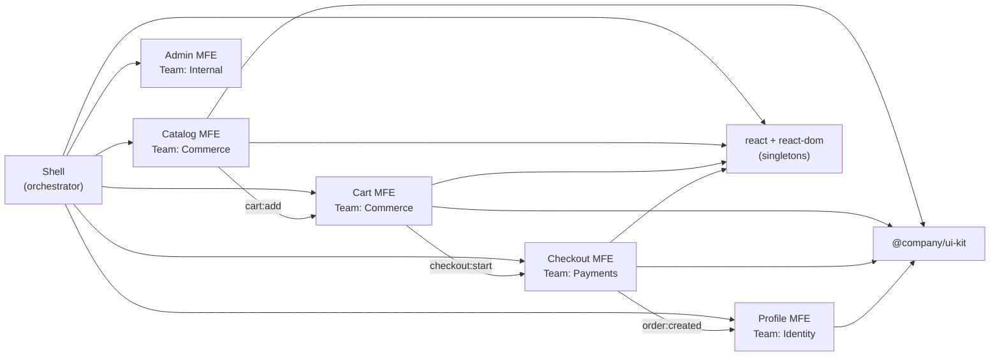
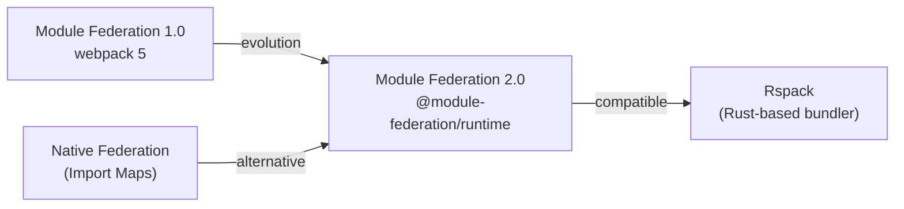

# Capstone: MFE Platform Architecture Design

This level is the final stop of the course. There are no new concepts you haven't encountered before. Instead, we design a real e-commerce platform using everything we've studied: Module Federation, Single-SPA, Web Components, routing, shared deps, communication, design system, deploy, monitoring, DX. An architect's job is not to know everything by heart, but to make well-founded decisions under specific constraints.

## E-commerce MFE Platform Architecture



The platform consists of a Shell and 5 domain MFEs. Shell is the orchestrator: it configures routing, global state (auth), error boundaries, and loads MFEs via Module Federation. Each MFE is an independent deployable unit with its own team and deployment strategy.

## Architect's Checklist: What to Verify Before Launch

Before the MFE platform goes to production, the architect must go through the following checklist:

**Isolation and Contracts**
- Each MFE has an explicit public API: exported components, events (emit/listen)
- No direct imports between MFEs (only through shared packages or events)
- Contract versioning: on breaking change — a new event version

**Shared Dependencies**
- All singletons (react, react-dom) are specified via `singleton: true` in Module Federation
- Shared dep versions are coordinated across all MFEs
- No duplication of heavy libraries (verify with bundle analyzer)

**Routing**
- Shell knows all top-level routes, MFEs don't compete for the same paths
- Lazy loading for each MFE: the user doesn't download all JS at startup
- 404 is handled in Shell, doesn't fall through to MFE

**Deploy and Versioning**
- Each MFE deploys independently without coordination
- remoteEntry.js URL contains a version or hash (not `latest` — that's an anti-pattern)
- Rollback works: rolling back an MFE doesn't require rolling back Shell

**Monitoring**
- Error Boundary on each MFE: failure of one doesn't bring down the rest
- Trace correlation via X-Request-ID between Shell and MFEs
- SLOs defined and measured for each MFE separately

**DX**
- A new developer can launch a single MFE in < 5 minutes (mock remote)
- Scaffolding CLI for creating a new MFE
- CI: affected-only in monorepo or independent pipelines in polyrepo

## Common Mistakes When Designing an MFE Platform

### Mistake 1: Overly Granular Decomposition

```
❌ Split into MFEs: Header, Footer, Button, Modal
   Problem: Module Federation overhead for components with no business logic
   Result: 20+ MFEs instead of 5, impossible to manage independently
```

```
✅ MFE = business domain with a team that owns it fully
   Catalog, Cart, Checkout, Profile — each has a backend, team, P&L
```

### Mistake 2: Shared State Instead of Events

```tsx
// ❌ Global Redux store — all MFEs write to one store
import { store } from 'shell/store'  // coupling to shell
store.dispatch(addToCart(product))   // MFE knows the structure of someone else's state
```

```tsx
// ✅ EventBus: MFE publishes an event, doesn't know who listens
window.dispatchEvent(new CustomEvent('cart:add', {
  detail: { productId: 'p1', qty: 1 }
}))
```

### Mistake 3: Synchronous Releases

```
❌ Coordinated deploy: "rolling out all MFEs simultaneously on Friday"
   Problem: defeats the entire purpose of MFE architecture
   Risk: one failed MFE rolls back the entire platform
```

```
✅ Independent deploy: Catalog deploys 3 times a day
   Shell deploys once a week
   Checkout — Blue/Green with manual approval
```

### Mistake 4: No Error Boundary

```tsx
// ❌ MFE renders directly — error in Catalog brings down the entire page
<Route path="/catalog" element={<CatalogApp />} />
```

```tsx
// ✅ Each MFE wrapped in Error Boundary
<Route path="/catalog" element={
  <ErrorBoundary fallback={<MfeFallback name="Catalog" />}>
    <CatalogApp />
  </ErrorBoundary>
} />
```

## The Future: Module Federation 2.0, Rspack, Native Federation

**Module Federation 2.0** (released with Rspack/webpack 5.87+) adds:
- `@module-federation/runtime` — runtime without webpack dependency
- Typed federation via auto-generated `.d.ts` files
- `FederationHost` API for dynamic remote management

**Rspack** — a webpack-compatible bundler in Rust. Supports Module Federation and provides 5-10x build speedup. Drop-in replacement for most webpack configs.

**Native Federation** — a library by Manfred Steyer for Angular/any frameworks, implementing Module Federation ideas via native ES Modules and Import Maps. Works without webpack.



The direction of movement: independence from webpack, native ES Modules, better typing tools, runtime unification.

## ⚠️ Common Beginner Mistakes

### Mistake 1: Start with Technology, Not Business Boundaries

```
❌ "Let's use Module Federation!" — without domain analysis
   Result: technology is there, but MFEs are cut arbitrarily (not by teams)
   A year later: 3 teams editing one MFE, no independence
```

```
✅ First: Event Storming, DDD, Conway's Law
   Teams → domains → MFE boundaries → then technology
```

### Mistake 2: Ignoring Contract Versioning

```ts
// ❌ Event without version — any change is a breaking change
window.dispatchEvent(new CustomEvent('cart:add', {
  detail: { id: product.id }  // tomorrow we rename to productId — everything breaks
}))
```

```ts
// ✅ Event is versioned
window.dispatchEvent(new CustomEvent('cart:add:v2', {
  detail: { productId: product.id, quantity: 1 }
}))
// v1 event continues to work until everyone migrates
```

### Mistake 3: One remoteEntry.js for All Environments

```js
// ❌ One URL for dev/staging/prod — accidentally deploy to prod from dev
remotes: { catalog: 'catalog@https://cdn.example.com/remoteEntry.js' }
```

```js
// ✅ URL depends on environment and version
const REMOTE_URL = process.env.CATALOG_REMOTE_URL
  || `https://cdn.example.com/catalog/${process.env.CATALOG_VERSION}/remoteEntry.js`
```
