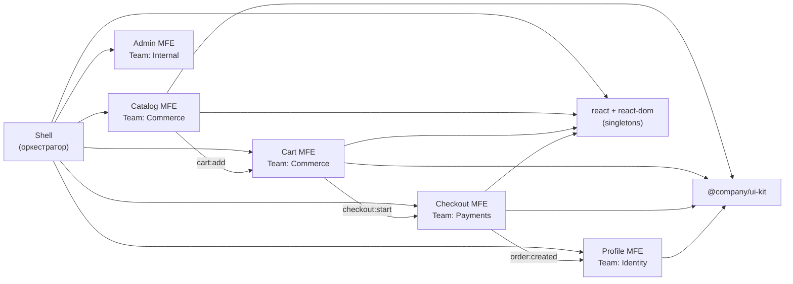
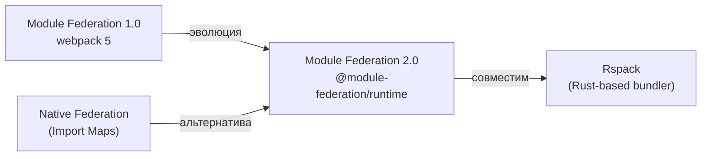

# Capstone: проектирование MFE-платформы

Этот уровень — финальная остановка курса. Здесь нет новых концепций, которых вы ещё не встречали. Вместо этого мы проектируем реальную e-commerce платформу, используя всё, что изучили: Module Federation, Single-SPA, Web Components, routing, shared deps, communication, design system, deploy, monitoring, DX. Задача архитектора — не знать всё наизусть, а уметь принимать обоснованные решения в условиях конкретных ограничений.

## Архитектура e-commerce MFE-платформы



Платформа состоит из Shell и 5 доменных MFE. Shell — оркестратор: он настраивает routing, глобальный state (auth), error boundaries и загружает MFE через Module Federation. Каждый MFE — независимый deployable unit со своей командой и стратегией деплоя.

## Checklist архитектора: что проверить перед запуском

Перед тем как MFE-платформа уйдёт в production, архитектор должен пройти следующий контрольный список:

**Изоляция и контракты**
- Каждый MFE имеет явный публичный API: экспортируемые компоненты, события (emit/listen)
- Нет прямых импортов между MFE (только через shared пакеты или события)
- Версионирование контрактов: при breaking change — новая версия события

**Shared Dependencies**
- Все синглтоны (react, react-dom) заданы через `singleton: true` в Module Federation
- Версии shared deps согласованы между всеми MFE
- Нет дублирования тяжёлых библиотек (проверить bundle analyzer)

**Routing**
- Shell знает все top-level маршруты, MFE не конкурируют за одни пути
- Lazy loading для каждого MFE: пользователь не скачивает весь JS при старте
- 404 обрабатывается в Shell, не падает в MFE

**Deploy и версионирование**
- Каждый MFE деплоится независимо без координации
- remoteEntry.js URL содержит версию или хэш (не latest — это антипаттерн)
- Rollback работает: откат MFE не требует отката Shell

**Мониторинг**
- Error Boundary на каждом MFE: падение одного не роняет остальные
- Корреляция трейсов через X-Request-ID между Shell и MFE
- SLO определены и измеряются для каждого MFE отдельно

**DX**
- Новый разработчик может запустить один MFE за < 5 минут (mock remote)
- Scaffolding CLI для создания нового MFE
- CI: affected-only в monorepo или независимые пайплайны в polyrepo

## Типичные ошибки при проектировании MFE-платформы

### Ошибка 1: Слишком мелкая декомпозиция

```
❌ Выделить в MFE: Header, Footer, Button, Modal
   Проблема: overhead Module Federation для компонентов без бизнес-логики
   Результат: 20+ MFE вместо 5, невозможно управлять независимо
```

```
✅ MFE = бизнес-домен с командой, которая владеет им полностью
   Catalog, Cart, Checkout, Profile — у каждого есть backend, команда, P&L
```

### Ошибка 2: Shared state вместо событий

```tsx
// ❌ Глобальный Redux store — все MFE пишут в один store
import { store } from 'shell/store'  // coupling на shell
store.dispatch(addToCart(product))   // MFE знает о структуре чужого state
```

```tsx
// ✅ EventBus: MFE публикует событие, не знает кто слушает
window.dispatchEvent(new CustomEvent('cart:add', {
  detail: { productId: 'p1', qty: 1 }
}))
```

### Ошибка 3: Синхронные релизы

```
❌ Координированный деплой: "выкатываем все MFE одновременно в пятницу"
   Проблема: теряется весь смысл MFE-архитектуры
   Риск: один неудачный MFE откатывает всю платформу
```

```
✅ Независимый деплой: Catalog деплоится 3 раза в день
   Shell деплоится раз в неделю
   Checkout — Blue/Green с ручным подтверждением
```

### Ошибка 4: Отсутствие error boundary

```tsx
// ❌ MFE рендерится напрямую — ошибка в Catalog роняет всю страницу
<Route path="/catalog" element={<CatalogApp />} />
```

```tsx
// ✅ Каждый MFE обёрнут в Error Boundary
<Route path="/catalog" element={
  <ErrorBoundary fallback={<MfeFallback name="Catalog" />}>
    <CatalogApp />
  </ErrorBoundary>
} />
```

## Будущее: Module Federation 2.0, Rspack, Native Federation

**Module Federation 2.0** (выпущен вместе с Rspack/webpack 5.87+) добавляет:
- `@module-federation/runtime` — runtime без webpack зависимости
- Typed federation через автоматически генерируемые `.d.ts`
- `FederationHost` API для динамического управления remote

**Rspack** — webpack-совместимый bundler на Rust. Поддерживает Module Federation и даёт 5-10x ускорение сборки. Drop-in замена для большинства webpack конфигов.

**Native Federation** — библиотека Manfred Steyer для Angular/любых фреймворков, реализующая идеи Module Federation через нативные ES Modules и Import Maps. Работает без webpack.



Направление движения: независимость от webpack, нативные ES Modules, лучшие инструменты типизации, унификация runtime.

## ⚠️ Типичные ошибки новичков

### Ошибка 1: Начать с технологии, а не с бизнес-границ

```
❌ "Давайте используем Module Federation!" — без анализа доменов
   Результат: технология есть, но MFE разрезаны произвольно (не по командам)
   Через год: 3 команды редактируют один MFE, нет независимости
```

```
✅ Сначала: Event Storming, DDD, Conway's Law
   Команды → домены → MFE-границы → потом технология
```

### Ошибка 2: Игнорировать версионирование контрактов

```ts
// ❌ Событие без версии — любое изменение — breaking change
window.dispatchEvent(new CustomEvent('cart:add', {
  detail: { id: product.id }  // завтра переименуем в productId — всё сломается
}))
```

```ts
// ✅ Событие версионировано
window.dispatchEvent(new CustomEvent('cart:add:v2', {
  detail: { productId: product.id, quantity: 1 }
}))
// v1 событие продолжает работать пока все не мигрировали
```

### Ошибка 3: Один remoteEntry.js для всех окружений

```js
// ❌ Один URL для dev/staging/prod — случайно деплоишь в prod из dev
remotes: { catalog: 'catalog@https://cdn.example.com/remoteEntry.js' }
```

```js
// ✅ URL зависит от окружения и версии
const REMOTE_URL = process.env.CATALOG_REMOTE_URL
  || `https://cdn.example.com/catalog/${process.env.CATALOG_VERSION}/remoteEntry.js`
```
