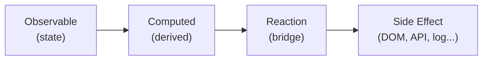

# Level 4: Reactions — Side Effects

## Introduction

MobX has three key concepts: **observable** (state), **computed** (derived data), and **reactions** (side effects). If computed answers the question "what can be derived from the state?", then reactions answer the question "what needs to **happen** when the state changes?".

Reactions are the bridge between the reactive world of MobX and the "outside world": DOM, localStorage, network requests, console, timers, etc.



MobX provides three types of reactions:

| Reaction | When it runs | How many times |
|----------|--------------|----------------|
| `autorun` | Immediately + on every dependency change | Multiple times |
| `reaction` | Only on change (not on initialization) | Multiple times |
| `when` | When the condition becomes `true` | Once |

---

## autorun — Automatic Execution

`autorun` takes a function and **immediately executes** it. During execution, MobX tracks which observables were read. When any of them change, the function runs again.

```ts
import { makeAutoObservable, autorun } from 'mobx'

class ThemeStore {
  theme: 'light' | 'dark' = 'light'

  constructor() {
    makeAutoObservable(this)
  }

  toggleTheme() {
    this.theme = this.theme === 'light' ? 'dark' : 'light'
  }
}

const store = new ThemeStore()

// Runs IMMEDIATELY, then on every change of store.theme
const disposer = autorun(() => {
  document.body.className = `theme-${store.theme}`
  console.log('Theme applied:', store.theme)
})

// "Theme applied: light"  — fired immediately

store.toggleTheme()
// "Theme applied: dark"   — fired on change
```

### How autorun tracks dependencies

MobX doesn't analyze code statically. Instead, it **executes** the function and records which observables were accessed during execution:

```ts
const store = makeAutoObservable({
  a: 1,
  b: 2,
  c: 3,
})

autorun(() => {
  // MobX sees access to store.a and store.b
  // store.c is NOT read — changing store.c will NOT trigger a re-run
  console.log(store.a + store.b)
})
```

Important: dependencies are determined **dynamically** on each run. If one run reads `store.a` and another reads `store.b`, the set of tracked observables can change.

```ts
autorun(() => {
  // When showDetails === false, only showDetails is tracked
  // When showDetails === true, both showDetails AND details are tracked
  if (store.showDetails) {
    console.log(store.details)
  }
})
```

### autorun returns a disposer

Every `autorun` call returns a disposer function. **Always** save and call it when the reaction is no longer needed:

```ts
const disposer = autorun(() => {
  console.log(store.value)
})

// When the reaction is no longer needed:
disposer()
```

---

## reaction — Controlled Reaction

`reaction` is similar to `autorun`, but takes **two functions**:

1. **Data function** — returns the data to track
2. **Effect function** — called when the data function's result changes

```ts
import { reaction } from 'mobx'

const disposer = reaction(
  // Data function — WHAT to track
  () => searchStore.query,

  // Effect function — WHAT to do on change
  (query, previousQuery) => {
    console.log(`Query changed: "${previousQuery}" → "${query}"`)
    searchStore.search()
  }
)
```

### Key difference from autorun

| Characteristic | `autorun` | `reaction` |
|---------------|-----------|------------|
| Runs on creation | Yes, immediately | No |
| Tracking | All observables in the function | Only data function's return value |
| Access to previous value | No | Yes (`previousValue`) |
| When to use | Syncing with the outside world | Reacting to a specific change |

`reaction` **does not run** the effect function on initialization — only on subsequent changes. This is useful when you don't need to perform the effect on the first render:

```ts
// autorun — fires IMMEDIATELY (calls search with an empty query)
autorun(() => {
  searchStore.search()  // Unwanted call on initialization
})

// reaction — fires ONLY when query changes
reaction(
  () => searchStore.query,
  () => searchStore.search()
)
```

### reaction options

```ts
reaction(
  () => store.query,
  (query) => fetchResults(query),
  {
    delay: 300,         // Debounce in milliseconds
    fireImmediately: true, // Run immediately (like autorun)
    equals: comparer.structural, // Custom comparison
  }
)
```

The `delay` option is especially useful for search queries — no need to make a request on every keystroke.

---

## when — One-time Reaction

`when` waits until a condition becomes `true`, executes the callback **once**, and automatically disposes. There are two ways to use it:

### Form 1: callback

```ts
import { when } from 'mobx'

const disposer = when(
  // Predicate — wait until it returns true
  () => loadingStore.isLoaded,

  // Callback — executes once
  () => {
    console.log('Data loaded:', loadingStore.data)
  }
)

// You can cancel the wait before the condition is met
disposer()
```

### Form 2: promise (await when)

```ts
async function waitForData() {
  // when without a callback returns a Promise
  await when(() => loadingStore.isLoaded)

  // Code runs when isLoaded becomes true
  console.log('Data loaded:', loadingStore.data)
}
```

The `await` form is convenient in async functions — the code reads linearly, without nested callbacks.

### When to use when

- Waiting for loading to complete
- One-time initialization after a condition is met
- Waiting for the user to perform a specific action

```ts
// Show a welcome message only when the profile is loaded
when(
  () => userStore.profile !== null,
  () => showWelcomeMessage(userStore.profile.name)
)
```

---

## Disposing Reactions

Every reaction (`autorun`, `reaction`, `when`) returns a **disposer** — a function that deactivates the reaction. If you don't call the disposer, the reaction lives forever and causes a **memory leak**.

### Pattern with useEffect

In React components, reactions are created in `useEffect` and disposed in the cleanup function:

```tsx
import { autorun, reaction } from 'mobx'
import { useEffect } from 'react'
import { observer } from 'mobx-react-lite'

const MyComponent = observer(function MyComponent() {
  useEffect(() => {
    const disposer1 = autorun(() => {
      document.title = `Count: ${store.count}`
    })

    const disposer2 = reaction(
      () => store.query,
      (query) => analytics.track('search', { query })
    )

    // CRITICAL: dispose ALL reactions on unmount
    return () => {
      disposer1()
      disposer2()
    }
  }, [])

  return <div>{store.count}</div>
})
```

### What happens without disposing

```tsx
// MEMORY LEAK
useEffect(() => {
  autorun(() => {
    console.log(store.value)  // Runs FOREVER, even after unmount
  })
  // No cleanup — disposer is lost!
}, [])
```

The component has unmounted, but autorun keeps running. It holds references to the store, the closure, and React state (if it uses `setState`). This is a classic memory leak.

### Pattern for multiple reactions

When there are many reactions, it's convenient to collect disposers in an array:

```tsx
useEffect(() => {
  const disposers: (() => void)[] = []

  disposers.push(
    autorun(() => {
      document.title = store.title
    })
  )

  disposers.push(
    reaction(
      () => store.locale,
      (locale) => i18n.changeLanguage(locale)
    )
  )

  disposers.push(
    when(
      () => store.isReady,
      () => analytics.track('ready')
    )
  )

  return () => disposers.forEach(d => d())
}, [])
```

---

## Comparison Table

| | `autorun` | `reaction` | `when` |
|---|---|---|---|
| **Runs on creation** | Yes | No | No (waits for condition) |
| **Number of runs** | Unlimited | Unlimited | Once |
| **Tracking** | All read observables | Only data function | Only predicate |
| **Previous value** | No | Yes | No |
| **Returns** | Disposer | Disposer | Disposer / Promise |
| **Auto-disposal** | No | No | Yes (after firing) |
| **Typical use** | DOM sync, logging | Reacting to a specific field | Waiting for a condition |

---

## Common Mistakes

### 1. Forgetting to dispose a reaction

```tsx
// Wrong — disposer is lost
useEffect(() => {
  autorun(() => {
    document.title = store.title
  })
}, [])
```

```tsx
// Correct — disposer is saved and called in cleanup
useEffect(() => {
  const disposer = autorun(() => {
    document.title = store.title
  })
  return () => disposer()
}, [])
```

**Why this is a mistake:** without calling the disposer, the reaction keeps running after the component unmounts. This causes memory leaks and can lead to "Can't perform a React state update on an unmounted component" errors.

---

### 2. Using autorun instead of reaction for a targeted response

```tsx
// Wrong — autorun fires immediately and reacts to
// ALL observables read in the function
autorun(() => {
  if (store.query.length > 2) {
    fetchResults(store.query)
  }
})
```

```tsx
// Correct — reaction only watches query,
// doesn't fire on initialization
reaction(
  () => store.query,
  (query) => {
    if (query.length > 2) {
      fetchResults(query)
    }
  }
)
```

**Why this is a mistake:** `autorun` runs immediately on creation — this can trigger an unwanted fetch. Additionally, autorun tracks **all** observables read in the function, which can lead to unnecessary firings.

---

### 3. Accessing observables outside the data function in reaction

```tsx
// Wrong — store.filter is read in the effect, not the data function
// The reaction won't fire when filter changes
reaction(
  () => store.query,
  (query) => {
    fetchResults(query, store.filter) // filter is not tracked!
  }
)
```

```tsx
// Correct — both values in the data function
reaction(
  () => ({ query: store.query, filter: store.filter }),
  ({ query, filter }) => {
    fetchResults(query, filter)
  },
  { equals: comparer.structural }
)
```

**Why this is a mistake:** MobX only tracks dependencies in the data function. Observables read in the effect function are **not tracked** — changing `store.filter` won't trigger the reaction.

---

### 4. Mutating observables inside autorun without an action

```tsx
// Wrong — mutating observable inside autorun
// (with enforceActions: 'always', this will throw an error)
autorun(() => {
  store.fullName = `${store.firstName} ${store.lastName}`
})
```

```tsx
// Correct — use computed for derived data
class Store {
  firstName = ''
  lastName = ''

  constructor() {
    makeAutoObservable(this)
  }

  get fullName() {
    return `${this.firstName} ${this.lastName}`
  }
}
```

**Why this is a mistake:** reactions are meant for **side effects** (interacting with the outside world), not for computing derived data. Use `computed` for derived data. Additionally, mutating observables inside a reaction can cause infinite loops.

---

### 5. Not using when for one-time conditions

```tsx
// Wrong — reaction lives forever,
// even though it's only needed once
const disposer = reaction(
  () => store.isLoaded,
  (isLoaded) => {
    if (isLoaded) {
      showNotification('Ready!')
      disposer() // Manual disposal — easy to forget
    }
  }
)
```

```tsx
// Correct — when automatically disposes after firing
when(
  () => store.isLoaded,
  () => showNotification('Ready!')
)
```

**Why this is a mistake:** `when` is specifically designed for one-time conditions — it automatically disposes after firing. Using `reaction` for this is overkill and prone to leaks if you forget to call the disposer.

---

## Additional Resources

- [MobX Reactions](https://mobx.js.org/reactions.html)
- [MobX autorun](https://mobx.js.org/reactions.html#autorun)
- [MobX reaction](https://mobx.js.org/reactions.html#reaction)
- [MobX when](https://mobx.js.org/reactions.html#when)
- [MobX — Rules for Reactions](https://mobx.js.org/reactions.html#rules)
