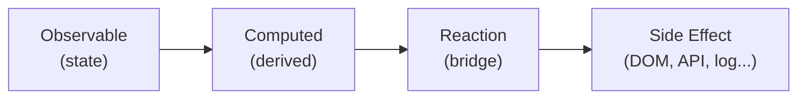

# Уровень 4: Reactions — Побочные эффекты

## 📚 Введение

В MobX есть три ключевых концепции: **observable** (состояние), **computed** (производные данные) и **reactions** (побочные эффекты). Если computed отвечает на вопрос «что можно вычислить из состояния?», то reactions отвечают на вопрос «что нужно **сделать**, когда состояние изменилось?».

Реакции — это мост между реактивным миром MobX и «внешним миром»: DOM, localStorage, сетевые запросы, консоль, таймеры и т.д.



MobX предоставляет три вида реакций:

| Реакция | Когда запускается | Сколько раз |
|---------|-------------------|-------------|
| `autorun` | Сразу + при каждом изменении зависимостей | Многократно |
| `reaction` | Только при изменении (не при инициализации) | Многократно |
| `when` | Когда условие становится `true` | Один раз |

---

## ⚡ autorun — автоматический запуск

`autorun` принимает функцию и **немедленно выполняет** её. При этом MobX отслеживает, какие observable были прочитаны во время выполнения. Когда любое из них изменяется — функция запускается снова.

```ts
import { makeAutoObservable, autorun } from 'mobx'

class ThemeStore {
  theme: 'light' | 'dark' = 'light'

  constructor() {
    makeAutoObservable(this)
  }

  toggleTheme() {
    this.theme = this.theme === 'light' ? 'dark' : 'light'
  }
}

const store = new ThemeStore()

// Запустится СРАЗУ, а потом при каждом изменении store.theme
const disposer = autorun(() => {
  document.body.className = `theme-${store.theme}`
  console.log('Theme applied:', store.theme)
})

// "Theme applied: light"  — сработало сразу

store.toggleTheme()
// "Theme applied: dark"   — сработало на изменение
```

### 🔍 Как autorun отслеживает зависимости

MobX не анализирует код статически. Вместо этого он **выполняет** функцию и записывает, к каким observable были обращения во время выполнения:

```ts
const store = makeAutoObservable({
  a: 1,
  b: 2,
  c: 3,
})

autorun(() => {
  // MobX видит обращение к store.a и store.b
  // store.c НЕ читается — изменение store.c НЕ вызовет перезапуск
  console.log(store.a + store.b)
})
```

Важно: зависимости определяются **динамически** при каждом запуске. Если в одном запуске читается `store.a`, а в другом — `store.b`, набор отслеживаемых observable может меняться.

```ts
autorun(() => {
  // При showDetails === false отслеживается только showDetails
  // При showDetails === true отслеживаются showDetails И details
  if (store.showDetails) {
    console.log(store.details)
  }
})
```

### ⚠️ autorun возвращает disposer

Каждый вызов `autorun` возвращает функцию-disposer. **Всегда** сохраняйте и вызывайте её, когда реакция больше не нужна:

```ts
const disposer = autorun(() => {
  console.log(store.value)
})

// Когда реакция больше не нужна:
disposer()
```

---

## 🔍 reaction — реакция с контролем

`reaction` похож на `autorun`, но принимает **две функции**:

1. **Data function** — возвращает данные, которые нужно отслеживать
2. **Effect function** — вызывается, когда результат data function изменился

```ts
import { reaction } from 'mobx'

const disposer = reaction(
  // Data function — ЧТО отслеживать
  () => searchStore.query,

  // Effect function — ЧТО делать при изменении
  (query, previousQuery) => {
    console.log(`Query changed: "${previousQuery}" → "${query}"`)
    searchStore.search()
  }
)
```

### Ключевое отличие от autorun

| Характеристика | `autorun` | `reaction` |
|---------------|-----------|------------|
| Запуск при создании | Да, сразу | Нет |
| Отслеживание | Все observable в функции | Только возврат data function |
| Доступ к предыдущему значению | Нет | Да (`previousValue`) |
| Когда использовать | Синхронизация с внешним миром | Реакция на конкретное изменение |

`reaction` **не запускает** effect function при инициализации — только при последующих изменениях. Это полезно, когда вам не нужно выполнять эффект при первом рендере:

```ts
// autorun — сработает СРАЗУ (выполнит search при пустом query)
autorun(() => {
  searchStore.search()  // Нежелательный вызов при инициализации
})

// reaction — сработает ТОЛЬКО при изменении query
reaction(
  () => searchStore.query,
  () => searchStore.search()
)
```

### Опции reaction

```ts
reaction(
  () => store.query,
  (query) => fetchResults(query),
  {
    delay: 300,         // Debounce в миллисекундах
    fireImmediately: true, // Запустить сразу (как autorun)
    equals: comparer.structural, // Кастомное сравнение
  }
)
```

Опция `delay` особенно полезна для поисковых запросов — не нужно делать запрос на каждый символ.

---

## 🎯 when — одноразовая реакция

`when` ждёт, пока условие станет `true`, выполняет callback **один раз** и автоматически утилизируется. Есть два способа использования:

### Форма 1: callback

```ts
import { when } from 'mobx'

const disposer = when(
  // Предикат — ждём, когда вернёт true
  () => loadingStore.isLoaded,

  // Callback — выполнится один раз
  () => {
    console.log('Data loaded:', loadingStore.data)
  }
)

// Можно отменить ожидание до того, как условие выполнится
disposer()
```

### Форма 2: promise (await when)

```ts
async function waitForData() {
  // when без callback возвращает Promise
  await when(() => loadingStore.isLoaded)

  // Код выполнится, когда isLoaded станет true
  console.log('Data loaded:', loadingStore.data)
}
```

Форма с `await` удобна в async-функциях — код читается линейно, без вложенных callback.

### Когда использовать when

- Ожидание завершения загрузки
- Одноразовая инициализация после выполнения условия
- Ожидание, пока пользователь выполнит определённое действие

```ts
// Показать приветствие только когда профиль загружен
when(
  () => userStore.profile !== null,
  () => showWelcomeMessage(userStore.profile.name)
)
```

---

## 🧹 Утилизация реакций (Disposing)

Каждая реакция (`autorun`, `reaction`, `when`) возвращает **disposer** — функцию, которая отключает реакцию. Если не вызвать disposer, реакция будет жить вечно и вызывать **утечку памяти**.

### Паттерн с useEffect

В React-компонентах реакции создаются в `useEffect` и утилизируются в cleanup-функции:

```tsx
import { autorun, reaction } from 'mobx'
import { useEffect } from 'react'
import { observer } from 'mobx-react-lite'

const MyComponent = observer(function MyComponent() {
  useEffect(() => {
    const disposer1 = autorun(() => {
      document.title = `Count: ${store.count}`
    })

    const disposer2 = reaction(
      () => store.query,
      (query) => analytics.track('search', { query })
    )

    // КРИТИЧНО: утилизировать ВСЕ реакции при размонтировании
    return () => {
      disposer1()
      disposer2()
    }
  }, [])

  return <div>{store.count}</div>
})
```

### Что будет без утилизации

```tsx
// ❌ УТЕЧКА ПАМЯТИ
useEffect(() => {
  autorun(() => {
    console.log(store.value)  // Работает ВЕЧНО, даже после unmount
  })
  // Нет cleanup — disposer потерян!
}, [])
```

Компонент размонтировался, но autorun продолжает работать. Он держит ссылки на store, на замыкание, на React state (если использует `setState`). Это классическая утечка памяти.

### Паттерн для множества реакций

Когда реакций много, удобно собирать disposer-ы в массив:

```tsx
useEffect(() => {
  const disposers: (() => void)[] = []

  disposers.push(
    autorun(() => {
      document.title = store.title
    })
  )

  disposers.push(
    reaction(
      () => store.locale,
      (locale) => i18n.changeLanguage(locale)
    )
  )

  disposers.push(
    when(
      () => store.isReady,
      () => analytics.track('ready')
    )
  )

  return () => disposers.forEach(d => d())
}, [])
```

---

## 📊 Сравнительная таблица

| | `autorun` | `reaction` | `when` |
|---|---|---|---|
| **Запуск при создании** | Да | Нет | Нет (ждёт условие) |
| **Количество запусков** | Неограниченно | Неограниченно | Один раз |
| **Отслеживание** | Все прочитанные observable | Только data function | Только предикат |
| **Предыдущее значение** | Нет | Да | Нет |
| **Возвращает** | Disposer | Disposer | Disposer / Promise |
| **Авто-утилизация** | Нет | Нет | Да (после срабатывания) |
| **Типичное использование** | Синхронизация DOM, логирование | Реакция на конкретное поле | Ожидание условия |

---

## ❌ Частые ошибки новичков

### 1. Забыть утилизировать реакцию

```tsx
// ❌ Неправильно — disposer потерян
useEffect(() => {
  autorun(() => {
    document.title = store.title
  })
}, [])
```

```tsx
// ✅ Правильно — disposer сохранён и вызван в cleanup
useEffect(() => {
  const disposer = autorun(() => {
    document.title = store.title
  })
  return () => disposer()
}, [])
```

**Почему это ошибка:** без вызова disposer реакция продолжает работать после размонтирования компонента. Это вызывает утечку памяти и может приводить к ошибкам «Can't perform a React state update on an unmounted component».

---

### 2. Использовать autorun вместо reaction для точечной реакции

```tsx
// ❌ Неправильно — autorun запустится сразу и среагирует
// на ВСЕ observable, прочитанные в функции
autorun(() => {
  if (store.query.length > 2) {
    fetchResults(store.query)
  }
})
```

```tsx
// ✅ Правильно — reaction следит только за query,
// не запускается при инициализации
reaction(
  () => store.query,
  (query) => {
    if (query.length > 2) {
      fetchResults(query)
    }
  }
)
```

**Почему это ошибка:** `autorun` выполнится сразу при создании — это может вызвать нежелательный fetch. Кроме того, autorun отслеживает **все** observable, прочитанные в функции, что может привести к лишним срабатываниям.

---

### 3. Обращаться к observable вне data function в reaction

```tsx
// ❌ Неправильно — store.filter читается в effect, а не в data function
// Реакция не будет срабатывать при изменении filter
reaction(
  () => store.query,
  (query) => {
    fetchResults(query, store.filter) // filter не отслеживается!
  }
)
```

```tsx
// ✅ Правильно — оба значения в data function
reaction(
  () => ({ query: store.query, filter: store.filter }),
  ({ query, filter }) => {
    fetchResults(query, filter)
  },
  { equals: comparer.structural }
)
```

**Почему это ошибка:** MobX отслеживает зависимости только в data function. Observable, прочитанные в effect function, **не отслеживаются** — изменение `store.filter` не вызовет повторный запуск реакции.

---

### 4. Менять observable внутри autorun без action

```tsx
// ❌ Неправильно — мутация observable внутри autorun
// (при enforceActions: 'always' будет ошибка)
autorun(() => {
  store.fullName = `${store.firstName} ${store.lastName}`
})
```

```tsx
// ✅ Правильно — использовать computed для производных данных
class Store {
  firstName = ''
  lastName = ''

  constructor() {
    makeAutoObservable(this)
  }

  get fullName() {
    return `${this.firstName} ${this.lastName}`
  }
}
```

**Почему это ошибка:** реакции предназначены для **побочных эффектов** (взаимодействие с внешним миром), а не для вычисления производных данных. Для производных данных используйте `computed`. Кроме того, мутация observable внутри реакции может вызвать бесконечный цикл.

---

### 5. Не использовать when для одноразовых условий

```tsx
// ❌ Неправильно — reaction будет жить вечно,
// хотя нужен только один раз
const disposer = reaction(
  () => store.isLoaded,
  (isLoaded) => {
    if (isLoaded) {
      showNotification('Ready!')
      disposer() // Ручная утилизация — легко забыть
    }
  }
)
```

```tsx
// ✅ Правильно — when автоматически утилизируется после срабатывания
when(
  () => store.isLoaded,
  () => showNotification('Ready!')
)
```

**Почему это ошибка:** `when` специально создан для одноразовых условий — он автоматически утилизируется после срабатывания. Использование `reaction` для этого избыточно и чревато утечками, если забыть вызвать disposer.

---

## 📚 Дополнительные ресурсы

- [MobX Reactions](https://mobx.js.org/reactions.html)
- [MobX autorun](https://mobx.js.org/reactions.html#autorun)
- [MobX reaction](https://mobx.js.org/reactions.html#reaction)
- [MobX when](https://mobx.js.org/reactions.html#when)
- [MobX — Rules for Reactions](https://mobx.js.org/reactions.html#rules)
