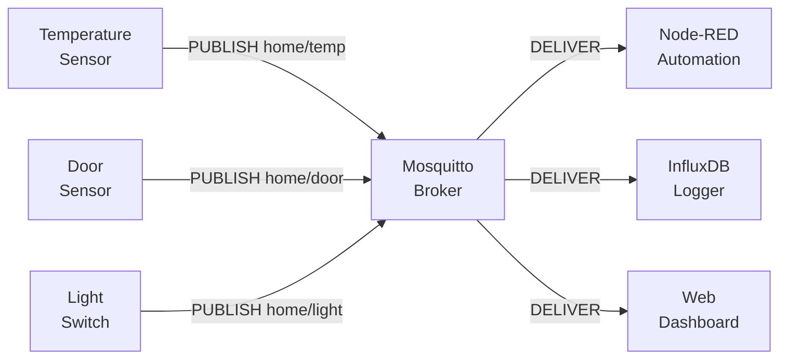
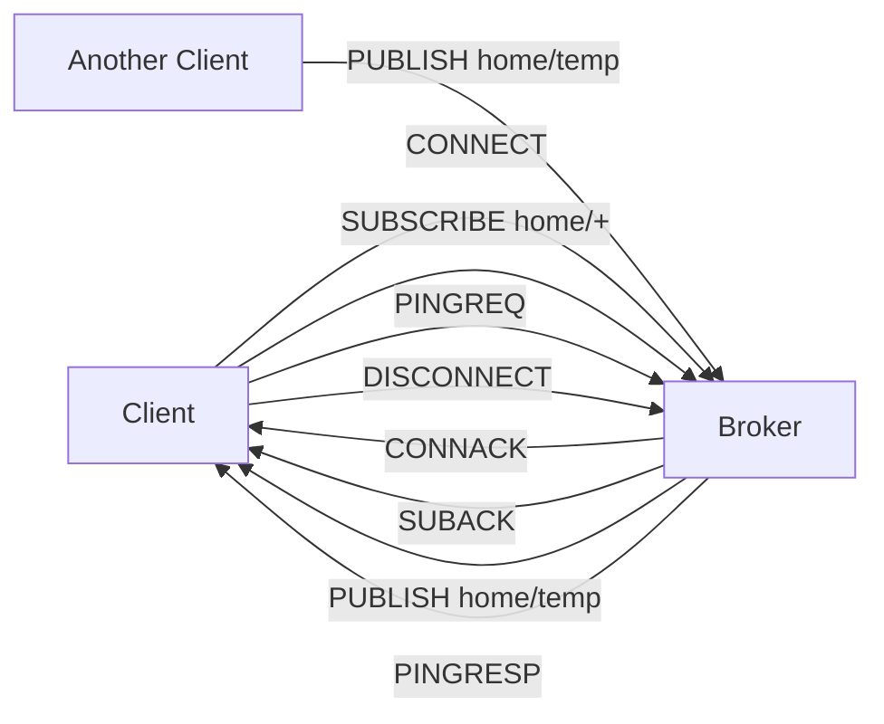

# Level 0: Introduction to MQTT — Detailed Theory

## History and Context

In 1999, engineers Andy Stanford-Clark (IBM) and Arlen Nipper (Arcom) were solving the problem of monitoring oil pipelines via satellite links. The conditions were harsh: unstable connection, high latency, limited bandwidth, battery-powered devices. HTTP was completely unsuitable for this.

They created MQTT — a protocol where every byte counts, connections recover automatically, and devices don't need to stay permanently connected.

Today MQTT is used by: Philips Hue smart bulbs, Facebook Messenger (messages), Amazon IoT, Azure IoT Hub, smart water and electricity meters worldwide.

---

## Architectural Model in Detail

### The Problem with HTTP in IoT

Imagine 1000 temperature sensors. Each needs to send data to a server every 10 seconds.

**With HTTP:**
- Each sensor makes an HTTP POST request
- Headers: 400+ bytes per request
- No persistent connection — TCP handshake every time
- Server cannot "push" data to a sensor
- 1000 sensors × 400 bytes × 6 times/min = ~2.4 MB/min in overhead

**With MQTT:**
- Each sensor maintains a single persistent TCP connection
- Data: 2 bytes header + topic length + payload
- Server can send commands to a sensor at any time
- 1000 sensors × ~30 bytes × 6 times/min = ~180 KB/min

### The Broker — Heart of the System



The broker performs three key functions:
1. **Routing** — delivers messages to all subscribed clients
2. **Buffering** — stores messages for temporarily offline clients (QoS 1/2)
3. **Retained messages** — stores the last value per topic for new subscribers

### Connection Lifecycle



---

## Topics: Anatomy and Rules

### Topic Structure

A topic is a UTF-8 string, separator is `/` (U+002F). Maximum length — 65535 bytes.

```
# Well-structured topics
home/floor1/bedroom/sensor/temperature
factory/line-3/machine-12/rpm
vehicles/truck-42/gps/coordinates
users/alice/notifications/inbox

# Bad practice
/sensor/temp          # leading slash = empty first level
TEMPERATURE           # all uppercase, no hierarchy
a                     # not informative
```

### Wildcards (SUBSCRIBE only)

The `+` and `#` symbols work **only in subscription patterns**. They are invalid in publish topics.

```
Publish topic:       home/bedroom/temperature  (concrete path)
Subscribe pattern:   home/+/temperature        (single level)
Subscribe pattern:   home/#                    (all levels)
Subscribe pattern:   #                         (EVERYTHING — be careful!)
```

**Match table:**

| Pattern | Matches | Does not match |
|---------|---------|----------------|
| `home/+/temp` | `home/bedroom/temp` | `home/floor1/bedroom/temp` |
| `home/#` | `home/`, `home/a/b/c/d` | `office/` |
| `+/+` | `a/b` | `a/b/c` |
| `#` | anything | — |

### System Topics $SYS

Mosquitto publishes metadata about its operation to special topics:

```bash
# Subscribe to all system topics
mosquitto_sub -t '$SYS/#' -v

# Examples of system topics:
$SYS/broker/version          → "mosquitto version 2.0.18"
$SYS/broker/uptime           → "3600 seconds"
$SYS/broker/clients/connected → "42"
$SYS/broker/messages/received → "18293"
$SYS/broker/load/messages/received/1min → "12.5"
```

📌 Notice the quotes around `$SYS` in the command line — otherwise the shell expands `$SYS` as an environment variable.

---

## Quality of Service (QoS)

Three levels of delivery guarantee:

### QoS 0 — At most once

```
Publisher  →  Broker  →  Subscriber
   PUBLISH ─────────────────────→
              (no confirmation)
```

The message is sent once without confirmation. If the broker is unavailable — the message is lost. Suitable for: frequent telemetry data where losing a single value is non-critical.

### QoS 1 — At least once

```
Publisher  →  Broker  →  Subscriber
   PUBLISH ─────────→
              PUBACK ←
                         PUBLISH ─────────→
                                   PUBACK ←
```

Guarantee: the message will arrive **at least once** (duplicates are possible). Suitable for: control commands, events, data important for logic.

### QoS 2 — Exactly once

```
PUBLISH → PUBREC → PUBREL → PUBCOMP (4 exchanges)
```

Guaranteed delivery without duplication. The slowest and most resource-intensive. Suitable for: critical transactions, financial data.

---

## Retained Messages and LWT

### Retained Messages

When publishing with `retain=true`, the broker stores the **last** message for that topic. A new subscriber immediately receives this message upon subscribing.

```bash
# Publish a retained message
mosquitto_pub -t "home/boiler/status" -m "online" -r

# Clear a retained message (empty payload)
mosquitto_pub -t "home/boiler/status" -m "" -r
```

💡 Analogy: retained message = the latest status on a bulletin board. A new employee immediately sees the current state without waiting for the next update.

### Last Will and Testament (LWT)

When connecting, a client can specify a "will" — a message the broker will publish if the client disconnects unexpectedly.

```python
# Example (paho-mqtt Python):
client.will_set(
    topic="home/sensors/boiler/status",
    payload="offline",
    qos=1,
    retain=True
)
```

This is a powerful mechanism for detecting emergency disconnects without periodic polling.

---

## MQTT 5.0: What's New

MQTT 5.0 added important mechanisms missing in v3.1.1:

### Properties (metadata)

```
Message Properties:
  Content-Type: "application/json"
  Response-Topic: "response/request-id-123"
  Correlation-Data: [binary]
  User-Property: {"source": "sensor-42", "firmware": "1.2.3"}
  Message-Expiry-Interval: 3600  # auto-delete after an hour
```

### Reason Codes

In v5, every CONNACK, PUBACK, SUBACK contains a numeric reason code:

```
0x00 = Success
0x87 = Not Authorized
0x8F = Session Taken Over
0x97 = Quota Exceeded
```

### Shared Subscriptions

Allows load balancing between multiple consumers:

```bash
# Group "workers" — each message goes to only one subscriber
mosquitto_sub -t '$share/workers/jobs/#'
```

---

## MQTT vs HTTP vs WebSocket vs AMQP

### When to Choose MQTT

✅ Use MQTT if:
- Devices have limited resources (RAM < 64 MB, unstable internet)
- You need push notifications from devices to server AND from server to devices
- Many devices → one server (message fan-out)
- You need LWT (connection drop detection)
- Battery-powered devices (minimal network traffic)

❌ Don't use MQTT if:
- You need request/response with a guaranteed specific response (HTTP is better)
- Transactional message processing (AMQP with RabbitMQ is better)
- Single device, web browser, public API (WebSocket or HTTP is better)

### Comparison Table

| Parameter | MQTT 5 | HTTP/2 | WebSocket | AMQP 1.0 |
|---------|--------|--------|-----------|----------|
| Fixed header | 2 bytes | ~200 bytes | ~10 bytes (after HS) | ~8 bytes |
| Persistent connection | ✅ | ✅ (HTTP/2) | ✅ | ✅ |
| Pub/Sub out of the box | ✅ | ❌ | ❌ | ✅ |
| QoS guarantees | QoS 0/1/2 | ❌ | ❌ | ACK/txn |
| Broker-free | ❌ | ✅ | ✅ | ❌ |
| Wildcards | ✅ | ❌ | ❌ | ✅ |
| LWT | ✅ | ❌ | ❌ | ❌ |
| IoT Standard | ✅ IANA 1883 | ❌ | partial | ❌ |

---

## ⚠️ Common Beginner Mistakes

### ❌ Publishing from a single client to all topics

```python
# Bad: one "central client" publishing on behalf of all sensors
central_client.publish("home/sensor1/temp", "23.5")
central_client.publish("home/sensor2/temp", "21.0")
```
**Why it's a problem:** if the central client disconnects, all topics go silent. LWT won't help for each sensor.

✅ Each device = its own MQTT client. The broker is designed for thousands of simultaneous connections.

### ❌ Using `#` as the only subscription pattern

```python
# Bad: subscribing to everything in production
client.subscribe("#")
```
**Why it's a problem:** the broker will send ABSOLUTELY ALL messages to the client. Under high load the client will choke.

✅ Subscribe to specific subtrees: `home/#`, `factory/line1/#`.

### ❌ Storing state only in retained messages

```bash
# Bad: the only state storage is a retained message
mosquitto_pub -t "system/config" -m '{"timeout":30}' -r
# After a broker restart without persistence, data is lost!
```
✅ Retained messages are a cache, not a database. Duplicate critical data to external storage.

### ❌ Leaving clientId empty or generating it randomly

```python
# Bad:
client = mqtt.Client()  # random clientId

# Even worse:
client = mqtt.Client(client_id="")  # broker will assign a random one
```
**Why it's a problem:** a persistent session with QoS 1/2 will never recover. The broker accumulates "abandoned" sessions.

✅ Use stable, unique clientIds: `sensor-bedroom-01`, `dashboard-main`.

---

## Practice: First Steps with mosquitto_pub/sub

```bash
# Terminal 1: subscriber
mosquitto_sub -h 192.168.1.1 -p 1883 -t "test/#" -v

# Terminal 2: publisher
mosquitto_pub -h 192.168.1.1 -p 1883 -t "test/hello" -m "Hello, MQTT!"

# Terminal 1 will receive:
# test/hello Hello, MQTT!
```

mosquitto_pub flags:
| Flag | Meaning |
|------|---------|
| `-h` | broker address |
| `-p` | port (default 1883) |
| `-t` | topic |
| `-m` | payload (message) |
| `-q` | QoS (0, 1, 2) |
| `-r` | retain flag |
| `-u` / `-P` | username / password |
| `-d` | debug output |
| `-i` | client ID |
