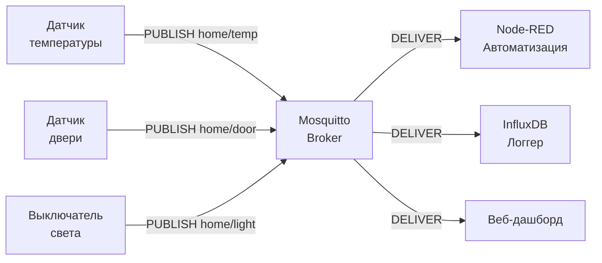
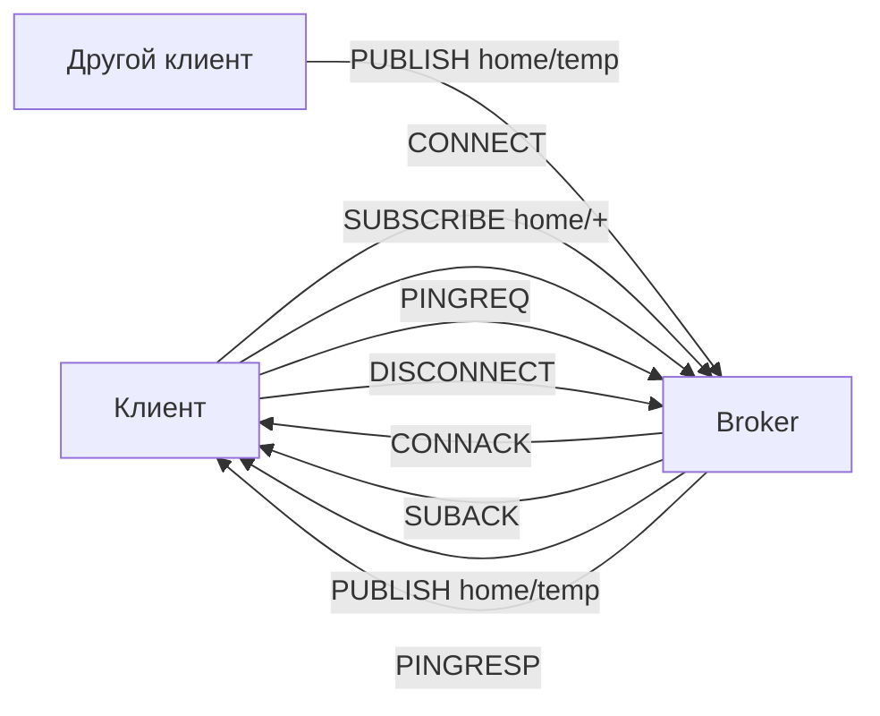
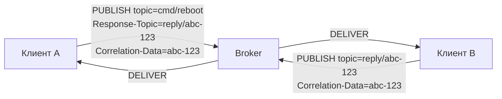
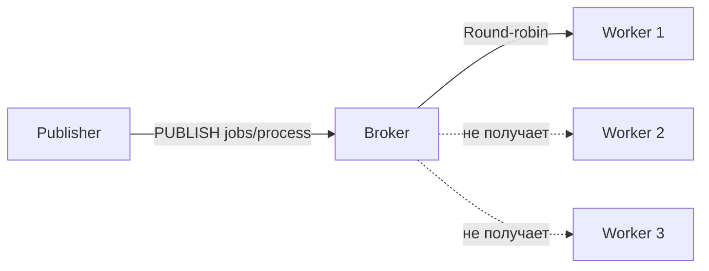

# Уровень 0: Введение в MQTT — Подробная теория

## История и контекст

В 1999 году инженеры Andy Stanford-Clark (IBM) и Arlen Nipper (Arcom) решали задачу мониторинга нефтепроводов через спутниковые каналы. Условия были жёсткими: нестабильное соединение, высокая задержка, ограниченная пропускная способность, батарейные устройства. HTTP для этого совершенно не подходил.

Они создали MQTT — протокол, где каждый байт на счету, соединение восстанавливается автоматически, а устройства не нуждаются в постоянном подключении.

Сегодня MQTT используют: умные лампочки Philips Hue, Facebook Messenger (сообщения), Amazon IoT, Azure IoT Hub, умные счётчики воды и электричества по всему миру.

---

## Архитектурная модель подробно

### Проблема с HTTP в IoT

Представь 1000 датчиков температуры. Каждый должен каждые 10 секунд отправить данные на сервер.

**С HTTP:**
- Каждый датчик делает HTTP POST запрос
- Заголовки: 400+ байт на каждый запрос
- Нет постоянного соединения — TCP handshake каждый раз
- Сервер не может "толкнуть" данные датчику
- 1000 датчиков × 400 байт × 6 раз/мин = ~2.4 МБ/мин на накладные расходы

**С MQTT:**
- Каждый датчик поддерживает одно постоянное TCP-соединение
- Данные: 2 байта заголовок + длина топика + payload
- Сервер может отправлять команды датчику в любой момент
- 1000 датчиков × ~30 байт × 6 раз/мин = ~180 КБ/мин

### Брокер — сердце системы



Брокер выполняет три ключевые функции:
1. **Маршрутизация** — доставляет сообщение всем подписанным клиентам
2. **Буферизация** — хранит сообщения для temporarily offline клиентов (QoS 1/2)
3. **Retained messages** — хранит последнее значение по топику для новых подписчиков

### Жизненный цикл подключения



---

## Топики: анатомия и правила

### Структура топика

Топик — это UTF-8 строка, разделитель — `/` (U+002F). Максимальная длина — 65535 байт.

```
# Хорошо структурированные топики
home/floor1/bedroom/sensor/temperature
factory/line-3/machine-12/rpm
vehicles/truck-42/gps/coordinates
users/alice/notifications/inbox

# Плохая практика
/sensor/temp          # ведущий слэш = пустой первый уровень
TEMPERATURE           # всё в верхнем регистре, нет иерархии
a                     # неинформативно
```

### Wildcards (только для SUBSCRIBE)

Символы `+` и `#` работают **только в паттернах подписки**. В топиках при публикации они недопустимы.

```
Топик публикации:  home/bedroom/temperature  (конкретный путь)
Паттерн подписки:  home/+/temperature        (один уровень)
Паттерн подписки:  home/#                    (все уровни)
Паттерн подписки:  #                         (ВСЕ топики — осторожно!)
```

**Таблица совпадений:**

| Паттерн | Совпадает | Не совпадает |
|---------|-----------|-------------|
| `home/+/temp` | `home/bedroom/temp` | `home/floor1/bedroom/temp` |
| `home/#` | `home/`, `home/a/b/c/d` | `office/` |
| `+/+` | `a/b` | `a/b/c` |
| `#` | всё что угодно | — |

### Системные топики $SYS

Mosquitto публикует метаданные о своей работе в специальные топики:

```bash
# Подписаться на все системные топики
mosquitto_sub -t '$SYS/#' -v

# Примеры системных топиков:
$SYS/broker/version          → "mosquitto version 2.0.18"
$SYS/broker/uptime           → "3600 seconds"
$SYS/broker/clients/connected → "42"
$SYS/broker/messages/received → "18293"
$SYS/broker/load/messages/received/1min → "12.5"
```

📌 Обрати внимание на кавычки вокруг `$SYS` в командной строке — иначе shell раскрывает `$SYS` как переменную окружения.

---

## Качество обслуживания (QoS)

Три уровня гарантии доставки:

### QoS 0 — At most once (максимум один раз)

```
Publisher  →  Broker  →  Subscriber
   PUBLISH ─────────────────────→
              (нет подтверждения)
```

Сообщение отправляется один раз без подтверждения. Если брокер недоступен — сообщение теряется. Подходит для: частые телеметрические данные, где потеря одного значения некритична.

### QoS 1 — At least once (минимум один раз)

```
Publisher  →  Broker  →  Subscriber
   PUBLISH ─────────→
              PUBACK ←
                         PUBLISH ─────────→
                                   PUBACK ←
```

Гарантия: сообщение дойдёт **хотя бы один раз** (возможны дубликаты). Подходит для: команды управления, события, данные, важные для логики.

### QoS 2 — Exactly once (ровно один раз)

```
PUBLISH → PUBREC → PUBREL → PUBCOMP (4 обмена)
```

Гарантия доставки без дублирования. Самый медленный и ресурсоёмкий. Подходит для: критически важные транзакции, финансовые данные.

---

## Retained messages и LWT

### Retained messages

При публикации с флагом `retain=true` брокер сохраняет **последнее** сообщение по этому топику. Новый подписчик немедленно получает это сообщение при подписке.

```bash
# Опубликовать retained сообщение
mosquitto_pub -t "home/boiler/status" -m "online" -r

# Сбросить retained сообщение (пустой payload)
mosquitto_pub -t "home/boiler/status" -m "" -r
```

💡 Аналогия: retained message = последний статус на доске объявлений. Новый сотрудник сразу видит текущее состояние, не дожидаясь следующего обновления.

### Last Will and Testament (LWT)

При подключении клиент может указать "завещание" — сообщение, которое брокер опубликует, если клиент неожиданно отключится.

```python
# Пример (paho-mqtt Python):
client.will_set(
    topic="home/sensors/boiler/status",
    payload="offline",
    qos=1,
    retain=True
)
```

Это мощный механизм обнаружения аварийных отключений без периодического опроса.

---

## MQTT 5.0: что нового

MQTT 3.1.1 был рабочей лошадкой IoT больше 10 лет, но ему не хватало многих вещей, которые разработчики реализовывали костылями. В 2019 году вышел MQTT 5.0 — обратно несовместимый, но значительно более мощный протокол. Mosquitto поддерживает v5 начиная с версии 2.0.

💡 Аналогия: если MQTT 3.1.1 — это SMS (текст и всё), то MQTT 5.0 — это мессенджер: есть статусы доставки, метаданные, реакции на ошибки, группы.

### Properties (метаданные сообщений)

В v3.1.1 сообщение — это просто `topic + payload`. Никаких метаданных. Хочешь передать тип контента? Запиши в payload. Хочешь время жизни? Реализуй сам. В v5 появились стандартные **свойства**, которые можно прикрепить к любому пакету:

```
Message Properties:
  Content-Type: "application/json"          # MIME-тип payload
  Response-Topic: "response/request-id-123" # для request/reply паттерна
  Correlation-Data: [binary]                # связать запрос с ответом
  User-Property: {"source": "sensor-42"}    # произвольные key-value пары
  Message-Expiry-Interval: 3600             # автоудаление через час
  Payload-Format-Indicator: 1               # 0 = байты, 1 = UTF-8 текст
  Topic-Alias: 7                            # числовой псевдоним топика
```

#### Topic Alias — экономия трафика

Когда устройство публикует в один и тот же длинный топик тысячи раз, каждый раз передаётся полная строка. Topic Alias решает это:

```
# Первый PUBLISH — брокер запоминает, что alias 7 = этот топик
PUBLISH topic="factory/line-3/machine-12/vibration/sensor-a" alias=7

# Все последующие — только 2 байта вместо 48
PUBLISH topic="" alias=7
PUBLISH topic="" alias=7
```

На устройстве с тысячами сообщений в минуту это значительная экономия.

#### Request/Response паттерн

В v3.1.1 для реализации запрос/ответ приходилось изобретать собственные конвенции. В v5 это стандартизировано:



Клиент A отправляет команду и указывает, куда ждать ответ (`Response-Topic`). Клиент B выполняет команду и отправляет результат обратно. `Correlation-Data` позволяет сопоставить ответ с конкретным запросом, если их несколько одновременно.

### Reason Codes — внятная диагностика

В v3.1.1 при ошибке брокер просто разрывал соединение. Почему? Неизвестно. Разбирайся по логам. В v5 **каждый** пакет-ответ содержит числовой Reason Code:

| Код | Название | Когда возникает |
|-----|---------|----------------|
| `0x00` | Success | Операция выполнена успешно |
| `0x10` | No Matching Subscribers | Сообщение опубликовано, но никто не подписан |
| `0x80` | Unspecified Error | Общая ошибка без деталей |
| `0x83` | Implementation Specific Error | Ошибка конкретной реализации брокера |
| `0x87` | Not Authorized | Нет прав на эту операцию |
| `0x8F` | Session Taken Over | Другой клиент подключился с тем же clientId |
| `0x90` | Topic Filter Invalid | Невалидный паттерн подписки |
| `0x97` | Quota Exceeded | Превышена квота (слишком много сообщений/подписок) |

Дополнительно брокер может отправить **Reason String** — текстовое описание ошибки для отладки:

```
CONNACK Reason Code: 0x87
Reason String: "User 'sensor-42' not authorized for topic 'admin/#'"
```

### Shared Subscriptions — балансировка нагрузки

В v3.1.1 при подписке нескольких клиентов на один топик **каждый** получает копию сообщения. Shared Subscriptions позволяют создать группу потребителей, где каждое сообщение доставляется **только одному** участнику группы:



```bash
# Все три воркера подписываются на одну shared-группу "workers"
mosquitto_sub -t '$share/workers/jobs/#'  # Worker 1
mosquitto_sub -t '$share/workers/jobs/#'  # Worker 2
mosquitto_sub -t '$share/workers/jobs/#'  # Worker 3

# Каждое сообщение в jobs/# получит только один из трёх
```

Формат: `$share/{group-name}/{topic-filter}`. Разные группы работают независимо — можно создать группу `loggers` и группу `processors`, и каждая будет получать все сообщения, но внутри группы — без дублирования.

### Session Expiry Interval — управление временем жизни сессии

В v3.1.1 сессия либо удаляется при отключении (`clean session = true`), либо живёт вечно (`clean session = false`). Вечные сессии — головная боль: забытые устройства накапливают очереди сообщений, съедая память брокера.

В v5 клиент указывает **точное время жизни сессии** в секундах:

```
CONNECT:
  Clean Start: true / false
  Session Expiry Interval: 3600  # сессия живёт 1 час после отключения
```

- `0` — удалить сессию при отключении (аналог `clean session = true`)
- `4294967295` (0xFFFFFFFF) — сессия живёт бесконечно
- Любое другое значение — TTL в секундах

Это решает проблему «зомби-сессий»: если устройство не переподключилось за час, брокер автоматически очистит его очередь.

### Flow Control — защита от перегрузки

В v3.1.1 быстрый паблишер мог «затопить» медленного подписчика, а у брокера не было стандартного способа это ограничить. В v5 появился **Receive Maximum** — максимальное количество неподтверждённых QoS 1/2 сообщений в полёте:

```
CONNECT:
  Receive Maximum: 10   # клиент готов обработать максимум 10 сообщений одновременно

CONNACK:
  Receive Maximum: 100  # брокер готов принять максимум 100 одновременно
```

Когда лимит достигнут, отправитель приостанавливает публикацию до получения подтверждений. Это не даёт устройству с 32 КБ RAM захлебнуться потоком данных.

### Сводная таблица отличий

| Возможность | MQTT 3.1.1 | MQTT 5.0 |
|-------------|-----------|----------|
| Метаданные сообщений | ❌ | ✅ Properties |
| Диагностика ошибок | Разрыв соединения | Reason Code + String |
| Балансировка нагрузки | ❌ | ✅ Shared Subscriptions |
| Время жизни сессии | Вечно или 0 | Настраиваемый TTL |
| Время жизни сообщения | ❌ | ✅ Message Expiry |
| Request/Response | Костыли | ✅ Response-Topic |
| Flow Control | ❌ | ✅ Receive Maximum |
| Topic Alias | ❌ | ✅ Экономия трафика |
| Причина отключения | ❌ | ✅ Disconnect Reason Code |

### Когда оставаться на 3.1.1?

Не всем нужно переходить на v5:
- **Устройство не поддерживает v5** — многие дешёвые ESP8266/ESP32 библиотеки до сих пор работают только с v3.1.1
- **Брокер не поддерживает v5** — некоторые облачные IoT-платформы ещё не обновились
- **Простой сценарий** — если достаточно pub/sub с QoS 0 без метаданных, v3.1.1 проще и легковеснее

Mosquitto 2.x поддерживает оба протокола одновременно — v3.1.1 и v5 клиенты могут работать с одним брокером.

---

## MQTT vs HTTP vs WebSocket vs AMQP

### Когда выбирать MQTT

✅ Используй MQTT, если:
- Устройства имеют ограниченные ресурсы (RAM < 64 МБ, нестабильный интернет)
- Нужны push-уведомления от устройств к серверу И от сервера к устройствам
- Много устройств → один сервер (fan-out сообщений)
- Нужен LWT (обнаружение обрывов соединения)
- Батарейные устройства (минимальный сетевой трафик)

❌ Не используй MQTT, если:
- Нужен request/response с гарантией конкретного ответа (HTTP лучше)
- Транзакционная обработка сообщений (AMQP с RabbitMQ лучше)
- Одно устройство, веб-браузер, публичный API (WebSocket или HTTP лучше)

### Таблица сравнения

| Параметр | MQTT 5 | HTTP/2 | WebSocket | AMQP 1.0 |
|---------|--------|--------|-----------|----------|
| Фикс. заголовок | 2 байта | ~200 байт | ~10 байт (после HS) | ~8 байт |
| Персист. соединение | ✅ | ✅ (HTTP/2) | ✅ | ✅ |
| Pub/Sub из коробки | ✅ | ❌ | ❌ | ✅ |
| QoS гарантии | QoS 0/1/2 | ❌ | ❌ | ACK/txn |
| Broker-free | ❌ | ✅ | ✅ | ❌ |
| Wildcards | ✅ | ❌ | ❌ | ✅ |
| LWT | ✅ | ❌ | ❌ | ❌ |
| IoT Standard | ✅ IANA 1883 | ❌ | частично | ❌ |

---

## ⚠️ Частые ошибки новичков

### ❌ Публикация одним единственным клиентом на все топики

```python
# Плохо: один "центральный клиент" публикует от имени всех датчиков
central_client.publish("home/sensor1/temp", "23.5")
central_client.publish("home/sensor2/temp", "21.0")
```
**Почему проблема:** при отключении центрального клиента все топики "замолкают". LWT не поможет для каждого датчика.

✅ Каждое устройство = свой MQTT-клиент. Брокер спроектирован для тысяч одновременных соединений.

### ❌ Использовать `#` как единственный паттерн подписки

```python
# Плохо: подписка на всё в продакшне
client.subscribe("#")
```
**Почему проблема:** брокер будет отправлять клиенту АБСОЛЮТНО ВСЕ сообщения. При высокой нагрузке клиент захлебнётся.

✅ Подписывайся на конкретные поддеревья: `home/#`, `factory/line1/#`.

### ❌ Хранить состояние только в retained messages

```bash
# Плохо: единственное хранилище состояния — retained message
mosquitto_pub -t "system/config" -m '{"timeout":30}' -r
# При перезапуске брокера без persistence данные теряются!
```
✅ Retained messages — это кэш, а не база данных. Дублируй критически важные данные во внешнее хранилище.

### ❌ clientId оставлять пустым или генерировать случайно

```python
# Плохо:
client = mqtt.Client()  # случайный clientId

# Ещё хуже:
client = mqtt.Client(client_id="")  # брокер присвоит случайный
```
**Почему проблема:** persistent session с QoS 1/2 никогда не восстановится. Брокер накапливает "брошенные" сессии.

✅ Используй стабильные, уникальные clientId: `sensor-bedroom-01`, `dashboard-main`.

---

## Практика: первые шаги с mosquitto_pub/sub

```bash
# Терминал 1: подписчик
mosquitto_sub -h 192.168.1.1 -p 1883 -t "test/#" -v

# Терминал 2: публикатор
mosquitto_pub -h 192.168.1.1 -p 1883 -t "test/hello" -m "Привет, MQTT!"

# Терминал 1 получит:
# test/hello Привет, MQTT!
```

Флаги mosquitto_pub:
| Флаг | Значение |
|------|---------|
| `-h` | адрес брокера |
| `-p` | порт (по умолчанию 1883) |
| `-t` | топик |
| `-m` | payload (сообщение) |
| `-q` | QoS (0, 1, 2) |
| `-r` | retain flag |
| `-u` / `-P` | username / password |
| `-d` | debug output |
| `-i` | client ID |
