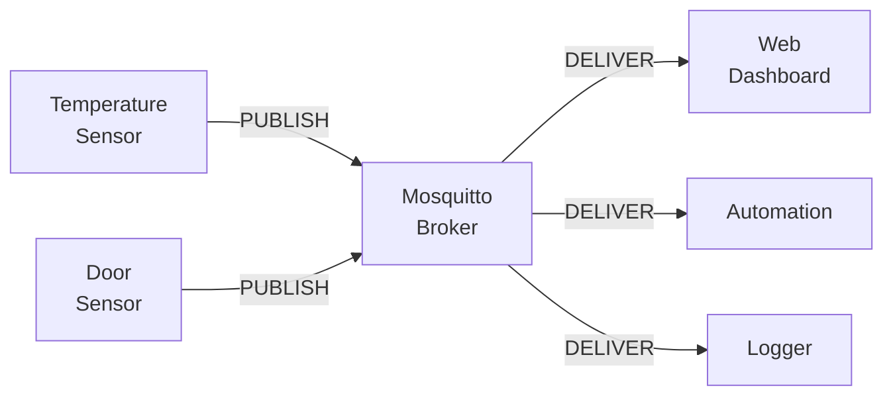

# Level 0: Introduction to MQTT

## What is MQTT and Why It's Needed

Imagine a post office with a bulletin board. The sender attaches a note with a topic ("weather/street"), and everyone subscribed to that topic receives it — without knowing about each other. That's MQTT.

**MQTT** (Message Queuing Telemetry Transport) is a lightweight messaging protocol for resource-constrained devices. Developed by IBM in 1999 for monitoring oil pipelines via satellite links with high latency and low bandwidth.

Today MQTT is the de facto standard for IoT (smart home, industrial automation, telematics).



---

## The Pub/Sub Model

MQTT uses the **publish/subscribe** pattern — unlike HTTP, where the client explicitly requests data.

| Role | What it does |
|------|-------------|
| **Publisher** | Publishes a message to a topic |
| **Broker** | Routes messages from publishers to subscribers |
| **Subscriber** | Subscribes to topics and receives messages |

💡 Key point: the publisher doesn't know who will receive the message. The subscriber doesn't know who sent it. The broker is the sole intermediary.

---

## MQTT Message Structure

```
MQTT packet = Fixed Header (2 bytes) + Variable Header + Payload

Minimal PUBLISH packet:
  [0x30] [length] [topic length] [topic] [payload]

Example:
  topic:   "home/sensor/temperature"
  payload: "23.5"
  QoS:     0
  retain:  false
```

📌 The fixed header size is **only 2 bytes**. For comparison, HTTP headers take 200–800 bytes.

---

## Topics and Hierarchy

A topic is a slash-separated string, like a file system path:

```
home/living_room/temperature
home/living_room/humidity
home/bedroom/light/status
factory/line1/machine3/rpm
```

Wildcards for subscriptions:
- `+` — single level: `home/+/temperature` matches `home/bedroom/temperature`
- `#` — all levels below: `home/#` matches everything under `home/`

---

## MQTT vs Other Protocols

| Criterion | MQTT | HTTP | WebSocket | AMQP |
|---------|------|------|-----------|------|
| Overhead | 2 bytes | 200–800 bytes | Small (after handshake) | Medium |
| Server push | ✅ yes | ❌ polling only | ✅ yes | ✅ yes |
| Requires broker | ✅ yes | ❌ no | ❌ no | ✅ yes |
| QoS | 3 levels | ❌ no | ❌ no | ACK/transactions |
| IoT suitability | ⭐⭐⭐⭐⭐ | ⭐⭐⭐ | ⭐⭐⭐⭐ | ⭐⭐ |

---

## Protocol Versions

- **MQTT 3.1.1** (2014) — the most widespread version, supported by all devices
- **MQTT 5.0** (2019) — adds: properties (metadata), reason codes, session expiry, shared subscriptions, request/response pattern

Mosquitto 2.x supports both protocols simultaneously.

---

## ⚠️ Common Beginner Mistakes

**❌ Thinking MQTT = task queue**
```
# Wrong understanding: "the broker stores all messages"
# Actually: without retain flag, messages are not stored!
```
✅ The broker is a router, not a permanent storage. Retained message = only the last value.

**❌ Starting topics with a slash**
```
# Bad:
/home/sensor/temperature

# Good:
home/sensor/temperature
```
✅ A leading slash creates an empty first level — it's redundant and breaks standard wildcards.
