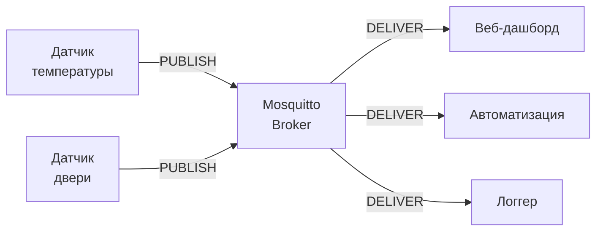

# Уровень 0: Введение в MQTT

## Что такое MQTT и зачем он нужен

Представь почту с доской объявлений. Отправитель прикрепляет записку с темой ("погода/улица"), и все, кто подписан на эту тему, её получают — не зная друг о друге. Это и есть MQTT.

**MQTT** (Message Queuing Telemetry Transport) — это лёгкий протокол передачи сообщений для устройств с ограниченными ресурсами. Разработан IBM в 1999 году для мониторинга нефтепроводов через спутниковые каналы с высокой задержкой и малой пропускной способностью.

Сегодня MQTT — стандарт де-факто для IoT (умный дом, промышленная автоматизация, телематика).



---

## Модель pub/sub

MQTT использует паттерн **publish/subscribe** — в отличие от HTTP, где клиент сам запрашивает данные.

| Роль | Что делает |
|------|-----------|
| **Publisher** | Публикует сообщение в топик |
| **Broker** | Маршрутизирует сообщения от publishers к subscribers |
| **Subscriber** | Подписывается на топики и получает сообщения |

💡 Ключевой момент: publisher не знает, кто получит сообщение. Subscriber не знает, кто его отправил. Брокер — единственный посредник.

---

## Структура MQTT-сообщения

```
MQTT packet = Fixed Header (2 байта) + Variable Header + Payload

Минимальный пакет PUBLISH:
  [0x30] [длина] [длина топика] [топик] [payload]

Пример:
  topic:   "home/sensor/temperature"
  payload: "23.5"
  QoS:     0
  retain:  false
```

📌 Размер фиксированного заголовка — **всего 2 байта**. Для сравнения, HTTP-заголовки занимают 200–800 байт.

---

## Топики и иерархия

Топик — это строка, разделённая слэшами, как путь в файловой системе:

```
home/living_room/temperature
home/living_room/humidity
home/bedroom/light/status
factory/line1/machine3/rpm
```

Wildcards при подписке:
- `+` — один уровень: `home/+/temperature` матчит `home/bedroom/temperature`
- `#` — все уровни ниже: `home/#` матчит всё внутри `home/`

---

## MQTT vs другие протоколы

| Критерий | MQTT | HTTP | WebSocket | AMQP |
|---------|------|------|-----------|------|
| Overhead | 2 байта | 200–800 байт | Малый (после handshake) | Средний |
| Push от сервера | ✅ да | ❌ только polling | ✅ да | ✅ да |
| Нужен брокер | ✅ да | ❌ нет | ❌ нет | ✅ да |
| QoS | 3 уровня | ❌ нет | ❌ нет | ACK/транзакции |
| IoT-пригодность | ⭐⭐⭐⭐⭐ | ⭐⭐⭐ | ⭐⭐⭐⭐ | ⭐⭐ |

---

## Версии протокола

- **MQTT 3.1.1** (2014) — самая распространённая версия, поддерживается всеми устройствами
- **MQTT 5.0** (2019) — добавляет: properties (метаданные), reason codes, session expiry, shared subscriptions, request/response pattern

Mosquitto 2.x поддерживает оба протокола одновременно.

---

## ⚠️ Частые ошибки новичков

**❌ Думать, что MQTT = очередь задач**
```
# Неверное понимание: "брокер хранит все сообщения"
# На самом деле: без retain flag сообщения не хранятся!
```
✅ Брокер — маршрутизатор, а не постоянное хранилище. Retained message = только одно последнее значение.

**❌ Топики начинать со слэша**
```
# Плохо:
/home/sensor/temperature

# Хорошо:
home/sensor/temperature
```
✅ Ведущий слэш создаёт пустой первый уровень — избыточно и ломает стандартные wildcards.
