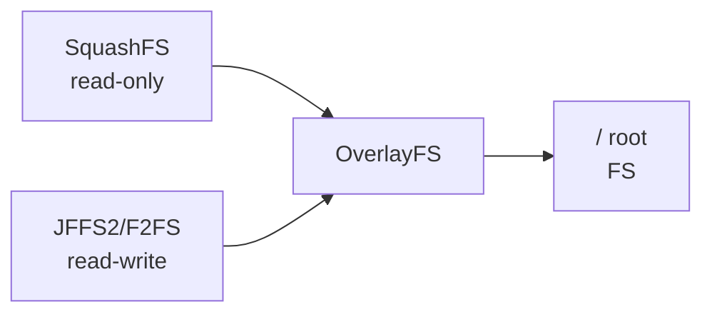

# Level 1: Installing Mosquitto on OpenWRT — Detailed Theory

## OpenWRT Architecture

OpenWRT is a full Linux distribution on a router. Understanding the architecture helps avoid installation errors.

### File System



OpenWRT uses an **overlay filesystem**: the base system is stored in read-only SquashFS (compressed, doesn't wear out flash). All changes are written to the JFFS2/F2FS partition (read-write). Together they mount as a normal filesystem.

**Important consequence:** `/tmp` is tmpfs in RAM. Data in `/tmp` disappears on reboot. Mosquitto logs and PID files live exactly there.

### Typical Router Resource Limits

| Resource | Typical Router (2023) | Raspberry Pi 4 |
|--------|----------------------|----------------|
| Flash | 4–16 MB | 32+ GB |
| RAM | 64–256 MB | 4–8 GB |
| CPU | MIPS/ARM 580–1400 MHz | ARM 64-bit 1.8 GHz |
| Network | 100M–1Gbit | 1Gbit |

Mosquitto is designed for these constraints: its RAM consumption under normal load is **5–15 MB**.

---

## opkg — Package Manager

### How It Works

opkg downloads package lists from repositories and installs `.ipk` files (analog of `.deb`/`.rpm` for embedded systems).

```bash
# View available repositories
cat /etc/opkg/distfeeds.conf

# Typical contents:
# src/gz openwrt_core https://downloads.openwrt.org/releases/23.05.3/targets/...
# src/gz openwrt_base https://downloads.openwrt.org/releases/23.05.3/packages/mipsel_24kc/base
# src/gz openwrt_packages https://downloads.openwrt.org/releases/23.05.3/packages/mipsel_24kc/packages
```

### Useful opkg Commands

```bash
# Update package list (needed after every reboot)
opkg update

# Find a package
opkg find "mosquitto*"

# View package info
opkg info mosquitto-nossl

# What's installed from mosquitto
opkg list-installed | grep mosquitto

# What files a package contains
opkg files mosquitto-nossl

# Remove a package
opkg remove mosquitto-nossl

# Upgrade a specific package
opkg upgrade mosquitto-nossl
```

---

## Full Installation Process

### Step 1: Update and Install

```bash
# Update the package index
opkg update

# Install the broker (version without TLS)
opkg install mosquitto-nossl

# Install CLI clients
opkg install mosquitto-client-nossl

# Check installed versions
mosquitto --version
mosquitto_pub --version
```

Expected output:
```
mosquitto version 2.0.18
libmosquitto version 2.0.18
```

### Step 2: Initial Config Setup

After installation, check the default config:

```bash
cat /etc/mosquitto/mosquitto.conf
```

By default Mosquitto 2.x **does not allow anonymous connections**. This changed in version 2.0: you now need to explicitly allow or configure authentication.

```bash
# Minimal working config to get started
cat > /etc/mosquitto/mosquitto.conf << 'EOF'
pid_file /var/run/mosquitto.pid
persistence false
log_dest syslog
log_type error
log_type warning
log_type notice

listener 1883
allow_anonymous true
EOF
```

### Step 3: Start and Auto-Start

```bash
# Enable auto-start on boot (creates symlink in /etc/rc.d/)
/etc/init.d/mosquitto enable

# Start the service now
/etc/init.d/mosquitto start

# Check status
/etc/init.d/mosquitto status
```

---

## Detailed File Structure Breakdown

### /etc/mosquitto/mosquitto.conf

Main configuration file. Syntax: `key value` (no = sign).

```ini
# This is a comment
# Key and value are separated by a space
log_dest syslog
listener 1883

# Empty lines are ignored
# You can include other config files:
include_dir /etc/mosquitto/conf.d
```

### /etc/mosquitto/passwd

Created by the `mosquitto_passwd` utility, contains hashed passwords:

```bash
# Create a password file and add the first user
mosquitto_passwd -c /etc/mosquitto/passwd admin

# Add a user to an existing file
mosquitto_passwd /etc/mosquitto/passwd sensor01

# Change a password
mosquitto_passwd /etc/mosquitto/passwd admin

# Remove a user
mosquitto_passwd -D /etc/mosquitto/passwd old_user
```

File format (PBKDF2-SHA512):
```
admin:$7$101$abc...xyz$hashedpassword=
sensor01:$7$101$def...uvw$hashedpassword=
```

⚠️ Never edit passwd manually — use only mosquitto_passwd.

### /var/run/mosquitto.pid

Created by the broker on startup, contains the PID. Used by the init script to stop the process:

```bash
cat /var/run/mosquitto.pid  # → 1847
kill -SIGHUP $(cat /var/run/mosquitto.pid)  # reload config without restart
```

### /var/lib/mosquitto/ (persistence)

Appears only when `persistence true`. Contains:
- `mosquitto.db` — retained messages and QoS 1/2 queues

On OpenWRT it's recommended to use `/tmp/mosquitto/` (tmpfs) instead of `/var/lib/mosquitto/` to avoid wearing out flash.

---

## Diagnosing Installation Problems

### Mosquitto Won't Start

```bash
# View detailed startup logs
mosquitto -c /etc/mosquitto/mosquitto.conf -v

# Typical errors:
# Error: Unable to open log file ... - no permissions or directory
# Error: Address already in use - port 1883 busy by another process
# Error: Invalid line in configuration - syntax error in config
```

### Port Busy by Another Process

```bash
# Who's listening on port 1883?
netstat -tlnp | grep 1883
# or
lsof -i :1883

# If port is busy by another mosquitto instance:
kill $(cat /var/run/mosquitto.pid)
/etc/init.d/mosquitto start
```

### No Response from the Broker

```bash
# Ping the broker via MQTT (should get CONNACK)
mosquitto_pub -h 127.0.0.1 -t "test" -m "ping" -d

# The -d flag (debug) shows connection details:
# Client (null) sending CONNECT
# Client (null) received CONNACK (0)   ← 0 = success
# Client (null) sending PUBLISH ...
# Client (null) sending DISCONNECT
```

---

## Updating Mosquitto

Mosquitto 2.x periodically updates in OpenWRT repositories. To update:

```bash
opkg update
opkg upgrade mosquitto-nossl mosquitto-client-nossl

# Restart after update
/etc/init.d/mosquitto restart
```

⚠️ Mosquitto 2.0+ is incompatible with 1.x configuration: `bind_address` and `port` parameters no longer work at the top level — use `listener` instead.

### Major Changes in Mosquitto 2.0

| Parameter | v1.x | v2.x |
|---------|------|------|
| Anonymous access | Allowed by default | Denied by default |
| `bind_address` | Global | Only under `listener` |
| `port` | Global | Only under `listener` |
| `cafile`, `certfile` | Global | Only under `listener` |

Typical migration config from v1 to v2:

```ini
# v1.x config (WILL BREAK in v2):
port 1883
bind_address 192.168.1.1
allow_anonymous true

# v2.x config (correct):
listener 1883 192.168.1.1
allow_anonymous true
```

---

## Automating Installation via UCI/LuCI

OpenWRT supports configuration through UCI (Unified Configuration Interface):

```bash
# View mosquitto config via UCI
uci show mosquitto

# Change a parameter via UCI
uci set mosquitto.@mosquitto[0].enabled=1
uci commit mosquitto
/etc/init.d/mosquitto restart
```

Via LuCI (OpenWRT web interface), management is available at: Services → Mosquitto MQTT Broker.

---

## Resource Consumption

Benchmark on a router with 128 MB RAM, 100 connected clients:

| Parameter | Value |
|---------|---------|
| RAM (idle) | ~3 MB |
| RAM (100 clients) | ~8–12 MB |
| CPU (100 msg/sec) | ~2–5% |
| CPU (1000 msg/sec) | ~15–25% |

For most home automation scenarios (10–50 devices, infrequent messages), Mosquitto consumes less than **5 MB RAM**.
