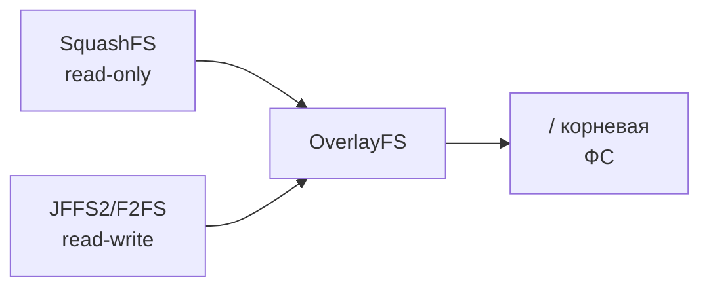

# Уровень 1: Установка Mosquitto на OpenWRT — Подробная теория

## Архитектура OpenWRT

OpenWRT — это полноценный Linux на маршрутизаторе. Понимание архитектуры помогает избежать ошибок при установке.

### Файловая система



OpenWRT использует **overlay filesystem**: базовая система хранится в read-only SquashFS (сжатая, не изнашивает flash). Все изменения записываются в JFFS2/F2FS раздел (read-write). Вместе они монтируются как обычная ФС.

**Важное следствие:** `/tmp` — это tmpfs в оперативной памяти. Данные в `/tmp` исчезают при перезагрузке. Logи и pid-файлы Mosquitto живут именно там.

### Ограничения ресурсов типичного роутера

| Ресурс | Типичный роутер (2023) | Raspberry Pi 4 |
|--------|----------------------|----------------|
| Flash | 4–16 МБ | 32+ ГБ |
| RAM | 64–256 МБ | 4–8 ГБ |
| CPU | MIPS/ARM 580–1400 МГц | ARM 64-bit 1.8 ГГц |
| Сеть | 100M–1Gbit | 1Gbit |

Mosquitto спроектирован для подобных ограничений: его потребление RAM при нормальной нагрузке — **5–15 МБ**.

---

## opkg — пакетный менеджер

### Принципы работы

opkg скачивает список пакетов из репозиториев и устанавливает `.ipk` файлы (аналог `.deb`/`.rpm` для встраиваемых систем).

```bash
# Посмотреть доступные репозитории
cat /etc/opkg/distfeeds.conf

# Типичное содержимое:
# src/gz openwrt_core https://downloads.openwrt.org/releases/23.05.3/targets/...
# src/gz openwrt_base https://downloads.openwrt.org/releases/23.05.3/packages/mipsel_24kc/base
# src/gz openwrt_packages https://downloads.openwrt.org/releases/23.05.3/packages/mipsel_24kc/packages
```

### Полезные команды opkg

```bash
# Обновить список пакетов (нужно после каждой перезагрузки)
opkg update

# Найти пакет
opkg find "mosquitto*"

# Посмотреть информацию о пакете
opkg info mosquitto-nossl

# Что установлено из mosquitto
opkg list-installed | grep mosquitto

# Какие файлы содержит пакет
opkg files mosquitto-nossl

# Удалить пакет
opkg remove mosquitto-nossl

# Обновить конкретный пакет
opkg upgrade mosquitto-nossl
```

---

## Полный процесс установки

### Шаг 1: Обновление и установка

```bash
# Обновляем индекс пакетов
opkg update

# Устанавливаем брокер (версия без TLS)
opkg install mosquitto-nossl

# Устанавливаем CLI-клиенты
opkg install mosquitto-client-nossl

# Проверяем установленные версии
mosquitto --version
mosquitto_pub --version
```

Ожидаемый вывод:
```
mosquitto version 2.0.18
libmosquitto version 2.0.18
```

### Шаг 2: Первичная настройка конфига

После установки смотрим дефолтный конфиг:

```bash
cat /etc/mosquitto/mosquitto.conf
```

По умолчанию Mosquitto 2.x **не разрешает анонимные подключения**. Это поменялось в версии 2.0: теперь нужно явно разрешить или настроить аутентификацию.

```bash
# Минимальный рабочий конфиг для начала работы
cat > /etc/mosquitto/mosquitto.conf << 'EOF'
pid_file /var/run/mosquitto.pid
persistence false
log_dest syslog
log_type error
log_type warning
log_type notice

listener 1883
allow_anonymous true
EOF
```

### Шаг 3: Запуск и автозапуск

```bash
# Включить автозапуск при загрузке (создаёт симлинк в /etc/rc.d/)
/etc/init.d/mosquitto enable

# Запустить сервис сейчас
/etc/init.d/mosquitto start

# Проверить статус
/etc/init.d/mosquitto status
```

---

## Детальный разбор файловой структуры

### /etc/mosquitto/mosquitto.conf

Главный файл конфигурации. Синтаксис: `ключ значение` (без знака =).

```ini
# Это комментарий
# Ключ и значение разделяются пробелом
log_dest syslog
listener 1883

# Пустые строки игнорируются
# Можно include другие файлы конфига:
include_dir /etc/mosquitto/conf.d
```

### /etc/mosquitto/passwd

Создаётся утилитой `mosquitto_passwd`, содержит хешированные пароли:

```bash
# Создать файл паролей и добавить первого пользователя
mosquitto_passwd -c /etc/mosquitto/passwd admin

# Добавить пользователя в существующий файл
mosquitto_passwd /etc/mosquitto/passwd sensor01

# Изменить пароль
mosquitto_passwd /etc/mosquitto/passwd admin

# Удалить пользователя
mosquitto_passwd -D /etc/mosquitto/passwd old_user
```

Формат файла (PBKDF2-SHA512):
```
admin:$7$101$abc...xyz$hashedpassword=
sensor01:$7$101$def...uvw$hashedpassword=
```

⚠️ Никогда не редактируй passwd вручную — используй только mosquitto_passwd.

### /var/run/mosquitto.pid

Создаётся брокером при запуске, содержит PID. Используется init-скриптом для остановки процесса:

```bash
cat /var/run/mosquitto.pid  # → 1847
kill -SIGHUP $(cat /var/run/mosquitto.pid)  # reload конфига без перезапуска
```

### /var/lib/mosquitto/ (persistence)

Появляется только при `persistence true`. Содержит:
- `mosquitto.db` — retained messages и QoS 1/2 очереди

На OpenWRT рекомендуется использовать `/tmp/mosquitto/` (tmpfs) вместо `/var/lib/mosquitto/` чтобы не изнашивать flash.

---

## Диагностика проблем установки

### Mosquitto не стартует

```bash
# Смотреть подробные логи старта
mosquitto -c /etc/mosquitto/mosquitto.conf -v

# Типичные ошибки:
# Error: Unable to open log file ... - нет прав или директории
# Error: Address already in use - порт 1883 занят другим процессом
# Error: Invalid line in configuration - синтаксическая ошибка в конфиге
```

### Порт занят другим процессом

```bash
# Кто слушает порт 1883?
netstat -tlnp | grep 1883
# или
lsof -i :1883

# Если порт занят другим экземпляром mosquitto:
kill $(cat /var/run/mosquitto.pid)
/etc/init.d/mosquitto start
```

### Нет ответа от брокера

```bash
# Пинг брокера через MQTT (должен получить CONNACK)
mosquitto_pub -h 127.0.0.1 -t "test" -m "ping" -d

# Флаг -d (debug) показывает детали подключения:
# Client (null) sending CONNECT
# Client (null) received CONNACK (0)   ← 0 = успех
# Client (null) sending PUBLISH ...
# Client (null) sending DISCONNECT
```

---

## Обновление Mosquitto

Mosquitto 2.x периодически выходит в репозиториях OpenWRT. Для обновления:

```bash
opkg update
opkg upgrade mosquitto-nossl mosquitto-client-nossl

# Перезапустить после обновления
/etc/init.d/mosquitto restart
```

⚠️ Mosquitto 2.0+ несовместим по конфигурации с 1.x: параметры `bind_address` и `port` больше не работают на верхнем уровне — используй `listener`.

### Основные изменения Mosquitto 2.0

| Параметр | v1.x | v2.x |
|---------|------|------|
| Анонимный доступ | Разрешён по умолчанию | Запрещён по умолчанию |
| `bind_address` | Глобальный | Только под `listener` |
| `port` | Глобальный | Только под `listener` |
| `cafile`, `certfile` | Глобальные | Только под `listener` |

Типичный конфиг миграции с v1 на v2:

```ini
# v1.x конфиг (СЛОМАЕТСЯ в v2):
port 1883
bind_address 192.168.1.1
allow_anonymous true

# v2.x конфиг (правильно):
listener 1883 192.168.1.1
allow_anonymous true
```

---

## Автоматизация установки через UCI/LuCI

OpenWRT поддерживает конфигурацию через UCI (Unified Configuration Interface):

```bash
# Посмотреть конфиг mosquitto через UCI
uci show mosquitto

# Изменить параметр через UCI
uci set mosquitto.@mosquitto[0].enabled=1
uci commit mosquitto
/etc/init.d/mosquitto restart
```

Через LuCI (веб-интерфейс OpenWRT) доступна управление через: Services → Mosquitto MQTT Broker.

---

## Потребление ресурсов

Benchmark на роутере с 128 МБ RAM, 100 подключённых клиентов:

| Параметр | Значение |
|---------|---------|
| RAM (idle) | ~3 МБ |
| RAM (100 клиентов) | ~8–12 МБ |
| CPU (100 msg/sec) | ~2–5% |
| CPU (1000 msg/sec) | ~15–25% |

Для большинства home automation сценариев (10–50 устройств, редкие сообщения) Mosquitto потребляет менее **5 МБ RAM**.
