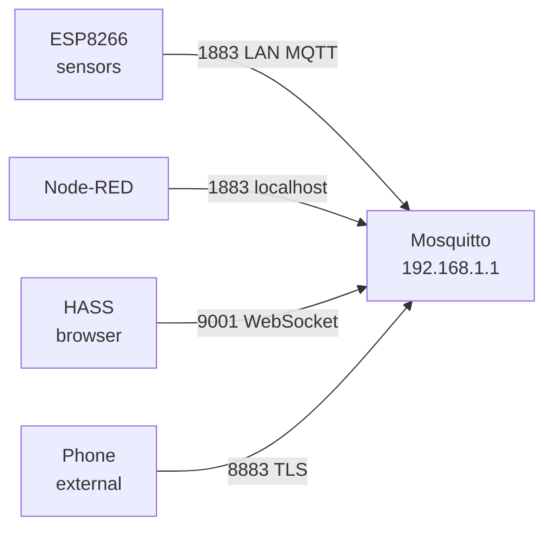

# Level 2: Basic Mosquitto Configuration — Detailed Theory

## Mosquitto 2.x Configuration System

### Configuration File Syntax

```ini
# Comment (starts with #)

# Simple value
pid_file /var/run/mosquitto.pid

# Boolean values: true/false
persistence false
log_timestamp true

# Numeric values
max_connections 100
listener 1883

# Value with address on one line
listener 1883 192.168.1.1

# include directive — for config modularity
include_dir /etc/mosquitto/conf.d
```

Important rules:
- Separator: **space** (not `=`)
- Quotes: only if the value contains spaces
- `#` in the middle of a line — this is a comment
- Order matters: parameters after `listener` apply to it

### Listener Context in v2.x

Mosquitto 2.x introduced an important change: security parameters became **per-listener**. This is a powerful model allowing different policies on different ports.

```ini
# Global parameters (apply before the first listener)
pid_file /var/run/mosquitto.pid
persistence false

# === Listener 1: local MQTT without authentication ===
listener 1883 127.0.0.1
allow_anonymous true    # local processes only

# === Listener 2: LAN MQTT with passwords ===
listener 1883 192.168.1.1
allow_anonymous false
password_file /etc/mosquitto/passwd
acl_file /etc/mosquitto/acl

# === Listener 3: TLS for external ===
listener 8883 0.0.0.0
allow_anonymous false
password_file /etc/mosquitto/passwd
cafile /etc/mosquitto/certs/ca.crt
certfile /etc/mosquitto/certs/server.crt
keyfile /etc/mosquitto/certs/server.key
```

---

## Detailed Parameter Reference

### Group: Network Connections

**`listener [port] [bind_address]`**

Defines the port and optionally the IP address to listen on. If bind_address is not specified — listens on all interfaces (`0.0.0.0`).

```ini
listener 1883              # all interfaces, port 1883
listener 1883 127.0.0.1    # loopback only
listener 1883 192.168.1.1  # LAN only
listener 8883              # TLS port on all interfaces
```

**`max_connections [-1 | number]`**

```ini
max_connections -1   # no limit (default)
max_connections 50   # max 50 simultaneous clients
```

On a router with 64 MB RAM and ~150 KB per client, the limit is recommended to be ~50–200.

**`max_inflight_messages [0 | number]`**

Maximum number of QoS 1/2 messages "in flight" (sent but not confirmed) per client:

```ini
max_inflight_messages 0   # no limit (default: 20)
max_inflight_messages 10  # limit for IoT router
```

**`max_queued_messages [0 | number]`**

Queue length for temporarily disconnected clients (persistent session, QoS > 0):

```ini
max_queued_messages 1000  # default
max_queued_messages 100   # save RAM on router
max_queued_messages 0     # no limit
```

**`message_size_limit [bytes]`**

```ini
message_size_limit 0       # MQTT spec limit: 256 MB (default)
message_size_limit 65536   # 64 KB — reasonable limit for IoT
message_size_limit 1048576 # 1 MB
```

**`keepalive_interval [seconds]`**

Maximum interval after which the client must send a PINGREQ:

```ini
keepalive_interval 60   # default
keepalive_interval 30   # more aggressive disconnect detection
keepalive_interval 0    # disable keepalive
```

### Group: Persistence

**`persistence [true|false]`**

Enables saving retained messages and QoS 1/2 queues to a file:

```ini
persistence false  # default in OpenWRT package
persistence true
```

**Pitfalls of persistence on OpenWRT:**

1. By default writes to `/var/lib/mosquitto/` — this is overlay FS stored on flash
2. With high frequency of retained messages, flash wears out (limited write cycles)
3. Size of mosquitto.db depends on the number of retained messages and QoS queues

```ini
# Safe variant: tmpfs (data lost on reboot)
persistence true
persistence_location /tmp/mosquitto/
persistence_file mosquitto.db

# If you need to persist data — external USB
persistence true
persistence_location /mnt/usb/mosquitto/
```

**`autosave_interval [seconds]`**

How often to write to disk in the background:

```ini
autosave_interval 1800  # every 30 minutes (default)
autosave_interval 0     # only on shutdown
```

### Group: Security (basic)

**`allow_anonymous [true|false]`**

In Mosquitto 2.0 the default changed from `true` to `false`:

```ini
allow_anonymous false  # v2.0+ default
allow_anonymous true   # explicitly allow (for development)
```

**`password_file [path]`**

```ini
password_file /etc/mosquitto/passwd
```

Creating users:
```bash
# Create a new file + add first user
mosquitto_passwd -c /etc/mosquitto/passwd admin

# Add user to existing file
mosquitto_passwd /etc/mosquitto/passwd sensor01

# Batch creation (batch mode)
echo "sensor01:password123" | mosquitto_passwd -U /etc/mosquitto/passwd
```

**`acl_file [path]`**

```ini
acl_file /etc/mosquitto/acl
```

Example ACL file:
```
# User admin: full access
user admin
topic readwrite #

# User sensor01: publish only their own data
user sensor01
topic write home/sensor/sensor01/#
topic read home/sensor/sensor01/config

# Pattern with substitution %u (username)
pattern write devices/%u/telemetry
pattern read devices/%u/commands
```

---

## Listeners — Multi-Port Architecture

### Typical Smart Home Configuration



```ini
pid_file /var/run/mosquitto.pid
persistence false
log_dest syslog
log_type error
log_type warning
log_type notice

# 1. Localhost — for local scripts (no passwords)
listener 1883 127.0.0.1
protocol mqtt
allow_anonymous true

# 2. LAN — for smart devices (with passwords)
listener 1883 192.168.1.1
protocol mqtt
allow_anonymous false
password_file /etc/mosquitto/passwd
acl_file /etc/mosquitto/acl

# 3. WebSocket — for browser clients
listener 9001 192.168.1.1
protocol websockets
allow_anonymous false
password_file /etc/mosquitto/passwd
```

### Binding to a Specific Interface

An OpenWRT router typically has at least two interfaces: LAN (`br-lan`, usually 192.168.1.1) and WAN (public IP). Binding the broker to the WAN interface without TLS is a critical security error.

```bash
# Check interface IPs
ip addr show

# Example: br-lan = 192.168.1.1, eth0.2 = 88.xx.xx.xx (WAN)
# Correct: listen only on LAN
listener 1883 192.168.1.1
```

---

## Logging Configuration — In Detail

### All Available log_dest Options

```ini
# System log (recommended for OpenWRT)
log_dest syslog

# Standard output (when running manually for debugging)
log_dest stdout

# File (better in tmpfs)
log_dest file /tmp/mosquitto.log

# Multiple destinations simultaneously
log_dest syslog
log_dest file /tmp/mosquitto.log

# Publishing logs to an MQTT topic (interesting approach for monitoring)
log_dest topic
# Topics: $SYS/broker/log/D, /I, /N, /W, /E (debug/info/notice/warn/err)
```

### File Log Rotation

Mosquitto doesn't rotate logs automatically. On OpenWRT you can use `logrotate` or a simpler solution:

```bash
# /etc/cron.d/mosquitto-logrotate
# Rotate daily if file > 1 MB
0 3 * * * [ -f /tmp/mosquitto.log ] && [ $(wc -c < /tmp/mosquitto.log) -gt 1048576 ] && \
  kill -USR1 $(cat /var/run/mosquitto.pid) && \
  mv /tmp/mosquitto.log /tmp/mosquitto.log.1
```

Mosquitto supports `SIGUSR1` for reopening the log file (without restart).

### What Each Level Shows

**notice** (recommended for production):
```
1712345678: mosquitto version 2.0.18 starting
1712345678: Config loaded from /etc/mosquitto/mosquitto.conf
1712345678: Opening ipv4 listen socket on port 1883.
1712345678: New connection from 192.168.1.100 on port 1883.
1712345678: New client connected from 192.168.1.100 as sensor01 (p2, c1, k60).
1712345678: Client sensor01 disconnected.
```

**debug** (for temporary diagnostics):
```
1712345678: Received CONNECT from sensor01
1712345678: Creating persistence database at /tmp/mosquitto/mosquitto.db
1712345678: socket error on client sensor01, disconnecting.
```

---

## Reloading Config Without Restart

Mosquitto supports `SIGHUP` for reloading the config:

```bash
# Reload config (without dropping existing connections)
kill -HUP $(cat /var/run/mosquitto.pid)

# Verify reload was successful
logread | grep mosquitto | tail -5
# Should show: "Reloading config."
```

**What IS reloaded on SIGHUP:**
- `log_type`, `log_dest`
- `password_file`, `acl_file`
- `allow_anonymous`

**What is NOT reloaded (requires full restart):**
- `listener` parameters
- `persistence` settings
- TLS certificates (in some versions)

---

## Full Production Config for OpenWRT

```ini
# /etc/mosquitto/mosquitto.conf
# Version: production, OpenWRT 23.05, Mosquitto 2.0.18

# === System settings ===
pid_file /var/run/mosquitto.pid
user mosquitto

# === Persistence — tmpfs to protect flash ===
persistence true
persistence_location /tmp/mosquitto/
persistence_file mosquitto.db
autosave_interval 1800

# === Logging ===
log_dest syslog
log_type error
log_type warning
log_type notice
log_timestamp true
log_timestamp_format %Y-%m-%dT%H:%M:%S

# === Listener: LAN MQTT ===
listener 1883 192.168.1.1
protocol mqtt
allow_anonymous false
password_file /etc/mosquitto/passwd
acl_file /etc/mosquitto/acl
max_connections 100
message_size_limit 65536
```

---

## ⚠️ Common Mistakes and How to Fix Them

### ❌ Security parameters outside listener context

```ini
# WRONG in Mosquitto 2.x:
allow_anonymous false
password_file /etc/mosquitto/passwd
listener 1883
```

Problem: Mosquitto 2.x ignores `allow_anonymous false` at the global level in some builds.

```ini
# CORRECT:
listener 1883
allow_anonymous false
password_file /etc/mosquitto/passwd
```

### ❌ Wrong persistence path on flash

```ini
# WRONG — wears out flash memory:
persistence true
persistence_location /var/lib/mosquitto/

# CORRECT — tmpfs in RAM:
persistence true
persistence_location /tmp/mosquitto/
```

```bash
# Create the directory (if it doesn't exist):
mkdir -p /tmp/mosquitto
chown mosquitto:mosquitto /tmp/mosquitto
```

### ❌ Forgetting to restart after changing listener

```bash
# Changed listener port in config
kill -HUP $(cat /var/run/mosquitto.pid)  # Will NOT apply listener change!

# Instead:
/etc/init.d/mosquitto restart
```

### ❌ Space before = in config

```ini
# WRONG (syntax error):
log_dest = syslog
persistence = false

# CORRECT:
log_dest syslog
persistence false
```

Mosquitto will report the error:
```
Error: Invalid configuration option "log_dest = syslog"
```
