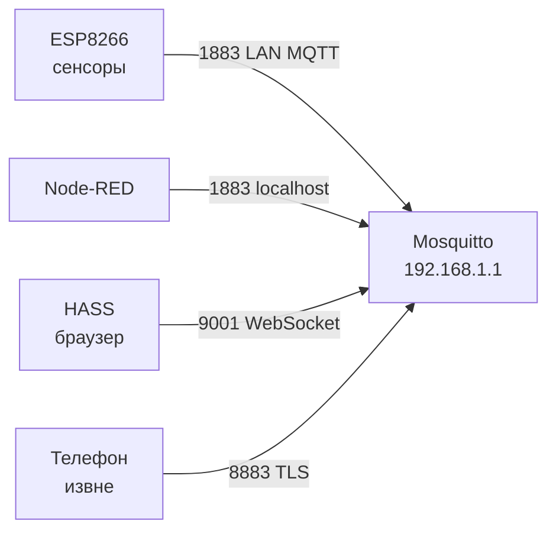

# Уровень 2: Базовая конфигурация Mosquitto — Подробная теория

## Система конфигурации Mosquitto 2.x

### Синтаксис конфигурационного файла

```ini
# Комментарий (начинается с #)

# Простое значение
pid_file /var/run/mosquitto.pid

# Булевы значения: true/false
persistence false
log_timestamp true

# Числовые значения
max_connections 100
listener 1883

# Значение с адресом в одной строке
listener 1883 192.168.1.1

# include директива — для модульности конфига
include_dir /etc/mosquitto/conf.d
```

Важные правила:
- Разделитель: **пробел** (не `=`)
- Кавычки: только если значение содержит пробелы
- `#` в середине строки — это комментарий
- Порядок имеет значение: параметры после `listener` применяются к нему

### Контекст listener в v2.x

В Mosquitto 2.x введено важное изменение: параметры безопасности стали **per-listener**. Это мощная модель, позволяющая иметь разные политики на разных портах.

```ini
# Глобальные параметры (применяются до первого listener)
pid_file /var/run/mosquitto.pid
persistence false

# === Listener 1: локальный MQTT без аутентификации ===
listener 1883 127.0.0.1
allow_anonymous true    # только локальные процессы

# === Listener 2: LAN MQTT с паролями ===
listener 1883 192.168.1.1
allow_anonymous false
password_file /etc/mosquitto/passwd
acl_file /etc/mosquitto/acl

# === Listener 3: TLS для внешних ===
listener 8883 0.0.0.0
allow_anonymous false
password_file /etc/mosquitto/passwd
cafile /etc/mosquitto/certs/ca.crt
certfile /etc/mosquitto/certs/server.crt
keyfile /etc/mosquitto/certs/server.key
```

---

## Подробный справочник параметров

### Группа: Сетевые соединения

**`listener [port] [bind_address]`**

Определяет порт и опционально IP-адрес для прослушивания. Если bind_address не указан — слушает на всех интерфейсах (`0.0.0.0`).

```ini
listener 1883              # все интерфейсы, порт 1883
listener 1883 127.0.0.1    # только loopback
listener 1883 192.168.1.1  # только LAN
listener 8883              # TLS порт на всех интерфейсах
```

**`max_connections [-1 | число]`**

```ini
max_connections -1   # без ограничений (по умолчанию)
max_connections 50   # максимум 50 одновременных клиентов
```

На роутере с 64 МБ RAM и ~150 KB per client лимит рекомендуется ставить ~50–200.

**`max_inflight_messages [0 | число]`**

Максимальное число QoS 1/2 сообщений в "полёте" (отправлены, но не подтверждены) для одного клиента:

```ini
max_inflight_messages 0   # без лимита (по умолчанию: 20)
max_inflight_messages 10  # ограничить для IoT-роутера
```

**`max_queued_messages [0 | число]`**

Длина очереди для клиентов, временно отключённых (persistent session, QoS > 0):

```ini
max_queued_messages 1000  # по умолчанию
max_queued_messages 100   # экономия RAM на роутере
max_queued_messages 0     # без ограничений
```

**`message_size_limit [число_байт]`**

```ini
message_size_limit 0       # MQTT spec limit: 256 МБ (по умолчанию)
message_size_limit 65536   # 64 КБ — разумный лимит для IoT
message_size_limit 1048576 # 1 МБ
```

**`keepalive_interval [секунды]`**

Максимальный интервал, через который клиент должен прислать PINGREQ:

```ini
keepalive_interval 60   # по умолчанию
keepalive_interval 30   # агрессивнее обнаружение отключений
keepalive_interval 0    # отключить keepalive
```

### Группа: Persistence

**`persistence [true|false]`**

Включает сохранение retained messages и QoS 1/2 очередей в файл:

```ini
persistence false  # по умолчанию в OpenWRT пакете
persistence true
```

**Подводные камни persistence на OpenWRT:**

1. По умолчанию пишет в `/var/lib/mosquitto/` — это overlay FS, которая хранится на flash
2. При высокой частоте retained-сообщений flash изнашивается (ограниченный ресурс перезаписи)
3. Размер mosquitto.db зависит от количества retained messages и QoS-очередей

```ini
# Безопасный вариант: tmpfs (данные теряются при перезагрузке)
persistence true
persistence_location /tmp/mosquitto/
persistence_file mosquitto.db

# Если нужно сохранять данные — внешний USB
persistence true
persistence_location /mnt/usb/mosquitto/
```

**`autosave_interval [секунды]`**

Как часто писать на диск в фоне:

```ini
autosave_interval 1800  # каждые 30 минут (по умолчанию)
autosave_interval 0     # только при останове
```

### Группа: Безопасность (базовая)

**`allow_anonymous [true|false]`**

В Mosquitto 2.0 значение по умолчанию изменилось с `true` на `false`:

```ini
allow_anonymous false  # v2.0+ default
allow_anonymous true   # явно разрешить (для разработки)
```

**`password_file [путь]`**

```ini
password_file /etc/mosquitto/passwd
```

Создание пользователей:
```bash
# Создать новый файл + добавить первого пользователя
mosquitto_passwd -c /etc/mosquitto/passwd admin

# Добавить пользователя в существующий файл
mosquitto_passwd /etc/mosquitto/passwd sensor01

# Пакетное создание (batch mode)
echo "sensor01:password123" | mosquitto_passwd -U /etc/mosquitto/passwd
```

**`acl_file [путь]`**

```ini
acl_file /etc/mosquitto/acl
```

Пример ACL-файла:
```
# Пользователь admin: полный доступ
user admin
topic readwrite #

# Пользователь sensor01: только публикация своих данных
user sensor01
topic write home/sensor/sensor01/#
topic read home/sensor/sensor01/config

# Паттерн с подстановкой %u (имя пользователя)
pattern write devices/%u/telemetry
pattern read devices/%u/commands
```

---

## Listeners — архитектура с несколькими портами

### Типичная конфигурация для умного дома



```ini
pid_file /var/run/mosquitto.pid
persistence false
log_dest syslog
log_type error
log_type warning
log_type notice

# 1. Localhost — для локальных скриптов (без паролей)
listener 1883 127.0.0.1
protocol mqtt
allow_anonymous true

# 2. LAN — для умных устройств (с паролями)
listener 1883 192.168.1.1
protocol mqtt
allow_anonymous false
password_file /etc/mosquitto/passwd
acl_file /etc/mosquitto/acl

# 3. WebSocket — для браузерных клиентов
listener 9001 192.168.1.1
protocol websockets
allow_anonymous false
password_file /etc/mosquitto/passwd
```

### Привязка к конкретному интерфейсу

OpenWRT роутер обычно имеет как минимум два интерфейса: LAN (`br-lan`, обычно 192.168.1.1) и WAN (публичный IP). Привязывать брокер к WAN-интерфейсу без TLS — критическая ошибка безопасности.

```bash
# Узнать IP интерфейсов
ip addr show

# Пример: br-lan = 192.168.1.1, eth0.2 = 88.xx.xx.xx (WAN)
# Правильно: слушать только на LAN
listener 1883 192.168.1.1
```

---

## Настройка логирования — детально

### Все доступные log_dest

```ini
# Системный журнал (рекомендуется для OpenWRT)
log_dest syslog

# Стандартный вывод (если запускать вручную для отладки)
log_dest stdout

# Файл (лучше в tmpfs)
log_dest file /tmp/mosquitto.log

# Несколько назначений одновременно
log_dest syslog
log_dest file /tmp/mosquitto.log

# Публикация логов в MQTT-топик (интересный подход для мониторинга)
log_dest topic
# Топики: $SYS/broker/log/D, /I, /N, /W, /E (debug/info/notice/warn/err)
```

### Ротация файловых логов

Mosquitto не ротирует логи автоматически. На OpenWRT можно использовать `logrotate` или решение проще:

```bash
# /etc/cron.d/mosquitto-logrotate
# Ротация раз в сутки если файл > 1 МБ
0 3 * * * [ -f /tmp/mosquitto.log ] && [ $(wc -c < /tmp/mosquitto.log) -gt 1048576 ] && \
  kill -USR1 $(cat /var/run/mosquitto.pid) && \
  mv /tmp/mosquitto.log /tmp/mosquitto.log.1
```

Mosquitto поддерживает `SIGUSR1` для reopening log file (без перезапуска).

### Что показывает каждый уровень

**notice** (рекомендуемый для продакшна):
```
1712345678: mosquitto version 2.0.18 starting
1712345678: Config loaded from /etc/mosquitto/mosquitto.conf
1712345678: Opening ipv4 listen socket on port 1883.
1712345678: New connection from 192.168.1.100 on port 1883.
1712345678: New client connected from 192.168.1.100 as sensor01 (p2, c1, k60).
1712345678: Client sensor01 disconnected.
```

**debug** (для временной диагностики):
```
1712345678: Received CONNECT from sensor01
1712345678: Creating persistence database at /tmp/mosquitto/mosquitto.db
1712345678: socket error on client sensor01, disconnecting.
```

---

## Reload конфига без перезапуска

Mosquitto поддерживает `SIGHUP` для перечитывания конфига:

```bash
# Reload конфига (без обрыва существующих соединений)
kill -HUP $(cat /var/run/mosquitto.pid)

# Проверить что reload прошёл успешно
logread | grep mosquitto | tail -5
# Должно появиться: "Reloading config."
```

**Что ПЕРЕЧИТЫВАЕТСЯ при SIGHUP:**
- `log_type`, `log_dest`
- `password_file`, `acl_file`
- `allow_anonymous`

**Что НЕ перечитывается (требует полного рестарта):**
- `listener` параметры
- `persistence` настройки
- TLS сертификаты (в некоторых версиях)

---

## Полный production-конфиг для OpenWRT

```ini
# /etc/mosquitto/mosquitto.conf
# Версия: production, OpenWRT 23.05, Mosquitto 2.0.18

# === Системные настройки ===
pid_file /var/run/mosquitto.pid
user mosquitto

# === Persistence — tmpfs для защиты flash ===
persistence true
persistence_location /tmp/mosquitto/
persistence_file mosquitto.db
autosave_interval 1800

# === Логирование ===
log_dest syslog
log_type error
log_type warning
log_type notice
log_timestamp true
log_timestamp_format %Y-%m-%dT%H:%M:%S

# === Listener: LAN MQTT ===
listener 1883 192.168.1.1
protocol mqtt
allow_anonymous false
password_file /etc/mosquitto/passwd
acl_file /etc/mosquitto/acl
max_connections 100
message_size_limit 65536
```

---

## ⚠️ Частые ошибки и как их исправить

### ❌ Параметры безопасности вне контекста listener

```ini
# НЕПРАВИЛЬНО в Mosquitto 2.x:
allow_anonymous false
password_file /etc/mosquitto/passwd
listener 1883
```

Проблема: Mosquitto 2.x игнорирует `allow_anonymous false` на глобальном уровне в некоторых сборках.

```ini
# ПРАВИЛЬНО:
listener 1883
allow_anonymous false
password_file /etc/mosquitto/passwd
```

### ❌ Неправильный путь к persistence на flash

```ini
# НЕПРАВИЛЬНО — изнашивает flash-память:
persistence true
persistence_location /var/lib/mosquitto/

# ПРАВИЛЬНО — tmpfs в RAM:
persistence true
persistence_location /tmp/mosquitto/
```

```bash
# Создать директорию (если не существует):
mkdir -p /tmp/mosquitto
chown mosquitto:mosquitto /tmp/mosquitto
```

### ❌ Забыть перезапустить после изменения listener

```bash
# Изменил порт listener в конфиге
kill -HUP $(cat /var/run/mosquitto.pid)  # НЕ применит изменение listener!

# Нужно:
/etc/init.d/mosquitto restart
```

### ❌ Пробел перед = в конфиге

```ini
# НЕПРАВИЛЬНО (синтаксическая ошибка):
log_dest = syslog
persistence = false

# ПРАВИЛЬНО:
log_dest syslog
persistence false
```

Mosquitto сообщит об ошибке:
```
Error: Invalid configuration option "log_dest = syslog"
```
