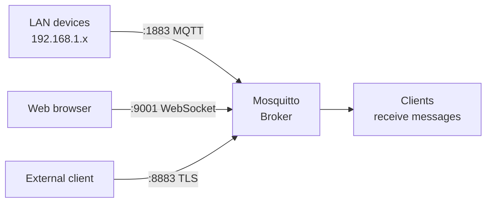

# Level 2: Basic Mosquitto Configuration

## Anatomy of mosquitto.conf

The Mosquitto config is a text file with `key value` syntax. No `=`, no quotes (unless the value contains spaces). Comments start with `#`.

```ini
# Global parameters
pid_file /var/run/mosquitto.pid
persistence false

# Listener block — everything applies only to this listener
listener 1883 0.0.0.0
protocol mqtt
allow_anonymous false
password_file /etc/mosquitto/passwd

# Second listener — WebSockets
listener 9001
protocol websockets
allow_anonymous false
```

📌 **Important in Mosquitto 2.x:** authentication parameters (`allow_anonymous`, `password_file`, `acl_file`) work **in the context of a specific listener**, not globally. If they appear before the first `listener` — they apply to all listeners.

---

## Key Parameters

### Network

```ini
listener 1883           # MQTT port
listener 1883 127.0.0.1 # MQTT localhost only
listener 8883           # MQTT+TLS port (IANA standard)
listener 9001           # WebSockets
bind_address 192.168.1.1 # only within listener context
max_connections 100     # limit connections
keepalive_interval 60   # keepalive seconds
message_size_limit 65536 # max payload size (bytes)
```

### Persistence

```ini
persistence false               # disabled (recommended on OpenWRT)
persistence true                # enabled
persistence_location /tmp/mosquitto/  # tmpfs is safe for flash
persistence_file mosquitto.db   # file name
```

### Security

```ini
allow_anonymous false           # disallow without password (v2.0 default)
allow_anonymous true            # development / LAN only
password_file /etc/mosquitto/passwd
acl_file /etc/mosquitto/acl
```

---

## Listeners and Ports

Mosquitto can listen on multiple ports simultaneously — with different security settings:



This allows, for example, permitting anonymous access for internal devices while requiring TLS for external connections.

---

## Logging Configuration

Logs are the first diagnostic tool. The right balance of levels matters on a router.

```ini
# Recommended configuration for OpenWRT
log_dest syslog
log_type error
log_type warning
log_type notice
log_timestamp true
log_timestamp_format %Y-%m-%dT%H:%M:%S
```

Logging levels (from quiet to verbose):

| Level | When to use |
|---------|-------------------|
| `error` | Always (critical errors) |
| `warning` | Always (warnings) |
| `notice` | Production (start, connections) |
| `information` | Extended monitoring |
| `subscribe` | Subscription debugging |
| `debug` | Debugging only (very verbose) |

```bash
# Read logs on OpenWRT
logread | grep mosquitto

# Follow logs in real time
logread -f | grep mosquitto
```

---

## Minimal Working Config

```ini
# /etc/mosquitto/mosquitto.conf
# Recommended for OpenWRT home automation

pid_file /var/run/mosquitto.pid
persistence false

log_dest syslog
log_type error
log_type warning
log_type notice
log_timestamp true

listener 1883 192.168.1.1
protocol mqtt
allow_anonymous false
password_file /etc/mosquitto/passwd
```

After changing the config:
```bash
# Reload config without dropping connections (SIGHUP)
kill -HUP $(cat /var/run/mosquitto.pid)

# Or full restart
/etc/init.d/mosquitto restart
```

---

## ⚠️ Common Mistakes

**❌ Using global `port` instead of `listener`**
```ini
# Bad (Mosquitto v1.x syntax):
port 1883
bind_address 192.168.1.1

# Correct (v2.x):
listener 1883 192.168.1.1
```

**❌ `allow_anonymous true` in production**
```ini
# Dangerous — anyone on the network can read and write any topic!
allow_anonymous true
```
✅ Even on a home network, set up passwords — protection against accidental device conflicts.

**❌ Enabling persistence without specifying tmpfs**
```ini
# Dangerous for router flash memory:
persistence true
persistence_location /var/lib/mosquitto/  # writes to flash!

# Safe:
persistence true
persistence_location /tmp/mosquitto/      # tmpfs (RAM)
```
