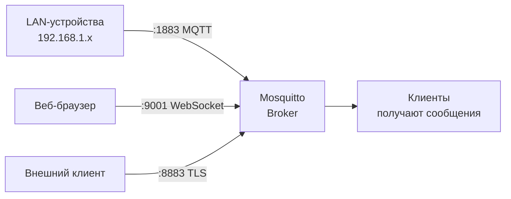

# Уровень 2: Базовая конфигурация Mosquitto

## Анатомия mosquitto.conf

Конфиг Mosquitto — текстовый файл с синтаксисом `ключ значение`. Никаких `=`, никаких кавычек (если значение без пробелов). Комментарии начинаются с `#`.

```ini
# Глобальные параметры
pid_file /var/run/mosquitto.pid
persistence false

# Listener-блок — всё относится только к этому listener
listener 1883 0.0.0.0
protocol mqtt
allow_anonymous false
password_file /etc/mosquitto/passwd

# Второй listener — WebSockets
listener 9001
protocol websockets
allow_anonymous false
```

📌 **Важно в Mosquitto 2.x:** параметры аутентификации (`allow_anonymous`, `password_file`, `acl_file`) работают **в контексте конкретного listener**, а не глобально. Если они указаны до первого `listener` — применяются ко всем listener-ам.

---

## Ключевые параметры

### Сетевые

```ini
listener 1883           # MQTT порт
listener 1883 127.0.0.1 # MQTT только localhost
listener 8883           # MQTT+TLS порт (стандарт IANA)
listener 9001           # WebSockets
bind_address 192.168.1.1 # только в контексте listener
max_connections 100     # ограничить подключения
keepalive_interval 60   # секунды keepalive
message_size_limit 65536 # макс. размер payload (байт)
```

### Persistence

```ini
persistence false               # выключить (рекомендуется на OpenWRT)
persistence true                # включить
persistence_location /tmp/mosquitto/  # tmpfs безопасна для flash
persistence_file mosquitto.db   # имя файла
```

### Безопасность

```ini
allow_anonymous false           # запретить без пароля (v2.0 default)
allow_anonymous true            # только для разработки / LAN
password_file /etc/mosquitto/passwd
acl_file /etc/mosquitto/acl
```

---

## Listeners и порты

Mosquitto может слушать несколько портов одновременно — с разными настройками безопасности:



Это позволяет, например, разрешить анонимный доступ для внутренних устройств, но требовать TLS для внешних подключений.

---

## Настройка логирования

Логи — первый инструмент диагностики. Правильный баланс уровней важен на роутере.

```ini
# Рекомендуемая конфигурация для OpenWRT
log_dest syslog
log_type error
log_type warning
log_type notice
log_timestamp true
log_timestamp_format %Y-%m-%dT%H:%M:%S
```

Уровни логирования (от тихого к шумному):

| Уровень | Когда использовать |
|---------|-------------------|
| `error` | Всегда (критические ошибки) |
| `warning` | Всегда (предупреждения) |
| `notice` | Продакшн (старт, подключения) |
| `information` | Расширенный мониторинг |
| `subscribe` | Отладка подписок |
| `debug` | Только при отладке (очень много вывода) |

```bash
# Читать логи на OpenWRT
logread | grep mosquitto

# Следить за логами в реальном времени
logread -f | grep mosquitto
```

---

## Минимальный рабочий конфиг

```ini
# /etc/mosquitto/mosquitto.conf
# Рекомендуется для OpenWRT home automation

pid_file /var/run/mosquitto.pid
persistence false

log_dest syslog
log_type error
log_type warning
log_type notice
log_timestamp true

listener 1883 192.168.1.1
protocol mqtt
allow_anonymous false
password_file /etc/mosquitto/passwd
```

После изменения конфига:
```bash
# Перезагрузить конфиг без разрыва соединений (SIGHUP)
kill -HUP $(cat /var/run/mosquitto.pid)

# Или полный перезапуск
/etc/init.d/mosquitto restart
```

---

## ⚠️ Частые ошибки

**❌ Использовать глобальный `port` вместо `listener`**
```ini
# Плохо (Mosquitto v1.x синтаксис):
port 1883
bind_address 192.168.1.1

# Правильно (v2.x):
listener 1883 192.168.1.1
```

**❌ `allow_anonymous true` в продакшне**
```ini
# Опасно — любой в сети может читать и писать любые топики!
allow_anonymous true
```
✅ Даже в домашней сети настрой пароли — защита от случайных конфликтов устройств.

**❌ Включать persistence без указания tmpfs**
```ini
# Опасно для flash-памяти роутера:
persistence true
persistence_location /var/lib/mosquitto/  # пишет на flash!

# Безопасно:
persistence true
persistence_location /tmp/mosquitto/      # tmpfs (RAM)
```
