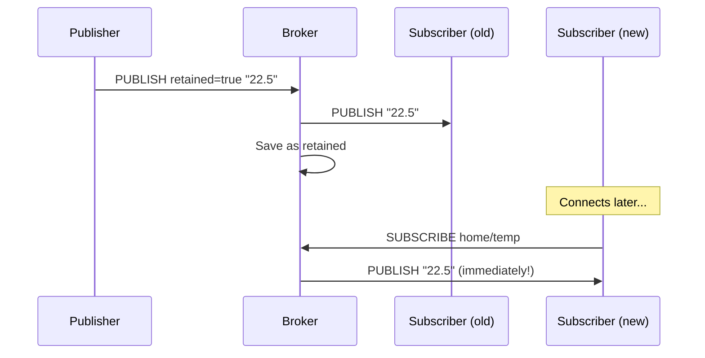

# Level 4: QoS and Delivery — Extended Theory

## Why Do We Need QoS at All?

TCP already guarantees packet delivery. So why does MQTT add its own layer of guarantees?

The problem is that **TCP only guarantees byte delivery between two points right now**. But IoT devices:

- Regularly go to sleep (no connection)
- Work over unstable channels (GSM, outdoor Wi-Fi)
- May reboot (crash, firmware update)

MQTT QoS solves the task at the **business logic level**: guarantees that a message reaches B from A even across several reconnections.

## QoS 0 — Fire and Forget

### How It Works

```
Publisher                    Broker                    Subscriber
   │                           │                           │
   │──── PUBLISH (QoS=0) ─────►│                           │
   │                           │──── PUBLISH (QoS=0) ─────►│
   │                           │                           │
```

One packet. No confirmations. If the packet is lost — neither the broker nor the publisher knows.

### When to Use

- Real-time metrics (temperature, humidity) — losing one value is non-critical
- GPS coordinates — the next value arrives in a second
- High-frequency logs and events — duplicates are more important than losses

### Resource Consumption

QoS 0 is minimal. On OpenWRT with Mosquitto:
- No persistence writes
- No in-flight message table
- No retry timers

```
# mosquitto.conf for QoS 0 scenario
max_inflight_messages 0   # no limit (doesn't affect QoS 0)
```

## QoS 1 — At Least Once

### How It Works

```
Publisher                    Broker                    Subscriber
   │                           │                           │
   │──── PUBLISH (QoS=1) ─────►│                           │
   │                           │──── PUBLISH (QoS=1) ─────►│
   │◄─── PUBACK ───────────────│◄─── PUBACK ───────────────│
   │                           │                           │
```

If PUBACK doesn't arrive (timeout) — the publisher retries with the DUP=1 flag.

### Duplicates Are Normal

With QoS 1, the subscriber **may receive the same message multiple times**. This is not a bug, it's the specification. Your code must be **idempotent** (repeated execution = same result):

```
# Good for QoS 1 — idempotent:
"temperature: 22.5"   # set a value (can be repeated)
"valve: open"         # set a state (opening an already open = OK)

# Bad for QoS 1 — not idempotent:
"counter: increment"  # each duplicate increases the counter
"payment: execute"    # money will be charged twice
```

### Persistence and QoS 1

If the subscriber has a persistent session (`clean_session false`), the broker accumulates QoS 1+ messages while the subscriber is offline:

```
# mosquitto.conf
max_queued_messages 100    # max messages in queue for offline client
max_inflight_messages 20   # simultaneously "in flight" to one client
```

On OpenWRT with limited memory:
```
max_queued_messages 10   # reduce to minimum
```

## QoS 2 — Exactly Once

### How It Works (4 Steps)

```
Publisher                    Broker
   │                           │
   │──── PUBLISH (QoS=2) ─────►│  Step 1: broker stored
   │◄─── PUBREC ───────────────│  Step 2: receipt confirmed
   │──── PUBREL ───────────────►│  Step 3: permission to deliver
   │◄─── PUBCOMP ──────────────│  Step 4: complete
   │                           │
```

Similarly between broker and subscriber:
```
Broker                    Subscriber
   │                           │
   │──── PUBLISH (QoS=2) ─────►│
   │◄─── PUBREC ───────────────│
   │──── PUBREL ───────────────►│
   │◄─── PUBCOMP ──────────────│
```

### Internal State Table

The broker keeps a table of unfinished QoS 2 exchanges in memory (and in persistence). Each entry contains:
- packet_id
- state (PUBLISH_SENT / PUBREC_RECEIVED / PUBREL_SENT)
- message payload

On OpenWRT this consumes RAM. With `max_inflight_messages 20` each client can have up to 20 such entries.

### When You Really Need QoS 2

Only for **atomic non-idempotent operations**:
- Open/close a valve (can't open twice in a row)
- Financial transaction
- Self-destruct command (joke — but the point stands)

For 95% of IoT tasks QoS 1 or QoS 0 is sufficient.

## Retained Messages in Detail

### How It Works



### Only One Retained Message per Topic

Each new retained replaces the previous one:
```bash
mosquitto_pub -r -t 'home/temp' -m '22.5'  # saved
mosquitto_pub -r -t 'home/temp' -m '23.0'  # replaced the previous
# New subscribers receive "23.0"
```

### Deleting a Retained Message

```bash
# Empty payload + retained flag = delete retained
mosquitto_pub -r -t 'home/temp' -m ''

# Or in Python:
client.publish('home/temp', payload=None, retain=True)
```

### Retained + Wildcards

When subscribing to `home/#` the subscriber receives **all** retained messages matching the pattern. This is useful for "bootstrapping" — getting the current state of the entire system:

```bash
# Get all current states in one request
mosquitto_sub -t 'home/#' --retained-only
```

### Configuring Retained Storage

```
# mosquitto.conf
retain_available true          # allow retained (default)
max_retained_messages 0        # 0 = no limits (careful on OpenWRT!)
max_retained_messages 1000     # limit to save memory
```

On OpenWRT it's recommended to limit — each retained message uses RAM.

## Last Will and Testament (LWT)

### How to Configure

LWT is set on connection (CONNECT packet). The client specifies:
- `will_topic` — topic for the last word
- `will_payload` — content
- `will_qos` — QoS of the last word (recommended: 1)
- `will_retain` — save as retained (usually true)

```python
# Python paho-mqtt
import paho.mqtt.client as mqtt

client = mqtt.Client()
client.will_set(
    topic='device/esp32-01/status',
    payload='offline',
    qos=1,
    retain=True
)
client.connect('192.168.1.1', 1883)

# On manual connect, publish "online" with retained
client.publish('device/esp32-01/status', 'online', qos=1, retain=True)
```

### Online/Offline Pattern

```
┌──────────────────────────────────────────────────────┐
│  Client connects:                                     │
│    1. will_set('device/id/status', 'offline', ...)   │
│    2. connect(broker)                                 │
│    3. publish('device/id/status', 'online', ...)     │
│                                                       │
│  Normal disconnect:                                  │
│    4. publish('device/id/status', 'offline', ...)    │
│    5. disconnect() ← LWT is NOT sent                 │
│                                                       │
│  Emergency disconnect:                               │
│    4. [connection lost]                              │
│    5. Broker → publish LWT: 'offline'                │
└──────────────────────────────────────────────────────┘
```

### LWT Delay (MQTT v5)

MQTT v5 introduced `Will Delay Interval` — the broker waits N seconds before sending the LWT. If the client reconnects within this time — the LWT is not sent. Useful for temporary connection drops (Wi-Fi → LTE transition).

```
# Mosquitto 2.x supports v5, but the client must explicitly request v5
```

## QoS Levels Comparison

| Parameter | QoS 0 | QoS 1 | QoS 2 |
|---|---|---|---|
| Guarantee | At most once | At least once | Exactly once |
| Packet exchanges | 1 | 2 | 4 |
| Duplicates | No | Possible | No |
| Losses | Possible | No | No |
| Broker load | Minimal | Medium | Maximum |
| RAM per entry | 0 | ~200 bytes | ~400 bytes |
| Speed (relative) | 100% | 50% | 25% |

## QoS on OpenWRT: Practical Recommendations

On a router with Mosquitto and limited resources:

```
# mosquitto.conf — QoS optimization
max_inflight_messages 10    # no more than 10 QoS 1/2 in flight per client
max_queued_messages 20      # queue for offline clients
max_queued_bytes 0          # 0 = no byte limit (but limit messages)
```

Level recommendations:
- **Telemetry** (temperature, humidity, power) → QoS 0
- **Alerts and events** (motion, door open) → QoS 1
- **Control commands** (open valve, turn on pump) → QoS 1 or 2
- **Critical commands** (emergency shutdown) → QoS 2

## ⚠️ Common Mistakes

❌ **Persistent session + QoS 1 without queue limit:**
```
# Client went offline for a day → 86400 messages in memory!
max_queued_messages 0   # DANGEROUS on OpenWRT
```
✅ Always set `max_queued_messages` for embedded systems.

❌ **LWT with QoS 0:**
```python
client.will_set('device/status', 'offline', qos=0)  # may not arrive!
```
✅ Use QoS 1 for LWT — this is a critically important message.

❌ **Retained not cleaned on shutdown:**
```python
# Client shuts down normally, but retained "online" remains!
client.disconnect()  # LWT not sent, retained "online" hangs
```
✅ On normal shutdown, explicitly publish "offline" retained before disconnect.

❌ **QoS 2 for everything "just in case":**
Each QoS 2 message holds 4 packets and a memory entry. On a router with 64 MB RAM and 50 clients this quickly fills buffers.
