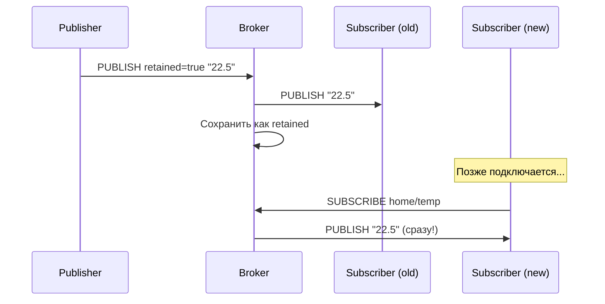

# Уровень 4: QoS и доставка — Развёрнутая теория

## Почему вообще нужен QoS?

TCP уже гарантирует доставку пакетов. Так зачем MQTT добавляет свой уровень гарантий?

Проблема в том, что **TCP гарантирует только доставку байт между двумя точками прямо сейчас**. Но IoT-устройства:

- Регулярно уходят в сон (нет соединения)
- Работают по нестабильным каналам (GSM, Wi-Fi на улице)
- Могут перезагружаться (краш, обновление прошивки)

MQTT QoS решает задачу на уровне **бизнес-логики**: гарантирует, что сообщение дойдёт из A в B даже через несколько переподключений.

## QoS 0 — Fire and Forget

### Как работает

```
Издатель                    Брокер                    Подписчик
   │                           │                           │
   │──── PUBLISH (QoS=0) ─────►│                           │
   │                           │──── PUBLISH (QoS=0) ─────►│
   │                           │                           │
```

Один пакет. Никаких подтверждений. Если пакет потерялся — брокер не знает, издатель не знает.

### Когда использовать

- Метрики в реальном времени (температура, влажность) — потеря одного значения некритична
- Координаты GPS — следующее значение придёт через секунду
- Логи и события высокой частоты — дубликаты важнее, чем потери

### Потребление ресурсов

QoS 0 минимален. На OpenWRT с Mosquitto:
- Нет записи в persistence
- Нет таблицы in-flight сообщений
- Нет таймеров повторной отправки

```
# mosquitto.conf для QoS 0 сценария
max_inflight_messages 0   # не ограничивать (не влияет на QoS 0)
```

## QoS 1 — At Least Once

### Как работает

```
Издатель                    Брокер                    Подписчик
   │                           │                           │
   │──── PUBLISH (QoS=1) ─────►│                           │
   │                           │──── PUBLISH (QoS=1) ─────►│
   │◄─── PUBACK ───────────────│◄─── PUBACK ───────────────│
   │                           │                           │
```

Если PUBACK не пришёл (таймаут) — издатель повторяет с флагом DUP=1.

### Дубликаты — это нормально

При QoS 1 подписчик **может получить одно сообщение несколько раз**. Это не баг, это спецификация. Ваш код должен быть **идемпотентным** (повторное выполнение = то же результат):

```
# Хорошо для QoS 1 — идемпотентно:
"temperature: 22.5"   # установить значение (можно повторить)
"valve: open"         # установить состояние (открыть уже открытое = OK)

# Плохо для QoS 1 — неидемпотентно:
"counter: increment"  # каждый дубликат увеличит счётчик
"payment: execute"    # деньги спишутся дважды
```

### Persistence и QoS 1

Если у подписчика persistent session (`clean_session false`), брокер накапливает QoS 1+ сообщения пока подписчик недоступен:

```
# mosquitto.conf
max_queued_messages 100    # максимум сообщений в очереди для offline-клиента
max_inflight_messages 20   # одновременно "в пути" к одному клиенту
```

На OpenWRT с ограниченной памятью:
```
max_queued_messages 10   # сократить до минимума
```

## QoS 2 — Exactly Once

### Как работает (4 шага)

```
Издатель                    Брокер
   │                           │
   │──── PUBLISH (QoS=2) ─────►│  Шаг 1: брокер сохранил
   │◄─── PUBREC ───────────────│  Шаг 2: подтвердил получение
   │──── PUBREL ───────────────►│  Шаг 3: разрешение доставить
   │◄─── PUBCOMP ──────────────│  Шаг 4: завершено
   │                           │
```

Аналогично между брокером и подписчиком:
```
Брокер                    Подписчик
   │                           │
   │──── PUBLISH (QoS=2) ─────►│
   │◄─── PUBREC ───────────────│
   │──── PUBREL ───────────────►│
   │◄─── PUBCOMP ──────────────│
```

### Внутренняя таблица состояний

Брокер держит таблицу незавершённых QoS 2 обменов в памяти (и в persistence). Каждая запись содержит:
- packet_id
- состояние (PUBLISH_SENT / PUBREC_RECEIVED / PUBREL_SENT)
- payload сообщения

На OpenWRT это занимает RAM. При `max_inflight_messages 20` для каждого клиента может быть до 20 таких записей.

### Когда реально нужен QoS 2

Только для **атомарных неидемпотентных операций**:
- Открыть/закрыть клапан (нельзя открыть дважды в ряд)
- Финансовая транзакция
- Команда самоуничтожения (шутка — но суть верна)

Для 95% IoT задач QoS 1 или QoS 0 достаточно.

## Retained Messages в деталях

### Механизм работы



### Только одно retained сообщение на топик

Каждый следующий retained заменяет предыдущий:
```bash
mosquitto_pub -r -t 'home/temp' -m '22.5'  # сохранено
mosquitto_pub -r -t 'home/temp' -m '23.0'  # заменило предыдущее
# Новые подписчики получат "23.0"
```

### Удаление retained сообщения

```bash
# Пустой payload + retained флаг = удалить retained
mosquitto_pub -r -t 'home/temp' -m ''

# Или в Python:
client.publish('home/temp', payload=None, retain=True)
```

### Retained + wildcards

При подписке на `home/#` подписчик получит **все** retained сообщения, которые совпадают с паттерном. Это полезно для "bootstrapping" — получить текущее состояние всей системы:

```bash
# Получить все текущие состояния одним запросом
mosquitto_sub -t 'home/#' --retained-only
```

### Настройка хранения retained

```
# mosquitto.conf
retain_available true          # разрешить retained (по умолчанию)
max_retained_messages 0        # 0 = без ограничений (осторожно на OpenWRT!)
max_retained_messages 1000     # ограничить для экономии памяти
```

На OpenWRT рекомендуется ограничить — каждое retained сообщение занимает RAM.

## Last Will and Testament (LWT)

### Как настроить

LWT задаётся при подключении (CONNECT пакет). Клиент указывает:
- `will_topic` — топик для последнего слова
- `will_payload` — содержимое
- `will_qos` — QoS последнего слова (рекомендуется 1)
- `will_retain` — сохранить как retained (обычно true)

```python
# Python paho-mqtt
import paho.mqtt.client as mqtt

client = mqtt.Client()
client.will_set(
    topic='device/esp32-01/status',
    payload='offline',
    qos=1,
    retain=True
)
client.connect('192.168.1.1', 1883)

# При подключении вручную публикуем "online" с retained
client.publish('device/esp32-01/status', 'online', qos=1, retain=True)
```

### Паттерн Online/Offline

```
┌──────────────────────────────────────────────────────┐
│  Клиент подключается:                                 │
│    1. will_set('device/id/status', 'offline', ...)   │
│    2. connect(broker)                                 │
│    3. publish('device/id/status', 'online', ...)     │
│                                                       │
│  Нормальное отключение:                              │
│    4. publish('device/id/status', 'offline', ...)    │
│    5. disconnect() ← LWT НЕ отправляется             │
│                                                       │
│  Аварийное отключение:                               │
│    4. [связь прервана]                               │
│    5. Брокер → publish LWT: 'offline'                │
└──────────────────────────────────────────────────────┘
```

### Задержка LWT (MQTT v5)

В MQTT v5 появился `Will Delay Interval` — брокер ждёт N секунд перед отправкой LWT. Если клиент переподключится за это время — LWT не отправляется. Полезно при временных обрывах связи (переход Wi-Fi → LTE).

```
# Mosquitto 2.x поддерживает v5, но клиент должен явно запросить v5
```

## Сравнение QoS уровней

| Параметр | QoS 0 | QoS 1 | QoS 2 |
|---|---|---|---|
| Гарантия | Не более 1 раза | Не менее 1 раза | Ровно 1 раз |
| Пакетов обмена | 1 | 2 | 4 |
| Дубликаты | Нет | Возможны | Нет |
| Потери | Возможны | Нет | Нет |
| Нагрузка на брокер | Минимальная | Средняя | Максимальная |
| RAM на запись | 0 | ~200 байт | ~400 байт |
| Скорость (относительно) | 100% | 50% | 25% |

## QoS на OpenWRT: практические рекомендации

На роутере с Mosquitto при ограниченных ресурсах:

```
# mosquitto.conf — оптимизация QoS
max_inflight_messages 10    # не более 10 QoS1/2 одновременно на клиента
max_queued_messages 20      # очередь для offline-клиентов
max_queued_bytes 0          # 0 = без ограничений по байтам (но ограничьте messages)
```

Рекомендации по уровням:
- **Телеметрия** (температура, влажность, мощность) → QoS 0
- **Алерты и события** (движение, открытие двери) → QoS 1
- **Команды управления** (открыть клапан, включить насос) → QoS 1 или 2
- **Критические команды** (аварийное отключение) → QoS 2

## ⚠️ Частые ошибки

❌ **Persistent session + QoS 1 без ограничения очереди:**
```
# Клиент ушёл в оффлайн на день → 86400 сообщений в памяти!
max_queued_messages 0   # ОПАСНО на OpenWRT
```
✅ Всегда ставьте `max_queued_messages` для встраиваемых систем.

❌ **LWT с QoS 0:**
```python
client.will_set('device/status', 'offline', qos=0)  # может не дойти!
```
✅ Используйте QoS 1 для LWT — это критически важное сообщение.

❌ **Retained без очистки при завершении работы:**
```python
# Клиент выключается нормально, но retained "online" остаётся!
client.disconnect()  # LWT не отправляется, retained "online" висит
```
✅ При нормальном выключении явно публикуйте "offline" retained перед disconnect.

❌ **QoS 2 для всего "на всякий случай":**
Каждое QoS 2 сообщение держит 4 пакета и запись в памяти. На роутере с 64 МБ RAM и 50 клиентами это быстро заполняет буферы.
