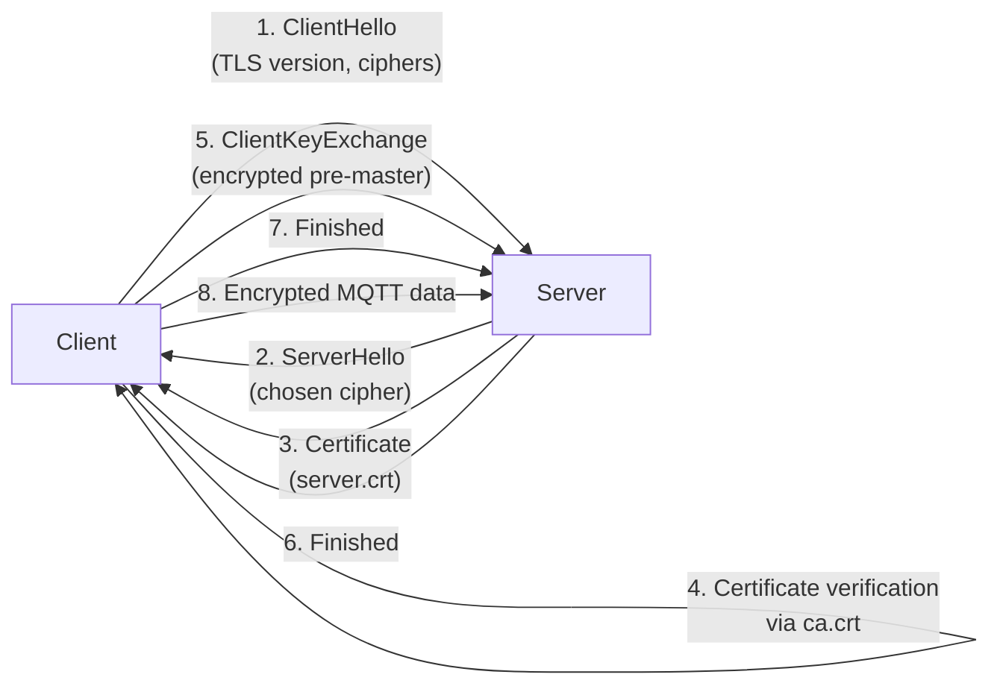
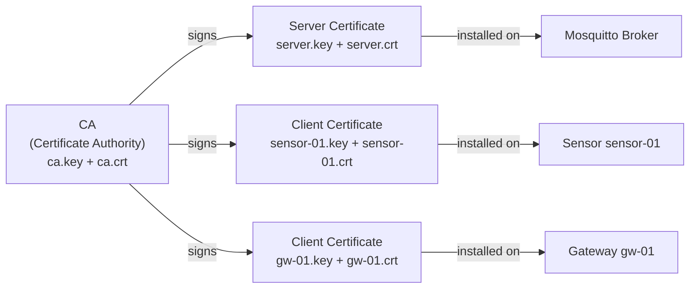

# Level 6: TLS/SSL MQTT Encryption — Detailed Theory

## Introduction: Why Encryption is Mandatory

Imagine sending a letter by post. Without an envelope — everyone who touches the letter along the way can read it. MQTT without TLS is exactly that letter: plain text, visible to everyone on the network.

Run `tcpdump` on your network while an IoT device publishes data without TLS:

```bash
tcpdump -i eth0 -A port 1883
```

You'll see logins, passwords, and message contents in plain text. On a home network this might be acceptable, but in an industrial environment or if outsiders have access to the router — it's a disaster.

TLS (Transport Layer Security) solves three tasks at once:
1. **Confidentiality** — data is encrypted, interception is meaningless
2. **Authentication** — the client is sure it's connecting to the real broker, not a fake
3. **Integrity** — data cannot be modified in transit without detection

---

## 1. How TLS Works: Analogy and Mechanism

### Safe and Key Analogy

Imagine a scheme with two locks:
1. You have a **public key** (a lock everyone can use for encryption)
2. You have a **private key** (the only key that opens that lock)

The server publishes its lock (public key in the certificate). The client encrypts a message with that lock. Only the server can decrypt it — the sole owner of the private key.

### TLS Handshake Step by Step



This entire process takes a few milliseconds. After it, both parties share a symmetric session key — all subsequent data is encrypted with it.

---

## 2. PKI: Public Key Infrastructure

### PKI Structure

PKI (Public Key Infrastructure) — a system for managing digital certificates. In our case, it's a three-level structure:



**CA (Certificate Authority)** — the root of trust. This is your own certificate authority. Everyone who trusts the CA automatically trusts all certificates it signed.

> 💡 Analogy: the CA is the passport office that issues IDs. When you show your passport at a bank, the bank trusts you because it trusts the passport office.

### What's in a Certificate

An X.509 certificate contains:
- **Subject** (CN, O, C) — issued to whom
- **Issuer** — who signed (our CA)
- **Public Key** — owner's public key
- **Validity** — validity period (Not Before / Not After)
- **Signature** — CA's digital signature

```bash
# View certificate contents
openssl x509 -in server.crt -text -noout
```

---

## 3. Generating Certificates: Step by Step

### Step 1: Creating a CA

```bash
# Generate CA private key (2048 bits — minimum, 4096 — for the paranoid)
openssl genrsa -out ca.key 2048

# Create a self-signed CA certificate
# -x509 means: create a certificate (not a CSR)
# -days 3650 = 10 years
openssl req -new -x509 -days 3650 \
  -key ca.key \
  -out ca.crt \
  -subj "/CN=MQTT CA/O=HomeNetwork/C=RU"
```

Subject parameters:
- `CN` (Common Name) — CA name
- `O` (Organization) — organization
- `C` (Country) — two-letter country code

### Step 2: Server Certificate

```bash
# Server private key
openssl genrsa -out server.key 2048

# CSR (Certificate Signing Request) — request for signature
# CN MUST match the hostname clients use to connect to the broker!
openssl req -new -key server.key -out server.csr \
  -subj "/CN=mqtt.home/O=HomeNetwork/C=RU"

# CA signs the request
# -CAcreateserial — creates a ca.srl file with serial numbers
openssl x509 -req -days 3650 \
  -in server.csr \
  -CA ca.crt \
  -CAkey ca.key \
  -CAcreateserial \
  -out server.crt
```

> ⚠️ **Critical:** if a client connects via IP address (e.g., `192.168.1.1`) and the CN in the certificate is `mqtt.home`, you'll get a `hostname mismatch` error. Solution: use SAN (Subject Alternative Names) or always connect via hostname.

### Step 3: Client Certificates (for mTLS)

Create a separate certificate for each device:

```bash
# For sensor sensor-01
openssl genrsa -out sensor-01.key 2048
openssl req -new -key sensor-01.key -out sensor-01.csr \
  -subj "/CN=sensor-01/O=HomeNetwork/C=RU"
openssl x509 -req -days 3650 \
  -in sensor-01.csr -CA ca.crt -CAkey ca.key -CAcreateserial \
  -out sensor-01.crt

# For gateway gw-01
openssl genrsa -out gw-01.key 2048
openssl req -new -key gw-01.key -out gw-01.csr \
  -subj "/CN=gw-01/O=HomeNetwork/C=RU"
openssl x509 -req -days 3650 \
  -in gw-01.csr -CA ca.crt -CAkey ca.key -CAcreateserial \
  -out gw-01.crt
```

With `use_identity_as_username true` in Mosquitto, the CN values (`sensor-01`, `gw-01`) become usernames — ACL rules can be based on them.

---

## 4. Configuring Mosquitto 2.x

### Basic TLS Configuration

```conf
# /etc/mosquitto/mosquitto.conf

# Listener without TLS — localhost only (for local tools)
listener 1883 localhost
allow_anonymous true

# Listener with TLS
listener 8883

# Certificates
cafile /etc/mosquitto/certs/ca.crt
certfile /etc/mosquitto/certs/server.crt
keyfile /etc/mosquitto/certs/server.key

# Minimum TLS version (tlsv1.2 or tlsv1.3)
tls_version tlsv1.2

# Optional: cipher restriction (strong only)
# ciphers ECDHE-RSA-AES256-GCM-SHA384:ECDHE-RSA-AES128-GCM-SHA256
```

> 💡 Version `tlsv1.3` is faster and more secure, but some older IoT devices don't support it. `tlsv1.2` is a reasonable compromise for heterogeneous environments.

### mTLS: Mutual Authentication Configuration

```conf
listener 8883
cafile /etc/mosquitto/certs/ca.crt
certfile /etc/mosquitto/certs/server.crt
keyfile /etc/mosquitto/certs/server.key
tls_version tlsv1.2

# mTLS parameters
require_certificate true          # Client MUST present a certificate
use_identity_as_username true     # Certificate CN → username
```

With `use_identity_as_username true` you can configure ACL based on CN:

```conf
# /etc/mosquitto/acl

# sensor-01 can only publish sensor data
user sensor-01
topic write sensors/01/#

# gw-01 can read all sensor topics
user gw-01
topic read sensors/#
```

---

## 5. File Permissions (Security)

```bash
# Create directory
mkdir -p /etc/mosquitto/certs

# Copy files
cp ca.crt server.crt server.key /etc/mosquitto/certs/

# Private key — owner only (600)
chmod 600 /etc/mosquitto/certs/server.key

# Certificates — readable by everyone (644)
chmod 644 /etc/mosquitto/certs/ca.crt
chmod 644 /etc/mosquitto/certs/server.crt

# Mosquitto runs as user mosquitto
chown mosquitto:mosquitto /etc/mosquitto/certs/server.key
```

> ❌ Never place `server.key` in publicly accessible locations! If the key is compromised, an attacker can decrypt all recorded traffic and impersonate your broker.

---

## 6. Testing

### Basic TLS Connection

```bash
# Publishing with CA verification
mosquitto_pub \
  --cafile /etc/mosquitto/certs/ca.crt \
  -h mqtt.home -p 8883 \
  -t test/hello -m "TLS works!"

# If CN in the certificate is an IP, not hostname:
mosquitto_pub \
  --cafile /etc/mosquitto/certs/ca.crt \
  --insecure \           # ⚠️ Debug only!
  -h 192.168.1.1 -p 8883 \
  -t test -m "hello"
```

### mTLS Connection

```bash
mosquitto_sub \
  --cafile /etc/mosquitto/certs/ca.crt \
  --cert /etc/mosquitto/certs/sensor-01.crt \
  --key /etc/mosquitto/certs/sensor-01.key \
  -h mqtt.home -p 8883 \
  -t "sensors/#" -v
```

### Checking via openssl

```bash
# See which certificate the server sends
openssl s_client -connect mqtt.home:8883 -CAfile ca.crt

# Successful output contains:
# Verify return code: 0 (ok)
```

---

## 7. Certificate Lifetime and Rotation

### Monitoring Expiration

```bash
# Check expiration date
openssl x509 -in server.crt -noout -dates
# notBefore=Jan  1 00:00:00 2024 GMT
# notAfter=Jan  1 00:00:00 2034 GMT

# Script for OpenWRT (cron)
DAYS_LEFT=$(( ($(date -d "$(openssl x509 -in /etc/mosquitto/certs/server.crt -noout -enddate | cut -d= -f2)" +%s) - $(date +%s)) / 86400 ))
[ $DAYS_LEFT -lt 30 ] && logger "MQTT TLS cert expires in $DAYS_LEFT days!"
```

### Rotation Strategy

When updating certificates:
1. Generate new certificates
2. Copy new files
3. Restart Mosquitto: `service mosquitto restart`
4. Update certificates on client devices

---

## ⚠️ Common Beginner Mistakes

### 🐛 1. CN Doesn't Match Hostname

```bash
# ❌ Certificate issued for "mqtt.home", but connecting via IP
openssl req -subj "/CN=mqtt.home/..."
mosquitto_pub -h 192.168.1.1 -p 8883 ...
# Error: hostname mismatch
```

> **Why this is an error:** TLS client checks that the CN in the certificate matches the address it's connecting to. This is protection against server spoofing.

```bash
# ✅ Either issue certificate for IP, or add DNS record
openssl req -subj "/CN=192.168.1.1/..."
# Or use hostname in all connections
mosquitto_pub -h mqtt.home -p 8883 ...
```

### 🐛 2. Wrong Permissions on server.key

```bash
# ❌ Mosquitto won't start
[1657891234] Error: Unable to load server cert/key
```

> **Why this is an error:** Mosquitto runs as user `mosquitto`, but `server.key` has `root:root 640` permissions — Mosquitto can't read it.

```bash
# ✅ Correct permissions
chown mosquitto:mosquitto /etc/mosquitto/certs/server.key
chmod 600 /etc/mosquitto/certs/server.key
```

### 🐛 3. Forgetting to Pass --cafile to Client

```bash
# ❌ Connecting without CA
mosquitto_pub -h mqtt.home -p 8883 -t test -m "hello"
# Error: certificate verify failed (self-signed certificate in chain)
```

> **Why this is an error:** our CA is self-signed (not registered with public CAs). The client doesn't know about it and doesn't trust certificates signed by it.

```bash
# ✅ Pass the CA explicitly
mosquitto_pub --cafile /path/to/ca.crt -h mqtt.home -p 8883 -t test -m "hello"
```

### 🐛 4. Using --insecure in Production

```bash
# ❌ Disabling certificate verification
mosquitto_sub --cafile ca.crt --insecure -h mqtt.home -p 8883 -t "#"
```

> **Why this is an error:** `--insecure` disables hostname checking. TLS encrypts traffic but doesn't protect against "man-in-the-middle" attacks — an attacker could substitute their own certificate.

```bash
# ✅ Always use the correct hostname and don't use --insecure
mosquitto_sub --cafile ca.crt -h mqtt.home -p 8883 -t "#"
```

---

## 📌 Summary

| Parameter | Description |
|----------|---------|
| `listener 8883` | Standard MQTT+TLS port |
| `cafile` | CA certificate for client verification (and clients for server verification) |
| `certfile` | Server certificate (public) |
| `keyfile` | Server private key (secret!) |
| `tls_version` | Minimum TLS version (`tlsv1.2` or `tlsv1.3`) |
| `require_certificate` | `true` = mTLS, client must present a certificate |
| `use_identity_as_username` | Client certificate CN → username for ACL |

- ✅ Always use TLS for MQTT outside localhost
- ✅ Generate a separate certificate for each device
- ✅ CN must match the broker's hostname
- ✅ Private key `server.key` — only for the Mosquitto process
- ❌ Never use `--insecure` in production systems
