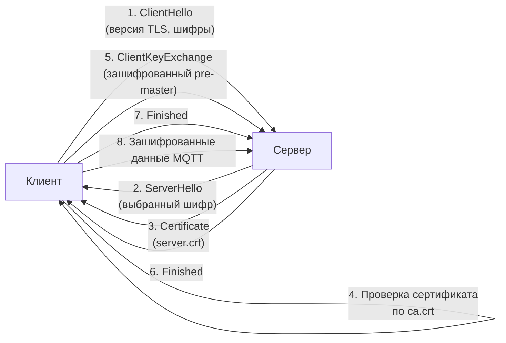
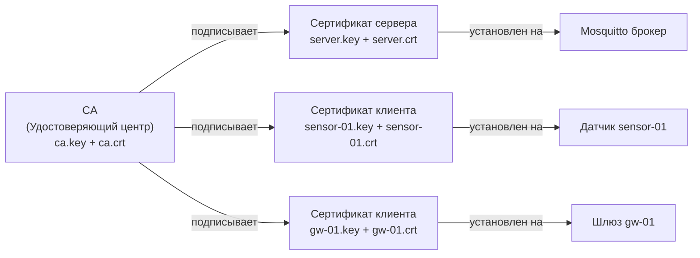

# Уровень 6: TLS/SSL шифрование MQTT — подробная теория

## Введение: почему шифрование обязательно

Представьте, что вы отправляете письмо по почте. Без конверта — все, кто прикоснётся к письму по
пути, смогут его прочитать. MQTT без TLS — это именно такое письмо: открытый текст, видимый каждому
в сети.

Запустите `tcpdump` в своей сети в момент, когда IoT-устройство публикует данные без TLS:

```bash
tcpdump -i eth0 -A port 1883
```

Вы увидите логины, пароли и содержимое сообщений в открытом виде. В домашней сети это, возможно,
терпимо, но в промышленной среде или если к роутеру имеют доступ посторонние — это катастрофа.

TLS (Transport Layer Security) решает сразу три задачи:
1. **Конфиденциальность** — данные зашифрованы, перехват бессмысленен
2. **Аутентификация** — клиент уверен, что подключается к настоящему брокеру, а не к подделке
3. **Целостность** — данные не могут быть изменены в пути без обнаружения

---

## 1. Как работает TLS: аналогия и механизм

### Аналогия с сейфом и ключами

Представьте схему с двумя замками:
1. У вас есть **публичный ключ** (замок, который все могут использовать для зашифровки)
2. У вас есть **приватный ключ** (единственный ключ, открывающий этот замок)

Сервер публикует свой замок (публичный ключ в сертификате). Клиент шифрует сообщение этим замком.
Расшифровать может только сервер — единственный владелец приватного ключа.

### TLS Handshake шаг за шагом



Весь этот процесс занимает несколько миллисекунд. После него оба участника имеют общий
симметричный ключ сессии — им шифруются все последующие данные.

---

## 2. PKI: инфраструктура открытых ключей

### Структура PKI

PKI (Public Key Infrastructure) — система управления цифровыми сертификатами. В нашем случае
это трёхуровневая структура:



**CA (Certificate Authority)** — корень доверия. Это ваш собственный удостоверяющий центр.
Все, кто доверяет CA, автоматически доверяют всем сертификатам, которые он подписал.

> 💡 Аналогия: CA — это паспортный стол, который выдаёт удостоверения личности. Когда вы
> показываете паспорт в банке, банк доверяет вам, потому что доверяет паспортному столу.

### Что хранится в сертификате

Сертификат X.509 содержит:
- **Subject** (CN, O, C) — кому выдан
- **Issuer** — кто подписал (наш CA)
- **Public Key** — публичный ключ владельца
- **Validity** — срок действия (Not Before / Not After)
- **Signature** — цифровая подпись CA

```bash
# Посмотреть содержимое сертификата
openssl x509 -in server.crt -text -noout
```

---

## 3. Генерация сертификатов: пошагово

### Шаг 1: Создание CA

```bash
# Генерируем приватный ключ CA (2048 бит — минимум, 4096 — для параноиков)
openssl genrsa -out ca.key 2048

# Создаём самоподписанный сертификат CA
# -x509 означает: создать сертификат (не CSR)
# -days 3650 = 10 лет
openssl req -new -x509 -days 3650 \
  -key ca.key \
  -out ca.crt \
  -subj "/CN=MQTT CA/O=HomeNetwork/C=RU"
```

Параметры Subject:
- `CN` (Common Name) — название CA
- `O` (Organization) — организация
- `C` (Country) — двухбуквенный код страны

### Шаг 2: Сертификат сервера

```bash
# Приватный ключ сервера
openssl genrsa -out server.key 2048

# CSR (Certificate Signing Request) — запрос на подпись
# CN ДОЛЖЕН совпадать с hostname, по которому клиенты подключаются к брокеру!
openssl req -new -key server.key -out server.csr \
  -subj "/CN=mqtt.home/O=HomeNetwork/C=RU"

# CA подписывает запрос
# -CAcreateserial — создаёт файл ca.srl с серийными номерами
openssl x509 -req -days 3650 \
  -in server.csr \
  -CA ca.crt \
  -CAkey ca.key \
  -CAcreateserial \
  -out server.crt
```

> ⚠️ **Критично:** если клиент подключается по IP-адресу (например, `192.168.1.1`), а CN в
> сертификате — `mqtt.home`, получите ошибку `hostname mismatch`. Решение: использовать
> SAN (Subject Alternative Names) или всегда подключаться по hostname.

### Шаг 3: Клиентские сертификаты (для mTLS)

Для каждого устройства создаём отдельный сертификат:

```bash
# Для датчика sensor-01
openssl genrsa -out sensor-01.key 2048
openssl req -new -key sensor-01.key -out sensor-01.csr \
  -subj "/CN=sensor-01/O=HomeNetwork/C=RU"
openssl x509 -req -days 3650 \
  -in sensor-01.csr -CA ca.crt -CAkey ca.key -CAcreateserial \
  -out sensor-01.crt

# Для шлюза gw-01
openssl genrsa -out gw-01.key 2048
openssl req -new -key gw-01.key -out gw-01.csr \
  -subj "/CN=gw-01/O=HomeNetwork/C=RU"
openssl x509 -req -days 3650 \
  -in gw-01.csr -CA ca.crt -CAkey ca.key -CAcreateserial \
  -out gw-01.crt
```

При `use_identity_as_username true` в Mosquitto, значения CN (`sensor-01`, `gw-01`) станут
именами пользователей — ACL-правила можно писать на их основе.

---

## 4. Настройка Mosquitto 2.x

### Базовая конфигурация TLS

```conf
# /etc/mosquitto/mosquitto.conf

# Listener без TLS — только для localhost (для локальных инструментов)
listener 1883 localhost
allow_anonymous true

# Listener с TLS
listener 8883

# Сертификаты
cafile /etc/mosquitto/certs/ca.crt
certfile /etc/mosquitto/certs/server.crt
keyfile /etc/mosquitto/certs/server.key

# Минимальная версия TLS (tlsv1.2 или tlsv1.3)
tls_version tlsv1.2

# Опционально: ограничение шифров (только сильные)
# ciphers ECDHE-RSA-AES256-GCM-SHA384:ECDHE-RSA-AES128-GCM-SHA256
```

> 💡 Версия `tlsv1.3` быстрее и безопаснее, но некоторые старые IoT-устройства её не поддерживают.
> `tlsv1.2` — разумный компромисс для гетерогенных сред.

### mTLS: конфигурация взаимной аутентификации

```conf
listener 8883
cafile /etc/mosquitto/certs/ca.crt
certfile /etc/mosquitto/certs/server.crt
keyfile /etc/mosquitto/certs/server.key
tls_version tlsv1.2

# mTLS-параметры
require_certificate true          # Клиент ОБЯЗАН предъявить сертификат
use_identity_as_username true     # CN сертификата → username
```

С `use_identity_as_username true` можно настроить ACL на основе CN:

```conf
# /etc/mosquitto/acl

# sensor-01 может только публиковать данные с датчиков
user sensor-01
topic write sensors/01/#

# gw-01 может читать все топики с датчиков
user gw-01
topic read sensors/#
```

---

## 5. Права на файлы (безопасность)

```bash
# Создаём директорию
mkdir -p /etc/mosquitto/certs

# Копируем файлы
cp ca.crt server.crt server.key /etc/mosquitto/certs/

# Приватный ключ — только для владельца (600)
chmod 600 /etc/mosquitto/certs/server.key

# Сертификаты — можно читать всем (644)
chmod 644 /etc/mosquitto/certs/ca.crt
chmod 644 /etc/mosquitto/certs/server.crt

# Mosquitto запускается от пользователя mosquitto
chown mosquitto:mosquitto /etc/mosquitto/certs/server.key
```

> ❌ Никогда не размещайте `server.key` в публично доступных местах! Если ключ скомпрометирован,
> злоумышленник может расшифровать весь записанный трафик и выдавать себя за ваш брокер.

---

## 6. Тестирование

### Базовое TLS-подключение

```bash
# Публикация с проверкой CA
mosquitto_pub \
  --cafile /etc/mosquitto/certs/ca.crt \
  -h mqtt.home -p 8883 \
  -t test/hello -m "TLS works!"

# Если CN в сертификате — IP, а не hostname:
mosquitto_pub \
  --cafile /etc/mosquitto/certs/ca.crt \
  --insecure \           # ⚠️ Только для отладки!
  -h 192.168.1.1 -p 8883 \
  -t test -m "hello"
```

### mTLS-подключение

```bash
mosquitto_sub \
  --cafile /etc/mosquitto/certs/ca.crt \
  --cert /etc/mosquitto/certs/sensor-01.crt \
  --key /etc/mosquitto/certs/sensor-01.key \
  -h mqtt.home -p 8883 \
  -t "sensors/#" -v
```

### Проверка через openssl

```bash
# Посмотреть, какой сертификат отдаёт сервер
openssl s_client -connect mqtt.home:8883 -CAfile ca.crt

# Вывод при успехе содержит:
# Verify return code: 0 (ok)
```

---

## 7. Срок жизни сертификатов и ротация

### Мониторинг срока действия

```bash
# Проверить дату истечения
openssl x509 -in server.crt -noout -dates
# notBefore=Jan  1 00:00:00 2024 GMT
# notAfter=Jan  1 00:00:00 2034 GMT

# Скрипт для OpenWRT (cron)
DAYS_LEFT=$(( ($(date -d "$(openssl x509 -in /etc/mosquitto/certs/server.crt -noout -enddate | cut -d= -f2)" +%s) - $(date +%s)) / 86400 ))
[ $DAYS_LEFT -lt 30 ] && logger "MQTT TLS cert expires in $DAYS_LEFT days!"
```

### Стратегия ротации

При обновлении сертификатов:
1. Сгенерировать новые сертификаты
2. Скопировать новые файлы
3. Перезапустить Mosquitto: `service mosquitto restart`
4. Обновить сертификаты на клиентских устройствах

---

## ⚠️ Частые ошибки новичков

### 🐛 1. CN не совпадает с hostname

```bash
# ❌ Сертификат выдан для "mqtt.home", но подключаемся по IP
openssl req -subj "/CN=mqtt.home/..."
mosquitto_pub -h 192.168.1.1 -p 8883 ...
# Ошибка: hostname mismatch
```

> **Почему это ошибка:** TLS-клиент проверяет, что CN в сертификате совпадает с адресом, к
> которому он подключается. Это защита от подмены сервера.

```bash
# ✅ Либо выдать сертификат на IP, либо добавить DNS-запись
openssl req -subj "/CN=192.168.1.1/..."
# Или использовать hostname во всех подключениях
mosquitto_pub -h mqtt.home -p 8883 ...
```

### 🐛 2. Неправильные права на server.key

```bash
# ❌ Mosquitto не запускается
[1657891234] Error: Unable to load server cert/key
```

> **Почему это ошибка:** Mosquitto работает от пользователя `mosquitto`, а файл `server.key` имеет
> права `root:root 640` — Mosquitto не может его прочитать.

```bash
# ✅ Правильные права
chown mosquitto:mosquitto /etc/mosquitto/certs/server.key
chmod 600 /etc/mosquitto/certs/server.key
```

### 🐛 3. Забыть передать --cafile клиенту

```bash
# ❌ Подключение без CA
mosquitto_pub -h mqtt.home -p 8883 -t test -m "hello"
# Ошибка: certificate verify failed (self-signed certificate in chain)
```

> **Почему это ошибка:** наш CA самоподписан (не зарегистрирован в публичных CA). Клиент не знает
> о нём и не доверяет подписанным им сертификатам.

```bash
# ✅ Передаём CA явно
mosquitto_pub --cafile /path/to/ca.crt -h mqtt.home -p 8883 -t test -m "hello"
```

### 🐛 4. Использовать --insecure в продакшне

```bash
# ❌ Отключение проверки сертификата
mosquitto_sub --cafile ca.crt --insecure -h mqtt.home -p 8883 -t "#"
```

> **Почему это ошибка:** `--insecure` отключает проверку hostname. TLS шифрует трафик, но не
> защищает от атаки "человек посередине" — злоумышленник может подставить свой сертификат.

```bash
# ✅ Всегда использовать правильный hostname и не использовать --insecure
mosquitto_sub --cafile ca.crt -h mqtt.home -p 8883 -t "#"
```

---

## 📌 Итоги

| Параметр | Описание |
|----------|---------|
| `listener 8883` | Стандартный порт MQTT+TLS |
| `cafile` | Сертификат CA для проверки клиентов (и клиентов для проверки сервера) |
| `certfile` | Сертификат сервера (публичный) |
| `keyfile` | Приватный ключ сервера (секретный!) |
| `tls_version` | Минимальная версия TLS (`tlsv1.2` или `tlsv1.3`) |
| `require_certificate` | `true` = mTLS, клиент обязан предъявить сертификат |
| `use_identity_as_username` | CN клиентского сертификата → username для ACL |

- ✅ Всегда используйте TLS для MQTT вне локального хоста
- ✅ Генерируйте отдельный сертификат на каждое устройство
- ✅ CN должен совпадать с hostname брокера
- ✅ Закрытый ключ `server.key` — только для процесса Mosquitto
- ❌ Никогда не используйте `--insecure` в рабочих системах
