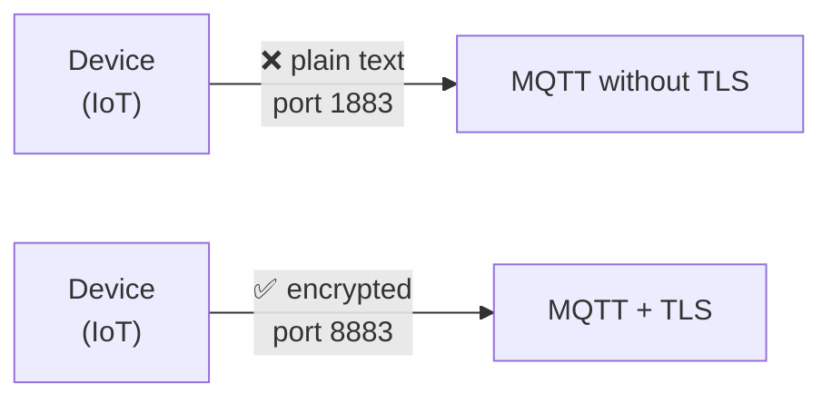
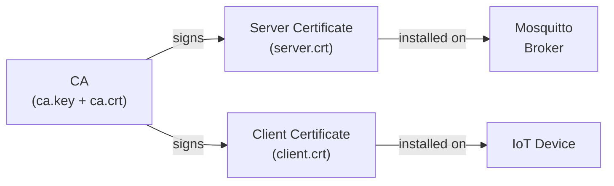

# Level 6: TLS/SSL MQTT Encryption

## Why Encrypt MQTT?

By default, MQTT transmits data in plain text. Anyone on the same network can intercept logins, passwords, and messages — just run `tcpdump` or Wireshark.
TLS (Transport Layer Security) solves this by creating an encrypted tunnel.



## PKI: Public Key Infrastructure

TLS is built on **PKI** (Public Key Infrastructure) — a system of certificates and certificate authorities.

Key components:
- **CA (Certificate Authority)** — a certificate authority trusted by all parties
- **Server certificate** — signed by CA, proves the broker's identity
- **Client certificate** — for mTLS, proves the client's identity



## Generating Certificates

### 1. Creating a CA

```bash
# CA private key
openssl genrsa -out ca.key 2048

# Self-signed CA certificate (10 years)
openssl req -new -x509 -days 3650 \
  -key ca.key -out ca.crt \
  -subj "/CN=MQTT CA/O=HomeNetwork/C=RU"
```

### 2. Server Certificate

```bash
openssl genrsa -out server.key 2048
openssl req -new -key server.key -out server.csr \
  -subj "/CN=mqtt.home/O=HomeNetwork/C=RU"
openssl x509 -req -days 3650 \
  -in server.csr -CA ca.crt -CAkey ca.key -CAcreateserial \
  -out server.crt
```

> ⚠️ CN (Common Name) must match the broker's hostname!

### 3. Client Certificate (for mTLS)

```bash
openssl genrsa -out client.key 2048
openssl req -new -key client.key -out client.csr \
  -subj "/CN=sensor-01/O=HomeNetwork/C=RU"
openssl x509 -req -days 3650 \
  -in client.csr -CA ca.crt -CAkey ca.key -CAcreateserial \
  -out client.crt
```

## Configuring Mosquitto

```conf
# /etc/mosquitto/mosquitto.conf

# Unencrypted listener for localhost only
listener 1883 localhost

# TLS listener
listener 8883
cafile /etc/mosquitto/certs/ca.crt
certfile /etc/mosquitto/certs/server.crt
keyfile /etc/mosquitto/certs/server.key
tls_version tlsv1.2
```

## mTLS: Mutual Authentication

```conf
listener 8883
cafile /etc/mosquitto/certs/ca.crt
certfile /etc/mosquitto/certs/server.crt
keyfile /etc/mosquitto/certs/server.key
require_certificate true
use_identity_as_username true
```

- `require_certificate true` — client must present a certificate
- `use_identity_as_username true` — CN from the certificate becomes the username

## File Permissions

```bash
mkdir -p /etc/mosquitto/certs
cp ca.crt server.crt server.key /etc/mosquitto/certs/
chmod 600 /etc/mosquitto/certs/server.key   # Owner-only read on key
chown mosquitto: /etc/mosquitto/certs/server.key
```

## Testing

```bash
# Test with CA (TLS)
mosquitto_pub --cafile ca.crt -h mqtt.home -p 8883 -t test -m "hello"

# Test with client certificate (mTLS)
mosquitto_sub --cafile ca.crt --cert client.crt --key client.key \
  -h mqtt.home -p 8883 -t "#"
```

## ⚠️ Common Mistakes

| Error | Cause | Fix |
|--------|---------|---------|
| `hostname mismatch` | CN doesn't match hostname | Re-issue certificate with correct CN |
| `certificate verify failed` | Client doesn't know the CA | Pass `--cafile ca.crt` |
| `no shared cipher` | Incompatible ciphers | Remove `ciphers` restriction |
| `Permission denied` | Mosquitto can't read the key | `chmod 600 server.key; chown mosquitto:` |

## 📌 Summary

- ✅ Standard MQTT+TLS port — **8883**
- ✅ Three files needed: `ca.crt`, `server.crt`, `server.key`
- ✅ mTLS requires `require_certificate true` + client certificate
- ✅ `use_identity_as_username true` — CN becomes the username
- ❌ Never share `server.key` with clients!
