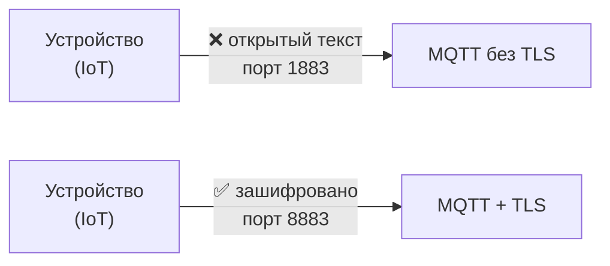
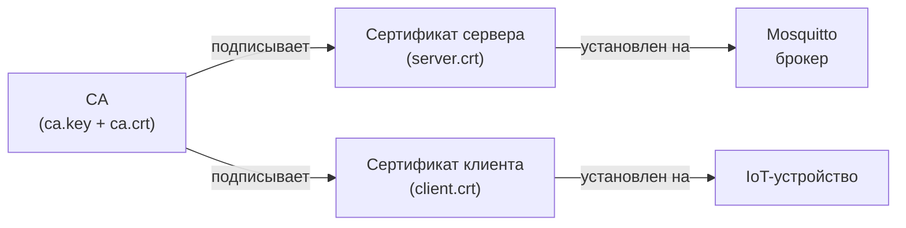

# Уровень 6: TLS/SSL шифрование MQTT

## Зачем шифровать MQTT?

По умолчанию MQTT передаёт данные открытым текстом. Любой, кто находится в одной сети, может
перехватить логины, пароли и сообщения — достаточно запустить `tcpdump` или Wireshark.
TLS (Transport Layer Security) решает эту проблему, создавая зашифрованный туннель.



## PKI: инфраструктура открытых ключей

TLS строится на **PKI** (Public Key Infrastructure) — системе сертификатов и удостоверяющих центров.

Основные компоненты:
- **CA (Certificate Authority)** — удостоверяющий центр, которому доверяют все стороны
- **Сертификат сервера** — подписан CA, доказывает подлинность брокера
- **Клиентский сертификат** — для mTLS, доказывает подлинность клиента



## Генерация сертификатов

### 1. Создание CA

```bash
# Приватный ключ CA
openssl genrsa -out ca.key 2048

# Самоподписанный сертификат CA (10 лет)
openssl req -new -x509 -days 3650 \
  -key ca.key -out ca.crt \
  -subj "/CN=MQTT CA/O=HomeNetwork/C=RU"
```

### 2. Сертификат сервера

```bash
openssl genrsa -out server.key 2048
openssl req -new -key server.key -out server.csr \
  -subj "/CN=mqtt.home/O=HomeNetwork/C=RU"
openssl x509 -req -days 3650 \
  -in server.csr -CA ca.crt -CAkey ca.key -CAcreateserial \
  -out server.crt
```

> ⚠️ CN (Common Name) должен совпадать с hostname брокера!

### 3. Клиентский сертификат (для mTLS)

```bash
openssl genrsa -out client.key 2048
openssl req -new -key client.key -out client.csr \
  -subj "/CN=sensor-01/O=HomeNetwork/C=RU"
openssl x509 -req -days 3650 \
  -in client.csr -CA ca.crt -CAkey ca.key -CAcreateserial \
  -out client.crt
```

## Настройка Mosquitto

```conf
# /etc/mosquitto/mosquitto.conf

# Незашифрованный listener только для localhost
listener 1883 localhost

# TLS listener
listener 8883
cafile /etc/mosquitto/certs/ca.crt
certfile /etc/mosquitto/certs/server.crt
keyfile /etc/mosquitto/certs/server.key
tls_version tlsv1.2
```

## mTLS: взаимная аутентификация

```conf
listener 8883
cafile /etc/mosquitto/certs/ca.crt
certfile /etc/mosquitto/certs/server.crt
keyfile /etc/mosquitto/certs/server.key
require_certificate true
use_identity_as_username true
```

- `require_certificate true` — клиент обязан предъявить сертификат
- `use_identity_as_username true` — CN из сертификата становится username

## Права на файлы

```bash
mkdir -p /etc/mosquitto/certs
cp ca.crt server.crt server.key /etc/mosquitto/certs/
chmod 600 /etc/mosquitto/certs/server.key   # Только владелец читает ключ
chown mosquitto: /etc/mosquitto/certs/server.key
```

## Тестирование

```bash
# Тест с CA (TLS)
mosquitto_pub --cafile ca.crt -h mqtt.home -p 8883 -t test -m "hello"

# Тест с клиентским сертификатом (mTLS)
mosquitto_sub --cafile ca.crt --cert client.crt --key client.key \
  -h mqtt.home -p 8883 -t "#"
```

## ⚠️ Частые ошибки

| Ошибка | Причина | Решение |
|--------|---------|---------|
| `hostname mismatch` | CN не совпадает с hostname | Перевыпустить сертификат с правильным CN |
| `certificate verify failed` | Клиент не знает CA | Передать `--cafile ca.crt` |
| `no shared cipher` | Несовместимые шифры | Убрать ограничение `ciphers` |
| `Permission denied` | Mosquitto не читает ключ | `chmod 600 server.key; chown mosquitto:` |

## 📌 Итоги

- ✅ Стандартный порт MQTT+TLS — **8883**
- ✅ Нужны три файла: `ca.crt`, `server.crt`, `server.key`
- ✅ mTLS требует `require_certificate true` + клиентский сертификат
- ✅ `use_identity_as_username true` — CN становится именем пользователя
- ❌ Никогда не передавайте `server.key` клиентам!
